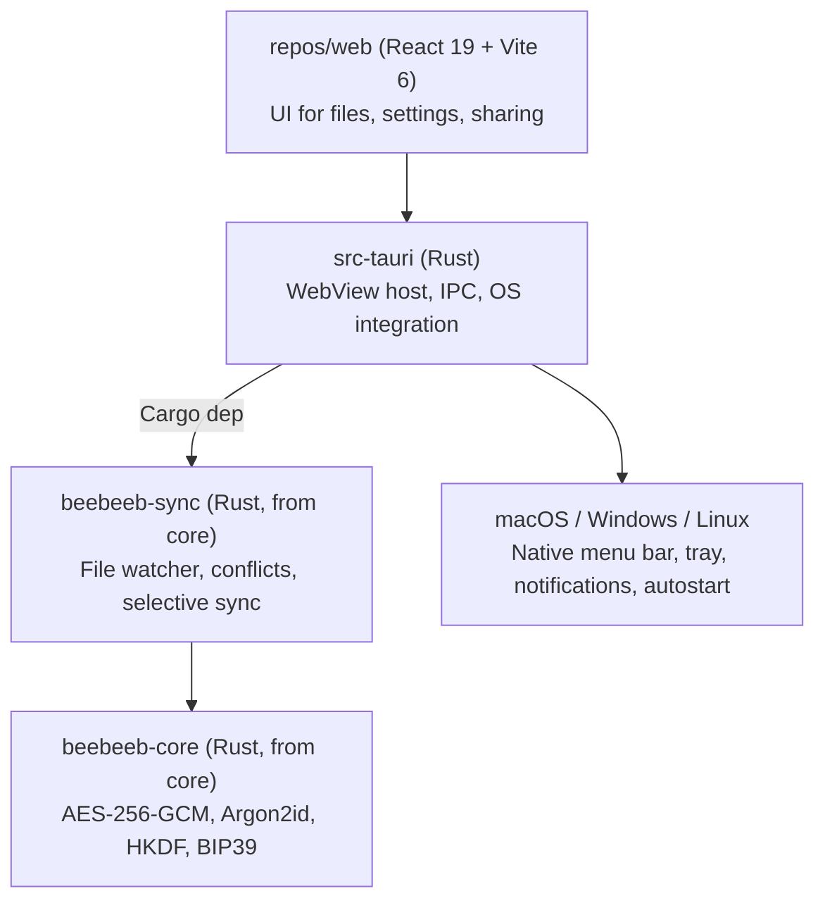

# beebeeb-io/desktop

Beebeeb desktop app. **Tauri v2** shell around the web client (`repos/web`) plus the Rust sync engine from `core`. One codebase, three OS targets (macOS, Windows, Linux).

## Architecture



Why Tauri (not Electron): native OS WebView (~10MB binaries vs ~150MB), Rust backend that imports `beebeeb-core` directly, no Node runtime in production builds.

## Layout

```
desktop/
├── src-tauri/            Rust app (Tauri v2)
│   ├── Cargo.toml
│   ├── build.rs
│   ├── tauri.conf.json   App config (window, bundle, identifier)
│   ├── capabilities/     Permission grants per window
│   ├── icons/            Bundle icons (PNG, ICNS, ICO)
│   └── src/
│       ├── main.rs       Entry — calls into lib::run()
│       └── lib.rs        Tauri Builder, command handlers
├── src/                  Placeholder frontend (replaced by repos/web)
├── index.html            Vite entry
├── package.json          Dev/build scripts (bun)
├── vite.config.ts        Frontend bundler config
└── tsconfig.json
```

The `linux/`, `macos/`, `windows/` folders are pre-Tauri scaffolds (separate native shells per OS). They are kept for reference but the Tauri shell supersedes them — new work goes in `src-tauri/`.

## Build & run

Requires Rust stable, bun, and Tauri's per-OS prerequisites (https://tauri.app/start/prerequisites/).

```sh
bun install
bun run tauri:dev      # spawns vite on :5173, opens native window
bun run tauri:build    # produces .dmg / .msi / .deb / .AppImage
```

To develop against the real web client instead of the placeholder:
- Run `repos/web` separately (`cd ../web && bun dev`) on :5173.
- The Tauri window will load it automatically (`devUrl` in `tauri.conf.json`).
- For production bundles, the web client is built and copied to `../dist/` (or `tauri.conf.json` is repointed at `../web/dist/`).

`cargo check` from `src-tauri/` validates the Rust side without the frontend.

## Key files

- `src-tauri/tauri.conf.json` — identifier `io.beebeeb.app`, 1200×800 default window.
- `src-tauri/src/lib.rs` — `run()` builds the Tauri app and registers `#[tauri::command]` handlers. Add new commands here.
- `src-tauri/capabilities/default.json` — permissions the frontend can invoke. Add explicit permissions before exposing new tauri APIs.

## Adding commands (Rust → JS bridge)

1. Add a `#[tauri::command]` function in `src-tauri/src/lib.rs`.
2. Register it in the `invoke_handler!` macro.
3. Call from JS: `import { invoke } from "@tauri-apps/api/core"; await invoke("my_cmd", { arg })`.
4. If it touches an OS API (fs, dialog, notification…), add the matching permission to `capabilities/default.json`.

## Sync engine (future)

Once `beebeeb-sync` integration lands: `src-tauri/Cargo.toml` will pull `beebeeb-sync = { git = "https://github.com/beebeeb-io/core" }` and a background tokio task in `lib.rs` will own the engine. Conflict resolution policy: never silently drop a version — default `KeepBoth` (rename loser as `file (Device, HH:MM).ext`). File watcher debounce: 100ms.

## Auto-update signing

Tauri's updater verifies update bundles with minisign. The keypair was
generated with `bunx tauri signer generate -w ~/.tauri/beebeeb-desktop.key`
on 2026-05-07.

- **Public key** lives in `src-tauri/tauri.conf.json` under
  `plugins.updater.pubkey`. Safe to commit; it's the verification key.
- **Private key** lives at `~/.tauri/beebeeb-desktop.key` on the build
  machine, mode `0600`. **Never commit it.** It's not in any `.gitignore`
  because it's not in the repo — it sits in the user's home dir.
- The key was generated **without a password** for initial pre-launch
  setup (the `-p ""` flag). Before public release, regenerate with a
  strong password, update the pubkey in tauri.conf.json, and rotate the
  CI secret. Track this work in `.claude/tasks/` if not already.

**For CI** (GitHub Actions, EAS, etc.) building signed updates:

- `TAURI_SIGNING_PRIVATE_KEY` — the *contents* of `~/.tauri/beebeeb-desktop.key`,
  set as a repository secret (not the file path)
- `TAURI_SIGNING_PRIVATE_KEY_PASSWORD` — the password if the key has one;
  unset for the current passwordless setup

To inspect the public key locally: `cat ~/.tauri/beebeeb-desktop.key.pub`.
The fingerprint at time of generation is `545D7BA77EDEA7E1`.

If the key is lost, no clients with already-installed builds can verify
new updates — they'll need a manual reinstall to onboard the new pubkey.

## Brand

- Icons: amber rounded square with lowercase `b` (`icons/icon.png`). Replace with the production icon set via `bunx tauri icon path/to/source.png` once ready.
- App name: "Beebeeb". Identifier: `io.beebeeb.app`.

## Graphify

This repo has a knowledge graph at graphify-out/.
- Before exploring code, read graphify-out/GRAPH_REPORT.md for module structure and relationships.
- After modifying code, run `graphify update .` and commit the updated graphify-out/.
- The graph tracks modules, functions, types, and their relationships.
- `graphify query "<question>"` to ask questions about the codebase.
- `graphify path "<A>" "<B>"` to find connections between two concepts.

## Keep shared docs in sync

When you add/change/remove endpoints, types, build commands, or dependencies: update the relevant skill file in `/Users/guuslangelaar/Development/Beebeeb/beebeeb.io/.claude/skills/` (beebeeb-api.md, beebeeb-designs.md, beebeeb-stack.md, beebeeb-dev.md). Other agents depend on these being accurate.
