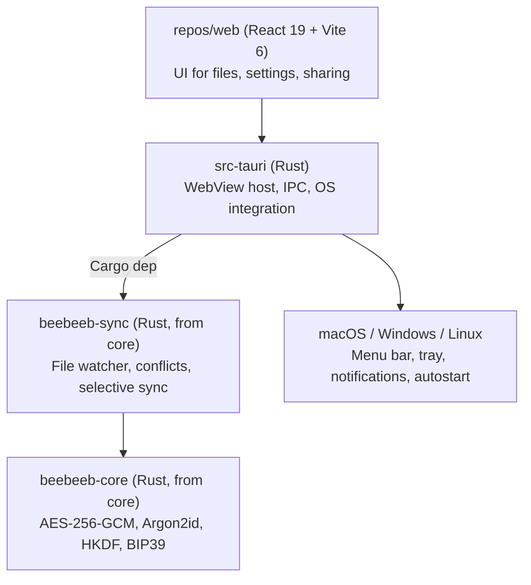

<p align="center">
  <a href="https://beebeeb.io"></a>
</p>
<h1 align="center">beebeeb desktop</h1>
<p align="center">Native desktop sync for macOS, Windows, and Linux — files encrypted before they leave your machine.</p>
<p align="center"><strong>We can't recover your data. Not even if we wanted to.</strong> That's the point.</p>
<p align="center">
  <a href="LICENSE"></a> &nbsp;
   &nbsp;
  <a href="SECURITY.md"></a>
</p>
<p align="center"><a href="https://beebeeb.io">Website</a> &nbsp;·&nbsp; <a href="https://beebeeb.io/security">How it works</a> &nbsp;·&nbsp; <a href="SECURITY.md">Report a vulnerability</a></p>
<p align="center"><sub>End-to-end encrypted cloud storage, built in Europe. Operated by Initlabs B.V., Wijchen, Netherlands.</sub></p>

---

## Status — no official release yet

> **In active development.** There are no published builds or GitHub releases,
> and the release pipeline is not yet green. macOS is the first product target;
> the Rust sync engine and Tauri shell are active. Finder / File Provider
> integration is blocked on Apple provisioning profiles with the correct
> app-group entitlements. Install instructions and a real CI/release badge will
> land here once the first release ships.

The [beebeeb](https://beebeeb.io) desktop client gives you a native sync folder on macOS, Windows, and Linux. Drop files into your beebeeb folder and they are encrypted on your machine and synced to the cloud — the server only ever sees ciphertext. The UI and the sync engine are shared with the rest of beebeeb: a [web](https://github.com/beebeeb-io/web) frontend in a native WebView, plus the Rust sync engine and cryptography from [core](https://github.com/beebeeb-io/core).

## Features

- **Automatic sync** — files in your beebeeb folder are encrypted and synced in the background
- **Selective sync** — choose which folders sync locally; the rest stay as online-only placeholders until you open them
- **Conflict resolution** — never silently drops a version. Default: keep both, rename the older version as `file (Device, HH:MM).ext`
- **Online-only files** — FUSE mount on Linux, native placeholder APIs on macOS and Windows
- **Zero-knowledge encryption** — per-file keys derived via HKDF; the server stores only ciphertext
- **Native shell, not Electron** — Tauri uses the OS WebView (~10 MB binaries vs ~150 MB), with a Rust backend that imports `core` directly

## Architecture

The UI is the beebeeb web client running inside a native Tauri (Rust) shell. The same Rust sync engine and cryptography that power the other clients run in the background — no protocol or crypto logic is re-implemented in TypeScript.



## Platform support

| Platform | Shell | Integration | Status |
|---|---|---|---|
| **macOS** | Tauri + Swift File Provider | Menu bar, Finder File Provider location | In progress |
| **Windows** | Tauri (WinUI WebView) | System tray, Explorer overlay icons | In progress |
| **Linux** | Tauri (WebKitGTK) | Tray indicator, FUSE mount for online-only files | In progress |

## Build & run

Requires [Rust](https://rustup.rs/) (stable, edition 2024), [bun](https://bun.sh/), and [Tauri's per-OS prerequisites](https://tauri.app/start/prerequisites/).

```sh
bun install
bun run tauri:dev      # spawns Vite on :5173, opens a native window
bun run tauri:build    # produces .dmg / .msi / .deb / .AppImage
```

To develop against the real web client instead of the placeholder, run `repos/web` separately (`cd ../web && bun dev`) — the Tauri window loads it automatically via `devUrl` in `tauri.conf.json`. `cargo check` from `src-tauri/` validates the Rust side without the frontend.

## Sync engine behavior

The sync engine (`beebeeb-sync`, from the [core](https://github.com/beebeeb-io/core) repo) handles:

- **File watching** — debounced at 100 ms; ignores `.DS_Store`, `Thumbs.db`, and temp files
- **Conflict resolution** — never silently drops data. Default strategy is `KeepBoth`: the older version is renamed `file (Device, HH:MM).ext`
- **Selective sync** — the vault stays remote by default. Folders marked locally available are hydrated and kept in sync; other items remain online-only placeholders until opened

## Security

Found a vulnerability? Email **security@beebeeb.io** — see [SECURITY.md](SECURITY.md).

## Part of beebeeb

End-to-end encrypted, zero-knowledge cloud storage — made in Europe.
[core](https://github.com/beebeeb-io/core) · [cli](https://github.com/beebeeb-io/cli) · [web](https://github.com/beebeeb-io/web) · [mobile](https://github.com/beebeeb-io/mobile) · [desktop](https://github.com/beebeeb-io/desktop) · [website](https://beebeeb.io)

## License

[AGPL-3.0-or-later](LICENSE) — © Initlabs B.V. (KvK 95157565), Wijchen, Netherlands.
