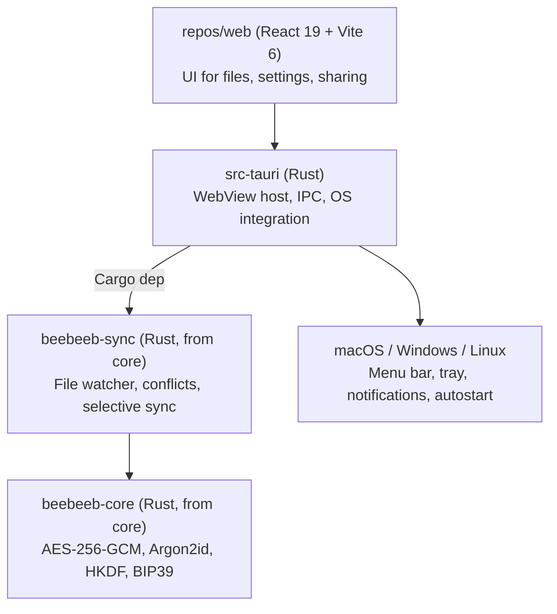

<p align="center">
  <a href="https://beebeeb.io"></a>
</p>
<h1 align="center">beebeeb desktop</h1>
<p align="center">Native desktop sync for macOS, Windows, and Linux — files encrypted before they leave your machine.</p>
<p align="center"><strong>We can't recover your data. Not even if we wanted to.</strong> That's the point.</p>
<p align="center">
  <a href="https://github.com/beebeeb-io/desktop/releases/latest"></a> &nbsp;
  <a href="LICENSE"></a> &nbsp;
   &nbsp;
  <a href="SECURITY.md"></a>
</p>
<p align="center"><a href="https://beebeeb.io">Website</a> &nbsp;·&nbsp; <a href="https://beebeeb.io/security">How it works</a> &nbsp;·&nbsp; <a href="SECURITY.md">Report a vulnerability</a></p>
<p align="center"><sub>End-to-end encrypted cloud storage, built in Europe. Operated by Initlabs B.V., Wijchen, Netherlands.</sub></p>

---

## Status — Windows + Linux released, macOS not yet

> **[desktop-v0.8.3](https://github.com/beebeeb-io/desktop/releases/latest) is the latest
> release** — `.msi`/`.exe` (NSIS) for Windows and `.AppImage`/`.deb`/`.rpm` for Linux,
> each with a minisign `.sig` for the auto-updater. v0.8.3's assets are signed with key ID
> `545D7BA77EDEA7E1` (the pre-rotation key; see `docs/RELEASING.md` — v0.8.3 is the key-rotation
> transition release and already bakes the new key `C6FADFD59D732197` in for future updates). **Neither
> installer carries an OS-trusted code-signing certificate yet** — Windows shows an "unknown
> publisher" SmartScreen warning until that's wired up. **macOS has no published release yet** (development-signed builds already run on real Mac
> hardware with the Finder File Provider mount — see `docs/MACOS_BRINGUP_BRIEF.md`): the
> macOS entry in the release workflow's build matrix is commented out (the File Provider
> extension doesn't yet support universal arm64+x86_64 builds, and no Developer ID/notary
> credentials are configured in CI). The site's [/download](https://beebeeb.io/download) page
> links directly to whatever is current once desktop apps are announced there; until then,
> grab a release straight from GitHub.

The [beebeeb](https://beebeeb.io) desktop client gives you a native sync folder on macOS, Windows, and Linux. Drop files into your beebeeb folder and they are encrypted on your machine and synced to the cloud — the server only ever sees ciphertext. The UI and the sync engine are shared with the rest of beebeeb: a [web](https://github.com/beebeeb-io/web) frontend in a native WebView, plus the Rust sync engine and cryptography from [core](https://github.com/beebeeb-io/core).

## Install

Download the installer for your system from the [latest release](https://github.com/beebeeb-io/desktop/releases/latest). Each installer has a matching `.sig` file next to it — you can use it to [check your download](#verify-your-download) before you install. The examples below use version `0.8.3`; replace it with the version you downloaded.

### Windows (64-bit)

Two installers are published. Pick one and stay with it — updates follow the installer type you started with.

- **`Beebeeb_<version>_x64-setup.exe`** (recommended) — per-user installer, no administrator rights needed.
- **`Beebeeb_<version>_x64_en-US.msi`** — for managed machines and software-deployment tools.

The installers are **not signed with a Windows code-signing certificate yet**, so Microsoft Defender SmartScreen shows **"Windows protected your PC"** the first time you run one. To continue:

1. Click **More info**.
2. Check that the file name is the one you downloaded from `github.com/beebeeb-io/desktop`, and click **Run anyway**.

If you would rather check the file first, [verify it](#verify-your-download) before clicking Run anyway.

### Linux (x86_64)

- **Debian / Ubuntu (`.deb`):**
  ```sh
  sudo apt install ./Beebeeb_0.8.3_amd64.deb
  ```
- **Fedora / RHEL / openSUSE (`.rpm`):**
  ```sh
  sudo dnf install ./Beebeeb-0.8.3-1.x86_64.rpm      # openSUSE: sudo zypper install ./Beebeeb-0.8.3-1.x86_64.rpm
  ```
- **Any distribution (`.AppImage`):** no install step — make it executable and run it:
  ```sh
  chmod +x Beebeeb_0.8.3_amd64.AppImage
  ./Beebeeb_0.8.3_amd64.AppImage
  ```
  AppImages need FUSE 2. If it does not start, install it (Ubuntu 22.04: `sudo apt install libfuse2`; Ubuntu 24.04 and later: `sudo apt install libfuse2t64`).

### macOS

No macOS release is published yet (see [Status](#status--windows--linux-released-macos-not-yet)). Building from source is covered under [Build & run](#build--run).

## Verify your download

Every installer is signed with [minisign](https://jedisct1.github.io/minisign/). Checking the signature proves the file is exactly what our release workflow built and has not been changed since.

The key that signs the **current** release (`desktop-v0.8.3`) — key ID `545D7BA77EDEA7E1`:

```
RWThp95+p3tdVI3intgGfThMBLsjCtlCF7eV0hTY478SM1BoLKwU4Fl4
```

The same key is published on [beebeeb.io/download](https://beebeeb.io/download). The `.sig` files are in the auto-updater's format (a minisign signature, base64-encoded once more), so decode it first, then verify.

**Linux / macOS** (install minisign with `apt install minisign`, `dnf install minisign`, or `brew install minisign`):

```sh
base64 -d < Beebeeb_0.8.3_amd64.deb.sig > Beebeeb_0.8.3_amd64.deb.minisig
minisign -Vm Beebeeb_0.8.3_amd64.deb -P RWThp95+p3tdVI3intgGfThMBLsjCtlCF7eV0hTY478SM1BoLKwU4Fl4
```

**Windows** (PowerShell; install minisign with `scoop install minisign`, or download it from the [minisign releases](https://github.com/jedisct1/minisign/releases)):

```powershell
[IO.File]::WriteAllBytes("$PWD\Beebeeb_0.8.3_x64-setup.exe.minisig", [Convert]::FromBase64String((Get-Content Beebeeb_0.8.3_x64-setup.exe.sig -Raw)))
minisign -Vm Beebeeb_0.8.3_x64-setup.exe -P RWThp95+p3tdVI3intgGfThMBLsjCtlCF7eV0hTY478SM1BoLKwU4Fl4
```

A good file prints `Signature and comment signature verified`, followed by a trusted comment that names the file. Anything else — `Signature verification failed`, or a message that the key IDs do not match — means **do not install it**; download it again from the release page, and if it still fails, tell us at security@beebeeb.io.

> **This key will change.** The app is moving to a new signing key, `C6FADFD59D732197` (see [`docs/RELEASING.md`](docs/RELEASING.md)). Releases up to and including `0.8.3` are signed with `545D7BA77EDEA7E1`; the first release signed with the new key will update this section and the download page. If the key ID a release was signed with does not match the one shown here, stop and ask us.

## Updating

**In-app updates do not work for most installs right now — update by reinstalling.** Every build from `0.3.0` onwards only accepts updates signed with the new key `C6FADFD59D732197`, but every release published so far, including `0.8.3`, is still signed with the old key `545D7BA77EDEA7E1`. So when one of those installs finds an update, it rejects the signature and stays where it is. (Separately, the update feed currently still offers `0.8.2`, not `0.8.3`.) This is fixed by the first release signed with the new key — the key rotation plan is in [`docs/RELEASING.md`](docs/RELEASING.md).

Until then, to update: download the newest installer from the [latest release](https://github.com/beebeeb-io/desktop/releases/latest), [verify it](#verify-your-download), and install it over your current version — same installer type as before (setup.exe or .msi on Windows; your package manager on Linux; for the AppImage, replace the old file). Your settings (`desktop.toml` in your user config folder) and your sync folder are outside the install location and are not touched by the installer.

## Features

- **Automatic sync** — files in your beebeeb folder are encrypted and synced in the background
- **Selective sync** — choose which folders sync locally; the rest stay as online-only placeholders until you open them
- **Conflict resolution** — never silently drops a version. A file changed both here and elsewhere is flagged, and nothing is overwritten until you choose Keep Mine, Keep Theirs, or Keep Both
- **Online-only files** — FUSE mount on Linux, native placeholder APIs on macOS and Windows
- **Zero-knowledge encryption** — per-file keys derived via HKDF; the server stores only ciphertext
- **Native shell, not Electron** — Tauri uses the OS WebView (~10 MB binaries vs ~150 MB), with a Rust backend that imports `core` directly

## Architecture

The UI is the beebeeb web client running inside a native Tauri (Rust) shell. The same Rust sync engine and cryptography that power the other clients run in the background — no protocol or crypto logic is re-implemented in TypeScript.



## Platform support

| Platform | Shell | Integration | Status |
|---|---|---|---|
| **macOS** | Tauri + Swift File Provider | Menu bar, Finder File Provider location | Not released — dev-signed builds run on real hardware; release build + Developer ID/notarization not wired into CI |
| **Windows** | Tauri (WinUI WebView) | System tray, Explorer overlay icons | [Released](https://github.com/beebeeb-io/desktop/releases/latest), not code-signed (SmartScreen warns) |
| **Linux** | Tauri (WebKitGTK) | Tray indicator, FUSE mount for online-only files | [Released](https://github.com/beebeeb-io/desktop/releases/latest) (AppImage/.deb/.rpm) |

## Build & run

Requires [Rust](https://rustup.rs/) (stable, edition 2024), [bun](https://bun.sh/), and [Tauri's per-OS prerequisites](https://tauri.app/start/prerequisites/).

```sh
bun install
bun run tauri:dev      # spawns Vite on :5173, opens a native window
bun run tauri:build    # produces .dmg / .msi / .deb / .AppImage
```

To develop against the real web client instead of the placeholder, run `repos/web` separately (`cd ../web && bun dev`) — the Tauri window loads it automatically via `devUrl` in `tauri.conf.json`. `cargo check` from `src-tauri/` validates the Rust side without the frontend.

## Sync engine behavior

The sync engine (`beebeeb-sync`, from the [core](https://github.com/beebeeb-io/core) repo) handles:

- **File watching** — debounced at 100 ms; ignores `.DS_Store`, `Thumbs.db`, and temp files
- **Conflict resolution** — never silently drops data. When a file changed both on this device and on the server, it is marked as a conflict and you get a notification; the file stays as it is until you resolve it in the conflict window. **Keep Both** renames *your local copy* to `name (conflict - <device name> - <YYYY-MM-DD>).ext` and downloads the server's version under the original name. **Keep Mine** uploads your local copy as the new version; **Keep Theirs** replaces your local copy with the server's version
- **Selective sync** — the vault stays remote by default. Folders marked locally available are hydrated and kept in sync; other items remain online-only placeholders until opened

## Contributing

Bug reports and pull requests are welcome — see [CONTRIBUTING.md](CONTRIBUTING.md) for the build, the test gate, and how pull requests are reviewed.

## Security

Found a vulnerability? Email **security@beebeeb.io** — see [SECURITY.md](SECURITY.md).

## Part of beebeeb

End-to-end encrypted, zero-knowledge cloud storage — made in Europe.
[core](https://github.com/beebeeb-io/core) · [cli](https://github.com/beebeeb-io/cli) · [web](https://github.com/beebeeb-io/web) · [mobile](https://github.com/beebeeb-io/mobile) · [desktop](https://github.com/beebeeb-io/desktop) · [website](https://beebeeb.io)

## License

[AGPL-3.0-or-later](LICENSE) — © Initlabs B.V. (KvK 95157565), Wijchen, Netherlands.
