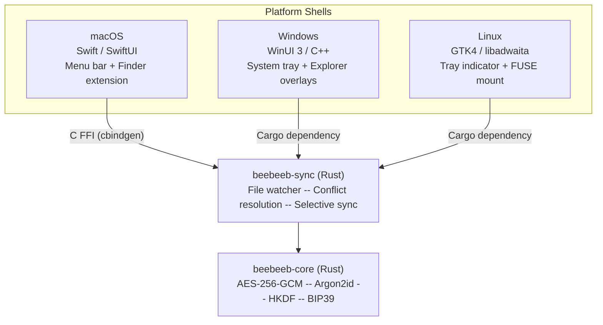

<p align="center">
  
</p>
<h3 align="center">Beebeeb Desktop</h3>
<p align="center">Desktop sync for macOS, Windows, and Linux -- files encrypted before they leave your machine.</p>

<p align="center">
  <a href="https://github.com/beebeeb-io/desktop/blob/main/LICENSE"></a>
  <a href="https://github.com/beebeeb-io/desktop/actions"></a>
  <a href="https://github.com/beebeeb-io/desktop/stargazers"></a>
</p>

---

> **In active development.** macOS is the first product target. The Rust sync
> engine and Tauri shell are active; Finder/File Provider integration is blocked
> on Apple provisioning profiles with the correct app-group entitlements.

The [Beebeeb](https://beebeeb.io) desktop client gives you a native sync folder on macOS, Windows, and Linux. Drop files into your Beebeeb folder and they are automatically encrypted and synced to the cloud. Each platform gets a native shell that feels at home on your OS, all powered by a shared Rust sync engine from the [core](https://github.com/beebeeb-io/core) repo.

Built and operated by [Initlabs B.V.](https://initlabs.nl), Wijchen, Netherlands.

## Features

- **Automatic sync** -- files in your Beebeeb folder are encrypted and synced in the background
- **Selective sync** -- choose which folders sync locally; the rest stay as online-only placeholders until you open them
- **Conflict resolution** -- never silently drops a version. Default: keep both, rename the older version as `file (Device, HH:MM).ext`
- **Online-only files** -- FUSE mount on Linux, native placeholder APIs on macOS and Windows
- **Zero-knowledge encryption** -- per-file keys derived via HKDF. The server stores only ciphertext
- **Native experience** -- each platform uses its own UI toolkit. No Electron.

## Architecture

The sync engine and cryptographic layer are written once in Rust and shared across all platforms. Platform-specific shells call into the engine via Cargo dependencies (Windows, Linux) or C FFI (macOS).



## Platform support

| Platform | Shell | Integration | Status |
|---|---|---|---|
| **macOS** | Tauri + Swift File Provider | Menu bar/control center, Finder File Provider location | In progress |
| **Windows** | WinUI 3 / C++ | System tray, File Explorer overlay icons | In progress |
| **Linux** | Rust + GTK4 / libadwaita | Tray indicator, FUSE mount for online-only files | In progress |

## Tech stack

| Layer | Technology |
|---|---|
| Sync engine | [`beebeeb-sync`](https://github.com/beebeeb-io/core/tree/main/beebeeb-sync) (Rust) |
| Crypto | [`beebeeb-core`](https://github.com/beebeeb-io/core/tree/main/beebeeb-core) (AES-256-GCM, Argon2id, HKDF) |
| File watching | `notify` crate (100ms debounce) |
| macOS | Swift, SwiftUI, Xcode 15+, macOS SDK 14.0+, cbindgen |
| Windows | WinUI 3, C++, Visual Studio 2022 17.8+, Windows App SDK 1.5+ |
| Linux | GTK4, libadwaita, FUSE 3 |

## Getting started

### Prerequisites

All platforms require [Rust](https://rustup.rs/) (stable, edition 2024).

### macOS

```sh
# Additional: Xcode 15+, macOS SDK 14.0+, Tauri prerequisites
bun install
bun run tauri:dev
bun run tauri:build
```

Current macOS release identifiers:

- App bundle id: `io.beebeeb.app`
- File Provider extension id: `io.beebeeb.app.FileProvider`
- File Provider domain id: `io.beebeeb.app.domain`
- Shared app group: `R8352WDJJR.io.beebeeb.app.fileprovider`

The Finder location will not install reliably until the Apple provisioning
profiles for both the containing app and File Provider extension include the
exact shared app group entitlement. A Tauri updater-signing failure about
`TAURI_SIGNING_PRIVATE_KEY` is separate from this provisioning issue.

### Windows

```sh
# Additional: Visual Studio 2022 17.8+, Windows SDK 10.0.22621+, Windows App SDK 1.5+
cd windows
cargo build --release
./target/release/beebeeb-desktop-windows --sync-path ~/Beebeeb
```

### Linux

```sh
# Additional: libgtk-4-dev, libadwaita-1-dev, libfuse3-dev
cd linux
cargo build --release
./target/release/beebeeb-desktop-linux --sync-path ~/Beebeeb
```

## Sync engine behavior

The sync engine (`beebeeb-sync` from the core repo) handles:

- **File watching** -- debounced at 100ms. Ignores `.DS_Store`, `Thumbs.db`, temp files.
- **Conflict resolution** -- never silently drops data. Default strategy is `KeepBoth`: the older version is renamed as `file (Device, HH:MM).ext`.
- **Selective sync** -- the vault stays remote by default. Folders marked as locally available are hydrated and kept in sync; other items remain online-only placeholders until opened.

## Security

All encryption happens on your device using [beebeeb-core](https://github.com/beebeeb-io/core). The server stores only ciphertext and never has access to your keys or plaintext data.

Found a vulnerability? Email [security@beebeeb.io](mailto:security@beebeeb.io). We aim to acknowledge reports within 48 hours.

## Contributing

We welcome contributions. Since the desktop client spans three platforms, contributions to any single platform are valuable. You do not need to build or test all three.

1. Fork the repository
2. Create a feature branch (`git checkout -b feat/your-feature`)
3. Make your changes and add tests where applicable
4. Run the linter (`cargo clippy -- -D warnings` for Rust code)
5. Commit -- pre-commit hooks will run secret scanning automatically
6. Open a pull request against `main`

## Part of Beebeeb

| Repository | Description |
|---|---|
| [core](https://github.com/beebeeb-io/core) | Cryptographic core, shared types, sync engine |
| [cli](https://github.com/beebeeb-io/cli) | `bb` -- CLI for encrypted cloud storage |
| **[desktop](https://github.com/beebeeb-io/desktop)** | Desktop sync for macOS, Windows, Linux (you are here) |
| [web](https://github.com/beebeeb-io/web) | Web client |
| [mobile](https://github.com/beebeeb-io/mobile) | iOS and Android app |

## License

[GNU Affero General Public License v3.0 or later](./LICENSE)

Copyright (c) Initlabs B.V.

---

[beebeeb.io](https://beebeeb.io) -- [GitHub](https://github.com/beebeeb-io)
