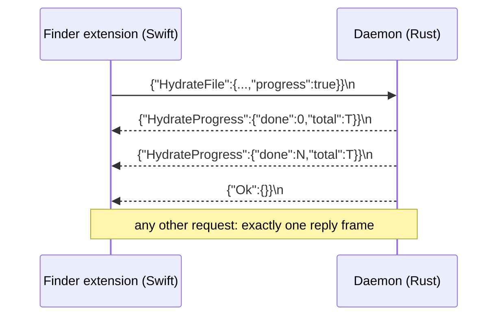
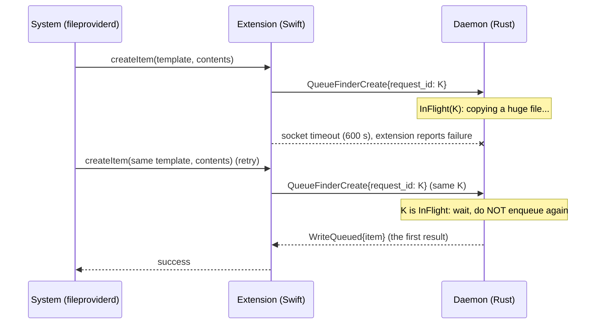

# Daemon IPC protocol (Unix socket)

Task 1670 issue 3. This is the contract between the desktop daemon
(`src-tauri/src/ipc_socket.rs`) and its socket clients: the macOS File Provider
extension (`BeebeebFileProvider/XPCBridge.swift`) and the Rust readiness probe
(`wait_for_file_provider_ipc_ready`). The Linux FUSE prototype (`src-tauri/src/linux_fuse`)
does not use this socket. Unix sockets do not exist on Windows, where Cloud Files runs
in-process.

Implementations that must stay in step:

| Half | File |
| --- | --- |
| Rust framing | `src-tauri/src/ipc_frame.rs` |
| Rust server | `src-tauri/src/ipc_socket.rs` (`handle_connection`, `hydrate_over_ipc`) |
| Swift framing + exchange | `BeebeebFileProvider/IPCFraming.swift` |
| Swift caller | `BeebeebFileProvider/XPCBridge.swift` |
| Write-queue idempotency (Rust) | `src-tauri/src/ipc_write_dedup.rs` (table), `dedup_write` in `ipc_socket.rs` |
| Write-queue idempotency (Swift) | `IPCWriteKey` / `IPCWriteRequest` in `BeebeebFileProvider/IPCFraming.swift` |
| Readiness probe (Rust client) | `wait_for_file_provider_ipc_ready` in `src-tauri/src/lib.rs` |

## Framing

A **frame** is one compact JSON value followed by a single `\n` (0x0A).

- Compact JSON escapes every control character inside a string (`\n`,
  `\u000a`), so a raw 0x0A byte can only be the delimiter. Both encoders assert
  this (`serde_json::to_vec` on the Rust side; `IPCFraming.encodeRequest`
  refuses to send a request containing one).
- One request per frame, client to server. Exactly one final reply frame per
  request, server to client. The connection stays open for further requests.
- Empty and whitespace-only lines are ignored.
- Requests are limited to 1 MiB (`MAX_REQUEST_BYTES`). A longer message gets an
  `Error` frame and the connection is closed (the stream cannot be
  resynchronised). Replies are limited to 32 MiB on the Swift side
  (`IPCFraming.maxReplyBytes`); over that the client reports an honest
  "reply larger than Finder can accept" error.



### Why (what was wrong before)

- The daemon treated one `read()` of at most 64 KiB as one whole request and
  wrote replies with no delimiter. On a `SOCK_STREAM` socket a request can arrive
  in several reads and a client cannot know where a reply ends.
- The Swift client did one unlooped `write()` and one `read()` of at most 65536
  bytes, then parsed. A reply over 64 KiB (a folder of a few hundred items) was
  always truncated.
- The daemon answered a successful hydrate with the bare JSON string `"Ok"`
  (a unit enum variant). `JSONSerialization` rejects a top-level string unless
  fragments are allowed, so **every successful hydrate surfaced as "daemon
  response was not valid JSON"** after the download had already finished. The
  success reply is now the object `{"Ok":{}}`.

## Hydrate progress

`HydrateFile` accepts an optional `"progress": true` (default false). When set,
the daemon sends zero or more `HydrateProgress` frames before the final reply:

```json
{"HydrateProgress":{"done":10485760,"total":31457280}}
```

`done` and `total` are plaintext bytes; `total` is 0 when the server did not
report a size. The first frame is `done: 0` as soon as the file's metadata and
key are known; then one per decrypted chunk. The final reply is `{"Ok":{}}` or
`{"Error":{"message":"..."}}`.

Clients that do not opt in (the 0.8.6 extension) receive no progress frames,
because they read exactly one reply and would mistake the first progress frame
for it.

### Cancellation

While a hydrate runs the daemon also watches the socket. If the client hangs up
(Finder cancelled the `Progress`; the Swift side calls `shutdown()` on the
socket) the daemon drops the download, writes nothing to disk, and restores the
file's status (`DownloadingStatusGuard` in `engine_bridge.rs`).

## Timeouts (Swift client)

Applied as `SO_RCVTIMEO`/`SO_SNDTIMEO`, i.e. per `read()`/`write()` call:

| Call | Timeout | Reason |
| --- | --- | --- |
| list / item / queue delete / queue create+modify without contents | 30 s | Database work in the daemon; answers in milliseconds. |
| queue create / modify WITH contents | 600 s | The daemon copies the whole file into staging (`StagedPayload::copy`, synchronous) before replying and sends nothing meanwhile. A timeout here is a duplicate hazard: the extension reports failure, the daemon still queues the upload, Finder retries and queues it again under a fresh id. 600 s covers 15 GB at 25 MB/s (a same-volume APFS copy is a clone, near-instant). A copy longer than that still times out; task 1684 closes that with a stable `request_id` the daemon dedups on (next section). |
| hydrate | 600 s idle | Each progress frame restarts it. The daemon's HTTP client allows 30 s per request (`api_client.rs`) and a hydrate makes one metadata request plus one per chunk; an older daemon sends no progress and is silent for the whole download. 20x the per-request ceiling also covers `download_kbps_limit` pacing sleeps. |

A timeout surfaces as `BeebeebIPCError.timedOut(seconds:)`
("Beebeeb's sync engine did not answer within N seconds..."), never as a JSON
error. No error message ever contains raw reply bytes.

## Write-queue idempotency (`request_id`, task 1684)

`QueueFinderCreate` and `QueueFinderModify` accept an optional `"request_id"` string.

**Why it has to be derived, not random.** When the extension's socket call times out, the
system retries `createItem` / `modifyItem`. That retry is a NEW invocation, so it cannot know a
per-call UUID the first attempt generated. A random id per call would be different every time
and deduplicate nothing. The key is therefore computed from the stable inputs of the logical
operation, so the retry recomputes the same value.



### The key

`request_id` = lowercase hex SHA-256 (64 characters) of this canonical byte string. Every
field is `s<utf8 byte count>:<bytes>;` for a string, `n;` for an absent string, `i<decimal>;`
for an integer; the fields are concatenated in this order (length prefixes make `("ab","c")`
and `("a","bc")` different):

| Operation | Fields, in order |
| --- | --- |
| create | `"bb-write-v1"`, `"create"`, parent item identifier, filename, kind (`file`/`folder`), content type, content size in bytes, content mtime in nanoseconds |
| modify | `"bb-write-v1"`, `"modify"`, item identifier, base version identifier, parent item identifier, filename, kind, content type, changed-fields bitmask (`NSFileProviderItemFields.rawValue`), content size, content mtime in nanoseconds |

"Content size / mtime" come from `stat()` on the file the system staged for the write.

- **Only requests that carry contents get a key.** A folder create, a rename or a move is
  answered from the database in milliseconds under the 30 s timeout; there is nothing to
  deduplicate and the request is sent without one. A request whose staged file cannot be
  `stat()`ed is also sent without one (never a made-up one).
- **The staged file's path is not an input** (it may differ between attempts) and neither is its
  inode: if the system re-stages a retry into a new file, an inode in the key would make every
  retry a different key. Size + nanosecond mtime survive a metadata-preserving clone/copy.
  Whether the system really hands the retry the same size and mtime is **not verified on a
  device** (see "Device rung" below); the extension logs the first 12 characters of each key so
  that rung has evidence.
- The Swift half is pinned by a test vector computed independently in Python
  (`BeebeebFileProviderTests/main.swift`).

### The daemon table

`WriteDedup` (`ipc_write_dedup.rs`) is an in-memory map `request_id -> InFlight | Done`,
shared by all connections, bounded to 4096 entries and a 30 minute TTL.

| A request with key K arrives while... | The daemon... |
| --- | --- |
| K unknown | runs the work (on the blocking pool, detached from the connection, so the copy finishes and is recorded even though the client hung up) |
| K `InFlight` | waits for the first run and returns **its** reply; never enqueues a second upload |
| K `Done` within the TTL and the result is still true | returns the stored reply without enqueueing, **refreshed from the row as it is now** (current `version_identifier` and `status`, see below) |
| K `Done`, but the row it created is gone, renamed, parked `Trashing`, or has a queued `TrashFile` op; or the user deleted that item through this socket since | treats it as a NEW operation (see below) and runs it |
| K `Done` past the TTL | forgets it and runs the work |
| K was used for a different (operation, parent or item, filename, kind) | does not merge them; runs the work and leaves the original entry alone |
| the first run panicked | the waiters are released and one of them runs its own work |
| the table is full of in-flight work | runs the work without deduplication rather than refuse a user write |
| no `request_id` (0.8.6 extension) | exactly the pre-1684 path: the work runs inline, nothing is remembered |
| `request_id` empty, over 128 bytes or containing a control character | `Error{"request_id must be 1 to 128 printable bytes"}`; nothing is queued |

Only `WriteQueued` replies are remembered. An `Error` is delivered to requests that were
already waiting on that run, but a later retry runs the work again (a failed attempt must not
poison the key).

### False-dedup risk (two genuinely different operations, one key) and how it is bounded

1. **Different file, same key:** needs parent, name, size and nanosecond mtime all equal, which
   is the same file going into the same folder (a name collision regardless). Plus the daemon
   refuses to merge across a different operation/parent-or-item/filename/kind.
2. **The same inputs recurring as a genuinely new operation inside the TTL:** create `a.txt`,
   delete it (here or on another device), copy the identical file back with its mtime preserved.
   Without a guard the second create would be answered with the first, and the file would
   silently never upload. **A Finder delete does not remove the `files` row** (the IPC delete
   queues a `TrashFile` op and leaves the row in place; after the server trash succeeds the op is
   dropped and the row stays until the snapshot prune or the op echo removes it), so "the row
   still exists" alone proves nothing. The daemon guards this in three independent layers:
   1. `QueueFinderDelete` **forgets every stored reply describing that item** before it queues the
      trash, so a create carrying the same key after a delete through this socket always runs
      (`a_create_after_the_trash_op_finished_still_uploads_the_new_file` pins this against the
      state after the trash op finished, where nothing else in the row or queue says "deleted").
   2. A stored reply is refused while its row has a queued `TrashFile` op (any retry state) or is
      parked `Trashing` (the watcher's delete path), which covers a delete that did not come
      through this socket (`a_cached_create_is_not_returned_while_a_trash_op_is_pending_for_its_row`,
      `a_cached_create_is_not_returned_for_a_row_parked_trashing`).
   3. A stored reply is refused when its row is gone or has a different filename (another device
      trashed it and the row was pruned, or the user renamed it).

   `a_real_finder_delete_then_the_same_create_uploads_the_new_file` drives the real
   `QueueFinderDelete` request end to end. (The earlier test that faked a delete with
   `delete_file` exercised a state the real delete path never produces.) A remote trash from
   another device leaves a row that is either pruned (layer 3) or has no queued op and a normal
   status until the `file_trash` echo deletes it; in the short window between a remote trash and
   its echo a same-key retry can still be answered with the stored reply. That window needs the
   same file to be copied back within seconds of a delete on another device and is unmeasured.
   A stored reply that passes is **refreshed**: it is rebuilt from the current row rather than
   served as first built, because finalizing the upload changes the item's `version_identifier`
   and `status`, and handing the system the old pair would make the next edit send a stale base
   version (`a_cached_reply_reports_the_row_as_it_is_now_not_as_it_was`).
3. **Accepted residual risk:** if the user renames the created item and a timed-out create of
   the same name is retried afterwards inside the TTL, the validation sees a renamed row, calls
   the stored reply stale and runs the retry as a new create (one duplicate, the pre-1684
   behaviour). That needs a retry to arrive after the user has already acted on the result, which
   the File Provider retry loop does not do in practice; it is unmeasured.
4. **Daemon restart forgets the table.** A retry that arrives after the daemon restarted is
   treated as new and can queue a second upload. Persisting keys would need a schema change;
   the window is the copy time plus a restart, and the pre-1684 behaviour was a duplicate every
   time.

### Device rung (not proven on this branch)

CI proves the framing, the key derivation, the request shape and the daemon table. It does not
prove that the real File Provider system retries with the same staged size and mtime, or that
the retry happens within 30 minutes. The next macOS alpha must force a write-queue timeout on a
large file (or lower `stagedCopyTimeoutSeconds` for a test build) and check the unified log for
the same `request_id=<12 hex>` on both attempts and exactly one queued upload.

## Change feed + sync anchor (task 1697)

The replica (`NSFileProviderReplicatedExtension`) needs a daemon-side change
cursor to answer `enumerateChanges(for:from:)` and `currentSyncAnchor`. Three
requests serve it; all state lives in the daemon's state.db (tables
`fp_changes`, `fp_sync_anchor`, `fp_materialized`), so it survives extension
process death and daemon restarts.

### `ListChanges { since_anchor?, limit? }`

Returns `FileProviderChanges { changes: [...], next_anchor: string|null }`.
Each change row: `{ file_id, kind, old_parent_id, new_parent_id, item? }` —
`kind` is `created | modified | deleted | reparented`; `item` is the FULL
`FileProviderItemPayload` for live rows (the replica can call `didUpdateItems`
without a second round-trip), absent for deletions and for rows that vanished
since the change was recorded. Paged: at most `limit` (clamped 1..100,
default 100) changes per reply; `next_anchor` doubles as the resume token
while more remain and as the up-to-date marker when the batch completed the
window. The anchor is the change-log rowid in decimal ASCII — strictly
ascending, ≤ 500 bytes for any realistic history (Apple caps anchors and page
tokens at 500 bytes).

An unparseable `since_anchor` (a cursor the log no longer contains) is an
`Error` reply — the replica answers with `NSFileProviderError.syncAnchorExpired`
so the SYSTEM drops its caches and does a full re-enumeration; it never
silently restarts at 0, which would double-deliver.

### `GetSyncAnchor` → `FileProviderSyncAnchor { anchor: string|null }`

The daemon's persistent cursor, served to `currentSyncAnchor`. The Swift side
persists it in the App Group (`fileprovider-state.json`) for crash recovery
and falls back to that copy when the daemon is unreachable.

### `ReportMaterialized { container_ids: [...] }` → `{"Ok":{}}`

The extension publishes the materialized DIRECTORIES the system reported (via
`materializedItemsDidChange` + the system's `enumeratorForMaterializedItems`).
The daemon's working-set signal filter (runner) fails OPEN against an
empty/unknown set: signals fire for any batch until the set arrives, because
Apple's documented fallback is "the working set is the entire dataset".

### What records a change

`upsert_file` (created/modified/reparented — a re-upsert whose row did not
change records nothing, so the metadata sweeps produce no churn),
`delete_file` / `delete_file_subtree` / `prune_absent` (deleted, with the
parent captured before the delete), `set_status` / `set_size_bytes` /
`set_file_contract_state` (modified; a contract parent change is
`reparented`). Windows-only reconciliation writes (`reconcile_os_state`,
`finish_windows_signout`) are deliberately NOT wired — the change log is FPFS
machinery and Windows refreshes placeholders natively.

## Version skew (app update in progress)

| Extension | Daemon | Behaviour |
| --- | --- | --- |
| new | old | The old daemon replies with no delimiter and keeps the connection open, and answers a hydrate with the bare string `"Ok"`. `IPCFrameReader` accepts a buffer that is already one complete JSON value without waiting for a newline, and `IPCFraming.decodeReply` maps a bare `"Ok"` to `{"Ok":{}}`. The old daemon ignores the unknown `progress` field, so no progress is shown. |
| new | old (before 1684) | The old daemon's `serde` ignores the unknown `request_id` field, so the request works and is simply not deduplicated (the pre-1684 behaviour). |
| new | old (before 1697) | The old daemon answers `ListChanges` with `unknown variant` — an `Error` reply the replica surfaces as `finishEnumeratingWithError`, and `currentSyncAnchor` falls back to the persisted App Group copy. The old daemon ignores the new payload fields (`created_at`, `modified_at`, `child_item_count`, `content_version`, `metadata_version`), so listings work with no dates/counts. |
| old | new | The old extension writes its request with no delimiter and does not close: `FrameReader` accepts a buffer that is already one complete JSON value. It requests no progress, so it gets one reply, now `{"Ok":{}}\n` (which its parser accepts). It sends no `request_id`, so its write-queue requests take the pre-1684 path. |

## Tests

| What | Where | Truth line |
| --- | --- | --- |
| Rust framing units | `ipc_frame.rs` `mod tests` | `cargo test` counts |
| Rust socket end-to-end (>64 KiB reply, split request, several requests per connection, unframed legacy request, oversize, bad line, `Ok` shape) | `src/ipc_socket_framing_tests.rs` | `cargo test` counts |
| Change feed over the real socket (anchor, paging/resume tokens, deletes with parents, reparents, ride-along item payloads) | `src/ipc_socket_framing_tests.rs` (`list_changes_*`) | `cargo test` counts |
| Hydrate progress + cancellation | `engine_bridge.rs` tests `ipc_hydrate_*` | `cargo test` counts |
| Swift framing + exchange over a real `socketpair` | `BeebeebFileProviderTests/main.swift` via `scripts/test-ipc-framing.sh` (macOS CI job "File Provider Swift (macOS)") | `ipc-framing: N passed, 0 failed`, N asserted |
| Swift key derivation (same inputs same key, any input differs, pinned vectors), request shape (`request_id` on BOTH create and modify, absent without contents) and file fingerprint | same file (10 tests of the 35) | same |
| Daemon table: concurrent same key runs once, repeat after completion, different keys, TTL expiry, key reused for another request shape, stale result, refreshed cache hit, `forget_where`, failed result not remembered, panicking leader, capacity | `ipc_write_dedup_tests.rs` | `cargo test` counts |
| Daemon over the real socket, counting REAL queued operations in the state DB | `ipc_socket_framing_tests.rs` (`concurrent_creates_with_one_request_id_...`, `a_repeat_after_completion_...`, `different_request_ids_...`, `a_request_without_a_request_id_...`, `a_cached_create_is_not_returned_...`, `concurrent_modifies_...`, real-delete-then-recreate, trash op finished, trash op pending, `Trashing` row, refreshed reply). The two concurrency tests hold the state DB lock so the leader is parked and every request provably overlaps it; with a tiny source file they would otherwise finish serially and exercise the cached path instead of the in-flight wait | `cargo test` counts |
| XPCBridge call sites still use the builder and pass the key inputs (XPCBridge is not compiled into the Swift harness) | `scripts/check-ipc-timeouts.py` (+ `--self-test`, 14 mutations) | `ipc-timeout guard: 3/3 call sites correct` |
