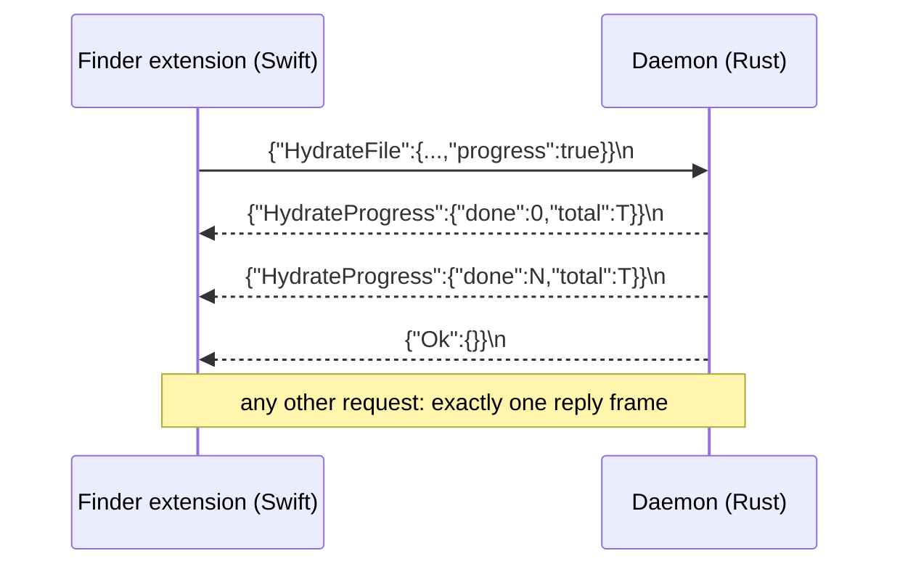

# Daemon IPC protocol (Unix socket)

Task 1670 issue 3. This is the contract between the desktop daemon
(`src-tauri/src/ipc_socket.rs`) and its socket clients: the macOS File Provider
extension (`BeebeebFileProvider/XPCBridge.swift`) and the Rust readiness probe
(`wait_for_file_provider_ipc_ready`). The Linux FUSE prototype (`src-tauri/src/linux_fuse`)
does not use this socket. Unix sockets do not exist on Windows, where Cloud Files runs
in-process.

Implementations that must stay in step:

| Half | File |
| --- | --- |
| Rust framing | `src-tauri/src/ipc_frame.rs` |
| Rust server | `src-tauri/src/ipc_socket.rs` (`handle_connection`, `hydrate_over_ipc`) |
| Swift framing + exchange | `BeebeebFileProvider/IPCFraming.swift` |
| Swift caller | `BeebeebFileProvider/XPCBridge.swift` |
| Readiness probe (Rust client) | `wait_for_file_provider_ipc_ready` in `src-tauri/src/lib.rs` |

## Framing

A **frame** is one compact JSON value followed by a single `\n` (0x0A).

- Compact JSON escapes every control character inside a string (`\n`,
  `\u000a`), so a raw 0x0A byte can only be the delimiter. Both encoders assert
  this (`serde_json::to_vec` on the Rust side; `IPCFraming.encodeRequest`
  refuses to send a request containing one).
- One request per frame, client to server. Exactly one final reply frame per
  request, server to client. The connection stays open for further requests.
- Empty and whitespace-only lines are ignored.
- Requests are limited to 1 MiB (`MAX_REQUEST_BYTES`). A longer message gets an
  `Error` frame and the connection is closed (the stream cannot be
  resynchronised). Replies are limited to 32 MiB on the Swift side
  (`IPCFraming.maxReplyBytes`); over that the client reports an honest
  "reply larger than Finder can accept" error.



### Why (what was wrong before)

- The daemon treated one `read()` of at most 64 KiB as one whole request and
  wrote replies with no delimiter. On a `SOCK_STREAM` socket a request can arrive
  in several reads and a client cannot know where a reply ends.
- The Swift client did one unlooped `write()` and one `read()` of at most 65536
  bytes, then parsed. A reply over 64 KiB (a folder of a few hundred items) was
  always truncated.
- The daemon answered a successful hydrate with the bare JSON string `"Ok"`
  (a unit enum variant). `JSONSerialization` rejects a top-level string unless
  fragments are allowed, so **every successful hydrate surfaced as "daemon
  response was not valid JSON"** after the download had already finished. The
  success reply is now the object `{"Ok":{}}`.

## Hydrate progress

`HydrateFile` accepts an optional `"progress": true` (default false). When set,
the daemon sends zero or more `HydrateProgress` frames before the final reply:

```json
{"HydrateProgress":{"done":10485760,"total":31457280}}
```

`done` and `total` are plaintext bytes; `total` is 0 when the server did not
report a size. The first frame is `done: 0` as soon as the file's metadata and
key are known; then one per decrypted chunk. The final reply is `{"Ok":{}}` or
`{"Error":{"message":"..."}}`.

Clients that do not opt in (the 0.8.6 extension) receive no progress frames,
because they read exactly one reply and would mistake the first progress frame
for it.

### Cancellation

While a hydrate runs the daemon also watches the socket. If the client hangs up
(Finder cancelled the `Progress`; the Swift side calls `shutdown()` on the
socket) the daemon drops the download, writes nothing to disk, and restores the
file's status (`DownloadingStatusGuard` in `engine_bridge.rs`).

## Timeouts (Swift client)

Applied as `SO_RCVTIMEO`/`SO_SNDTIMEO`, i.e. per `read()`/`write()` call:

| Call | Timeout | Reason |
| --- | --- | --- |
| list / item / queue delete / queue create+modify without contents | 30 s | Database work in the daemon; answers in milliseconds. |
| queue create / modify WITH contents | 600 s | The daemon copies the whole file into staging (`StagedPayload::copy`, synchronous) before replying and sends nothing meanwhile. A timeout here is a duplicate hazard: the extension reports failure, the daemon still queues the upload, Finder retries and queues it again under a fresh id. 600 s covers 15 GB at 25 MB/s (a same-volume APFS copy is a clone, near-instant). A copy longer than that still times out; closing that fully needs a client request id the daemon dedups on (not implemented). |
| hydrate | 600 s idle | Each progress frame restarts it. The daemon's HTTP client allows 30 s per request (`api_client.rs`) and a hydrate makes one metadata request plus one per chunk; an older daemon sends no progress and is silent for the whole download. 20x the per-request ceiling also covers `download_kbps_limit` pacing sleeps. |

A timeout surfaces as `BeebeebIPCError.timedOut(seconds:)`
("Beebeeb's sync engine did not answer within N seconds..."), never as a JSON
error. No error message ever contains raw reply bytes.

## Version skew (app update in progress)

| Extension | Daemon | Behaviour |
| --- | --- | --- |
| new | old | The old daemon replies with no delimiter and keeps the connection open, and answers a hydrate with the bare string `"Ok"`. `IPCFrameReader` accepts a buffer that is already one complete JSON value without waiting for a newline, and `IPCFraming.decodeReply` maps a bare `"Ok"` to `{"Ok":{}}`. The old daemon ignores the unknown `progress` field, so no progress is shown. |
| old | new | The old extension writes its request with no delimiter and does not close: `FrameReader` accepts a buffer that is already one complete JSON value. It requests no progress, so it gets one reply, now `{"Ok":{}}\n` (which its parser accepts). |

## Tests

| What | Where | Truth line |
| --- | --- | --- |
| Rust framing units | `ipc_frame.rs` `mod tests` | `cargo test` counts |
| Rust socket end-to-end (>64 KiB reply, split request, several requests per connection, unframed legacy request, oversize, bad line, `Ok` shape) | `src/ipc_socket_framing_tests.rs` | `cargo test` counts |
| Hydrate progress + cancellation | `engine_bridge.rs` tests `ipc_hydrate_*` | `cargo test` counts |
| Swift framing + exchange over a real `socketpair` | `BeebeebFileProviderTests/main.swift` via `scripts/test-ipc-framing.sh` (macOS CI job "File Provider Swift (macOS)") | `ipc-framing: N passed, 0 failed`, N asserted |
