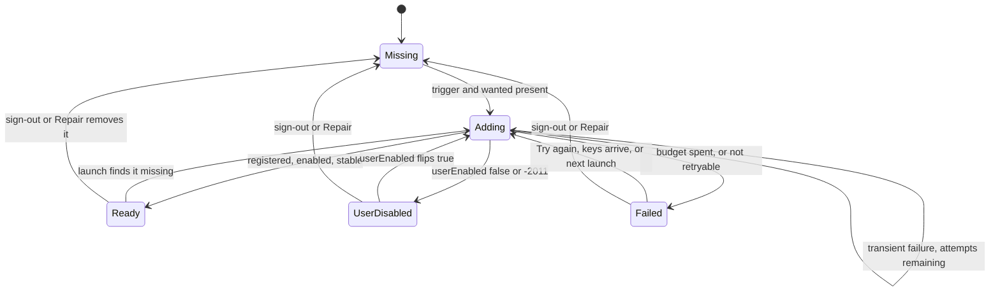

# 2026-10-06 — macOS: Beebeeb in Finder just works (spec A of 3)

**Status:** design approved section by section by Guus on 2026-10-06; written spec awaiting his review.
**Date:** 6 Oct 2026
**Repo:** desktop (macOS only; Windows and Linux behaviour is unchanged)
**Task:** allocated together with the implementation plan.
**Siblings:** spec B (the popover becomes the only macOS surface) and spec C (launch and first run become "sign in, and that's it") follow this one, each with its own spec, plan and review.
**Supersedes:** the "Finder not added" state and its "Add to Finder" action in the 1683 popover design (see Rulings, R5).

## 1. Why

Guus, 2026-10-06, on desktop 0.8.11:

> "The app sucks and doesnt work, install location fails (after update), then drive status still shows this, but it should just show to me to login and thats it."

"Install location" is onboarding's **Install the Finder location** step. This spec makes that step disappear: once you are signed in and this Mac has your keys, Beebeeb puts itself in Finder, keeps itself there across launches and updates, and says one honest sentence when macOS really stops it.

## 2. What we found (verified on Guus's Mac, 2026-10-06)

1. **The failure.** `fileproviderd` refused every add attempt from 0.8.11 (pid 31804) with the fault *"attempting create a domain root at `<FPFS>/B…b`, but that path already exists and is owned by a different provider `io.beebeeb.desktop.FileProvider/…domain`"*. The app made 11 attempts between 15:04:31 and 15:05:09 and then showed a generic error.
2. **The owner of the path.** `~/Library/CloudStorage/Beebeeb-Beebeeb` (created 18 May 20:48) carries `com.apple.file-provider-domain-id: io.beebeeb.desktop.FileProvider/io.beebeeb.desktop.domain`. Its extension is no longer installed (`pluginkit` lists only `io.beebeeb.app.FileProvider`), and `ls` on the folder times out. It is an orphan from our own app before the bundle rename: the app was `io.beebeeb.desktop` until `b9da3be` (18 May 2026).
3. **Why it collides now.** A domain's folder is `<app name>-<domain display name>`. Before 0.8.9 our domain was named "Drive" (`Beebeeb-Drive`). Task 1698 (`bb42d29`, shipped in 0.8.9) renamed it "Beebeeb", so it now asks for exactly the orphan's folder.
4. **Why our domain was gone.** Sign-out removes our domain on purpose (`clear_session_impl`, lib.rs ~1846–1857: "a logged-out machine has no live File Provider domain"). After a sign-out, the next sign-in has to add it again, and that add hits the orphan. `BeebeebFileProviderCtl status` reported `missing`.
5. **Why nothing cleaned it up.** `NSFileProviderManager.getDomains` returns only the calling provider's own domains, so the 1698 stale-domain sweep can never see `io.beebeeb.desktop.FileProvider`. `fileproviderctl` has no remove command.
6. **No way to diagnose it on a user's Mac.** The app logs only to stdout (`tracing_subscriber::fmt()`, lib.rs ~8736), which is lost when macOS launches the app. The evidence above came from the system log, which only reaches back about four hours.

### Correction: tasks 1696 and 1698

1698's comment in `src-tauri/src/macos_file_provider.rs` (the `DOMAIN_IDENTIFIER` doc) says the zombie `io.beebeeb.desktop.FileProvider` domain "keeps its 'Beebeeb-Drive' volume … until a SIGNED context enumerates and removes it". **That was wrong on two counts.**

- The zombie's folder is `Beebeeb-Beebeeb`, not `Beebeeb-Drive`.
- No signed `io.beebeeb.app` context can enumerate it, because `getDomains` is per provider.

The 1696 forensics line "we registered 'Drive' while the system showed 'Beebeeb'" was reading the **zombie's** name, so 1698 renamed our domain to match the zombie and created the collision. The implementation corrects that comment by adding the correction beneath it, leaving the original claim visible, per the honesty conventions.

**Who is affected.** Only Macs that ran a build from before 18 May. `io.beebeeb.desktop` never shipped publicly (the first public macOS release was 0.8.5, task 1608, 29 Sept), so in practice that means Guus's Mac and possibly Bram's. The bug class is still real for everyone: an add failure gets no specific reason, no retry limit, and no log.

## 3. Rulings recorded (Guus, 2026-10-06, in the brainstorming session)

- **R1: three separate specs.** "the seperate specs, prefer slow and quality over speed and quantity". Order: A (this spec), then C, then B.
- **R2: a revoked session keeps Beebeeb in Finder.** "Keep it, ask to sign in". Files stay listed, files not on this Mac cannot open until sign-in, the app asks for sign-in again, and edits made meanwhile are kept and upload after sign-in. A sign-out you choose still removes the domain.
- **R3: device checks run on Guus's own Mac account.** "My own Mac account" / "you're running on a mac right now". His real session gets signed out during the checks, and he signs back in at the end.
- **R4: one Finder reconciler in Rust** (approach 1). "looks good, lets go with it". This was chosen over calling `install_finder_location` automatically from the frontend (approach 2) and over managing the domain from the extension or a launch agent (approach 3, impossible: only the containing app can add or remove its domain).
- **R5: no "Add to Finder" anywhere.** "yep" to Section 1, which drops the 1683 "Finder not added" state and its "Add to Finder" button. "Try again" survives only inside a failure. This supersedes the approved 1683 artifact for that state, and the artefact is updated first (section 12).
- **R6: the orphan is removed with a one-off helper.** "Yes, I'll make the profiles". Guus creates two development provisioning profiles for the old IDs when the cleanup step comes up.
- **R7: device check D8 may sign a test account into production** to exercise the real alpha update path. This was approved with Section 6 ("perfect"). It is the only production action this spec authorizes.

## 4. Goal and non-goals

**Goal.** On a Mac, after sign-in, Beebeeb appears in Finder with no further click, stays there across launches, updates and revoked sessions, and leaves only when you sign out. When macOS blocks it, you get one sentence and one action, the app does not retry in a loop, and the reason is in a log file.

**Non-goals (handed on):**
- Which window or popover shows sign-in, and the launch behaviour → spec C.
- Removing the old compact window ("Drive status") and the hidden webviews (the source of about 1.7 M WebKit log lines in two hours on 0.8.9) → spec B.
- Windows CFAPI and Linux FUSE registration: unchanged. `install_finder_location` stays for them.
- A "Move to Applications" button that moves the app for you: not built. The app tells you, and you move it.

## 5. Behaviour

### 5.1 What the reconciler wants

| Situation | Wanted |
|---|---|
| Signed in and this Mac has your keys (`logged_in && vault_unlocked`) | **present** |
| Signed in, session revoked (`auth_expired`) | **present** (R2) |
| Signed in, keys missing (the recovery-phrase step) | no action: neither add nor remove |
| Signed out by choice | **absent** |
| "Repair…" in Settings (`reset_macos_integration`) | **absent, then wanted again**: remove, then one fresh check, so a signed-in Mac ends with Beebeeb back in Finder |

### 5.2 What it reports

It reuses the existing `surfaces::phase::FinderSetup` the popover reducer already consumes, so there is no second vocabulary. `Failed` gains a reason (section 6). Because `PopoverSnapshot` is `Copy`, the reason travels as a separate `finder_reason: Option<FinderFailureReason>` field.

| State | Meaning |
|---|---|
| `Adding` | a check is in flight, including its silent retries (popover state f1, "Adding Beebeeb to Finder…") |
| `Ready` | registered, enabled and stable |
| `UserDisabled` | turned off in System Settings; add is never called while it is off |
| `Failed(reason)` | retry budget spent or not retryable; one sentence and one action |
| `Missing` | only the instant before the first check, or while the wanted state is "no action"; never a state a person waits in |

### 5.3 What starts a check

1. **App launch**, including the relaunch after an update. This also covers "wanted absent but still registered", for example after a sign-out whose removal failed.
2. **Keys arrive on this Mac**, from every path: `desktop_login` returning unlocked, `desktop_login_2fa`, the browser sign-in handoff (`browser_login::run_handoff`), and `desktop_unlock_with_recovery_phrase`.
3. **While `UserDisabled`:** the enable poll sees `userEnabled` flip to true (section 7).
4. **"Try again"**, which starts a fresh retry budget.
5. **Sign-out by choice** (`clear_session`) sends the reconciler a remove. It cancels any check in flight and removes the domain, so add and remove can never race.
6. **"Repair…"** (`reset_macos_integration`) sends remove-then-check. The reconciler cancels any check in flight, removes the domain, then runs one check with a fresh retry budget.

A revoked session is deliberately **not** a trigger.

### 5.4 One check at a time

There is exactly one reconciler task. A trigger that arrives while a check is running sets a "check again" flag, so any number of triggers during a check produce at most one follow-up check.

### 5.5 One check

Steps:
1. Read macOS's own state (`domain_user_enabled_state`).
2. If registered and disabled, stop at `UserDisabled`.
3. If registered and enabled, confirm it is stable (short wait), then `Ready`.
4. If not registered, check the launch location (section 6.2), call `addDomain`, re-read `userEnabled`, and wait up to 10 s for stabilization. The result is `Ready`, `UserDisabled`, or a classified failure that the retry policy turns into another attempt or `Failed`.
5. On `Ready`, start the sync engine and save the sync folder. `install_finder_location`'s macOS arm does this today (`start_engine_for_pending_finder_install` / `persist_sync_root_and_start_engine`); it moves here.
6. On every transition, emit `finder-setup-changed` so surfaces refresh without polling, and write one log line (section 8).

## 6. Failure reasons, copy and actions

### 6.1 The bridge returns structured errors

`src-tauri/macos/FileProviderBridge.m` returns **(error domain, code, message)** instead of one flattened string, and Rust receives `FpError { domain, code, message }`. Classification reads only `domain` + `code`. The message goes only to the log, redacted. The substring matching in `classify_finder_install_error` (lib.rs ~2106), which matched English fragments of our own copy, is deleted on macOS.

### 6.2 The table

Codes are from the macOS 27 SDK header `FileProvider.framework/Headers/NSFileProviderError.h` on the build Mac.

| Reason | macOS signal | Retried silently | Copy | Action |
|---|---|---|---|---|
| `extension_loading` | `NSFileProviderErrorDomain` -2001 ProviderNotFound, -2003 OlderExtensionVersionRunning, -2004 NewerExtensionVersionFound, -2012 ProviderDomainTemporarilyUnavailable, -2014 ApplicationExtensionNotFound | yes | while retrying: "Adding Beebeeb to Finder…"; after the budget: "macOS hasn't finished loading Beebeeb's Finder extension." | Try again |
| `user_disabled` | -2011 DomainDisabled, or `userEnabled == false` (this becomes the `UserDisabled` state, not `Failed`) | no | "Beebeeb is turned off in System Settings." | Open System Settings (`open_login_items_and_extensions_settings`; recovers by itself) |
| `not_in_applications` | -2002 ProviderTranslocated, or the launch-location check | no | "Beebeeb is running from the disk image. Move it to Applications, then open it again." | Show in Finder |
| `folder_taken` | the domain root path is owned by a different provider. **The NSError domain and code are captured by device check D0** and written into this cell before the classifier for this row merges. | no | "An older Beebeeb installation still holds Beebeeb's place in Finder. Contact support and we'll help you clear it." | Copy details |
| `signing` | entitlement, app-group or provisioning errors (exact codes listed in the plan from the bridge's existing provisioning paths) | no | "This copy of Beebeeb can't add itself to Finder. Download it again from beebeeb.io." | Copy details |
| `timeout` | added, but never stable within the wait | yes | "macOS didn't finish adding Beebeeb to Finder." | Try again |
| `unknown` | anything else | once | "Beebeeb couldn't be added to Finder." | Try again |

Rules:
- **One sentence and one action** (1683 ruling 7). A failure that gates Finder is inline, never a toast.
- **"Copy details"** copies: app version, macOS version, reason, NSError domain and code, attempt count, and the time of the last attempt. Never paths, file names or the email.
- **All copy lives in one frontend module** (`src/finderSetupCopy.ts`), keyed by reason, with a test pinning every string above. No surface writes its own.
- **The launch-location check** (`launch_location(bundle_path)`) is pure:
  - bundle under `/Applications` or `~/Applications` → OK
  - a path containing `/AppTranslocation/`, or starting with `/Volumes/` → not OK
  - anywhere else → proceed and let macOS decide (a -2002 is still classified)
  It runs at launch and is exposed in `finder_setup_state` before sign-in, so spec C can show it before anyone types a password. Spec A only provides the detection and the copy.

## 7. Retry policy

- **Transient reasons** (`extension_loading`, `timeout`): at most **4 attempts**, starting 0 s, 5 s, 15 s and 45 s after the check starts. An attempt still in its ≤10 s stabilization wait when the next start time arrives delays that attempt until it finishes. A check therefore ends within about 55 s plus any such delay, and the person sees `Adding` throughout. After the 4th failure the state becomes `Failed(reason)`.
- **`unknown`**: one silent retry after 5 s, then `Failed`.
- **Not retryable** (`folder_taken`, `signing`, `not_in_applications`): `Failed` straight away.
- **After `Failed`**, nothing retries automatically until the next launch, keys arriving, or "Try again". Bringing the app to the front does not retry.
- **`UserDisabled` poll:** a read-only `userEnabled` check every 3 s, only while a Beebeeb window is visible, plus once when the app becomes active. It never calls add. The flip to true triggers exactly one check.
- **The schedule and the clock live in one place** (the reconciler's policy struct) and are injected in tests.

## 8. Lifecycle log

- **File:** `~/Library/Logs/Beebeeb/lifecycle.log`, visible in Console.app. It rotates at 1 MB (`lifecycle.log` → `.1` → `.2`) and keeps 3 files. It is our own small writer, with no new dependency.
- **Closed vocabulary.** Each line is one typed event:
  - launch: app version, macOS version, launch location
  - trigger received
  - reconciler transition: from, to, reason, NSError domain and code, attempt n of N
  - sign-in completed or signed out: no email, no account id
  - update downloaded or installed: from and to versions
- **The only free text** is the NSError message, passed through `diagnostic_redaction::redact_for_export` with the state DB's known names, so paths become `[path]` and unknown words become `[name]`.
- **It is not a `tracing` sink.** The general `tracing` stream (engine errors embed paths and file names) never reaches the file.
- **It contains no user content, so it survives sign-out.** That is what keeps a failed sign-in diagnosable.
- **"Copy details" and the 1685 support bundle include its last 200 lines.**
- Stdout `tracing` stays for dev runs.

## 9. Units and interfaces

Each unit has one purpose and can be tested on its own.

| Unit | Purpose | Interface | Depends on |
|---|---|---|---|
| `finder_setup::core` (new, pure) | decide the next state and effects | `step(state, event, observation, now) -> (state, Vec<Effect>)` | nothing (no OS, no clock, no I/O) |
| `finder_setup::policy` (new, pure) | retry schedule and reason classes | `next_attempt_at(reason, attempt, started) -> Option<Instant>`; `classify(&FpError) -> Reason` | nothing |
| `finder_setup::driver` (new) | the single reconciler task: receives events, runs observations and effects, merges triggers, owns the timer | `FinderSetupHandle::send(Event)`; `state() -> FinderSetupView` | core, policy, bridge, engine start, log |
| `macos_file_provider` + `FileProviderBridge.m` (changed) | talk to `NSFileProviderManager` | the existing calls return `Result<_, FpError>` | FileProvider.framework |
| `finder_setup::launch_location` (new, pure) | where the app runs from | `launch_location(&Path) -> LaunchLocation` | nothing |
| `lifecycle_log` (new) | the file in section 8 | `lifecycle_log::event(LifecycleEvent)` | redaction |

**Tauri commands on macOS:**
- `finder_setup_state` (read; replaces `finder_location_state`'s macOS use)
- `finder_setup_retry` ("Try again")
- `finder_setup_copy_details`
- `open_login_items_and_extensions_settings` (exists)

The macOS frontend no longer calls `install_finder_location`, `continue_without_finder_location` or `finder_domain_user_enabled`; the poll moves into the driver. The commands stay registered for Windows and Linux. `PopoverRuntime`'s `finder_adding_guard` is replaced by the driver's published state.

**Config (`desktop.toml`):**
- The free-text `finder_install_last_error` and the string `finder_install_status` stop being written on macOS. Truth comes from macOS on every check.
- What persists is `finder_last_failure = { reason, domain, code, at }`, for "Copy details" across a relaunch.
- Old keys must still load: they are ignored, never an error, and a test loads a 0.8.11 `desktop.toml`.

## 10. Frontend changes in this spec (macOS)

Kept to what makes A shippable on its own. Spec C later deletes the onboarding step, and spec B the old window.

- **`Onboarding.tsx`, Finder step:**
  - no "Install Finder location" button
  - shows `Adding`, then advances by itself on `Ready`
  - on `Failed` / `UserDisabled`, shows the one notice and one action from `finderSetupCopy.ts`
- **`MacSettings.tsx` Sync tab, `pages/SyncFolder.tsx`, `pages/Status.tsx`:**
  - read `finder_setup_state`
  - no "Install in Finder" on macOS
  - "Try again" only in `Failed`
  - `finderInstallCard.ts`'s macOS classifiers are replaced by the one reason-keyed copy module
- Subscribe to `finder-setup-changed` instead of polling `finder_location_state` every 3 s.

## 11. Clearing the orphan (dev Macs only, R6)

Not product code. It lives in a scratch directory and is deleted afterwards.

1. **Guus creates two Apple Development provisioning profiles**, for `io.beebeeb.desktop` and `io.beebeeb.desktop.FileProvider` (app group `R8352WDJJR.io.beebeeb.desktop.fileprovider`). He recreates the App IDs if May's are gone.
2. **Build a minimal helper app** `io.beebeeb.desktop` embedding an empty `io.beebeeb.desktop.FileProvider` extension, signed with those profiles. Its only action is `NSFileProviderManager.removeAllDomains`, printing the result.
3. **Run it once**, then delete the helper and the two profiles.
4. **Proven by four checks:**
   - the xattr and the `Beebeeb-Beebeeb` folder are gone
   - `fileproviderd` no longer writes domain properties for `io.beebeeb.desktop.FileProvider`
   - our add succeeds
   - `BeebeebFileProviderCtl status` prints `installed`

It runs **after** device check D0 has captured the real `folder_taken` code on this Mac. It is offered to Bram for his Mac if `ls ~/Library/CloudStorage` shows the same xattr there.

## 12. Design artefacts change first

Before the frontend change merges:
- `design/hifi/macos-menubar-popover.html`: the "Finder not added" artboard is removed, and the "Finder add failed" artboard shows the reason-keyed copy from 6.2.
- `docs/specs/2026-09-30-macos-menubar-popover.md`: an amendment line records R5 and points here.

## 13. Testing and verification

### 13.1 Automated

Every new test is seen failing before it passes, and the failure output is pasted into the task Notes.

- **`core`**: table tests for every trigger × every observation (section 5); merged triggers (N triggers during one check → exactly 1 follow-up); a revoked session never emits remove; sign-out cancels and removes; Repair removes and then checks exactly once; `Missing` is never a resting state while wanted is present.
- **`policy`**: on an injected clock, transient failures make exactly 4 attempts at 0/5/15/45 s; `unknown` makes 2; not-retryable reasons make 1; no attempt after `Failed` without an explicit trigger. `classify` covers every row of 6.2 plus the fallback. It is **mutation-checked**: flip one mapping, confirm the matching row's test fails, revert.
- **Bridge**: a stub returns each (domain, code) pair, and Rust receives it unchanged.
- **`launch_location`**: `/Applications`, `~/Applications`, `/private/var/folders/…/AppTranslocation/…`, `/Volumes/Beebeeb/…`, `~/Downloads/…`.
- **`lifecycle_log`**:
  - rotation at 1 MB, keeping 3
  - a known file name planted inside an NSError message comes out as `[name]`, and a path as `[path]`
  - an ordinary `tracing::warn!` with a path never appears in the file
- **Config**: a 0.8.11 `desktop.toml` with the old keys loads.
- **Frontend (bun)**:
  - the Finder step advances on a `Ready` event
  - each reason renders exactly one notice and the action from 6.2
  - no "Install" button renders on macOS
  - a source-contract test that no macOS code path calls `install_finder_location`
- **Gates**:
  - `cargo test --locked` in `src-tauri`, with the per-binary `test result: ok. N passed; 0 failed` lines
  - `cargo clippy --all-targets`
  - `bun test` with the `N pass / 0 fail` count
  - `bunx tsc --noEmit`
  - eslint

### 13.2 Device checks on Guus's Mac (R3)

Evidence for every check goes under `.claude/tasks/_qa-evidence/<task>/`:
- a screenshot
- the relevant `lifecycle.log` lines
- `BeebeebFileProviderCtl status` output
- the count of `fileproviderd` "Adding domain" lines for the attempt (`log show --predicate 'process == "fileproviderd" AND eventMessage CONTAINS "beebeeb"'`)

| # | Check | Pass means |
|---|---|---|
| D0 | Before the cleanup, the new build meets the orphan | `folder_taken` copy shown once; exactly 1 add attempt; the NSError domain and code recorded into 6.2 |
| D1 | Orphan cleanup (section 11) | all four checks |
| D2 | Signed out, then sign in | Beebeeb in Finder within 30 s with zero clicks after sign-in; a cloud-only file opens |
| D3 | Quit and relaunch | `Ready`; nothing asked; at most 1 add attempt |
| D4 | Sign out, then sign in | `status` `missing` and the sidebar entry gone; then back by itself |
| D4b | "Repair…" in Settings while signed in | Beebeeb leaves Finder and comes back by itself; ≤4 add attempts |
| D5 | Session revoked from the web | Finder stays; sign-in requested; an edit made meanwhile reaches the server after sign-in (version visible on the web) |
| D6 | Turned off in System Settings, then back on | the `user_disabled` notice; then `Ready` with no click in Beebeeb; exactly 1 add attempt after the flip |
| D7 | Opened from the mounted dmg | `not_in_applications` reported by `finder_setup_state` before sign-in |
| D8 | Update 0.8.11 → the alpha carrying this spec, while signed in | `Ready` after the relaunch; nothing asked; ≤4 add attempts |

**Environment:**
- D0–D7 run a build signed with the existing `io.beebeeb.app` development profiles (valid to May 2027), against the local API (`BB_API_BASE=http://localhost:3001`), with a test account.
- **D8 runs against production** (R7): the published 0.8.11 dmg, then the real alpha update, with a test account.
- Guus's own session is signed out during the run. Restoring it (his password) is the last step.

**What counts as done:**
- **Done** = every automated gate green with counts, plus D0–D8 passed with evidence.
- A check that cannot run gets its line amended in place, per `.claude/tasks/README.md`. It is never satisfied badly.

## 14. Docs that change with the code

- `repos/desktop/CLAUDE.md` → "Current macOS integration state": the reconciler, the log path, and the 1698 correction.
- `docs/CAPABILITIES.md`, if it describes Finder installation.
- `RELEASE_NOTES.md` for the release that carries A, with counted test results (the release script refuses notes without them).

## 15. Open items, each with an owner

- The `folder_taken` NSError domain and code: captured by D0, owner lead.
- Whether the May App IDs `io.beebeeb.desktop` and `io.beebeeb.desktop.FileProvider` still exist in the developer portal: Guus, at step 1 of section 11.
- The exact provisioning error codes mapped to `signing`: listed in the plan from the bridge's existing provisioning paths, owner lead.
