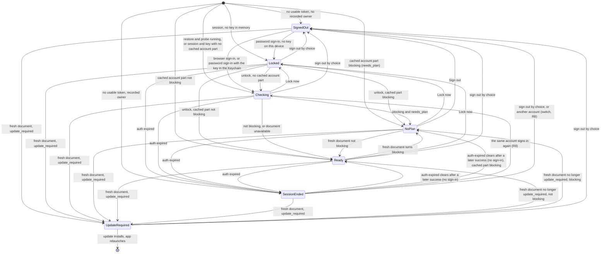

# 2026-10-07 — Desktop: the first run is sign-in only (spec C of 3)

**Status:** design approved by Guus on 2026-10-07 in three parts, with rulings C1–C7; this written spec awaits his review.
**Amended:** 2026-10-07 for the lead's rulings on the six open points and the browser sign-in outcome (§17, C-S1). — lead, 2026-10-07
**Amended:** 2026-10-07 for the lead's rulings on the independent spec review (§17.2). — lead, 2026-10-07
**Date:** 7 Oct 2026
**Repo:** desktop. macOS and Windows; Linux shares the Rust account state and the sign-in window (§7.8).
**Tasks:** 1747 (macOS) and 1748 (Windows), re-scoped by Guus on 2026-10-06: "Signup only web, signin web or direct". Server dependency: 1844.
**Builds on:** spec A, `docs/specs/2026-10-06-macos-finder-setup-reconciler.md` (task 1834). Work starts after spec A's two lanes merge.
**Siblings:** spec B (the popover becomes the only macOS surface) follows this one (spec A R1: A, then C, then B).
**Citations:**
- `file:line` means this repo at `origin/main` (`404bdcc`).
- "spec A" cites spec A's code by file and symbol, as it will merge from `feat/1834-finder-reconciler` (Rust) and `feat/1834-finder-reconciler-ui` (TypeScript). Its line numbers move before the merge.
- "server" means the server repo at `d2e7f776`.

## 1. Why

Guus, 2026-10-06 (spec A §1): "… it should just show to me to login and thats it."

- **Launch keys on the sync folder, not the session.** `startup_surface` opens onboarding only when no `sync_root` is set (`src-tauri/src/surfaces/policy.rs:49-55`, called at `src-tauri/src/lib.rs:9003-9036`). Sign-out never clears `sync_root`: the only `None` assignments are the default (`src-tauri/src/config.rs:312`) and the rejection of a relative path (`:503`). A Mac that was set up once and is now signed out opens the compact window on its "Drive status" page (`src/pages/Status.tsx:160,172`; landing page `src/App.tsx:27`). That page says "Signed out" (`src/App.tsx:163`) and offers no way to sign in.
- **macOS sign-in is email and password only** (`src/Onboarding.tsx:183`). The browser handoff exists, but only Windows offers it (`src/WindowsFirstRun.tsx:300-715`).
- **Neither platform has a "Create account" entry**, and neither reads the server's onboarding document.

This spec makes the first run "sign in, and that's it". You sign in natively, browser first and password second. You create an account on the web. The server's onboarding document decides what happens after sign-in.

## 2. Scope

- **In:** native sign-in on macOS (1747) and Windows (1748); a "Create account" link to the web; one account state derived in Rust from the session, the onboarding document and connectivity; a screen per state and the macOS launch policy; a crossed b in the menu bar when disconnected; notices for trial, read-only, frozen and failed-payment accounts.
- **Re-scoped out (Guus, 2026-10-06):** native signup on every platform. Accounts are created on the web.
- **Out:** see Non-goals (§18).

## 3. Rulings (Guus, 2026-10-07)

Quoted as given. C6-links is not item C6 of 1748, which is a Windows copy fix (§15).

- **C1 "Everything on the web":** no in-app plan chooser, no in-app trial start, no in-app checkout. A no-plan account is told to choose a plan on beebeeb.io (free trial included) with ONE button; the app re-checks and continues by itself.
- **C2 "Browser first, password second"** (sign-in methods).
- **C3 "Sign-in window, except at OS login":** a manual launch or first install shows the centred sign-in window; an automatic start at login shows only the menu-bar icon; clicking it opens the window.
- **C4:** "that also means we need to have an icon stating 'disconnected' in the header right, so where we now have the B icon it should be B with a cross through it so it makes sense its disconnected".
- **C4a "Any disconnection":** signed out, session ended, AND signed in but offline / server unreachable. The tooltip names which.
- **C4b "ye B":** variant B: a slash from bottom-left to top-right at 45°, stroke 2.6 pt (about 79% of the stem), round caps, a 1 pt knockout gap on each side, through the centre of the b's ink box.
- **C5 "Wait: no Finder, no sync"** for an account the server document marks blocking (`needs_plan`).
- **C6-links "Server sends the link":** account-stage documents gain the additive `fallback {kind, url}` (schema v1) that the pre_account stage already has, and the desktop opens what it names. Offline, or with an older server: one built-in beebeeb.io address per destination.
- **C7:** "on the payment failed, it needs a link to web billing".

## 4. Account state model

### 4.1 Inputs

Rust derives one `AccountView`, with one code path on all three operating systems; only the gate's hold is off on Linux (C-R14). The app's windows and the menu-bar icon only render it, the same pattern as spec A's `FinderSetupView` (spec A `finder_setup/driver.rs`). The inputs:

- **Session:** none, valid or ended. "Ended" holds in either of two cases:
  - **(a) spec A's existing auth-expired state,** `AuthHealth::is_expired()` (spec A `runner.rs`). `sync_status` reports it as `auth_expired`, and it drives `AuthExpiredBanner` and "Sign in again" (spec A `src/AuthExpiredBanner.tsx`). Spec C changes nothing in spec A's 401 handling: the threshold of 3 consecutive 401s and the clearing on any success stay. The onboarding fetch reports its own result to the same `AuthHealth::note_result`, so a revoked session is seen even while the engine is held.
  - **(b) no usable token while a recorded owner exists,** whether or not local data remains. The source is spec A's owner record (Task 10, R10: `StateDb::owner()` in spec A `state_db.rs`). This is what spec A Task 12's startup 401 leaves behind: the token dropped, keys and Finder kept (`discard_unusable_startup_session`, spec A). A relaunch after a revoked session therefore shows Session ended, not Signed out.
- **None** means no usable token and no recorded owner. A full sign-out (by choice, or an account switch) purges the owner record (spec A §5.6), so only those reach Signed out.
- **Keys:** whether the vault key is in memory, and for C-R4 whether it is in the Keychain (`keychain_vault_key_present`, spec A).
- **Document:** a fresh onboarding document; the cached account part (C-D5); "pending", while the first fetch since the session began has not concluded; or "unavailable", when that fetch ended without a usable document (§10).
- **Connectivity:** online, or offline at network level only (C-R7, §10).

### 4.2 Requirements

| ID | State | When | Window | Menu-bar icon | Finder + sync |
|---|---|---|---|---|---|
| C-R1 | Signed out | no usable token and no recorded owner | Sign-in (browser first, password second) + "Create account" (server's link) | crossed b | off |
| C-R2 | Session ended | spec A's auth-expired state, or no usable token while a recorded owner exists (§4.1) | the same sign-in window, sign-in-again mode | crossed b | as spec A: Finder kept (R8), sync paused until sign-in |
| C-R3 | Update required | a fresh document has `client.status == update_required` | "Update Beebeeb" (existing updater) | normal b with a valid session; crossed b when signed out or the session ended (C-I1) | off |
| C-R4 | Locked | valid session, no vault key in memory | Unlock (as today, C-W7) | normal b | off |
| C-R11 | Checking | a stored token whose startup restore and probe are running; or a valid session with the key in memory, no usable cached account part, and the document "pending" | the busy screen | normal b | off (the gate) |
| C-R5 | No plan yet | `blocking` and `account.state == needs_plan` | "Choose a plan on beebeeb.io" + one button | normal b | off |
| C-R6 | Ready | none of the above | nothing to do; one-line notice (§7.5) | normal b | spec A starts it (Windows, Linux: today's start) |
| C-R7 | Offline | an overlay on any state: a network-level failure | the state's own screen says offline | crossed b | unchanged |

- **C-R8 Precedence.** When several rows match, the first one in this order wins: C-R3, C-R2, C-R1, C-R4, Checking (C-R11), C-R5, C-R6. C-R7 overlays the winner.
  - Update required comes first because no other screen works on a version the server refuses.
  - Session ended comes before Signed out, so a missing token with a recorded owner always reads as Session ended. The two rows' conditions do not otherwise overlap.
- **C-R9 What "off" means.**
  - In C-R1 and C-R4 it is spec A's own behaviour. With no session or no keys, no engine starts. The reconciler takes no action, or wants Finder absent after a sign-out by choice (spec A §5.1).
  - In C-R2 it is spec A's handling, unchanged: Finder is kept (R8), and sync is paused until sign-in. Spec C neither stops nor starts the engine for C-R2.
  - In Checking, C-R3 and C-R5 it is the account gate (C-R10), which applies only while the session is valid.
    - A C-R3 while signed out keeps spec A's absent or no action, so a launch can still remove a Finder entry whose sign-out removal failed (spec A §5.3, trigger 1).
    - A C-R3 with an ended session keeps C-R2's handling.
    - On Linux the gate never holds (C-R14).
- **C-R10 The account gate is enforced at the point of action.**
  - **The value.** The gate is `{ open, epoch }` in Rust. On macOS and Windows it is closed in Checking, C-R3 and C-R5 while the session is valid, and open otherwise. On Linux it is always open (C-R14). Every change increments `epoch`.
  - **The reconciler's add.** `Op::AddDomain` (spec A `finder_setup/core.rs`) reads the gate immediately before it acts. It does nothing if the gate is closed, or if the epoch differs from the one its check started under.
  - **Every engine start reads it too.** `authorize_engine_start` reads the gate under the engine slot and returns a new permit, `AccountBlocked`, beside `NoSession` and `FinderRemovalOwed` (spec A `lib.rs`). The branch of `start_check_engine` that reuses a running engine (spec A) checks it as well.
  - **The six callers of `spawn_bound_engine`** (spec A `lib.rs`) treat `AccountBlocked` as held, never as an error:
    - `start_check_engine` ends the check with no action, so the reconciler shows no failure reason.
    - `ensure_sync_root_and_engine`, `persist_sync_root_and_start_engine` and `pick_sync_root` still save the sync folder.
    - `start_engine_if_possible` and `start_engine_for_pending_finder_install` log and return.
  - **When a fresh document closes the gate:**
    - the reconciler gets a hold that cancels any check in flight, like spec A's `Lock` trigger, and acknowledges it before the engine stops
    - a running engine is stopped with spec A's single stop helper, `stop_engine_in_slot`, keeping its unconfirmed-stop semantics (`engine_stop_unconfirmed`)
    - Finder is never removed because of blocking: the gate only holds adds
- **C-R11 Checking.**
  - **When.** Checking is entered on each of these, every one shown in the diagram (§4.3). The gate is closed throughout.
    - at launch, while spec A's startup restore and its probe run for a stored token (`probe_startup_session`, capped at 5 s, `lib.rs:561`, `:563`, `:573`)
    - at launch, once the restore has finished, with a session and the key but no usable cached account part
    - after a sign-in that leaves the key in memory: a browser sign-in, or a password sign-in with the key in the Keychain
    - after an unlock (the Keychain unlock or the recovery phrase) with no usable cached account part
    - after the same account signs in again from Session ended (R8)
  - **Screen.** The busy screen: the window's busy indicator, with no new words.
  - **Exit.** Checking ends with the first fresh document, or when the document is unavailable (§10: an HTTP status, a 429, an unreadable body, or offline). If the document is unavailable, the cache decides if there is one; otherwise the app proceeds as today (C-R6, gate open).
  - **Purpose.** Spec A's "keys arrived" cannot add Finder before the server has said whether the account is blocking.
- **C-R12 Every transition into Ready fires the account trigger.**
  - `account_ready` fires on every transition into C-R6: from Checking, C-R5, C-R4, C-R3 and C-R2, and at launch from the cache. One rule, not a list of cases, with a test for every incoming edge.
  - On macOS it acts like spec A's `KeysArrived`: it clears the reconciler's `held` flag and requests a check. A held reconciler ignores `TryAgain`, so this matters (spec A `finder_setup/core.rs`, `on_trigger`).
  - On Windows and Linux it calls today's engine start, `start_engine_if_possible`.
- **C-R13 The server enforces; the client explains.** The server refuses uploads for a no-plan account, so the client gate is for clarity, not enforcement. That is why offline never locks anyone out: offline uses the cached account part, and with no cache the app proceeds as today. A cached blocking account part keeps its gate until the next fresh document decides.
- **C-R14 Platforms.**
  - **Windows:** the same state, copy and crossed-b icon, rendered in its existing windows (§7.7), with no new launch policy (§6).
  - **Linux:** the same Rust state. The document fetch and the icon run on the shared paths, and Linux gets the changes to the shared sign-in window (§7.8). But the account gate never holds the engine on Linux, because Linux has no screens to explain a hold. The server still enforces (C-R13). Nothing Linux-specific is built.
- **C-R15 Blocking without `needs_plan`.** A document whose state is not `needs_plan`, and which is blocking only through a required `verify_email` step or a required step this client does not know, proceeds as today (C-R6, gate open). It writes one lifecycle-log line (§10) and gets no new screen. The server already refuses uploads and shares for an unverified email.

### 4.3 State diagram

Drawn from the table and C-R8. Offline (C-R7) overlays every state. Spec A's own transitions (keys, sign-out, switch) are named on the edges. A sign-in from Session ended goes through Checking; Session ended reaches Ready, No plan or Update required directly only when spec A clears the auth-expired state after a later success, with no sign-in.

## 5. The onboarding-document client (Rust)

- **C-D1 Endpoint.** `GET {BB_API_BASE}/api/v1/onboarding`. While signed out the request is anonymous (stage `pre_account`); while signed in it carries the session's Bearer (stage `account`). The server answers a bad Bearer with a 401 and never falls back to anonymous (server `beebeeb-api/src/routes/onboarding.rs:8-14`).
- **C-D2 Headers.**
  - Today's provenance headers stay: `X-Beebeeb-Client: desktop` and `X-Beebeeb-Client-Version` (`src-tauri/src/api_client.rs:45-66`).
  - This request also sends `X-Beebeeb-Onboarding-Schema: 1` and `X-Beebeeb-Client-OS: macos`, `windows` or `linux`. The server parses all three (server `onboarding/context.rs:20-22`, `:113-121`).
  - Without the OS header, the server resolves the desktop to purchase surface `none` and omits `purchase.checkout.poll_seconds` (server `onboarding/mod.rs:271-299`).
  - A test pins both headers.
- **C-D3 What the desktop reads.**
  - From `pre_account`: `client.status`, `signup.web_url` and `fallback`. Never `steps` or `policy`: the server still lists native signup steps there (server `onboarding/mod.rs:477`), and signup is web-only.
  - From `account`: `client.status`, `account.state`, `account.capabilities`, `account.trial.ends_at`, `account.lifecycle`, `blocking`, `steps[]` (`id`, `required`, `status`, `fallback`), `copy`, `fallback`, `purchase.checkout.poll_seconds` and `ttl_seconds`.
  - `offers`, the `start_trial` step, `choose_plan.params` and the rest of `purchase` are ignored (C1). Unknown fields are ignored.
- **C-D4 Schedule.**
  - **Normal.** Fetch at launch, when a sign-in completes, and every `ttl_seconds`: 60 s at account stage, 300 s at pre_account (server `onboarding/config.rs:56-58`). Also fetch on focus of a Beebeeb window when the last fetch is older than `poll_seconds`.
  - **After "Choose a plan on beebeeb.io" is clicked:** fetch every `poll_seconds` for 15 minutes, then return to the normal schedule. `poll_seconds` is 3 (server `config.rs:60`).
  - **Bounds.** A server `ttl_seconds` is clamped to 30–900 s and `poll_seconds` to 2–30 s. An absent value, or 0, takes the built-in one (60 s, 300 s or 3 s).
  - **Retries.** After a first failure the fetch is retried after 10 s. While offline, a 30 s probe replaces the schedule and the plan poll pauses; the poll resumes when the app is back online, if the 15 minutes have not run out.
  - **One fetch at a time.** A trigger during a fetch sets a "fetch again" flag (the pattern of spec A §5.4). The schedule and the clock live in one policy struct and are injected in tests.
- **C-D5 Binding the document to its account and session.**
  - **Generation.** Every fetch captures the session generation, which each session transition increments. It is provided by spec A Task 12; spec C adds it only if absent. A result whose generation has changed is dropped, never applied or cached. The in-memory document and `AccountView` are cleared inside the same transition as a sign-out or a switch.
  - **What is cached.** Only the account part is cached: `account`, `blocking`, `steps`, `copy`, `fallback` and `purchase.checkout.poll_seconds`. `client.status` is never cached. "Update required" therefore comes only from a fresh document, and offline the app never blocks on an update.
  - **Where.** One row in `state.db` holds the account part, the fetch time and the `account_binding::Identity` it was fetched for (spec A `account_binding.rs`).
  - **Identity unknown.** A session whose identity is not yet known (no `user_id`) keeps its document in memory only. It is persisted once the identity is known.
  - **Which account.** The row is used only when spec A's account comparison, as merged (`account_binding::same_account`), says it is the same account.
    - Another account: the row is deleted, never shown. It holds no user content, so this also applies on Windows, where R11 refuses the rest of a reset.
    - Cannot compare: the row is neither used nor deleted, the same as R10.
  - **Traces.** The row counts as a retained trace in `reauth::LocalTraces` (spec A `reauth.rs`), so R8 treats another account as a switch.
  - **Purge.** `purge_all_local_state` deletes tables by name (spec A `state_db.rs`), so the new table is added to its list explicitly. A sign-out by choice, an account switch and R10's reset delete the row. A session ended keeps it (the same account, R8). The pre_account document is held in memory only.
- **C-D6 Never logged.** The document body never reaches `tracing`, the lifecycle log, "Copy details" or the support bundle. The lifecycle log records closed tokens only (§10).

### 5.1 Links

- **Resolution.** Rust resolves each link and puts it in the `AccountView`; the frontend opens exactly that string. A destination takes the server's link when there is one, otherwise its built-in address.
- **Checks on a server link.** The URL is parsed, and it counts as absent unless all of these hold:
  - the scheme is `https` (the contract's pattern, server `contracts/onboarding/schema.v1.json`, `$defs/url`)
  - there is a host, and no user-info part
  - the host is `beebeeb.io` or one of its subdomains
  - In debug builds only (`cfg(debug_assertions)`), `http` to the exact host `localhost` is also accepted.
- **The webview does not filter.** `opener:default` (`src-tauri/capabilities/default.json:19`) allows any http or https URL, so these checks are the only filter, and a test pins them.

| Destination | Used by | Server link | Built-in address |
|---|---|---|---|
| Create account | the sign-in footer | pre_account `signup.web_url` | `https://app.beebeeb.io/signup` |
| Web billing | "Choose a plan on beebeeb.io", "Manage plan", "Choose a plan", "Update payment details" | account `fallback.url` with `kind: use_web` (1844) | `https://app.beebeeb.io/billing` |
| Support | "Contact support" | account `fallback.url` with `kind: contact_support` (1844) | `https://beebeeb.io/support` (today `src/macSettingsModel.ts:262`) |
| Unknown required step | the C-R5 button | the `fallback.url` of the first required step in document order that has one, else the document's | web billing |

One module owns these built-in addresses. It replaces every hard-coded web-billing URL:
- `src/desktopApi.ts:160`, used at `src/MacSettings.tsx:352`, `src/pages/Account.tsx:263` and `src/pages/VersionCenter.tsx:251`
- `src/windows/views/AccountView.tsx:34`, used at `:516`
- `src/WindowsApp.tsx:1764`

The rule "no literal URL outside this module" covers these destinations only. Other links, such as `ACCOUNT_URL` (`src/windows/views/AccountView.tsx:33`) and the downloads page, are out of scope.

## 6. Window and launch policy (C3, macOS only)

C3's launch policy applies to macOS only in spec C. Windows and Linux keep today's startup and today's icon clicks, and their startup pin stays unchanged (`src-tauri/src/surfaces/policy.rs:1-9`, `:48-50`).

### 6.1 Telling a login launch from a manual one

**How autostart is registered today (finding).**
- The app calls `tauri_plugin_autostart::init(MacosLauncher::LaunchAgent, Some(vec![]))` (`src-tauri/src/lib.rs:8763`; plugin 2.5.1 on `auto-launch` 0.5.0, `src-tauri/Cargo.lock`).
- `auto-launch` writes the agent to `dirs::home_dir()/Library/LaunchAgents/<app name>.plist` (`auto-launch` 0.5.0 `src/macos.rs:179-190`). `dirs-sys` 0.3.7 takes the home folder from `$HOME` first (`src/lib.rs:31-35`).
- The shipped macOS build is sandboxed (`src-tauri/entitlements.plist:38-39`). A sandboxed app's `$HOME` is its container, which is why spec A's lifecycle log, also built on `dirs::home_dir()`, lands under `~/Library/Containers/io.beebeeb.app/Data/` (spec A §8).
- So in the sandboxed build, "Start at login" writes the agent inside the container, where launchd does not read it. `is_enabled()` still says yes, because it only checks that this file exists (`src/macos.rs:162-165`).
- **Conclusion: autostart very likely cannot work in the sandboxed build.** This is not yet checked on a device (§16). The lead files a separate task; spec C does not fix autostart.

**Requirements:**
- **C-W1** A login launch is detected from the open-application Apple event: its `keyAELaunchedAsLogInItem` (`'lgit'`) parameter (macOS SDK, `AERegistry.h:1052`, "If present in a kAEOpenApplication event, application was launched as a login item").
  - It is read from `NSAppleEventManager`'s current event during launch, through a small Objective-C function beside `src-tauri/macos/FileProviderBridge.m`.
  - **Present:** a login launch.
  - **Absent, unreadable, or launched by an unknown mechanism:** a manual launch, and the window shows. This fails safe: the only cost is a window at login for a signed-out person who has autostart on.
  - **An updater relaunch** carries no such event, because tauri's `restart` spawns the binary directly (tauri 2.11.5 `src/process.rs:74-129`). It counts as manual.
  - One pure function maps the parameter to `LaunchKind`.
  - Whether the parameter arrives under the registration the shipped build uses is a device rung (§16).
- **C-W2** On macOS, opening the app while it is already running (from Finder, the Dock or Spotlight) is a manual launch. The app handles `RunEvent::Reopen`, which it does not today (`.run(tauri::generate_context!())`, `lib.rs:9059`).

### 6.2 Which window opens: one rule

- **C-W3 Icon click.**
  - In any state other than Ready, Checking included, a click opens the account window on that state's screen: sign-in (C-R1), sign-in again (C-R2, spec A's `open_reauth_window`), update (C-R3), unlock (C-R4, C-W7), choose a plan (C-R5), or busy (Checking). The exception is C-R4 with the key in the Keychain, which opens the Settings window (C-W7).
  - In Ready, a click opens the compact window on spec A's Finder location view (`src/pages/SyncFolder.tsx`, compact page `finder`) until spec B. It toggles as today (`lib.rs:9904-9912`).
- **C-W4 Manual launch.**
  - The decision waits until the state has settled, that is, until it is out of Checking. The 5 s settle starts when spec A's restore probe completes or times out (`probe_startup_session`, itself capped at 5 s, `lib.rs:561`).
  - If the state is still Checking at the end of the settle, the account window opens in the busy state.
  - A settled state other than Ready opens the account window on that state's screen, except C-R4 with the key in the Keychain, which opens the Settings window (C-W7).
  - In Ready, today's launch behaviour stays: `startup_surface` opens onboarding when no `sync_root` is set, else the compact window, which now lands on the Finder location view.
- **C-W5 Login launch.** It never opens a window.
- **C-W6 Nothing else** opens the account window by itself. A window that is already open re-renders when the state changes.
- **C-W7 The C-R4 screen is today's unlock flow; there is no new unlock UI.**
  - **The key is in the Keychain:** the Keychain unlock, which is the Settings Account tab's Vault "Unlock" button (`unlock_vault`, spec A `src/MacSettings.tsx`). The click or launch opens the Settings window (`show_macos_settings_window`, `lib.rs:8682`).
  - **No key on this device:** the account window's recovery-phrase step (`UnlockStep`, `src/Onboarding.tsx:350`, calling `desktop_unlock_with_recovery_phrase`).
- **C-W8 The account window** is the existing `onboarding` window (`lib.rs:874-910`, and spec A's `open_reauth_window`), centred at 860×640 (popover ruling 6).
  - On macOS its title becomes "Sign in to Beebeeb"; today it is "Welcome to Beebeeb" (`lib.rs:896`). The title bar follows the heading of the screen it shows.
  - The label stays, and so does spec A's `?window=onboarding&mode=reauth`.
- **C-W9 `startup_surface`** (`policy.rs:49-55`) gains the launch kind and the `AccountView` as inputs.
  - Only the macOS row changes. It still reads `no_sync_root` in Ready, because C-W4 keeps today's behaviour there.
  - The Windows and Linux rows, and their pin tests, stay as they are.

### 6.3 The menu

- **C-W10 No valid session.** In C-R1 and C-R2, and in C-R3 while signed out or with an ended session, the tray menu is detached (`set_menu(None)`), and both mouse buttons act as the click in C-W3. Today's handler acts on the left button only (`lib.rs:9850-9930`).
  - The window follows precedence: a C-R3 with an ended session opens the update screen.
  - The icon, tooltip and menu follow the session and connectivity instead (C-I1, C-I2).
- **C-W11 With a session.** The menu stays attached and unchanged until spec B. A left click follows C-W3.

### 6.4 Boundary with the popover spec

`docs/specs/2026-09-30-macos-menubar-popover.md` ruling 1 reads "show nothing at login; open the popover once after first install only", and ruling 6 keeps onboarding centred at 860×640. Spec C keeps "nothing at login" (C-W5) and the centred window (C-W8).

No popover exists yet (`src-tauri/tauri.conf.json:13-72` declares none). So after a first install with no session, the sign-in window opens (C3), and spec B decides whether its signed-out popover takes over. The Ready notices live in Settings until spec B moves them to the popover. Spec C builds no popover and does not change `surfaces::phase`.

## 7. Screens and copy

- **The copy below is exactly as approved.** In code, apostrophes are the typographic ’ (spec A §6.2 rule); the words do not change.
- **One module.** All strings live in `src/accountViewCopy.ts`, and a test pins each one.
- **Offline (C-R7) means network-level only (§10).** The update and choose-a-plan screens then replace their primary button with the sign-in window's offline line and "Try again" (§7.1). The unlock screen is unchanged, and the Settings notice keeps the cached line.
- **A document that is merely unavailable** (an HTTP status, a 429, an unreadable body) changes no screen. Sign-in buttons and built-in links stay.

### 7.1 Sign-in window (C-R1)

- Title: "Sign in to Beebeeb".
- Primary (amber): "Sign in with browser". It leads to the existing 1734 device-code screen, unchanged, with the code in mono. That screen lives in `src/WindowsFirstRun.tsx:300-715` today; it moves into one shared component that both windows mount, and its copy stays in `src/browserLoginCopy.ts`.
- Text link: "Use email and password". It leads to email, password, 2FA if it is on, and the recovery phrase if this Mac has no key. These are today's flows, copy unchanged (`src/Onboarding.tsx:183`, `:350`).
- Footer: "New to Beebeeb? Create an account on beebeeb.io" (server link, system browser), and a small "Quit Beebeeb". Cmd-Q also quits (it already exists, `lib.rs:9247`).
- Offline: the buttons are replaced by "Can't reach Beebeeb. Check your connection." + "Try again". "Create account" stays, with the built-in address.
- When spec A reports `not_in_applications` before sign-in (spec A §6.2, check D7), its sentence and "Show in Finder" sit above the buttons. The copy is spec A's (spec A `src/finderSetupCopy.ts`).
- **C-S1 One outcome for both sign-in paths.**
  - **Today on spec A's branch,** the browser path reports a different account in two raw ways: it emits an `account_mismatch` event that nothing consumes, and it returns the string `"account_mismatch"`. Its error arm also forwards that string in an `error` event (spec A `browser_login.rs`, `run_handoff` and `start_browser_login`).
  - **The shared contract.** `start_browser_login` returns the same `LoginOutcome` shape as `desktop_login` (spec A `lib.rs`). That shape always serializes `requires_2fa`, `reauthenticated`, `vault_unlocked` and `account_mismatch`, and `login_outcome_json_is_the_frontends_contract` pins it. The shape does not change.
  - **A fresh browser sign-in** delivers the keys, so its outcome carries `vault_unlocked: true`, and it never lands on the recovery-phrase step.
  - **The Lane T change.** `settledFrom` (spec A `src/onboardingSignIn.ts`) drops `vault_unlocked` for a fresh result today; its `fresh` result gains `vaultUnlocked`. `afterSignIn` (spec A `src/Onboarding.tsx`) then sends a fresh, unlocked result to Checking instead of to `UnlockStep`.
  - **A different account** gets spec A's switch warning (`AccountSwitchStep`), exactly as on the password path. No raw code reaches the UI: neither the command's error nor any event carries `account_mismatch`.
  - Both paths revoke the session they just created for the other account (spec A `lib.rs`, the password path's `AccountMismatch` arm; `browser_login.rs`). After "Sign out and switch", the person therefore signs in again, by either method.

### 7.2 Session ended (C-R2)

The same window, with spec A's sign-in-again wording unchanged: "Sync is paused until you sign in again." / "Sign in again" (spec A `src/AuthExpiredBanner.tsx`). Spec A's account-switch step stays.

### 7.3 Update required (C-R3)

"Update Beebeeb" — "This version of Beebeeb is too old to connect. Update to continue." — "Update now". "Update now" runs the existing updater, `check_for_updates_now` then `install_update` (`lib.rs:8073`, `:8135`), and its results show as they do in Settings today.

### 7.4 No plan yet (C-R5)

Title "Choose a plan" — "Your account is ready. Choose a plan on beebeeb.io, including the free trial. Beebeeb continues here by itself." — amber "Choose a plan on beebeeb.io". After the click: "Waiting for your plan. This window updates by itself." A quiet "Sign out" link (a sign-out by choice, spec A).

The click starts the 15-minute re-check (C-D4) whether or not the browser opened. When the state becomes Ready, the open window continues as after a sign-in (§7.6).

### 7.5 Ready notices (C-R6)

- **Where.** One line in Settings: the Account tab on macOS (`src/MacSettings.tsx:242`), the Account view on Windows (`src/windows/views/AccountView.tsx`). Spec B later moves it to the popover.
- **The plan button.** While a notice shows, its link replaces the Account tab's "Upgrade" / "Manage plan" button (`src/MacSettings.tsx:352`). With no notice the button stays, and it opens the resolved web-billing link.
- **Server copy wins.** If the server sends `copy` for the state, it is shown verbatim, so legal dates always come from the server. Otherwise the line comes from this table.

Each row was checked against the server's golden fixture (server `contracts/onboarding/fixtures/`):

| `account.state` | Golden fixture | Line | Link |
|---|---|---|---|
| `trialing_no_card` | `account.trialing_no_card.desktop.json` (sends `copy.trial_end_over_allowance`, shown verbatim) | "Free trial until 18 Oct." | "Manage plan" |
| `trialing` | `account.trialing.desktop.json` | "Free trial until 18 Oct." | "Manage plan" |
| `trial_ended` | `account.trial_ended.ios.json` (sends `copy.trial_ended_over_allowance`, shown verbatim) | the read-only variants below | "Choose a plan" |
| `trial_cancelling` | `account.trial_cancelling.web.json` (`trial: null`, upload denied) | the read-only variants below | "Choose a plan" |
| `lapsed` | `account.lapsed.ios.json` | the read-only variants below | "Choose a plan" |
| `read_only` | `account.read_only.web.json` | the read-only variants below | "Choose a plan" |
| `frozen` | `account.frozen.desktop.json` | "This account is frozen." | "Contact support" (server link) |
| `past_due` | `account.past_due.web.json` | "Payment failed. Update your payment details on beebeeb.io." | "Update payment details", to web billing (C7) |
| `active`, `legacy_free`, `allowance` | `account.active.web.json`, `account.legacy_free.web.json`, `account.allowance.desktop.json` | nothing | — |

- **Dates.** The table's dates are examples. The trial line uses `account.trial.ends_at`.
  - The format is day-month ("18 Oct"), UTC, with English month abbreviations, the same as the server's copy (server `onboarding/mod.rs:238`).
  - Rust formats them, and a test checks them against the server's examples.
- **Server copy keys** (server `onboarding/mod.rs:362-415`):
  - `trial_end_no_allowance` or `trial_end_over_allowance` replace the trial line.
  - `trial_ended_over_allowance` replaces the read-only line.
  - Other keys (`locale`, `region_line`, `plans_managed_on_web`, `trial_terms`, unknown ones) never become a notice.
- **The read-only line never invents a date.** It reads "Read-only since 7 Oct. Files are deleted on 21 Oct unless you choose a plan.", and each clause whose date is null is dropped:
  - `read_only_since` null: the line starts "Read-only."
  - `data_deletion_at` null: the deletion clause is replaced with "Choose a plan to upload again."
  - The dates come from `lifecycle` (server `onboarding/derive.rs:549-571`). The link is "Choose a plan" in every row.

  | `account.state` | Dates the server sends | Line |
  |---|---|---|
  | `trial_ended` | both (the fixture: 18 Oct, 1 Nov) | "Read-only since {read_only_since}. Files are deleted on {data_deletion_at} unless you choose a plan." |
  | `trial_ended` | neither (no `lifecycle`) | "Read-only. Choose a plan to upload again." |
  | `trial_cancelling` | both (the fixture: 6 Oct, 1 Nov); either may be null, and a null date drops its clause as above | "Read-only since {read_only_since}. Files are deleted on {data_deletion_at} unless you choose a plan." |
  | `lapsed` | `data_deletion_at` only (the fixture: 1 Dec); `read_only_since` is always null | "Read-only. Files are deleted on {data_deletion_at} unless you choose a plan." |
  | `lapsed` | neither | "Read-only. Choose a plan to upload again." |
  | `read_only` | neither (always) | "Read-only. Choose a plan to upload again." |

- **Unknown `account.state`.** It is decided from `capabilities`. If `upload.allowed` is false, the reason decides:
  - a plan reason (`plan_required`, `billing_read_only`, `account_lapsed`, `trial_ended`, `trial_cancelled_read_only`; server `onboarding/derive.rs:37-44`): the read-only variants
  - any other reason: "Read-only." alone. That is the first clause of the approved line with no date and no second clause; it is not a new string.
  - If upload is allowed, there is no notice.
- **Windows frozen notice.** On Windows the frozen notice replaces the whole `FrozenRow` text, "Frozen since … Reach support at beebeeb.io …" (`src/windows/views/AccountView.tsx:187-205`).

### 7.6 After sign-in (macOS)

The removed steps (§11) are not replaced by other steps. While spec A's reconciler is `Adding`, the window shows spec A's "Adding Beebeeb to Finder…" (spec A `src/finderSetupCopy.ts`) and closes by itself on `Ready`. On `Failed` or `UserDisabled` it shows spec A's one sentence and one action (spec A §6.2) instead. Without this, a failed first add would go unseen until spec B.

### 7.7 Windows (1748)

- **Same states, copy and icon,** shown in the existing windows. There is no new launch policy and no new click behaviour (§6); Windows starts as today.
- **`windows-onboarding`** shows the sign-in screen (C-R1). After sign-in and unlock, and before its "Files on demand" step, it shows C-R3 or C-R5 when that state holds.
- **`main-app`** renders C-R3 and C-R5 in place of its content, the way `SignedOutGate` renders signed out today (`src/WindowsApp.tsx:199`, `:1774-1778`).
- **The tray flyout** is unchanged.
- **Session ended.** C-R2 is reachable on Windows: spec A's auth-expired state shows the crossed b and "Beebeeb: Sign in again". "Sign in again" keeps today's Windows flow, a full sign-out and then a sign-in, because R8 is not on Windows (spec A enables it on macOS and Linux).
- **Unchanged.** The first-run steps that spec A does not automate stay: Files on demand and Explorer integration (`src/WindowsFirstRun.tsx:72-79`). The "Step 1 of 4" label beside a five-step rail (`src/WindowsFirstRun.tsx:482`) is not changed here.

### 7.8 Linux

- **What reaches Linux:**
  - the Rust account state, which is platform-neutral, with one code path on all three operating systems
  - the document fetch and the icon, on the shared paths
  - the shared sign-in window's changes: the sign-in methods, "Create account" and the offline line. Linux reaches them because it shares `Onboarding.tsx` (`src/main.tsx:58-60`) and the `onboarding` window (`lib.rs:886-896`).
- **The account gate never holds the engine on Linux.**
  - Linux has no C-R3 or C-R5 screens to explain a hold: its onboarding window keeps today's steps after sign-in, and a set-up machine opens today's main window.
  - A no-plan or update-required account on Linux therefore syncs as today, and the server still enforces (C-R13).
- **Nothing Linux-specific is built:**
  - No Finder work. Linux keeps `FinderInstallStep` (its FUSE registration) and the pinning and ready steps, as spec A keeps them for Linux and for an unknown platform (spec A `src/Onboarding.tsx`, the `finder` step's platform branch).
  - No launch policy, and the tray clicks are unchanged.
  - No Drive-status removal, and the title stays "Welcome to Beebeeb".
- **The icon.** Linux shares Windows' tray path: the config's colour `icons/icon.png` with no template (`src-tauri/tauri.conf.json:76-81`; only macOS overrides it, `tauri.macos.conf.json:4-7`), and the shared `setup_tray` and tooltip listener (`lib.rs:9745-9812`). So Linux gets the colour crossed variant (C-I4).
- **Session ended** on Linux is spec A's R8 flow.
- **Verification** is the cargo and bun tests, plus the named open rung "Linux UI not checked on hardware" (§16).

## 8. The menu-bar icon (C4, C4a, C4b)

- **C-I1 Rule.** The crossed b shows when the session is none or ended, or when C-R7 (offline) applies; otherwise the normal b shows. It depends only on the session and connectivity, never on the window's state:
  - a C-R3 while signed out shows the crossed b, with "Beebeeb: Signed out"
  - a C-R3 with an ended session shows the crossed b, with "Beebeeb: Sign in again", the menu detached, and a click opening the update screen (C-W10)

  One pure function, `tray_presentation`, maps the `AccountView` to the icon, the tooltip, the click action and whether the menu is attached.
- **C-I2 Tooltips.** "Beebeeb: Signed out", "Beebeeb: Sign in again", "Beebeeb: Offline".
  - The tooltip follows the session (none: "Signed out"; ended: "Sign in again") and connectivity, not the winning state, so C-R3 never changes it.
  - When offline applies together with one of the others, "Offline" wins, because it is the fix that comes first.
  - With the normal b, today's engine tooltip applies (`engine_status::tray_tooltip`, `lib.rs:9784-9789`). While the b is crossed, the engine listener does not overwrite the tooltip.
  - Leaving the crossed b re-applies the last engine tooltip at once, without waiting for the next engine event.
- **C-I3 macOS assets.** Variant B template PNGs, black and alpha only, byte-identical to today's b outside the stroke.
  - `TrayIcon::set_icon` takes one image, so the runtime uses only the 44×44 `src-tauri/icons/tray-template-disconnected@2x.png`, as the config does for today's icon (`src-tauri/tauri.macos.conf.json:5`).
  - Today's `tray-template@2x.png` is embedded too, so the app can swap back.
  - The 22×22 file and the SVG source, a traced b plus the stroke, go to the workspace `design/` as reference.
- **C-I4 Windows and Linux asset.** A colour `.ico`, `src-tauri/icons/tray-disconnected.ico`: today's colour tray icon (`icons/icon.png`, `src-tauri/tauri.conf.json:76-81`) with the variant B slash. There are no template images. It is drawn in the design task (§12).
  - Loading an `.ico` at runtime needs tauri's `image-ico` feature. This spec enables it in `src-tauri/Cargo.toml:16`, where today only `image-png` is on.
  - The plan proves `Cargo.lock` adds no package: a diff before and after shows no new `[[package]]` entry.
- **C-I5 Runtime swap.** It goes through the tray API on the config-built tray `"tray"` (`setup_tray`, `lib.rs:9793-9812`): `TrayIcon::set_icon`, then on macOS `set_icon_as_template(true)` (tauri 2.11.5). Today only the tooltip changes at runtime (`lib.rs:9786`). The swap runs only when the presentation changes, never on an engine tick.
- **C-I6 Clicks:** C-W3, C-W10 and C-W11 on macOS. Windows and Linux clicks are unchanged.

## 9. Server dependency (task 1844)

- **The change.** Account-stage documents get `fallback {kind, url}`, one link per state:
  - no plan, read-only, lapsed, trial and payment failed: `use_web` + web billing
  - frozen: `contact_support` + the support page
  - It is additive in schema v1. `update_required` keeps its existing `update_app` fallback. 1844 also adds the missing `needs_plan.desktop` golden fixture.
- **Today.** At account stage, `fallback` is set only for `update_required` (server `onboarding/mod.rs:439-447`, `:556`).
- **Ownership.** Workspace task 1844, owned by the onboarding owner (epic 1725). Desktop does not wait: it uses the built-in addresses (§5.1) until 1844 ships, and whenever it is offline.

## 10. Errors

| Case | Behaviour |
|---|---|
| 401 | Reported to spec A's `AuthHealth::note_result`. Its auth-expired state makes C-R2, and so does, after a relaunch, a missing token beside a recorded owner (§4.1). The last document is kept. |
| 429 | Keep the last document. The next fetch waits for `Retry-After`, or `ttl_seconds` when that header is absent or unreadable, capped at 300 s. It ends Checking as "document unavailable". |
| Any HTTP status that is not a usable document (5xx, a 400 for the schema header at server `routes/onboarding.rs:55`, other 4xx), an unreadable body, or an unknown `schema` | "Document unavailable": proceed as today (or from the cache), keeping the built-in links and the sign-in buttons, plus one lifecycle-log line. Never offline. |
| Network-level failure: DNS, connect, TLS, timeout, or the exchange breaking before any HTTP status | Offline (C-R7), shown only after 2 failures at least 10 s apart (C-D4), so it does not flicker. It clears on the next success. ~~While offline, the app re-probes every 30 s and on wake.~~ `link_health::classify_reqwest` minus its HTTP-status arm (`src-tauri/src/link_health.rs:131-136`) is the classifier. ~~A wake is detected when the wall clock moves more than 60 s across one 30 s probe tick; no new OS observer is added.~~ **Amended 2026-10-07 (§17.4):** While offline, the app re-probes every 30 s. A wake while offline is covered by the next 30 s re-probe, so there is no separate wake branch and no new OS observer. |
| Unknown `account.state` | Decided from `capabilities` (§7.5); `blocking` still applies (C-R15). |
| Unknown required step | Within C-R5: the button opens the server's link (§5.1, last row). Outside `needs_plan`: C-R15. |
| Browser won't open | Show the address as selectable text + "Copy link". |
| Cached document | Belongs to one account (spec A's owner record), purged on sign-out, never logged (C-D5, C-D6). |

**Lifecycle log.** Spec C adds three events to spec A's closed vocabulary (spec A `lifecycle_log.rs`, `LifecycleEvent`):
- `account_state from=<s> to=<s> offline=<yes|no>`
- `engine_held reason=<checking|account_blocking|update_required>`
- `onboarding_document outcome=<unavailable_http|unreadable|unknown_schema|blocking_verify_email|blocking_unknown_step>`

Rules for these events:
- `<s>` is one of `checking`, `signed_out`, `session_ended`, `update_required`, `locked`, `no_plan`, `ready`.
- Each event is written once per change, not on every fetch.
- No email, account id or URL appears.
- The lifecycle log is macOS-only (spec A `lib.rs`, `mod lifecycle_log`), so on Windows and Linux these lines go to `tracing` only.

## 11. What is removed (macOS only)

- **Onboarding steps.** On macOS, the `finder` step goes: both `MacFinderStep` (which spec A adds for macOS beside `FinderInstallStep`) and the macOS use of the step. The `pinning` and `ready` steps (`src/Onboarding.tsx:649`, `:742`) and the five-row rail (`:27-36`) go too.
  - Spec A §10 handed the Finder step's deletion to this spec.
  - `FinderInstallStep` (`:476`) stays for Linux and for an unknown platform.
  - Offline folders stay in Settings, Sync (`src/MacSettings.tsx:564`).
- **The "Drive status" page** (`src/pages/Status.tsx`; nav entry `src/compactNavigation.ts:29`; landing default `src/App.tsx:27`). Until spec B, the compact window lands on spec A's Finder location view (C-W3). Windows and Linux are unchanged.
- **The hard-coded web-billing URLs** (§5.1).

## 12. Design before code

The plan's first task draws these screens as hi-fi mocks, light and dark, into the workspace `design/`:
- the sign-in window: browser, email and password, offline, busy
- session ended, update required, and choose a plan before and after the click
- the Ready notices, with the read-only variants
- the Windows equivalents
- the crossed b on light and dark menu bars, and the colour `.ico`

Guus approves the mocks before any code. The icon is variant B. Where an approved mock and this spec disagree, the mock wins, and the spec is amended in the same change.

## 13. Units and interfaces

| Unit | Purpose | Interface |
|---|---|---|
| `account_view::derive` (new, pure) | the §4.2 table and C-R8 | `derive(&Inputs) -> AccountView` |
| `account_view::doc` (new, pure) | tolerant v1 parse, link checks and resolution (§5.1) | `parse(&[u8]) -> Result<Doc, Unavailable>` |
| `account_view::policy` (new, pure) | schedule, bounds, offline debounce, ~~wake,~~ the 5 s launch settle **Amended 2026-10-07 (§17.4):** no wake function; the 30 s offline re-probe covers a wake | `next_fetch_at(..)`, `connectivity(..)` |
| `account_view::gate` (new) | `{ open, epoch }`, read at every add and engine start | `AccountGate::current()` |
| `account_view::driver` (new) | the one task: fetch, cache, emit `account-view-changed` | `AccountViewHandle::send(Event)`; `state() -> AccountView` |
| `launch_kind` (new, pure) | login or manual launch (C-W1) | `launch_kind(lgit_present: Option<bool>) -> LaunchKind` |
| `tray_presentation` (new, pure) | icon, tooltip, click action, menu (§8) | `present(&AccountView) -> TrayPresentation` |

- **The `AccountView` fields the frontend reads:** `state`, `session` (none, valid or ended), `offline`, `screen`, `busy`, `links` (`create_account`, `billing`, `support`, `step`), and `notice` (`kind`, formatted dates, `link`).
- **Driver events:** launch, restore finished, sign-in completed (with its `LoginOutcome`), sign-out, account switch, lock, unlock, window focus, ~~wake,~~ plan opened, "Try again", and timer.
  - **Amended 2026-10-07 (§17.4):** no wake event; a wake while offline is covered by the next 30 s re-probe (the timer).
- **Tauri commands:** `account_view_state` (read), `account_view_retry` ("Try again") and `account_view_plan_opened`, which starts the 15-minute re-check.
- **Opening links.** The frontend opens links with `openUrl` (`src/desktopApi.ts:425`). When that fails, it shows the address as selectable text with "Copy link".

## 14. Testing

Every new test is seen failing before it passes, and its failure output is pasted into the task Notes.

**Rust:**
- **The table.** The §4.2 table is one pure function, tested row by row and on the C-R8 precedence. It is mutation-checked: flip one row, confirm that row's test fails, revert.
- **Session ended.** C-R2 is derived from the auth-expired state, and from a missing token beside a recorded owner, with and without local data remaining. C-R1 needs both no token and no owner. After a startup 401 that kept the owner, the relaunch derives C-R2; after a sign-out by choice, it derives C-R1.
- **Checking.** Every entry in C-R11 derives Checking, the restore period included. Checking ends on a fresh or unavailable document.
- **Linux.** The gate never holds the engine on Linux.
- **The trigger.** `account_ready` fires on every edge into Ready, with one test per incoming edge: from Checking, C-R5, C-R4, C-R3 and C-R2, and at launch from the cache. On no other edge does it fire. On macOS it clears the reconciler's `held` flag.
- **The gate:**
  - a reconcile in flight when the document turns blocking adds nothing
  - the reused-engine path of `start_check_engine` checks the gate
  - every `spawn_bound_engine` caller handles `AccountBlocked` as held, never as a failure reason
  - blocking never removes Finder
  - a running engine stops through `stop_engine_in_slot`
- **Fixtures.** Every server golden fixture is parsed, vendored byte-identical into `contracts/onboarding/` (this repo has none yet). The `needs_plan` row runs on `account.needs_plan.ios.json` until 1844 adds the desktop fixture, then on both. An unknown `account.state` gets a test case derived from a fixture; `forward_compat.unknown_step.ios.json` covers an unknown step.
- **Notices.** Every row of §7.5's table and every read-only variant, with server `copy` winning over each, and the plan-reason rule for an unknown state.
- **Headers.** Both request headers are pinned, including `linux`.
- **Schedule, on a fake clock:**
  - every 3 s for 15 minutes after the click, then every `ttl_seconds`
  - focus, and 429 ending Checking
  - the bounds
  - the 10 s retry; offline after exactly 2 network failures at least 10 s apart (never after 1), and never after an HTTP 5xx
  - cleared by 1 success; the 30 s re-probe; ~~wake~~
    - **Amended 2026-10-07 (§17.4):** a wake while offline is covered by the next 30 s re-probe, so there is no separate wake test; the 1747 device rung checks it on the Mac.
  - the plan poll pausing while offline
- **Binding:**
  - a result is dropped when the session generation changed
  - `client.status` is never cached
  - an unidentified session's document stays in memory
  - "cannot compare" keeps the row
  - the row is purged on a sign-out by choice and on a switch, kept after a session ended, never used for another identity, and counted as a trace
- **Launch (macOS):** `launch_kind` for the parameter present, absent and unreadable. The Windows and Linux `startup_surface` pins are unchanged.
- **`startup_surface`, macOS row, one named test per settled state (C-W4):**
  - `manual_launch_signed_out_opens_sign_in`
  - `manual_launch_session_ended_opens_sign_in_again`
  - `manual_launch_update_required_opens_update`
  - `manual_launch_locked_with_keychain_key_opens_settings`
  - `manual_launch_locked_without_key_opens_recovery_phrase`
  - `manual_launch_no_plan_opens_choose_a_plan`
  - `manual_launch_still_checking_after_settle_opens_busy`
  - `manual_launch_ready_without_sync_root_opens_onboarding`
  - `manual_launch_ready_with_sync_root_opens_compact_window`
  - `login_launch_never_opens_a_window`, run for every state
  - `settle_starts_after_the_restore_probe`
- **The icon click per state (C-W3, C-W10), one named test each:** `click_signed_out_opens_sign_in`, `click_session_ended_opens_sign_in_again`, `click_update_required_opens_update` (also with an ended session), `click_locked_with_keychain_key_opens_settings`, `click_locked_without_key_opens_recovery_phrase`, `click_no_plan_opens_choose_a_plan`, `click_checking_opens_busy`, `click_ready_toggles_compact_window`.
- **Icon:** the icon, tooltip and menu attachment for every state (C-I1, C-I2, C-W10), including a C-R3 with an ended session, and the tooltip re-applied on leaving the crossed b.
- **Links:** the scheme, host, user-info, allowlist and debug-only localhost checks.
- **Errors:** each row of §10.
- **Dependencies:** `Cargo.lock` adds no package after `image-ico` (C-I4).

**TypeScript:**
- every screen's copy pinned, and server copy shown verbatim
- every link equals the `AccountView`'s URL, with no literal URL for a §5.1 destination outside the built-in module
- the fallback when the browser does not open
- C-S1: a fresh browser result with `vault_unlocked: true` goes to Checking, never to `UnlockStep`; browser and password results reach `AccountSwitchStep` through the same parser
- the busy screen

**Gates** (as spec A §13.1):
- `cargo test --locked` with per-binary `test result: ok. N passed; 0 failed`
- `bun test` with its `N pass / 0 fail` count
- `bunx tsc --noEmit`, and eslint
- no new warnings from `cargo clippy --locked --all-targets` against an `origin/main` baseline

## 15. Verification (rewritten)

Each task file keeps its original line struck through. These are the replacements, amended 2026-10-07 by the desktop team lead and approved by Guus, and amended again after the review.

### 1747 (macOS)

- A debug `.app` bundle, `BB_API_BASE=http://localhost:3001` and `HOME=<scratch>` for every login.
- Sign in by browser handoff, by password, and by password + 2FA. Each reaches Ready, with a capture of each. The browser sign-in on a Mac with no key never shows the recovery phrase.
- A relaunch after a revoked session shows Session ended, with spec A's sign-in-again wording, the crossed b and "Beebeeb: Sign in again". A relaunch after a sign-out by choice shows Signed out.
- "Create account" opens exactly the address the server document names.
- A `needs_plan` account shows "Choose a plan". No Finder location is added and the engine does not start (lifecycle log). With the plan set active locally, the app continues by itself and spec A sets up Finder.
- The read-only, lapsed, frozen and payment-failed notices are captured, with dates and links.
- Also captured: the trial notice; the update-required screen; the sign-in-again window; an icon click in each state other than Ready (C-W3); a reopen from Spotlight (C-W2); a failed first Finder add after sign-in (§7.6); "browser won't open".
- The crossed b (variant B) is captured signed out, after a session ended, and offline, on light and dark menu bars.
- A manual launch while signed out shows the centred window; a login-item launch shows only the icon. This runs on the signed, sandboxed build only. While autostart cannot start that build at login (§6.1), the login half of this rung stays a named open rung.
- `cargo test` per-binary counts and `bun test` counts.
- A clean-machine first run of a notarized, Gatekeeper-checked build is recorded or left as a named open rung.
- Struck, out of scope after the re-scope: native signup, allowance→trial start, checkout in the app, the phrase-window capture rung and the ticket-expiry rung.

### 1748 (Windows)

- Build on a physical Windows build machine, with the installer signature checked by `verify-authenticode.ps1`.
- The same rungs as 1747 on that machine (real Windows hardware, not a clean machine), against a local API:
  - sign-in by browser, by password, and by password + 2FA
  - "Create account" opens the server's address
  - a `needs_plan` account shows "Choose a plan", with sync not started
  - the notices, with a real link in the frozen one
  - the crossed b `.ico` signed out, after a session ended, and offline
  - `cargo test` counts
- There are no launch rungs on Windows: C3's launch policy is macOS-only in this spec (§6).
- The first-run walk-through on a **clean physical Windows machine** stays a named open rung. A VM or CI run never answers it.
- Struck: the native signup, phrase-window and ticket-expiry rungs. Acceptance item C6 is struck too, because 1734 already fixed it (`7728a27`; `src/browserLoginCopy.ts:13` now says "session and key").

## 16. Open rungs

- **macOS:** a clean-machine first run of a notarized, Gatekeeper-checked build.
- **macOS, autostart:** enable "Start at login" on the signed, sandboxed build, find the agent file, and log out and in. This answers the §6.1 finding. The autostart fix itself is a separate task.
- **macOS, the login-item property:** does `keyAELaunchedAsLogInItem` arrive under the registration mechanism the shipped build uses? If it never arrives, every launch counts as manual (C-W1).
- **macOS, the login-launch rung** needs a real OS login on Guus's Mac account (spec A R3).
- **Windows:** the first run on a clean physical machine.
- **Linux:** "Linux UI not checked on hardware".
- **Server links:** the plan, support and payment links equal the document's `fallback.url`. These rungs run against the built-in addresses until 1844 ships, and are re-run then.

## 17. Resolved points

Each entry records a finding, with the ruling beneath it. Where a later ruling replaced an earlier one, both stay visible.

### 17.1 The six open points (lead rulings, 2026-10-07)

- **OP-1 A login launch was not detectable.** Autostart registers no arguments (`src-tauri/src/lib.rs:8763`, `Some(vec![])`), so a login start and a manual launch look the same.
  - **Ruled:** autostart registers `--login-item`, re-registers only if it is currently enabled, and a launch without the argument counts as manual.
  - **Superseded by I-11 (§17.2).** In the sandboxed build the agent file lands in the container, so an argument cannot be relied on. The login launch is detected from the Apple event instead (C-W1).
- **OP-2 The "Drive status" page versus spec A §4.** Spec A §4 hands the removal of the compact window to spec B, and a signed-in click opens that window on this page (`src/App.tsx:27`; `lib.rs:9904-9912`).
  - **Ruled:** the page is deleted on macOS only. Until spec B, the click opens the compact window on spec A's Finder location view. → C-W3, §11.
- **OP-3 Null dates in the read-only line.** The server sends `read_only_since: null` for `lapsed`, and both dates null for `read_only` (server `onboarding/derive.rs:549-571`).
  - **Ruled:** never invent a date. Drop each clause whose date is null, using fixed replacement words; server `copy` still wins. → §7.5.
- **OP-4 C3 on Windows versus the startup pin** (`policy.rs:1-9`, `:48-50`).
  - **Ruled:** the launch policy is macOS-only, the pin stays, and Windows gets the states, copy and icon, with no launch rungs. → §6, C-R14, §7.7, §15.
- **OP-5 Blocking without `needs_plan`.** A required `verify_email` step makes the document blocking (server `onboarding/derive.rs:653-655`, `:719-721`).
  - **Ruled:** proceed as today, plus one log line, with no new screen. → C-R15.
- **OP-6 The `.ico` needed a feature flag.** `Cargo.toml:16` enables only `image-png`. `image` 0.25.10 is already in `Cargo.lock`, and its `ico` feature adds only the `bmp` and `png` codecs.
  - **Ruled:** enable `image-ico`, and prove no package is added. → C-I4.
- **Browser sign-in outcome** (code review of spec A's Task 11).
  - **Ruled:** one `LoginOutcome` for both paths, spec A's switch warning for a different account, and no raw code in the UI. → C-S1.

### 17.2 The independent spec review (lead rulings, 2026-10-07)

- **C-1 Leaving Checking fired no trigger,** so after a password sign-in, or the first launch after the upgrade, Finder and sync would never start.
  - **Ruled:** every transition into Ready fires the account trigger, with a test per incoming edge. → C-R12.
- **I-1 Linux shares the macOS sign-in window, and the removals would break its first run.**
  - **Ruled:** be honest. The state and gate are platform-neutral, and the shared sign-in changes reach Linux. Nothing Linux-specific is built. The icon follows the shared tray path. Tests plus a named open rung. → C-R14, §7.8, §11, §16.
- **I-2 A fresh browser sign-in would land on the recovery phrase,** because `settledFrom` drops `vault_unlocked` for a fresh result.
  - **Ruled:** the outcome reports the vault unlocked, using the existing `vault_unlocked` field, and the parser carries it into Checking. → C-S1.
- **I-3 Nothing reliably opened the C-R3, C-R4 and C-R5 windows:** clicks went to the compact window, and the launch decision came before the state settled.
  - **Ruled:** one rule for clicks, manual launches (a 5 s settle) and login launches. → C-W3 to C-W6.
- **I-4 A check already in flight, or a reused engine, could still add Finder** for an account that just became blocking.
  - **Ruled:** the gate is enforced at the point of action. Blocking cancels pending adds and stops the engine through spec A's stop helper, and never removes Finder. → C-R10.
- **I-5 "Session ended" had no source of truth, and "off" conflicted with spec A's 401 handling.**
  - **Ruled:** C-R2 is spec A's auth-expired state, and spec C adds only the presentation. → §4.1, C-R2, §10.
- **I-6 "Locked" could be read two ways.**
  - **Ruled:** a valid session with no key in memory, shown through today's unlock flow: the Keychain unlock or the recovery phrase. → C-W7.
- **I-7 The diagram contradicted the table** (`SessionEnded --> Ready` skipped Checking) and left out common transitions.
  - **Ruled:** rebuild it from the table and the precedence; remove `SessionEnded --> Ready`; Session ended goes back through Checking after the sign-in. → §4.3.
  - **Corrected (lead, 2026-10-07, after the re-review):** the removal was wrong.
    - Spec A clears the auth-expired state after any later success, with no sign-in. So `SessionEnded --> Ready` stays, labelled "auth-expired clears after a later success (no sign-in)".
    - The implied edges are added: SessionEnded→NoPlan, SessionEnded→UpdateRequired, Checking→Locked, Checking→SignedOut, UpdateRequired→NoPlan.
    - A sign-in from Session ended still goes through Checking.
- **I-8 `trial_cancelling` was mapped to "Free trial until …",** but the server sends it read-only with no trial block.
  - **Ruled:** map each state as its golden fixture sends it, and list the fixture per row. → §7.5.
- **I-9 Gaps in binding the cached document** to the account, to the session, and to the app version.
  - **Ruled:** fetches are generation-bound; an unidentified session's document stays in memory; `client.status` is never cached. → C-D5.
- **I-10 A server error on one endpoint would remove the sign-in buttons.**
  - **Ruled:** offline means network-level only; an HTTP status means "document unavailable". → §7, §10.
- **I-11 The login argument may never reach a login launch in the sandboxed build.**
  - **Ruled:** drop the argument, detect the launch from `keyAELaunchedAsLogInItem` with unknown treated as manual, add a device rung, and state the autostart finding. → §6.1, §16.
- **A wrong citation** (`MacFinderStep` is added next to `FinderInstallStep`, not a rename) **and an incomplete list of billing-URL users:** both fixed. → §11, §5.1.
- **Follow-up rulings on the writer's report (lead, 2026-10-07):**
  - **The onboarding fetch reports to `AuthHealth::note_result`:** accepted.
  - **A relaunch after a revoked session read as Signed out.** Spec A's startup 401 drops the token without setting the auth-expired state.
    **Ruled:** Session ended also holds when there is no usable token while a recorded owner with retained local data exists, the source being spec A's owner record (Task 10). Signed out needs no recorded owner. → §4.1, C-R1, C-R2, C-R8, §4.3, §15.
    **Refined (re-review N-2):** a recorded owner with no usable token is Session ended whether or not local data remains. A full sign-out purges the owner record.
  - **The session generation:** provided by spec A Task 12, whose rulings now require it as a small public API; spec C adds it only if absent. → C-D5.
  - **Accepted as written:** the macOS startup row reads `no_sync_root` in Ready (C-W9), and Linux gets the colour crossed `.ico` (§7.8).
- **Minor findings:** all 19 applied (M-1 to M-19).
  - M-5: spec A is cited by symbol.
  - M-11: the updater relaunch counts as manual (C-W1).
  - M-14: the Windows machine is not named.

### 17.3 The scoped re-review (lead rulings, 2026-10-07)

- **I-7:** see the correction under I-7 in §17.2.
- **M-4: a C-R3 with an ended session** left its menu and tooltip open.
  - **Ruled:** the window follows precedence (update). The icon, tooltip and menu follow the session and connectivity: crossed b, "Beebeeb: Sign in again", menu detached, and a click opens the window. → C-W10, C-I1, C-I2.
- **M-13: no named tests** for the macOS `startup_surface` rows or the click per state.
  - **Ruled:** add them. → §14.
- **N-1: Checking had no table row,** and its entries were partly unlisted.
  - **Ruled:** add the row; Checking covers the restore period and every entry the diagram shows, unlock included; the 5 s settle starts after the restore probe. → §4.1, §4.2, C-R11, C-W4.
- **N-2: a hole between Signed out and Session ended.**
  - **Ruled:** a recorded owner with no usable token is Session ended, with or without local data. → §4.1, C-R2.
- **N-3: Linux had the gate but no screen** to explain it.
  - **Ruled:** on Linux the gate never holds the engine; the fetch and the icon still run on the shared paths. → C-R14, C-R10, §7.8.
- **N-4 and N-5, wording:**
  - C-W3 and C-W4 name the C-R4 Settings exception.
  - The bare "Read-only." is the first clause of the approved line.

### 17.4 The plan review (lead ruling, 2026-10-07)

- **Wake (plan, "Spec issues found" 21).** §10 detected a wake "when the wall clock moves more than 60 s across one 30 s probe tick" and re-probed on it. While offline, the only tick is the 30 s re-probe itself, and at that tick the re-probe is due anyway: the timer runs on the monotonic clock, which does not advance while the Mac sleeps, so the tick comes at most 30 s of awake time after the last probe, wake or not. A wake branch could never change what happens, and no test of it could fail.
  - **Ruled:** a wake while offline is covered by the next 30 s re-probe. There is no separate wake branch, event, function or test. The plan's 1747 device rung "Wake while offline re-probes" checks the behaviour on the Mac. → §10 (network-level failure row), §13 (`account_view::policy`, driver events), §14 (schedule).

## 18. Non-goals

- No native signup (the re-scope).
- No in-app checkout, no in-app trial start and no plan chooser (C1). `offers`, `start_trial`, `choose_plan.params` and `purchase.checkout` are ignored, except `poll_seconds`.
- No popover (spec B), and no change to `surfaces::phase`.
- No Linux-specific work: no Finder, no launch policy, no Drive-status removal (§7.8).
- No R8 on Windows (spec A), and no automation of the Windows Explorer step.
- No fix for autostart in the sandboxed build (§6.1 finding; separate task).
- `update_recommended` keeps today's update banner.
- No "Move to Applications" button (spec A §4).
