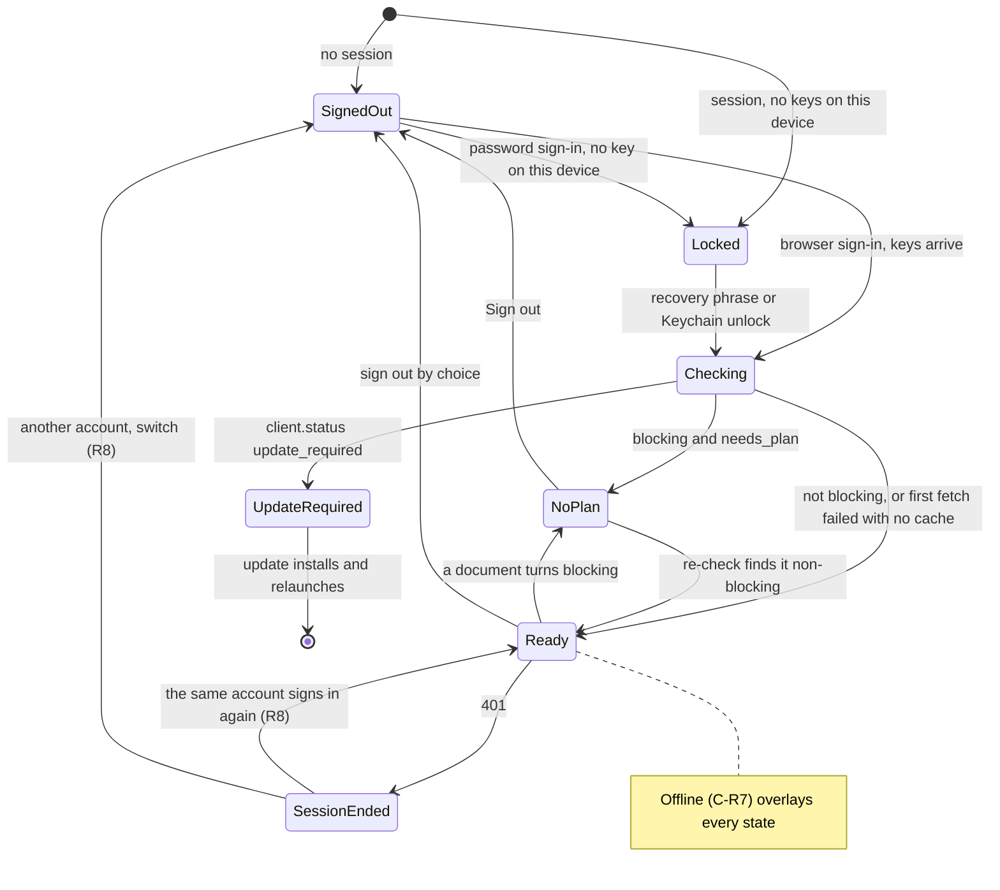

# 2026-10-07 — Desktop: the first run is sign-in only (spec C of 3)

**Status:** design approved by Guus on 2026-10-07 in three parts, with rulings C1–C7; this written spec awaits his review.
**Amended:** 2026-10-07 for the lead's rulings on the six open points and the browser sign-in outcome (§17, C-S1). — lead, 2026-10-07
**Date:** 7 Oct 2026
**Repo:** desktop (macOS and Windows; Linux unchanged)
**Tasks:** 1747 (macOS) and 1748 (Windows), re-scoped by Guus on 2026-10-06: "Signup only web, signin web or direct". Server dependency: 1844.
**Builds on:** spec A, `docs/specs/2026-10-06-macos-finder-setup-reconciler.md` (task 1834). Work starts after spec A's two lanes merge. Spec A's code is cited from its branches as "spec A branch": `feat/1834-finder-reconciler` (Rust, `8cd9ef2`) and `feat/1834-finder-reconciler-ui` (TypeScript, `6780cb8`).
**Siblings:** spec B (the popover becomes the only macOS surface) follows this one (spec A R1: A, then C, then B).
**Citations:** `file:line` means this repo at `origin/main` (`404bdcc`) unless it is labelled "spec A branch" or "server" (the server repo at `d2e7f776`).

## 1. Why

Guus, 2026-10-06 (spec A §1): "… it should just show to me to login and thats it."

- **Launch keys on the sync folder, not the session.** `startup_surface` opens onboarding only when no `sync_root` is set (`src-tauri/src/surfaces/policy.rs:49-55`, called at `src-tauri/src/lib.rs:9003-9036`). Sign-out never clears `sync_root`: the only `None` assignments are the default (`src-tauri/src/config.rs:312`) and the rejection of a relative path (`:503`). A Mac that was set up once and is now signed out opens the compact window on its "Drive status" page (`src/pages/Status.tsx:160,172`; landing page `src/App.tsx:27`). That window says "Signed out" (`src/App.tsx:163`) and offers no way to sign in.
- **macOS sign-in is email and password only** (`src/Onboarding.tsx:183`). The browser handoff exists, but only Windows offers it (`src/WindowsFirstRun.tsx:300-715`).
- **Neither platform has a "Create account" entry**, and neither reads the server's onboarding document.

This spec makes the first run "sign in, and that's it". You sign in natively, browser first and password second. You create an account on the web. The server's onboarding document decides what happens after sign-in.

## 2. Scope

- **In:** native sign-in on macOS (1747) and Windows (1748); a "Create account" link to the web; one account state derived in Rust from the session, the onboarding document and connectivity; a screen per state and the launch policy; a crossed b in the menu bar when disconnected; notices for trial, read-only, frozen and failed-payment accounts.
- **Re-scoped out (Guus, 2026-10-06):** native signup on every platform. Accounts are created on the web.
- **Out:** see Non-goals (§18).

## 3. Rulings (Guus, 2026-10-07)

Quoted as given. C6-links is not item C6 of 1748, which is a Windows copy fix (§15).

- **C1 "Everything on the web":** no in-app plan chooser, no in-app trial start, no in-app checkout. A no-plan account is told to choose a plan on beebeeb.io (free trial included) with ONE button; the app re-checks and continues by itself.
- **C2 "Browser first, password second"** (sign-in methods).
- **C3 "Sign-in window, except at OS login":** a manual launch or first install shows the centred sign-in window; an automatic start at login shows only the menu-bar icon; clicking it opens the window.
- **C4:** "that also means we need to have an icon stating 'disconnected' in the header right, so where we now have the B icon it should be B with a cross through it so it makes sense its disconnected".
- **C4a "Any disconnection":** signed out, session ended, AND signed in but offline / server unreachable. The tooltip names which.
- **C4b "ye B":** variant B: a slash from bottom-left to top-right at 45°, stroke 2.6 pt (about 79% of the stem), round caps, a 1 pt knockout gap on each side, through the centre of the b's ink box.
- **C5 "Wait: no Finder, no sync"** for an account the server document marks blocking (`needs_plan`).
- **C6-links "Server sends the link":** account-stage documents gain the additive `fallback {kind, url}` (schema v1) that the pre_account stage already has, and the desktop opens what it names. Offline, or with an older server: one built-in beebeeb.io address per destination.
- **C7:** "on the payment failed, it needs a link to web billing".

## 4. Account state model

### 4.1 Inputs

Rust derives one `AccountView`. The app's windows and the menu-bar icon only render it, the same pattern as spec A's `FinderSetupView` (spec A branch `src-tauri/src/finder_setup/driver.rs:24`). The inputs:

- **Session:** none, valid, or ended (a 401 on the stored token, spec A R2/R8).
- **Keys:** whether this device holds the vault key in memory.
- **Document:** the onboarding document (§5), the cached copy, or nothing.
- **Connectivity:** online or offline (§10).

### 4.2 Requirements

| ID | State | When | Window | Menu-bar icon | Finder + sync |
|---|---|---|---|---|---|
| C-R1 | Signed out | no session | Sign-in (browser first, password second) + "Create account" (server's link) | crossed b | off |
| C-R2 | Session ended | the stored session got a 401 | the same sign-in window, sign-in-again mode | crossed b | off, local data kept (R8) |
| C-R3 | Update required | `client.status == update_required` | "Update Beebeeb" (existing updater) | normal b | off |
| C-R4 | Locked | valid session, no keys on this device | Unlock (as today) | normal b | off |
| C-R5 | No plan yet | `blocking` and `account.state == needs_plan` | "Choose a plan on beebeeb.io" + one button | normal b | off |
| C-R6 | Ready | none of the above | nothing to do; one-line notice (§7.5) | normal b | spec A starts it (Windows: as today) |
| C-R7 | Offline | an overlay on any state | the state's own screen says offline | crossed b | unchanged |

- **C-R8 Precedence.** When several rows match, the first one in this order wins: C-R3, C-R1, C-R2, C-R4, C-R5, C-R6. C-R7 overlays the winner. Update required comes first because no other screen works on a version the server refuses.
- **C-R9 What "off" means.** The engine is held: not started, and stopped if a fresh document turns the state off while one runs. Spec A's reconciler wants **no action**: it neither adds nor removes the Finder entry, as for a locked vault today (spec A §5.1). Two exceptions: C-R1 after a sign-out by choice keeps spec A's **absent**, and C-R2 keeps Beebeeb listed in Finder (spec A R2) while nothing syncs.
- **C-R10 The gate.** C-R3 and C-R5 hold the engine through its one start, `spawn_bound_engine` (spec A branch `src-tauri/src/lib.rs:4105`): `authorize_engine_start` (`:4047`) gains the permit `AccountBlocked` beside `NoSession` and `FinderRemovalOwed` (`:3858-3862`). The reconciler's `wanted` (spec A branch `src-tauri/src/finder_setup/core.rs:68`) gains an `account_blocking` fact that yields `NoAction`. A new trigger, `account_unblocked`, joins spec A's list (`core.rs:17-25`) and fires when the state leaves C-R3 or C-R5, so the app continues by itself (C1). On Windows the same transition calls today's engine start.
- **C-R11 Checking.** This state covers the time between a sign-in, or a launch with a session but no cached document, and the first document or its failure. Rust treats it as C-R6 with the gate held. The window keeps its busy state; there is no separate screen. If the first fetch fails and there is no cache, the app proceeds as today (C-R6, gate open). Its purpose is that spec A's "keys arrived" trigger cannot add Finder before the server has said whether the account is blocking.
- **C-R12 The server enforces; the client explains.** The server refuses uploads for a no-plan account, so the client gate is there for clarity, not enforcement. That is why offline never locks anyone out. Offline uses the cached document, so a cached blocking document keeps its gate until the next successful fetch decides. With no cache, the app proceeds as today.
- **C-R13 Windows** uses the same Rust state, rendered in its existing windows (§7.7), with the same copy and the crossed-b icon, but no new launch policy (§6). **Linux** fetches no document and gets no gate and no new screens.
- **C-R14 Blocking through `verify_email` only.** A document whose state is not `needs_plan` and that is blocking only through a required `verify_email` step proceeds as today (C-R6, gate open), plus one lifecycle-log line (§10). There is no new screen. The server already refuses uploads and shares for an unverified email.

### 4.3 State diagram

## 5. The onboarding-document client (Rust)

- **C-D1 Endpoint.** `GET {BB_API_BASE}/api/v1/onboarding`. While signed out it is anonymous (stage `pre_account`). While signed in it carries the session's Bearer (stage `account`). The server answers a bad Bearer with a 401 and never falls back to anonymous (server `beebeeb-api/src/routes/onboarding.rs:8-14`).
- **C-D2 Headers.** Today's provenance headers stay: `X-Beebeeb-Client: desktop` and `X-Beebeeb-Client-Version` (`src-tauri/src/api_client.rs:45-66`). This request also sends `X-Beebeeb-Onboarding-Schema: 1` and `X-Beebeeb-Client-OS: macos` or `windows` (server header names `beebeeb-api/src/onboarding/context.rs:20-22`). Without the OS header the server resolves the desktop to purchase surface `none` and omits `purchase.checkout.poll_seconds` (server `onboarding/mod.rs:271-299`). A test pins both values.
- **C-D3 What the desktop reads.** From `pre_account`: `client.status`, `signup.web_url` and `fallback`, never `steps` or `policy` (the server still lists native signup steps there, server `onboarding/mod.rs:477`, and signup is web-only). From `account`: `client.status`, `account.state`, `account.capabilities`, `account.trial.ends_at`, `account.lifecycle`, `blocking`, `steps[]` (`id`, `required`, `status`, `fallback`), `copy`, `fallback`, `purchase.checkout.poll_seconds` and `ttl_seconds`. `offers`, the `start_trial` step, `choose_plan.params` and the rest of `purchase` are ignored (C1). Unknown fields are ignored.
- **C-D4 Schedule.** Fetch at launch, when a sign-in completes, and every `ttl_seconds` (60 s at account stage, 300 s at pre_account: server `onboarding/config.rs:56-58`); also on focus of a Beebeeb window when the last fetch is older than `poll_seconds`. After "Choose a plan on beebeeb.io" is clicked: every `poll_seconds` for 15 minutes, then the normal schedule. `poll_seconds` is 3 (server `config.rs:60`); the built-in value is also 3 s when the field is absent. One fetch runs at a time; a trigger during a fetch sets a "fetch again" flag (spec A §5.4 pattern). The schedule and the clock live in one policy struct and are injected in tests.
- **C-D5 Cache.** The last account-stage document is one row in `state.db`: the body, the fetch time and the `account_binding::Identity` it was fetched for (spec A branch `src-tauri/src/account_binding.rs:10`).
  - It is used only for a session that R10's comparison `same_account` (`account_binding.rs:30`) calls the same account. A row for another account is deleted, never shown.
  - It counts as a retained trace in `reauth::LocalTraces` (spec A branch `src-tauri/src/reauth.rs:25`, census at `lib.rs:3508-3517`), so R8 treats another account as a switch.
  - A sign-out by choice and an account switch delete it (`purge_all_local_state`, spec A branch `src-tauri/src/state_db.rs:3007`), and so does R10's reset. A session ended keeps it (same account, R8). The pre_account document is held in memory only.
- **C-D6 Never logged.** The document body never reaches `tracing`, the lifecycle log, "Copy details" or the support bundle. The lifecycle log records closed tokens only (§10).

### 5.1 Links

Rust resolves each link and puts it in the `AccountView`, and the frontend opens exactly that string. A destination takes the server's link when there is one, otherwise its built-in address. From the server the app accepts only `https://` URLs (the contract's URL pattern), plus `http://localhost` in debug builds. Any other value counts as absent.

| Destination | Used by | Server link | Built-in address |
|---|---|---|---|
| Create account | the sign-in footer | pre_account `signup.web_url` | `https://app.beebeeb.io/signup` |
| Web billing | "Choose a plan on beebeeb.io", "Manage plan", "Choose a plan", "Update payment details" | account `fallback.url` with `kind: use_web` (1844) | `https://app.beebeeb.io/billing` (today `src/desktopApi.ts:160`) |
| Support | "Contact support" | account `fallback.url` with `kind: contact_support` (1844) | `https://beebeeb.io/support` (today `src/macSettingsModel.ts:262`) |
| Unknown required step | the C-R5 button | the step's `fallback.url`, else the document's | web billing |

One module owns the built-in addresses and replaces the hard-coded billing URLs: `src/desktopApi.ts:160` (used by `src/MacSettings.tsx:352` and `src/pages/Account.tsx:263`), `src/windows/views/AccountView.tsx:34` and `src/WindowsApp.tsx:1764`.

## 6. Window and launch policy (C3, macOS only)

In spec C, C3's launch policy applies to macOS only (ruling on OP-4). Windows and Linux keep today's startup and today's icon clicks. Their startup pin stays unchanged (`src-tauri/src/surfaces/policy.rs:1-9`, `:48-50`).

### 6.1 Telling a login launch from a manual one

Today the two cannot be told apart. Autostart registers no arguments: `tauri_plugin_autostart::init(MacosLauncher::LaunchAgent, Some(vec![]))` (`src-tauri/src/lib.rs:8763`; plugin 2.5.1 on `auto-launch` 0.5.0, `src-tauri/Cargo.lock`). Ruled in §17 (OP-1).

- **C-W1** On macOS, autostart registers one argument, `--login-item`; the Windows and Linux registrations stay as they are.
  - At startup the app re-registers **only if autostart is currently enabled** (`autolaunch().is_enabled()` is true). The re-registration never enables autostart as a side effect. It makes a LaunchAgent plist written by an older version gain the argument (`auto-launch` 0.5.0 `enable()` rewrites the plist).
  - A launch whose arguments contain `--login-item` is a login launch. A launch without it counts as manual.
  - One pure function, `launch_kind(args)`, decides.
- **C-W2** On macOS, opening the app while it is already running (from Finder, the Dock or Spotlight) is a manual launch. The app handles `RunEvent::Reopen`, which it does not today (`.run(tauri::generate_context!())`, `lib.rs:9059`).

### 6.2 What opens

- **C-W3** On macOS, a manual launch (including the first after install) opens the current state's window:
  - sign-in for C-R1 and C-R2
  - update for C-R3
  - unlock for C-R4: the sign-in window at today's unlock step
  - choose a plan for C-R5
  - nothing for C-R6. The compact window no longer opens at startup.
- **C-W4** On macOS, a login launch opens no window. The icon shows the state.
- **C-W5** On macOS, a state change after launch never opens a window by itself. It changes the icon and tooltip, and any window already open re-renders.
- **C-W6** The macOS sign-in window is the existing `onboarding` window (`lib.rs:874-910`), centred at 860×640 (popover ruling 6). Its title becomes "Sign in to Beebeeb" (today "Welcome to Beebeeb", `lib.rs:896`), and the title bar follows the heading of the screen it shows. The label stays, and so does spec A's `?window=onboarding&mode=reauth` (spec A branch `lib.rs:1010`). Windows keeps `windows-onboarding`.
- **C-W7** `startup_surface` (`policy.rs:49-55`) gains the launch kind and the `AccountView` as inputs. Only its macOS row changes, and that row stops reading `no_sync_root`. The Windows and Linux rows return what they return today, and their pin tests stay unchanged.

### 6.3 Clicking the icon

- **C-W8** On macOS, with no valid session (C-R1, C-R2), a click on the icon opens the sign-in window directly, with no menu (C3). The tray menu is detached (`set_menu(None)`) in those states and attached again after sign-in. Today's handler acts on the left button only (`lib.rs:9850-9930`); both buttons open the window. Windows clicks are unchanged.
- **C-W9** Signed in on macOS, the menu stays as it is until spec B. A click opens the compact window on spec A's Finder location view (`src/pages/SyncFolder.tsx`, compact page `finder`) instead of the deleted "Drive status" page (ruling on OP-2).

### 6.4 Boundary with the popover spec

`docs/specs/2026-09-30-macos-menubar-popover.md` ruling 1 reads "show nothing at login; open the popover once after first install only", and ruling 6 keeps onboarding centred at 860×640. Spec C keeps "nothing at login" (C-W4) and the centred window (C-W6).

No popover exists yet: `src-tauri/tauri.conf.json:13-72` declares none. So after a first install with no session, the sign-in window opens (C3), and spec B decides whether its signed-out popover takes over. The Ready notices live in Settings until spec B moves them to the popover. Spec C builds no popover and does not change `surfaces::phase`.

## 7. Screens and copy

The copy below is exactly as approved. In code, apostrophes are the typographic ’ (spec A §6.2 rule), and the words do not change. All strings live in one frontend module, `src/accountViewCopy.ts`, and a test pins each one. Offline (C-R7): the update and choose-a-plan screens replace their primary button with the sign-in window's offline line and "Try again" (§7.1); the unlock screen is unchanged; the Settings notice keeps the cached document's line.

### 7.1 Sign-in window (C-R1)

- Title: "Sign in to Beebeeb".
- Primary (amber): "Sign in with browser". It leads to the existing 1734 device-code screen, unchanged, with the code in mono. That screen lives in `src/WindowsFirstRun.tsx:300-715` today; it moves into one shared component that both platforms mount, and its copy stays in `src/browserLoginCopy.ts`.
- Text link: "Use email and password". It leads to email, password, 2FA if it is on, and the recovery phrase if this Mac has no key. These are today's flows, copy unchanged (`src/Onboarding.tsx:183`, `:350`).
- Footer: "New to Beebeeb? Create an account on beebeeb.io" (server link, system browser), and a small "Quit Beebeeb". Cmd-Q also quits (it already exists, `lib.rs:9247`).
- Offline: the buttons are replaced by "Can't reach Beebeeb. Check your connection." + "Try again". "Create account" stays, using the built-in address.
- When spec A reports `not_in_applications` before sign-in (spec A §6.2, check D7), its sentence and "Show in Finder" sit above the buttons. The copy is spec A's (spec A branch `src/finderSetupCopy.ts:68`).
- **C-S1 One outcome for both sign-in paths.** On the spec A branch the browser path reports a different account by emitting an `account_mismatch` event that nothing consumes, and by returning the raw string `"account_mismatch"` (spec A branch `src-tauri/src/browser_login.rs:461-465`). Its error arm forwards that string in an `error` event (`:260-267`). The password path returns `LoginOutcome` (spec A branch `lib.rs:1056-1061`), which `settledFrom` parses (spec A branch `src/onboardingSignIn.ts:73-79`).
  - `start_browser_login` returns the same `LoginOutcome` shape as `desktop_login`.
  - The sign-in window routes a browser result through the same parser, so a different account gets spec A's switch warning (`AccountSwitchStep`, spec A branch `src/Onboarding.tsx:407`) exactly as on the password path.
  - No raw code reaches the UI: neither the command's error nor any event carries `account_mismatch`.

### 7.2 Session ended (C-R2)

The same window, with spec A's sign-in-again wording unchanged: "Sync is paused until you sign in again." / "Sign in again" (spec A branch `src/AuthExpiredBanner.tsx:44-46`). Spec A's account-switch step stays (spec A branch `src/Onboarding.tsx:407`).

### 7.3 Update required (C-R3)

"Update Beebeeb" — "This version of Beebeeb is too old to connect. Update to continue." — "Update now". "Update now" runs the existing updater: `check_for_updates_now`, then `install_update` (`lib.rs:8073`, `:8135`). Its results appear as they do in Settings today.

### 7.4 No plan yet (C-R5)

Title "Choose a plan" — "Your account is ready. Choose a plan on beebeeb.io, including the free trial. Beebeeb continues here by itself." — amber "Choose a plan on beebeeb.io". After the click: "Waiting for your plan. This window updates by itself." A quiet "Sign out" link (a sign-out by choice, spec A). The click starts the 15-minute re-check (C-D4) whether or not the browser opened, because the person may open the address by hand.

### 7.5 Ready notices (C-R6)

The notice is one line in Settings: the Account tab on macOS (`src/MacSettings.tsx:242`) and the Account view on Windows (`src/windows/views/AccountView.tsx`). Spec B later moves it to the popover. If the server sends `copy` for the state, that copy is shown verbatim, so legal dates always come from the server. Otherwise:

| `account.state` | Line | Link |
|---|---|---|
| `trialing_no_card`, `trialing`, `trial_cancelling` | "Free trial until 18 Oct." | "Manage plan" |
| `read_only`, `lapsed`, `trial_ended` | "Read-only since 7 Oct. Files are deleted on 21 Oct unless you choose a plan." (dates: see the variants below) | "Choose a plan" |
| `frozen` | "This account is frozen." | "Contact support" (server link) |
| `past_due` | "Payment failed. Update your payment details on beebeeb.io." | "Update payment details", to web billing (C7) |
| `active`, `legacy_free` | nothing | — |

- **Dates.** The table's dates are examples. The trial line uses `account.trial.ends_at`; the read-only line uses `lifecycle.read_only_since` and `lifecycle.data_deletion_at`. Format: day-month ("18 Oct"), UTC, English month abbreviations, the same as the server's copy (server `onboarding/mod.rs:238`). Rust formats them, and a test checks them against the server's examples.
- **No invented dates (ruling on OP-3).** Each clause whose date is null is dropped:
  - `read_only_since` null: the line starts "Read-only."
  - `data_deletion_at` null: the deletion clause is replaced with "Choose a plan to upload again."
  - Server `copy`, when present, still wins verbatim.

  The server's `lifecycle` (server `onboarding/derive.rs:549-571`) gives these variants. The link is "Choose a plan" in every row.

  | `account.state` | Dates the server sends | Line |
  |---|---|---|
  | `trial_ended` | both | "Read-only since {read_only_since}. Files are deleted on {data_deletion_at} unless you choose a plan." |
  | `trial_ended` | neither (no `lifecycle`) | "Read-only. Choose a plan to upload again." |
  | `lapsed` | `data_deletion_at` only (`read_only_since` is always null) | "Read-only. Files are deleted on {data_deletion_at} unless you choose a plan." |
  | `lapsed` | neither | "Read-only. Choose a plan to upload again." |
  | `read_only` | neither (always) | "Read-only. Choose a plan to upload again." |
- **Server copy keys** (server `onboarding/mod.rs:362-415`): `trial_end_no_allowance` or `trial_end_over_allowance` replace the trial line; `trial_ended_over_allowance` replaces the read-only line. Other keys (`locale`, `region_line`, `plans_managed_on_web`, `trial_terms`, unknown ones) never become a notice.
- `allowance`, which is unreachable today because the allowance is off, shows nothing.
- On Windows the frozen notice replaces the plain-text "Reach support at beebeeb.io" row (`src/windows/views/AccountView.tsx:187-205`).

### 7.6 After sign-in (macOS)

The removed steps (§11) are not replaced by other steps. While spec A's reconciler is `Adding`, the window shows spec A's "Adding Beebeeb to Finder…" (spec A branch `src/finderSetupCopy.ts:12`) and closes by itself on `Ready`. On `Failed` or `UserDisabled` it shows spec A's one sentence and one action (spec A §6.2) instead. Without this, a failed first add would go unseen until spec B.

### 7.7 Windows (1748)

- The states, the copy and the crossed-b icon are the same, shown in the existing windows. There is no new launch policy and no new click behaviour (§6). Windows starts as today.
- `windows-onboarding` hosts C-R1, C-R3 and C-R5, after sign-in and unlock and before its "Files on demand" step.
- `main-app` renders C-R3 and C-R5 in place of its content, the way `SignedOutGate` (`src/WindowsApp.tsx:199`, `:1774-1778`) renders signed out today, and `SignedOutGate` still opens sign-in.
- The first-run steps that spec A does not automate stay: Files on demand and Explorer integration (`src/WindowsFirstRun.tsx:72-79`).
- A session ended keeps today's Windows flow, because R8 is macOS-only (spec A §10).
- The "Step 1 of 4" label beside a five-step rail (`src/WindowsFirstRun.tsx:482`) is not changed here.

## 8. The menu-bar icon (C4, C4a, C4b)

- **C-I1 Rule.** The crossed b shows when the session is none or ended, or when C-R7 (offline) applies. Otherwise the normal b shows. The icon depends only on the session and connectivity, so a signed-out C-R3 also shows the crossed b. One pure function maps the `AccountView` to the icon, the tooltip, the click action, and whether the menu is attached.
- **C-I2 Tooltips.** "Beebeeb: Signed out", "Beebeeb: Sign in again", "Beebeeb: Offline". When offline applies together with one of the others, "Offline" wins, because it is the fix that comes first. With the normal b, today's engine tooltip applies (`engine_status::tray_tooltip`, `lib.rs:9784-9789`); while the b is crossed, the engine listener does not overwrite the tooltip.
- **C-I3 macOS assets.** Template PNGs, black and alpha only, variant B: `src-tauri/icons/tray-template-disconnected.png` (22×22) and `tray-template-disconnected@2x.png` (44×44), byte-identical to today's b outside the stroke. The SVG source (a traced b plus the stroke) goes to the workspace `design/`. Today's icon is loaded from config (`src-tauri/tauri.macos.conf.json:4-7`, `iconAsTemplate: true`).
- **C-I4 Windows asset.** A colour `.ico`, `src-tauri/icons/tray-disconnected.ico`: today's colour tray icon (`icons/icon.png`, `src-tauri/tauri.conf.json:76-81`) with the variant B slash. Windows uses no template images. The asset is drawn in the design task (§12).
  - Loading an `.ico` at runtime needs tauri's `image-ico` feature, which is enabled in `src-tauri/Cargo.toml:16` (ruling on OP-6).
  - The plan proves that `Cargo.lock` adds no package: a diff of `Cargo.lock` before and after shows no new `[[package]]` entry.
- **C-I5 Runtime swap.** The swap goes through the tray API, on the config-built tray `"tray"` (`setup_tray`, `lib.rs:9793-9812`): `TrayIcon::set_icon`, then `set_icon_as_template(true)` on macOS (tauri 2.11.5). Today only the tooltip changes at runtime (`lib.rs:9786`). The swap runs only when the presentation changes, never on an engine tick.
- **C-I6 Clicks:** C-W8 and C-W9 on macOS. Windows clicks are unchanged.

## 9. Server dependency (task 1844)

- **The change.** Account-stage documents get `fallback {kind, url}`, one link per state: no plan, read-only, lapsed, trial and payment failed → `use_web` + web billing; frozen → `contact_support` + the support page. Additive in schema v1; `update_required` keeps its existing `update_app` fallback. 1844 also adds the missing `needs_plan.desktop` golden fixture.
- **Today.** At account stage `fallback` is set only for `update_required` (server `onboarding/mod.rs:439-447`, `:556`).
- **Ownership.** Workspace task 1844, for the onboarding owner (epic 1725). Desktop does not wait: it uses the built-in addresses (§5.1) until 1844 ships, and whenever it is offline.

## 10. Errors

| Case | Behaviour |
|---|---|
| 401 | Session ended (C-R2): sign in again, data kept (R8). This is the same path as the startup probe's 401 (`lib.rs:561`). |
| 429 | Keep the last document. The next fetch waits for `Retry-After`; when it is absent or unreadable, `ttl_seconds`. The wait is capped at 300 s. |
| Network failure | Offline (C-R7), shown only after 2 failures at least 10 s apart, so it does not flicker. It clears on the next success. While offline, the app re-probes every 30 s and on wake. A failure is what `link_health` classes as offline or "server did not answer", which includes 5xx and timeouts (`src-tauri/src/link_health.rs:132`). A wake is detected when the wall clock moves more than 60 s across one 30 s probe tick; no new OS observer is added. |
| Unreadable document, unknown `schema`, a 400 for the schema header (server `routes/onboarding.rs:55`), any other 4xx | Proceed as today (C-R6, gate open), plus one lifecycle-log line. |
| Unknown `account.state` | Decide from `capabilities`: `upload.allowed == false` shows the read-only line, otherwise nothing. `blocking` still applies (C-R14). |
| Blocking only through a required `verify_email` | Proceed as today, plus one lifecycle-log line (C-R14). |
| Unknown required step | Show the server's link (§5.1, last row). |
| Browser won't open | Show the address as selectable text + "Copy link". |
| Cached document | Belongs to one account (spec A's owner record), purged on sign-out, never logged (C-D5, C-D6). |

**Lifecycle log.** Spec C adds three events to spec A's closed vocabulary (spec A branch `src-tauri/src/lifecycle_log.rs:31-48`):
- `account_state from=<s> to=<s> offline=<yes|no>`
- `engine_held reason=<account_blocking|update_required>`
- `onboarding_document outcome=<unreadable|unknown_schema|http_4xx|blocking_verify_email>`

`<s>` is one of `checking`, `signed_out`, `session_ended`, `update_required`, `locked`, `no_plan`, `ready`. No email, account id or URL appears. The lifecycle log is macOS-only (spec A branch `lib.rs:39-40`), so on Windows these lines go to `tracing` only.

## 11. What is removed

- **macOS onboarding steps.** The `finder`, `pinning` and `ready` steps and the five-row rail go (`src/Onboarding.tsx:27-35`; `FinderInstallStep` `:476`, which spec A renames `MacFinderStep`, spec A branch `:573`; `PinningStep` `:649`; `ReadyStep` `:742`). Spec A §10 handed the Finder step's deletion to this spec. Offline folders stay in Settings, Sync (`src/MacSettings.tsx:564`).
- **The "Drive status" page, on macOS only** (`src/pages/Status.tsx`; nav entry `src/compactNavigation.ts:29`; landing default `src/App.tsx:27`). Until spec B the compact window lands on spec A's Finder location view (C-W9). Windows and Linux are unchanged. The macOS startup never opens the compact window (C-W3).
- **`no_sync_root`** as a startup input on macOS (C-W7).
- **The hard-coded billing URLs** (§5.1).
- **Windows:** no first-run step is removed. "Create account" is added to both sign-in modes.

## 12. Design before code

The plan's first task draws these screens as hi-fi mocks, light and dark, into the workspace `design/`: the sign-in window (browser, email and password, offline), session ended, update required, choose a plan before and after the click, the Ready notices, the Windows equivalents, the crossed b on light and dark menu bars, and the Windows `.ico`. Guus approves them before any code. The icon is variant B. Where an approved mock and this spec disagree, the mock wins, and the spec is amended in the same change.

## 13. Units and interfaces

| Unit | Purpose | Interface |
|---|---|---|
| `account_view::derive` (new, pure) | the §4.2 table and C-R8 | `derive(&Inputs) -> AccountView` |
| `account_view::doc` (new, pure) | tolerant v1 parse, link resolution (§5.1) | `parse(&[u8]) -> Result<Doc, Unreadable>` |
| `account_view::policy` (new, pure) | fetch schedule, offline debounce, wake | `next_fetch_at(..)`, `connectivity(..)` |
| `account_view::driver` (new) | the one task: fetch, cache, emit `account-view-changed` | `AccountViewHandle::send(Event)`; `state() -> AccountView` |
| `launch_kind` (new, pure) | login or manual launch (C-W1) | `launch_kind(&[String]) -> LaunchKind` |
| `tray_presentation` (new, pure) | icon, tooltip, click action, menu (§8) | `present(&AccountView) -> TrayPresentation` |

Tauri commands: `account_view_state` (read), `account_view_retry` ("Try again") and `account_view_plan_opened` (starts the 15-minute re-check). The frontend opens links with `openUrl` (`src/desktopApi.ts:425`); when that fails it shows the address as selectable text with "Copy link".

## 14. Testing

Every new test is seen failing before it passes, and the failure output is pasted into the task Notes.

**Rust:**
- **The table.** The §4.2 table is one pure function, tested row by row and on the C-R8 precedence. It is mutation-checked: flip one row, confirm that row's test fails, revert.
- **Fixtures.** Parse every server golden fixture, vendored byte-identical into `contracts/onboarding/` (this repo has none yet). The `needs_plan` row runs on `account.needs_plan.ios.json` until 1844 adds the desktop fixture, then on both.
- **Headers.** Both request headers are pinned.
- **Schedule, on a fake clock:** every 3 s for 15 minutes after the click, then every `ttl_seconds`; focus; 429; offline after exactly 2 failures at least 10 s apart (never after 1), cleared by 1 success; the 30 s re-probe; wake.
- **Icon.** The icon and tooltip for every state (C-I1, C-I2).
- **The gate.** Finder and sync stay off while blocking: through `spawn_bound_engine` no engine starts, and the reconciler wants `NoAction`. Both continue on `account_unblocked`.
- **The cache.** Purged on a sign-out by choice and on a switch, kept after a session ended, never used for another identity, counted as a trace.
- **Launch (macOS).** `launch_kind` with and without `--login-item`. Re-registration adds the argument when autostart is enabled. When autostart is disabled, nothing is registered and autostart stays disabled. The Windows and Linux `startup_surface` pins are unchanged.
- **Read-only line.** Every variant in §7.5's table, plus server `copy` winning over each.
- **Browser outcome (C-S1).** A different-account browser sign-in returns `LoginOutcome` with `account_mismatch`, and no event or error carries the raw string. In TypeScript the browser and password results reach `AccountSwitchStep` through the same parser.
- **Dependencies.** `Cargo.lock` adds no package after `image-ico` (C-I4).

**TypeScript:** every screen's copy pinned; server copy shown verbatim; every link equals the `AccountView`'s URL, with no literal URL outside the built-in module; the fallback when the browser does not open.

**Gates** (as spec A §13.1): `cargo test --locked` with per-binary `test result: ok. N passed; 0 failed`; `bun test` with its `N pass / 0 fail` count; `bunx tsc --noEmit`; eslint; no new warnings from `cargo clippy --locked --all-targets` against an `origin/main` baseline.

## 15. Verification (rewritten)

Each task file keeps its original line struck through. These are the replacements, amended 2026-10-07 by the desktop team lead and approved by Guus.

### 1747 (macOS)

- A debug `.app` bundle, `BB_API_BASE=http://localhost:3001` and `HOME=<scratch>` for every login.
- Sign in by browser handoff, by password, and by password + 2FA. Each reaches Ready, with a capture of each.
- "Create account" opens exactly the address the server document names.
- A `needs_plan` account shows "Choose a plan". No Finder location is added and the engine does not start (lifecycle log). With the plan set active locally, the app continues by itself and spec A sets up Finder.
- The read-only, lapsed, frozen and payment-failed notices are captured, with dates and links.
- The crossed b (variant B) is captured signed out, after a session ended, and offline, on light and dark menu bars.
- A manual launch shows the centred window; a login-item launch shows only the icon.
- `cargo test` per-binary counts and `bun test` counts.
- A clean-machine first run of a notarized, Gatekeeper-checked build is recorded or left as a named open rung.
- Struck, out of scope after the re-scope: native signup, allowance→trial start, checkout in the app, the phrase-window capture rung and the ticket-expiry rung.

### 1748 (Windows)

- Build on the Legion host (`ssh legion`), with the installer signature checked by `verify-authenticode.ps1`.
- The same rungs as 1747, on the Legion (real Windows hardware, not a clean machine), against a local API: sign-in by browser, by password and by password + 2FA; "Create account" opens the server's address; a `needs_plan` account shows "Choose a plan" with sync not started; the notices, with a real link in the frozen one; the crossed b `.ico` signed out, after a session ended and offline; `cargo test` counts. There are no launch rungs on Windows: C3's launch policy is macOS-only in this spec (§6).
- The first-run walk-through on a **clean physical Windows machine** stays a named open rung. A VM or CI run never answers it.
- Struck: the native signup, phrase-window and ticket-expiry rungs. Acceptance item C6 is also struck, because 1734 already fixed it (`7728a27`; `src/browserLoginCopy.ts:13` now says "session and key").

## 16. Open rungs

- macOS: a clean-machine first run of a notarized, Gatekeeper-checked build.
- Windows: the first run on a clean physical machine.
- The server-link rungs (the plan, support and payment links equal the document's `fallback.url`) run against the built-in addresses until 1844 ships, and are re-run then.
- The macOS login-launch rung needs a real OS login on Guus's Mac account (spec A R3).

## 17. Resolved points (lead rulings, 2026-10-07)

Each of these was an open point: a place where the approved design and the code disagreed. Each finding is kept, and the ruling beneath it is now a requirement.

- **OP-1 A login launch was not detectable.** Autostart registers no arguments (`src-tauri/src/lib.rs:8763`, `Some(vec![])`), so a login start and a manual launch look the same.
  **Ruled:** accepted. Autostart registers `--login-item`. Re-registration at startup happens only if autostart is currently enabled, and never enables it as a side effect. A launch without the argument counts as manual. → C-W1.
- **OP-2 The "Drive status" page versus spec A §4.** Spec A §4 hands the removal of the compact window to spec B. A signed-in click opens that window on this page (`src/App.tsx:27`; `lib.rs:9904-9912`).
  **Ruled:** accepted as proposed. "Drive status" is deleted on macOS only. Until spec B the signed-in tray click opens the compact window on spec A's Finder location view. Windows and Linux are unchanged. → C-W9, §11.
- **OP-3 Null dates in the read-only line.** The server sends `read_only_since: null` for `lapsed`, and both dates null for `read_only` (server `onboarding/derive.rs:549-571`).
  **Ruled:** never invent a date. Each clause whose date is null is dropped, with fixed replacement words, and server `copy` still wins. → §7.5 variants table.
- **OP-4 C3 on Windows versus the startup pin.** `policy.rs:1-9` and `:48-50` pin Windows and Linux to today's startup.
  **Ruled:** C3's launch policy is macOS-only in spec C. The Windows and Linux pin stays unchanged. Windows gets the states, the copy and the crossed-b icon, but no new launch policy, and 1748 has no launch rungs. → §6, C-R13, §7.7, §15.
- **OP-5 Blocking without `needs_plan`.** `verify_email` is required whenever the email gate is on and the email is unverified, and it makes the document blocking (server `onboarding/derive.rs:653-655`, `:719-721`).
  **Ruled:** accepted. Such a document proceeds as today, plus one closed-vocabulary log line. There is no new screen. → C-R14, §10.
- **OP-6 The Windows `.ico` needed a feature flag.** `Cargo.toml:16` enables only tauri's `image-png`, and `Image::from_bytes` decodes `.ico` only with `image-ico` (tauri 2.11.5). The `image` crate is already in `Cargo.lock` (0.25.10), and its `ico` feature adds only the `bmp` and `png` codecs.
  **Ruled:** accepted. `image-ico` is enabled, and the plan proves that `Cargo.lock` adds no package. → C-I4.
- **Added from the code review of spec A's Task 11.** The browser sign-in returns a raw `"account_mismatch"` string and emits an event that nothing consumes.
  **Ruled:** one `LoginOutcome` for both paths, and spec A's switch warning for a different account. No raw code reaches the UI. → C-S1.

## 18. Non-goals

- No native signup (the re-scope).
- No in-app checkout, no in-app trial start and no plan chooser (C1). `offers`, `start_trial`, `choose_plan.params` and `purchase.checkout` are ignored, except `poll_seconds`.
- No popover (spec B), and no change to `surfaces::phase`.
- No change on Linux.
- No R8 on Windows (spec A §10), and no automation of the Windows Explorer step.
- `update_recommended` keeps today's update banner.
- No "Move to Applications" button (spec A §4).
