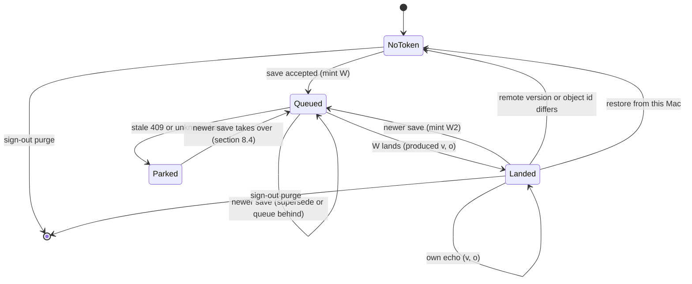
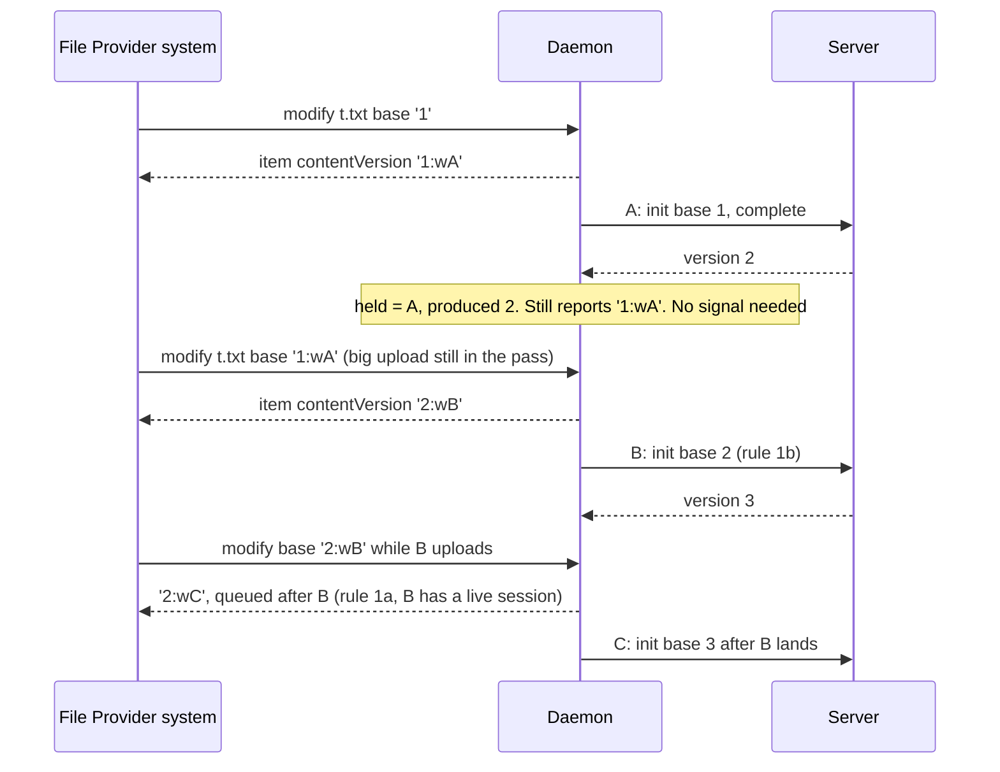
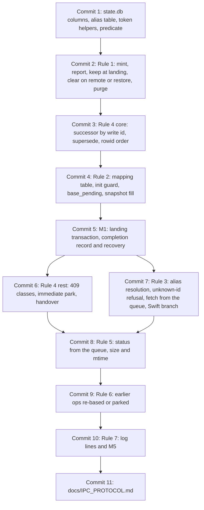

# 2026-10-09 — macOS: the version of the bytes Finder holds (task 1873, round 4)

**Status:** design for review. No code yet. The lead reviews this spec and rules before anyone implements it.
**Date:** 9 Oct 2026
**Repo:** desktop. The macOS File Provider path only. Windows (Cloud Files) and Linux behaviour is unchanged.
**Task:** 1873 (P0: files saved in the Finder location upload reliably), round 4.
**Read at:** desktop `931b885` (branch `fix/1873-finder-create-staging`). API server (private repository) `46e5054c`, read-only. FileProvider headers from the macOS 27.0 SDK (Xcode 27.0, `27A266a`).
**Builds on:** round 3. Writes complete with `shouldFetchContent: false`, identifiers lead with the server version, old identifiers are accepted, a queued modify records its size and mtime, uploads of one file form a chain, and refusals are logged. All of it is described in `docs/IPC_PROTOCOL.md`, "Versions and queued writes".
**Replaces:** three passages in `docs/IPC_PROTOCOL.md`: the "rebase on an equal base" chain, the "queued, no item" reply row and the "Not covered" note on provisional ids. Also the round-3 review's partial fixes: the C1 floor rule and the I1 "hold `Uploading`" fix.
**Ruling it implements:** [1873-identity], a local-write token. This changes a wire identifier (Trigger 1). It was decided under the standing delegation and surfaced in the lead's status message.

**Citations.**
- Desktop paths:
  - `EB` = `src-tauri/src/engine_bridge.rs`
  - `IPC` = `src-tauri/src/ipc_socket.rs`
  - `SD` = `src-tauri/src/state_db.rs`
  - `RUN` = `src-tauri/src/runner.rs`
  - `FPE` = `BeebeebFileProvider/FileProviderExtension.swift`
  - `FPI` = `BeebeebFileProvider/FileProviderItem.swift`
  - `XPC` = `BeebeebFileProvider/XPCBridge.swift`
- Headers:
  - `ITEM.h` = `NSFileProviderItem.h`
  - `REPL.h` = `NSFileProviderReplicatedExtension.h`
  - `THUMB.h` = `NSFileProviderThumbnailing.h`
- Server paths, under `beebeeb-api/src/`:
  - `UP` = `routes/uploads.rs`
  - `FILES` = `routes/files.rs`
  - `VER` = `routes/versions.rs`
  - `SY` = `routes/sync.rs`
  - `VD` = `routes/version_download.rs`
  - `DB` = `db.rs`
- `QA/…` = the device evidence for task 1873, kept with the task in the private workspace.
- Line numbers are at the commits above.
- **Unverified** marks a claim that no source or run here establishes.

## 1. Why

Round 3 made Finder saves reach the server. Its device rungs R1–R4 passed: a create plus two saves landed with the right bytes, and a save on an old-format row kept working. The round-3 review then found one design decision underneath three of its findings. The version we report for bytes our own upload produced is wrong by design.

- The reply to a save keeps the version the system already held, for example `"1"`, because the content version does not move until the upload lands (`SD:2010-2031`).
- The landing then renames those same bytes to `"2"` (`EB:1182-1184`), and enumeration reports the new name (`IPC:2642-2643`).
- To the system, `"2"` is a remote change:
  - it evicts the item and downloads it again (I1);
  - a save made before it re-reads the item still carries `"1"` and is refused with 409 (C1);
  - and the timing of the provisional-id swap gets worse (I3).

The same review found four more problems:
- I2: a replace with no base for rows whose version is 0.
- I3: a modify of the provisional id after the create landed deletes the file on disk and makes a second server file.
- I4: a doomed earlier upload blocks the newest save for about 5.6 hours.
- Five minors, M1–M5.

The device rung added one more finding, R2a:
- After a save to a just-created item, the system fetched the provisional id 12 ms after the save completed.
- The fetch got a 404, three times.
- The item was read-only for 24 s.

This spec settles all of them with one identity rule and the rules that follow from it.

## 2. What we found (verified at `931b885`)

1. **The reply names new bytes with the old version, and the landing renames them.**
   - `record_local_write` sets size and mtime and leaves the content version (`SD:2010-2031`).
   - The framing test asserts the reply's content version stays `"1"` (`ipc_socket_framing_tests.rs:900-905`).
   - `apply_completed_upload` sets `current_version` from the server, stamps `modified_at` and `remote_updated_at` with "now", and marks the row `Local` (`EB:1149-1152`, `EB:1182-1184`).
2. **Apple's contract makes that rename a remote change.**
   - "if the contentVersion changes, the system assumes that the contents have changed and will trigger a redownload if necessary. The exception to this is the case where the extension accepts a content sent by the system when replying to a createItemBasedOnTemplate or modifyItem call with shouldFetchContent set to NO." (`ITEM.h:93-97`)
   - The root reports `.downloadLazily` (`FPI:251-253`): "Download remote content updates eagerly if this file is not dataless." (`ITEM.h:263-264`)
   - An earlier build's own landing produced `update-item … diffs:dataless) why:eviction|itemChangedRemotely|contentUpdate|evictWithOldVersion` (`QA/inv2-fp-modify-window.log:177`).
3. **The system learns of a landing only once per pass.**
   - A pass runs every 30 s (`RUN:117`).
   - Remote changes are applied first (`RUN:1293`), then the queue runs (`RUN:1315`), then one working-set signal goes out (`RUN:1322-1323`).
4. **R2a, read from the logs.**
   - Create of the provisional item `859b9a45…`: `shouldFetch:false` (`QA/R2-fp.log:28`).
   - Save at 16:01:45.861: `update-item … target:<… cver:0> … → <actual: … cver:0 …> stillPending: shouldFetch:false` (`QA/R2-fp.log:54`).
   - `fetch-content(859b9a45…) why:itemChangedRemotely sched:utility#1791554505.822088`. That is the update job's own schedule id. It failed at .898 after 24.55 ms, so it started about 12 ms after the save completed. Cause: `404 Not Found … /api/v1/files/859b9a45…`.
   - The item became `m:r--el … deco:error` at 16:01:47.793. It went back to `rw` at 16:02:11.824.
   - The app logged `Finder hydrate failed … reason="not_found"` three times, at 14:01:45.898Z, 14:01:47.830Z and 14:02:12.677Z (`QA/R0-app-stdout.log`).
   - **Premise correction:** the save came during the create's *queue wait*, not its upload. The save was at 14:01:45Z. The create's server row appeared at 14:02:10.862Z, at the next pass (`QA/R2-run.txt`).
5. **The id swap still replaces the created file with a new item.**
   - In R1 the create was docID 131211 (`QA/R1-fp.log:33`). Both later saves targeted docID 131213 (`QA/R1-fp.log:164`, `:193`).
   - Between them the system "provid[ed]" the item for a claim at 16:00:14.226 (`QA/R1-fp.log:124`). That is a materialization of a file that had become dataless, as investigation Q2 found on the earlier build.
6. **A hydrate rewrites the status of a row that has a queued upload.**
   - It sets `Downloading` (`EB:2584`).
   - On success it sets `Local` (`EB:2647`, `hydrate_final_status` `EB:4233-4238`).
   - On failure it sets `Error` (`EB:2609`, `EB:2633`, `EB:2681`).
   - It never reads the server's version (`EB:2816-2826`).
7. **Startup turns every `Uploading` row into `Error`** (`SD:2041-2053`, called at `RUN:997`). That makes a file with a queued save read-only after any relaunch.
8. **Remote rows for `Uploading`, `Error` and `Conflict` rows are ignored** (`EB:6383-6392`).
   - Snapshot rows never update `Local` rows either.
   - The snapshot's `updated_at` is an RFC 3339 string, so `as_i64()` gives 0 (`EB:6274`), and the `remote_updated <= entry.remote_updated_at` short-circuit always fires (`EB:6326`).
9. **The content hash is never set in production code.** `content_hash: Some(` appears only in tests (`SD:4484`, `EB:8715` and others), so the `{current_version}:{hash}` form exists only in tests.
10. **Version sources** (fixes M4):

    | Source | `version_number` | Object version id | Notes |
    | --- | --- | --- | --- |
    | Upload `complete` response (our own uploads) | yes (`UP:1602`) | yes (`UP:1601`) | an idempotent repeat answers `already_completed` with neither (`UP:1299-1306`, `UP:1347-1353`) |
    | `file_create` / `file_update` op from the upload route | yes (`UP:1576`) | yes (`UP:1575`) | |
    | Legacy one-shot replace (`file_update`) | yes (`FILES:2273-2283`) | no | the mobile app uses the legacy endpoints (review I2) |
    | Legacy one-shot create (`file_create`) | **no** (`FILES:2286-2297`) | no | always version 1: `FILES:1987`, column default 1 at `DB:1174` |
    | Legacy chunked complete (`file_create`) | **no** (`FILES:3656-3667`) | no | can be a **replace**: the legacy init bumps `version_number` on a reused id (server `CLAUDE.md:72`) |
    | `/sync/snapshot` node | yes (`SY:197`, `SY:213`) | no | the desktop skips `Local` rows (item 8) |
    | `GET /files/{id}` | inside `download_version` when the file has an object version (`FILES:4724`, `FILES:4756`, `VD:23`) | yes | not for one-shot (V1) files |
    | Version restore | response only (`VER:614`, `VER:689`) | first branch only | **no op at all**: event bus only (`VER:604-610`, `VER:679-685`) |
    | Rename / move ops | no; the desktop keeps the contract's (`EB:6163-6166`) | no | |

11. **The two ops on the QA Mac** (state.db copy, `QA/inv2-statedb-copy-queries.log`):

    | Op | File | Base | Row: version | Row: `remote_updated_at` | Payload size |
    | --- | --- | --- | --- | --- | --- |
    | `905b6d55…` | `89da2556…` | `1791550250` | 1 | 1791550250 | 40 B |
    | `e5cec976…` | `bdfa53ed…` | `1791550190` | 1 | 1791550220 (re-stamped after the save) | 24 B |

    - The server still held version 1 of both (`QA/inv2-devdb-rows.log`).
    - Both were still retrying at attempt 10/25 at 14:10–14:11Z (`QA/R0-app-stdout.log`).

## 3. Rulings and premises

- **[1873-identity]** (lead, 2026-10-09), recorded verbatim in the ledger:
  > "do the structural fix — a stable local content version (local-write token: the reply names the accepted bytes; enumeration keeps that name while the server version is the one our own upload produced; a remote change clears it) — designed on paper first, reviewed by the lead, then implemented"
- **The same ruling** covers I2, I3 (alias), I4 (supersede), R2a and M1–M5. Follow-up D (task 1880) stays a follow-up "unless the design shows the alias is not enough".
- **Premise that is false: "the supersede rule must rescue" the two old QA ops.**
  - Their bytes are not on disk any more. The build they were queued under completed the save with `shouldFetchContent: true`, which fetched version 1 back over the edit (investigation Q3, step 4: 40 B → 28 B).
  - A later save of either file is therefore built on version 1, without the queued edit. Superseding the old op with it would drop that edit.
  - They are rescued by **re-basing** instead (§10.3). Supersede is limited to writes whose bytes the system provably held (§8.2).
- **Premise corrected:** R2a happened during the create's queue wait, not its upload (§2 item 4). The design covers both cases.
- **Candidate trigger refuted:** "the provisional row's identifier changes when B2 records the new size/hash".
  - R1 made the same B2 change on a server-id item, and no fetch followed:
    - A fetch there could only have returned the server's 21-byte version 1, and the local file was 45 B at every sample until the landing (`QA/R1-run.txt`).
    - The fileproviderd capture alone cannot show it. It lists failed fetch jobs (`QA/R2-fp.log`) but no successful ones: R1's own materialization appears only as a file-coordination "providing" line (`QA/R1-fp.log:124`). §14 corrects that instrument.
  - B2 changes only the metadata version and `version_identifier`. The extension builds the item version from `contentVersion` (`FPI:222-226`).
  - Of the metadata version, Apple says: "The system will store this version, but otherwise ignore it" (`ITEM.h:109-112`).

## 4. Goal and non-goals

**Goal.** On a Mac:
- A save in the Finder location reaches the server once, with the right base, whatever the timing.
- The bytes stay on disk, and the item stays writable.
- Our own upload never makes the system evict or re-download what it already holds.
- A real remote change still reaches the disk.
- Nothing a person saved is lost, reverted or overwritten silently.

**Non-goals** (§12):
- what the person is offered when a save meets a real remote change (1881);
- shared items in Finder (1701);
- packages (1879);
- removing the id swap (1880);
- Windows.

## 5. Rule 1: the identity of the bytes the system holds

**Rule.**
- Every content write the daemon accepts from the File Provider gets a fresh *write token*. The reply's content version is that token.
- Enumeration, the working set, item lookups and the item returned by a fetch keep reporting the token while one of two things is true:
  - the write is still in the queue; or
  - the server's current version is the one this write produced.
- Anything else clears it.

**Reason.** Apple's model is that a reply names the bytes it accepted, and the name changes only when the content changes elsewhere (`ITEM.h:93-97`). Naming our own bytes twice (C1, I1) is the bug.

### 5.1 Format

`{b}:w{W}`, for example `2:w9f1c0e3a5b7d4f2e8a6c4b2d0e9f7a1c`.

- **`b`** is the server version these bytes derive from, in decimal:
  - for a replace, its resolved base;
  - for a write queued behind an earlier write that has not landed, the earlier write's `b`;
  - `0` for a create, and for writes queued behind a create that has not landed.
- **`W`** is 32 lowercase hex digits: a fresh random (v4) UUID without hyphens. One is minted per accepted content write. It is never reused and never derived from a name or path.
- **Size.** At most 10 + 2 + 32 = 44 bytes. Apple limits a version component to 128 bytes (`ITEM.h:85`).
- **Older code** reads the first segment (`parse_base_version_number`, `EB:4718-4726`). `b` is safe there because it is an ancestor of the bytes:
  - older code sends a base the server accepts only when nothing in this chain has landed, and then the bytes are a valid replacement;
  - otherwise the server refuses it with 409.

  The exception is `b = 0` after a create landed: older code sends no base (§5.6, downgrade).
- **Matching** is by exact string equality with the row's held token, never by pattern.
  - The `w` only keeps the string apart from the other forms: `{v}`, `{v}:{hash}`, and the old `max(current_version, remote_updated_at)` forms.
  - It is not a hex digit, so no hash form can equal a token.

**Rejected:**
- *A content hash.* The server cannot hash plaintext, and hashing the staged copy before the reply reads the whole file inside the 600 s write budget. This agrees with the review, Focus 1.
- *The queue's `op_id`.* A supersede updates an op in place with new bytes (§8.2), and the name must change with the bytes.
- *The predicted landing version (`b + 1`).* Older code would parse it as a base. If this write never lands and a remote change takes the server to `b + 1`, older code would overwrite that change. `b` can only ever be refused.

### 5.2 What is stored (the migration)

The columns are additive and nullable, added with `ensure_column` (the `SD:899-924` pattern), with no backfill:

| Table | Column | Meaning |
| --- | --- | --- |
| `files` | `held_write_id TEXT` | `W` of the write whose bytes the system was last told about; NULL = no token |
| `files` | `held_base INTEGER` | `b` |
| `files` | `held_version INTEGER` | the server version `W` produced; NULL until it lands |
| `files` | `held_object_version_id TEXT` | the object version `W` produced; NULL until it lands |
| `files` | `held_mtime INTEGER` | seconds; mtime of `W`'s staged copy (the save time; the extension stamps the copy "now", `UploadStaging.swift:92-93`) |
| `operation_queue` | `write_id TEXT` + index | the write this upload carries; NULL for non-content ops and for Windows/watcher uploads |
| `operation_queue` | `after_write_id TEXT` | this upload's base is the version that write produces; NULL once resolved |
| `operation_queue` | `base_pending INTEGER NOT NULL DEFAULT 0` | the base is not known yet for a server-known file (§6.3) |
| `upload_resume` | `completed_version INTEGER`, `completed_object_version_id TEXT` | the landing the server confirmed, recorded before local bookkeeping (§8.6) |
| new `id_aliases` | `provisional_id TEXT PRIMARY KEY, server_id TEXT NOT NULL, created_at INTEGER NOT NULL` | §7.1 |

- There is no `file_state` table; the contract columns already live on `files` (`SD:774-800`).
- `upsert_file` (`SD:974-1048`) and `set_file_contract_state` (`SD:2226`) list their columns explicitly, so they never overwrite the new ones. Only new, dedicated `StateDb` functions write them.
- The token string is derived (`{held_base}:w{held_write_id}`) and never stored.

### 5.3 One predicate decides what is reported

`held_token(row, queue) -> Option<String>` is `Some` exactly when `held_write_id` is set and one of these holds:
- an upload op with `write_id = held_write_id` exists, whether queued, running, paused, backing off or parked; or
- `held_version == current_version`, and the two object version ids are equal or one of them is NULL.

Otherwise:
- The caller reports `item_content_version(current_version, hash)` (`EB:4661-4666`), as round 3 does.
- The held columns are cleared then. That is housekeeping; correctness comes from the predicate.

Every builder uses it:
- `file_entry_payload` (`IPC:2602-2679`) and `file_entry_payload_without_contract` (`IPC:2681-2737`), which serve enumeration, the change feed (`IPC:2404-2445`), item lookups, the dedup replay (`IPC:2279-2318`) and write replies (`IPC:2364-2396`);
- the base mapping (§6).

`version_identifier` keeps its round-3 meaning. The bundled extension never sends it as a base: the base is `contentVersion` (`FPE:592-594`).

### 5.4 Every state, and what each surface reports

The reply is the item in the `WriteQueued` answer. "Others" means enumeration, the working set, item lookups and the item returned with a fetch: one builder, one answer.

| # | State | What changes on the row | Reply | Others |
| --- | --- | --- | --- | --- |
| 0 | No write since the upgrade, or the token was cleared | nothing | n/a | `{cv}` |
| 1 | Create queued (provisional id P) | row P with no contract; held `(W, b=0)`; size and mtime from the copy | `0:wW` | `0:wW`, status `uploading` |
| 2 | Modify queued | held `(W, b)`; size and mtime of W (B2) | `b:wW` | `b:wW`, `uploading` |
| 3 | Save queued behind a live upload (§8.3) | held `W2`; op `after_write_id = W1` | `b:wW2` | `b:wW2` |
| 4 | Save superseded a queued one (§8.2) | the earlier op carries W2's bytes; held `W2` | `b:wW2` | `b:wW2` |
| 5 | W landed, nothing later queued | `held_version`/`held_object_version_id` = produced; status `Local`; the server's size (same bytes); `modified_at` kept (§9.3) | n/a | `b:wW` unchanged, `local` |
| 6 | W1 landed, W2 still queued | held stays `W2`; status `Uploading`; W2's size and mtime | n/a | `b:wW2`, `uploading` |
| 7 | Echo of our own landing (op or snapshot with the produced version) | nothing | n/a | unchanged |
| 8 | Remote content change (new version or object id), W not queued | held cleared | n/a | `{cv'}`: the system re-downloads |
| 9 | Remote change while W is still queued | ignored, because the row is `Uploading` (`EB:6383-6392`); W gets a stale 409 later and parks (§8.4) | n/a | `b:wW` (the disk holds W's bytes) |
| 10 | Restore from this Mac (`RestoreVersion` op) | `current_version` := the response's `version_number` (`VER:614`, `VER:689`; today it is discarded, `EB:632-642`); held cleared | n/a | `{r}`: re-download |
| 11 | Restore from another device | nothing: no op exists (`VER:604-610`, `VER:679-685`) | n/a | `b:wW`. Known gap (§12); the next save meets 409 and parks |
| 12 | Rename or move | held unchanged | token (reply of the metadata modify) | token; metadata version moves |
| 13 | Trash from Finder | row `Trashing`; held unchanged | n/a | token, listed under the trash container |
| 14 | Create lands (id swap) | in one transaction: S's row gets P's held columns plus produced version 1 and object id; alias P→S; row P deleted (§8.6) | n/a | S: `0:wW`; P: deleted |
| 15 | Sign-out by choice | held columns cleared and aliases deleted, in the purge transaction (`SD:2874-2944`) | n/a | the domain is removed (spec A) and rebuilt from `{cv}` |
| 16 | Re-install, existing domain, `state.db` kept | nothing | n/a | unchanged |
| 17 | Local data reset (spec A §5.6: reset, then Repair) | no held columns | n/a | `{cv}`; a stale token in the replica parses to `b` (§6.1, rule 5) |

While `Queued`, `Landed` or `Parked`, every surface reports the token. In `NoToken` they report `{cv}`.

### 5.5 Apple's own words: our landing no longer moves anything, a remote change still does

- **Our landing.** The reply already named the bytes with the token, under the exception Apple grants to "a content sent by the system when replying to a createItemBasedOnTemplate or modifyItem call with shouldFetchContent set to NO" (`ITEM.h:95-97`).
  - At the landing the predicate holds, so the content version does not change.
  - "if the contentVersion changes, the system assumes that the contents have changed and will trigger a redownload" (`ITEM.h:93-95`) cannot fire.
  - What changes is metadata: status and size. "The system will store this version, but otherwise ignore it" (`ITEM.h:109-112`).
  - `isUploaded` turns true, and the item becomes evictable "when the item is fully uploaded" (`ITEM.h:155-157`). Eviction is then the system's ordinary choice: disk pressure, or "Remove Download". It is no longer a reaction to a version change, which is what `evictWithOldVersion` was (`QA/inv2-fp-modify-window.log:177`).
- **A remote change.** The predicate fails, and the content version becomes `{cv'}`.
  - `ITEM.h:93-95` applies.
  - Under the root's `.downloadLazily`, a materialized item is downloaded again "eagerly if this file is not dataless" (`ITEM.h:263-264`).

### 5.6 Consequences

- **Thumbnails.** The thumbnail cache "will be invalidated when itemVersion.contentVersion changes" (`THUMB.h:37-38`). The token changes at the reply, so the system drops the old thumbnail at the save, not at the landing.
  - Until the write lands, the server holds only the previous version's thumbnail.
  - Rule: `FetchThumbnail` for an item whose held write has not landed answers "no thumbnail" (nil data, nil error: `THUMB.h:29-31`).
  - **Unverified:** whether the system caches that answer under the token until the next content change (§16, Q3).
- **Finder's modification date.** While the predicate holds, the payload's `modified_at` is `held_mtime`. Today it is `max(modified_at, remote_updated_at)` (`IPC:2585`), which shows the upload time (R1: 16:01:10), or an echo's "now" (`EB:6181`, `EB:5430`, `EB:6351`). The creation date falls back to it (`IPC:2586-2588`).
- **Downgrade.** A build from before this spec parses `0:wW` as no base. So the first save on that build of a file created under this spec, before the system re-reads it, is a replace without a base: round 3's I2 hole.
  - **Unverified:** whether the updater can install an older build (§16, Q4).

## 6. Rule 2: from the base the system sends to the server's `base_version_number`

**Rule.**
- The decision is made from the row as it is before the write changes it. The row is the alias target when there is one (§7).
- The first matching row of the table wins.
- A replace of a file the server knows is never sent without a base.

### 6.1 The mapping

| # | Incoming base identifier | Condition | Base of the new upload |
| --- | --- | --- | --- |
| 1a | the row's held token | its write W is still queued | *after W*: W's successor (§8); resolved when W lands, unless N supersedes W |
| 1b | the row's held token | W landed | `held_version` |
| 2 | anything | the row is provisional: no contract, and its create is queued | *after the create's write* (this device is the file's only lineage; the server has no file yet) |
| 3 | `{v}` (or `{v}:{hash}`) | the file has an upload queued **by this spec's code** whose resolved base is `v` | *after the newest such write*: the system sent this save before it recorded that write's reply. Only this device's chain exists, and the disk kept those bytes (round 3, item 1) |
| 4 | an old-format identifier that exactly matches the round-3 rule (`modify_base_version`, `EB:4693-4717`) | | `current_version`, then rule 3 with `v = current_version` |
| 5 | anything whose first segment is `v > 0`, including an older or unknown token's `b` | | `v`; the server decides (409 when stale, §8.4) |
| 6a | `0`, none or unparseable | the row is server-known with `current_version > 0` | queued and **parked at once** (`base_unknown`), bytes kept; nothing is sent |
| 6b | `0`, none or unparseable | the row is server-known with `current_version = 0` | queued with `base_pending` (§6.3) |

- **Rule 3 excludes ops from earlier builds.** Their bytes may not be on disk (§3), so a later save may not contain them.
- **Why 6a parks rather than refuses.** A refusal leaves the edit pending in the system, which retries with the same `"0"` base. Parking keeps the bytes and gives the same end state as a stale base. 1881 decides what the person is offered.
- **Deletes are unchanged.** A delete still parses its base, and that base is not sent to the server (`EB:1775`).

### 6.2 C1 is closed by construction

Every save's base names its predecessor's bytes exactly, through the token in the predecessor's reply. Equal numbers are never compared. The system therefore never needs to re-read the item to learn a version: the working-set timing (`RUN:1315-1323`) no longer matters.

- **The review's two-pass case:** B maps to version 2 through rule 1b.
- **The three-saves-in-one-pass case:** C maps to after B through rule 1a, never to `1`.

### 6.3 I2: never a replace without a base

1. **A guard where the request is built.** `upload_init_request_for_operation` (`EB:3640-3660`) refuses a non-create upload whose `write_id` is set and that reaches `init` without a base; that op is parked as `base_unknown`. (An upload still waiting on `after_write_id` or `base_pending` never reaches `init`.)
   - A base that does not fit the server's `i32` is no longer dropped silently. Today `i32::try_from(..).ok()` turns it into "no base" (`EB:3660`).
   - Uploads without a `write_id` (Windows, the watcher) keep their current `None` bases.
2. **The version is learned where the server left it out.**
   - A `file_create` op without `version_number` that inserts a row, or any server row that leaves a server-known row at version 0, requests a re-snapshot (`request_resnapshot`, `SD:1733`).
   - A requested re-snapshot runs instead of the next ops pull (`EB:5605-5619`), so no content op can change the version first.
   - A snapshot node sets `current_version` on a row whose version is 0 even when the row is `Local`. Only that field changes; the `EB:6326` short-circuit stays for everything else.
   - At engine start, if any server-known row has version 0, a re-snapshot is requested.
3. **`base_pending` uploads.**
   - They wait. Waiting is not an attempt.
   - Their base becomes the version the snapshot reports.
   - They park as `base_unknown` after 10 passes without a version.
   - **Residual, named:** a legacy chunked replace (`FILES:3656-3667`) or a restore (`VER:604-610`) between the system's last read of the file and the snapshot is invisible to the desktop. A save in that window lands over a version the person did not see. That version stays in the history.
4. **Rows with version 0 today:**
   - rows first learned from a legacy `file_create` op (`FILES:2286-2297`, `FILES:3656-3667`);
   - rows whose contract could not be read when they were reported (`IPC:2705`).

   After the snapshot, each reports `{N}` once instead of `"0"`. A materialized one is downloaded once (§10.1).
5. **Shared items** (I2(b)) are out of scope (§12).

## 7. Rule 3: provisional ids

### 7.1 The alias

- **Written** in the landing transaction (§8.6) whenever the server id differs from the local one.
- **Kept** for 30 days, swept at startup and once a day, and deleted by the sign-out purge.
- **Why not "until the system applies the swap":**
  - The daemon cannot see the system's cursor. The anchor it serves is its own (`IPC:1991-2025`), and the extension keeps the system's cursor App-Group side (`FPE:791`, `FPE:873`).
  - The swap is signalled only at the end of a pass, which can last minutes behind a large upload (`RUN:1315-1323`).
  - A provisional id is a random v4 UUID (`EB:1522-1525`), never reused, so an old alias can only match a request for that same id.

### 7.2 What resolves through it

| Request, id P after its create landed as S | Today | With the alias |
| --- | --- | --- |
| Content modify | queued under P; reply with no item (`IPC:2381-2383`), so the system deletes the item on disk (`REPL.h:629-634`); the op creates a second server file (`UP:664`) | resolved to S; base by §6.1 on S's row (P's create token is S's held token, so the base is 1); reply = S's item **presented under identifier P**, with the new token |
| Rename / move | op under P | resolved to S; the name is encrypted for S |
| Delete (trash) | "unknown item, idempotent success" (`EB:1750-1758`): S stays on the server and comes back when the swap is applied | resolved to S; trashes S |
| Hydrate | `GET /files/P` → 404 (§2, item 4) | resolved to S (§7.4) |
| Item lookup | not found | S presented as P |
| Thumbnail | 404 | resolved to S |
| Enumeration and change feed | never list P | unchanged: S, plus P's deletion |

Presenting S under P keeps the system's item P consistent until it applies the swap: an insert of S and a delete of P, in that order (`FPE:777`, `FPE:780`). That mechanism is unchanged; it is follow-up D's concern.

### 7.3 An unknown id without an alias is refused

- **A modify** answers `IpcResponse::Error`, category `unknown_item`, and queues nothing.
  - The extension maps a daemon error to `cannotSynchronize` (`XPC:88-92`, `XPC:688-691`). The system "will present an appropriate error message and back off until the next time it is signalled" (`REPL.h:731-736`), and the edit stays on disk.
  - It is never `NoSuchItem`. With that error "the system will attempt to delete the item on disk" (`REPL.h:710-714`).
- **A delete** of an unknown id stays an idempotent success. That is the existing ruling, "unknown items report success".
- **No write reply carries `item: None` unless the write was ignored.** A queued outcome whose row cannot be read back becomes an error (`IPC:2364-2396`).
- **The Swift side follows suit.** `queuedWriteCompletion`'s "queued, no item" branch (`FPE:405-411`, `FPE:419`) becomes the transient `serverUnreachable` error instead of a nil item. Even a daemon from another build can then never make the system delete a file through this branch.

### 7.4 R2a: trigger and removal

**What the log proves:**
- The fetch is fileproviderd's own follow-up to the update job: same schedule id, about 12 ms later.
- It is not `shouldFetchContent`, which was false.
- It is not our working-set signal: none was sent between 14:01:10Z and 14:02:14Z (`QA/R0-app-stdout.log`).

**What the code makes of it:**
- The daemon hydrates the provisional id from the server, and gets 404 because the server never knew it (`EB:2825`).
- It sets `Downloading`, then `Error` (`EB:2584`, `EB:2681`). `Error` grants read only (`IPC:2739-2755`).
- The pass sets `Uploading` again at 14:02:10 (`EB:662`), which is why the item became writable at 16:02:11.

**Trigger: not established (unverified).**
- R1 had the same B2 change and no fetch; the byte samples show it, not the log (§3).
- Between R1 and R2, the only difference in what we reported: R2's item was the system's own create, never uploaded, and its content version was `"0"` both as base and in the reply.
- `"0"` is the value every row without a contract reports (`IPC:2705`). R1's item reported `"1"`.
- Why fileproviderd fetches in that case is not documented.

**Removal, whatever the trigger:**
1. **Fetch from the queue.** A fetch of an item whose held write is still queued is served from that write's staged bytes, the bytes the token names. It never goes to the server, and the returned item names the token.
   - Apple: "Except for the error case, the version of the returned item is assumed to be identical to what was requested" (`REPL.h:330-332`).
   - The staged payload is the plaintext copy the queue already holds for upload. The hydrate handover through the App Group and the system's temporary directory is unchanged (`FPE:75-213`).
2. **No status change.** A hydrate never changes the status of a row that has a live upload of its own: no `Downloading`, `Local` or `Error` (`EB:2584`, `EB:2609`, `EB:2633`, `EB:2647`, `EB:2681` today).
3. **No more shared `"0"`.** A provisional item reports its write token.

In R2's sequence, the fetch, if it still happens, gets the same 8,388,618 bytes. The item stays writable, and nothing reaches the server. D4 and D4b (§14) record whether the fetch still happens.

### 7.5 Is follow-up D (task 1880, no id swap) still needed?

**Yes**, for one symptom: after every create the system replaces the person's materialized file with a new item for the server id (§2, item 5; investigation Q2). That costs one download of the file and, in the moment, a dataless file.

**No**, for correctness: once the alias exists, nothing is lost or duplicated, and every operation reaches the right file.

**Unverified:** S now carries P's content version (the token, §5.4 state 14). That might make the system keep the materialized file at the swap. D10 records it. If it does, 1880's urgency drops (§16, Q2).

## 8. Rule 4: queue order and supersede

### 8.1 The successor relation

- A write N is the **successor** of write W when its base maps to "after W" (§6.1 rules 1a, 2, 3).
- That is recorded on N's op as `after_write_id = W`.
- When W lands, the chain step sets `base_version` (and the object version id) on every op with `after_write_id = W`. Today the chain matches equal bases instead (`EB:1239`).
- Re-keying across the id swap (`EB:1216-1265`, `SD:3122-3142`) is kept.

### 8.2 Supersede: when

**N supersedes W when both hold:**
- N is W's successor; and
- W has **no live server session**: no `upload_resume` row (`SD:949-963`). That row is written right after `init` (`EB:798`).

**How:** in one transaction, W's op is updated in place.
- It takes N's staged payload, `write_id`, size, encrypted name, content type and display name.
- It keeps W's base (`base_version`, `after_write_id`, or being a create), its file id and its queue position.
- `attempts` goes to 0, `next_retry_at` to now, and `last_error` is cleared.
- `paused_reason` is kept, because an account-level pause applies to the new bytes too.
- W's old staged payload is released.

**Also at the start of each pass:** a waiting successor supersedes its predecessor when the predecessor still has no live session, for example after its `init` failed and it is backing off.

**Why it is safe.**
- When the person saved N, the system held W's bytes: it had W's token.
- With `shouldFetchContent: false` nothing replaced them on disk.
- So N, a full file, contains W's changes.
- N on W's base ends at the same content as W followed by N.
- That holds only for writes this spec minted. Hence §3 and §10.3.

The R2 case (a save during the create's queue wait) becomes a single upload: the create carries the newest bytes.

### 8.3 Wait: when

When W has a live session, N is queued with `after_write_id = W`. It runs after W in queue order (`SD:3102-3118`) and gets its base when W lands.

### 8.4 Never blocks a newer save for hours

- **A doomed predecessor is passed at once:**
  - With no session, N supersedes it (§8.2).
  - **A stale-base 409 at `init` parks the op at once,** not after 25 attempts, about 5.6 h (`EB:4933-4936`). A stale base never becomes valid again: the server's version only grows (`UP:782-787`).
  - **A predecessor that parks for any reason** (stale base, missing payload, another 4xx) hands its place, base and position to its direct successor, as in §8.2. A successor that inherits a stale base meets 409 and parks too. Its bytes contain the predecessor's, so keeping them is enough.
- **What still waits:** a successor behind a predecessor with a live session whose last attempt failed transiently (network, 5xx, timeout). The successor would fail the same way.
- **409 classes.** The server answers 409 for:
  - a stale base: "stale base version for replacement upload" (`UP:777`);
  - another upload in progress: "upload is already in progress for this file" (`UP:732`, `UP:773`);
  - an id that is trashed or belongs to a folder (`UP:675-690`).

  `init` keeps the response message (today `error_for_status` drops it) and classifies it:
  - `stale_base` parks at once;
  - `in_progress` retries and blocks;
  - anything else retries, as today.

  A changed server message falls back to "retry", today's behaviour. A test pins the two strings.

### 8.5 Order is insertion order (M2)

- Queue order becomes `rowid` alone, everywhere: `SD:2677`, `SD:3091`, `SD:3112-3113`.
- `enqueue_operation`'s `ON CONFLICT DO UPDATE` keeps the `rowid` (`SD:2622-2646`).
- A new row gets a `rowid` above every live row's. That is SQLite's documented allocation, not re-checked here.
- The code runs no `VACUUM` (grep: 0 hits). A future `VACUUM` may renumber the rowids of a table without an `INTEGER PRIMARY KEY` (SQLite documentation, unverified here), so it would have to be weighed against this rule.

### 8.6 A landing is committed once `complete` returns (M1)

**Today:**
- The landing is three separate calls (`EB:1121-1194`), with no transaction.
- The chain step's `?` (`EB:828`) can fail after the server completed: `metadata_rekeyed_to` bails (`EB:4038-4044`), and that happens before `clear_upload_resume` (`EB:833`).
- The retry then resumes a completed session. If the session is gone, `upload_session_is_gone` abandons it, which for a create **trashes the server file** and starts again (`EB:859-866`, `EB:1040-1055`, `EB:3982-3988`).

**Rule:**
1. When `complete` answers, whether fresh or `already_completed` (`UP:1299-1306`, `UP:1347-1353`), the resume row records the produced version and object version id. That is one small write.
   - For `already_completed`, the object id comes from the session, and the version is base + 1 (1 for a create; `UP:782-787`).
2. One SQLite transaction then applies everything else:
   - the row and contract;
   - the held columns;
   - the id swap and the alias;
   - the chain step (re-key and rebase);
   - removal of the op and its resume row;
   - release of the staged payload.
3. **The chain step never fails the landing.** A successor that cannot be re-keyed is parked, with its bytes and a warn line.
4. A retry that finds a recorded completion skips the network and repeats step 2.
5. Suppose a resumed session has every chunk acknowledged and `complete` answers 404 (the session was swept). The daemon then reads `GET /files/{S}`. If the current object version is the session's, it applies the landing. It never abandons such a session.

## 9. Rule 5: eviction safety and what the person sees

1. **Status follows the queue, not `files.status`.**
   - Whenever the file has an upload in the queue that the File Provider path queued (it has a `write_id`) and that has not parked (queued, running, backing off or paused), `file_entry_payload_for_db` (`IPC:2573-2600`) presents status `uploading`. That means `isUploaded` false (`FPI:228-235`) and full write capabilities (`IPC:2753`).
   - Apple: "If you choose to finish uploading items after calling the completion handler of creteItem/modifyItem, you must set the uploaded flag to false, in order for the item to be excluded from eviction." (`ITEM.h:531-533`)
   - A parked upload presents `error`: read-only, and still not evictable.
2. **The writers of `files.status` change:**
   - the landing sets `Local` only when no later upload of the file is queued (`EB:1149`);
   - the rollback guard keeps `Uploading` while the op will retry, and sets `Error` only when it parks (`EB:662-690`);
   - a hydrate leaves a row with a live upload alone (§7.4);
   - the startup reconcile leaves a row with such an upload `Uploading` (`SD:2041-2053`).
   - Keep Mine uploads of a `Conflict` row have no `write_id` and keep today's behaviour; `Conflict` already reports `isUploaded` false (`FPI:228-235`).
3. **Size and modification time are those of the newest bytes:**
   - B2 records them when the save is queued (`SD:2010-2031`);
   - the landing writes the server's size, and keeps `modified_at`, only when no later write is queued (`EB:1150-1152`);
   - while the token is held, the payload's modification date is `held_mtime` (§5.6). The person sees their save time, not the upload's completion time or an echo's stamp.

## 10. Rule 6: the upgrade path

### 10.1 From 0.8.11

0.8.11 never queued a Finder write. Every create or modify that carried contents failed with -2005 before it was queued (investigation Q4).

- **No ops to migrate.**
- **Materialized rows with `remote_updated_at > current_version` download once.** That is round 3's rollout caveat (`docs/IPC_PROTOCOL.md:168-172`): the first enumeration reports `{cv}` instead of the old `max(cv, remote_updated_at)`.
  - These are rows the desktop uploaded, or touched through an op echo. In 0.8.11 that means only echoes, such as files renamed, moved or edited elsewhere while the app ran.
- **Materialized server-known rows at version 0** (§6.3) download once, when the startup snapshot fills their version.
- **Nothing else.** No row gets a token until it is written.
- **A save before the system re-reads the item** goes through round 3's old-identifier rule (`EB:4693-4717`). Its limit (M3: an op echo in between makes it a false refusal, which is safe) is unchanged, and only the first save after the upgrade depends on it.

**Rejected:** freezing each row's old identifier as a held token at the migration, to avoid those re-downloads. The migration cannot tell a replica that holds the old strings (0.8.11) from one that has already re-read `{cv}` (round 3). The freeze would then force the re-download on round-3 replicas instead.

### 10.2 From a round-3 build (QA and dev Macs only; round 3 never shipped)

- Items the system has re-read hold `{cv}`, the same string as before.
- Ops round 3 queued get a `write_id` at engine start, are marked as from an earlier build, and keep their numeric bases.
- They get no held token, because the system was never given one for their bytes. So the content version moves once at their landing, and that file downloads once: round-3 behaviour, only for ops in flight at the upgrade.

### 10.3 Ops already queued with old bases: the two on the QA Mac

**At engine start:**
1. Every upload op without a `write_id` gets one and is marked as from an earlier build. Rule 3 of §6.1 and §8.2 never treat it as minted by this spec.
2. A base of `10^9` or more cannot be a server version: it is a wall-clock second. (Versions grow by one per content change.) Such an op is **re-based** on the row's current version **if and only if** the op's recorded base object version id equals the row's current one.
   - The modify path records it when the save is queued (`EB:1702-1704`).
   - Equal ids prove that no content version arrived since the save.
   - When re-based: `attempts := 0` and `next_retry_at := now` (a parked op runs again), and a warn line names the op, the file and both bases.
3. Otherwise the op parks at once as `stale_base`. Its bytes are kept, and 1881 decides.

**What happens to the two.**
- `905b6d55…` and `e5cec976…` should both re-base to version 1, and their edits (40 B and 24 B) land as version 2.
- The rows' versions and the server agree (§2, item 11). The object ids are checked on the device (D1).
- They get no held token, so the content version moves to `"2"` and the system downloads the saved bytes back onto the disk. Those bytes had been reverted by the old build.
- Round 3's old-identifier rule could not rescue `e5cec976…`: its row was re-stamped after the save (1791550220 against 1791550190). That is the M3 window.

**Why not supersede them:** see §3. A later save does not contain their edits.

### 10.4 Re-install with an existing domain

- `state.db` lives in the app's container (`QA/R0-app-stdout.log`, "state dir resolved").
- Deleting and reinstalling the app keeps it. **Unverified:** that macOS never removes the container with the app; it does not do so routinely. So held tokens and aliases survive.
- Local data that was reset goes through spec A §5.6: reset, then Repair. That rebuilds the replica.
- A token that survives in a replica without its row parses to `b` (§6.1, rule 5), so the worst case is a false 409, never an accepted stale base.

### 10.5 Nothing a person saved is lost or reverted

- A reply never asks for a fetch (round 3) and never names bytes the daemon does not hold.
- Our own landing no longer changes the version, so nothing is downloaded over newer local bytes (I1).
- A supersede replaces only bytes that the newer save contains (§8.2).
- No replace of a known file is sent without a base. A stale write parks with its bytes instead of overwriting (§6.3).
- An unknown id is refused, never deleted (§7.3).
- A modify of a provisional id after the swap reaches the right file (§7.2).
- An op from an earlier build is re-based or parked, never dropped (§10.3).
- Parked bytes stay in the queue. What the person is then offered is 1881.

## 11. Rule 7: observability

Every line is a `warn!`, except the hydrate count (`info!`), with ids and fixed categories only. No name, path, URL or error text appears (the round-3 style, `EB:4004-4027`, `IPC:1406`, `IPC:2194-2203`). There is at most one line per write or per attempt, and a parked op stops logging.

| Event | Message | Fields |
| --- | --- | --- |
| A write refused by the daemon | `Finder write refused` (existing) | `op`, `reason`, now also `unknown_item`, `base_unknown` |
| `init` refused with 409 | `upload refused by the server (409 Conflict); will retry` (existing) | existing fields + `class` (`stale_base`, `in_progress`, `other`) |
| Parked | `… parked with its bytes kept in the queue` (existing) | + `reason` (`stale_base`, `base_unknown`, `predecessor_parked`, `rekey_failed`) |
| Supersede | `queued write superseded by a newer save` | `op_id`, `file_id`, `superseded_write`, `write` |
| Successor takes over a parked predecessor | `queued write took over a parked one` | `op_id`, `file_id`, `parked_op_id` |
| Alias resolution | `provisional id resolved to the server id` | `request` (`modify`, `delete`, `hydrate`, `item`, `thumbnail`), `provisional_id`, `file_id` |
| Unknown id | `Finder write refused`, `reason="unknown_item"` | `id` |
| Base resolved from the snapshot | `queued write based on the version the snapshot reported` | `op_id`, `file_id`, `base_version` |
| Upgrade re-base | `queued write re-based after the upgrade` | `op_id`, `file_id`, `old_base`, `new_base` |
| Every hydrate over the socket (`info!`, the one line that is not a warning: it is the device plan's count of fetches) | `Finder hydrate served` | `file_id`, `source` (`queue`, `server`) |

**M5.** A line that logs an id taken from the wire logs it only when it parses as a UUID. Otherwise it logs `id_kind="non_uuid"`.
- This also applies to the existing hydrate warning on Linux.
- There the identifier check is a no-op (`IPC:2064-2067`), and the warning logs any caller-supplied text (`IPC:2195-2199`).

## 12. Out of scope, named

- **1881, a real stale base.** What the person is offered when a save parks: a conflict copy, keep-mine, or something else. This spec only guarantees that the bytes are kept and nothing is overwritten.
- **1701, shared items in Finder.** To record on 1701, the I2(b) caveat. If shared items ever return to Finder, three things must change first; until then a save would be a replace with no base:
  - their listing carries no version (`FILES:4016-4166`, per the round-3 review);
  - recipients receive no ops, because ops go to the owner's tenant (`UP:1561-1578`);
  - the upload path encrypts with the recipient's key (`EB:912`, `EB:1672`), while shared reads use the share key (`EB:2763-2813`).
- **1879, packages.**
- **1880, removing the id swap.** Still needed for the dataless replacement after a create (§7.5).
- **Windows Cloud Files and watcher uploads.** No `write_id`; their `None` bases are unchanged.
- **Optional server line item S1, separate from this spec.**
  - Legacy `file_create` ops would carry `version_number`.
  - A version restore would emit a versioned `file_update` op.
  - Init 409s would carry an error code, not just a message.
  - It closes the residuals in §6.3 and state 11 of §5.4. Nothing here depends on it.
- **Pinned hydrates** (`GET /files/{id}?object_version_id=`, `FILES:4724`). A hydrate can still deliver bytes newer than the row's version until the next op arrives. That predates this spec and is unchanged.

## 13. Test plan

Every test is seen RED before it passes, and its mutation is seen RED on the intended assertion. Logs go to the 1873 evidence folder under `r4-*`.

**Rust styles:**
- `VersionedServerMock` (`EB:12657-12800`), `seed_uploaded_row` (`EB:13147`), `queue_save` (`EB:13168`), the existing drain helper, and `init_summary`;
- IPC payload tests (`IPC:4065`);
- framing tests (`ipc_socket_framing_tests.rs:853`);
- `state_db` unit tests (`SD:5352`);
- log capture with the second dispatcher (`EB:13352`, `IPC:4993`).

**Swift style:** `check(…)` in `BeebeebFileProviderTests/main.swift`. `EXPECTED_TESTS` goes from 94 to 95 (`scripts/test-ipc-framing.sh:20`).

**Base taken from the reply.** In the C1 and I3 tests, every save's base is the content version of the previous reply, as the system would send it. It is never hard-coded.

| # | Rule | Test | Asserts | Red today because | Mutation that must turn it red |
| --- | --- | --- | --- | --- | --- |
| T1 | 1 | `a_landing_keeps_the_content_version_the_reply_named` | after the landing, the payload's content version equals the reply's (`…:w…`) | `"2"` vs `"1"` | report `{cv}` once landed |
| T2 | 1 | `a_remote_change_replaces_the_token` (guard) | `file_update` op v3 with another object id: `"3"` | green today | predicate ignores a version mismatch |
| T3 | 1 | `our_own_echo_keeps_the_token` | echo with v2 and our object id: token unchanged | `"2"` ≠ reply | clear the token on every op |
| T4 | 1 | `a_restore_from_this_mac_replaces_the_token` | `RestoreVersion` with a mocked v3: `"3"` | response discarded | ignore the response |
| T5 | 1 | `the_token_survives_rename_move_and_trash` (guard) | token unchanged | n/a (new) | clear on metadata ops |
| T6 | 1 | `sign_out_clears_tokens_and_aliases` | after `purge_all_local_state`: held columns NULL, 0 aliases | new columns | skip the clear |
| T7 | 1 | `token_format_and_older_parse` (pure) | matches `^\d+:w[0-9a-f]{32}$`; ≤ 128 B; `parse_base_version_number` gives `Some(b)`, or `None` for 0 | new | emit `b + 1` |
| T8 | 2 | `c1_a_save_after_the_first_landed_is_based_on_what_it_produced` (the review's two passes) | inits `[(f,1,201),(f,2,201)]`; latest = second save | `(f,1,409)` repeated | map a landed token to `b` instead of `held_version` |
| T9 | 2 | `c1_three_saves_in_one_pass` (C queued from a thread while the mock holds B's first chunk, the 400 ms delayed-answer style) | inits base 1, 2, 3, all 201; latest = C | C gets `(1,409)` | successor by equal base (round-3 rule) |
| T10 | 2 | existing old-identifier tests (`EB:13041-13114`) | stay green | n/a | n/a |
| T11 | 2 | `i2_a_row_without_a_version_never_uploads_without_a_base` (row from a legacy `file_create` op) | no `init` until the mocked snapshot gives v1; then `base_version_number: 1` | init without a base | drop the `base_pending` gate |
| T12 | 2 | `i2_a_zero_base_on_a_versioned_row_parks` | parked `base_unknown`; 0 inits | replace without a base | read `"0"` as the current version |
| T13 | 2 | `a_versionless_create_op_requests_a_snapshot_that_fills_local_rows` | flag set; snapshot sets version on a `Local` row, content untouched | never filled | keep the `EB:6326` short-circuit for it |
| T14 | 2 | `the_init_guard_refuses_a_finder_replace_without_a_base` (also a base beyond `i32`) | no init; parked | sent without a base | remove the guard |
| T15 | 3 | `i3_create_lands_then_a_modify_under_the_provisional_id` | reply has an item, identifier P, new token; 1 server file with 2 versions; latest = the modify | 2 files; reply item None | skip the alias lookup |
| T16 | 3 | `a_delete_of_the_provisional_id_after_landing_trashes_the_server_file` | mock receives `DELETE /files/S` | idempotent success, S kept | skip the alias for delete |
| T17 | 3 | `an_unknown_id_is_refused_never_answered_without_an_item` | `IpcResponse::Error`, `unknown_item`; nothing queued | `WriteQueued{item: None}` | answer `Ignored` |
| T18 | 3 | `r2a_a_fetch_during_the_creates_queue_wait_is_served_locally` (mock answers 404) | bytes = staged bytes; row `Uploading`; 0 server requests | 404, row `Error` | hydrate from the server |
| T19 | 3, 5 | `a_failed_hydrate_never_changes_a_row_with_a_live_upload` (payload removed) | status `uploading` | `Error` | keep today's `set_status` calls |
| T20 | 3 | Swift: `a queued write without an item is an error, never a nil item` | `serverUnreachable`, transient | nil item | restore the nil branch |
| T21 | 4 | `a_newer_save_supersedes_a_queued_write_without_a_session` | 1 init on the earlier write's base; latest = newer | 2 inits | require a session to supersede |
| T22 | 4 | `a_newer_save_waits_behind_a_live_session` (guard) | 2 inits in order; second base = first's version | n/a | supersede despite a resume row |
| T23 | 4 | `i4_a_doomed_earlier_write_never_blocks_hours` (its payload deleted) | successor lands in the same or next pass | waits through backoff | count a parked op as live |
| T24 | 4 | `a_stale_base_409_parks_at_once` | `attempts == max_attempts` after 1 attempt; park line with `class=stale_base` | retried 25× | classify as `other` |
| T25 | 4 | `an_in_progress_409_is_retried` (guard) | retried, not parked | n/a | treat every 409 as stale |
| T26 | 4 | `an_earlier_builds_op_is_never_superseded` (op without a minted token + newer save on `"1"`) | no supersede; both sets of bytes on the server or parked, none dropped | new | supersede by equal base |
| T27 | 4 | `m1_a_chain_failure_after_complete_never_duplicates` (successor with an unencryptable name) | 1 server file; landing applied; successor parked with a warn line | second init | propagate the chain error |
| T28 | 4 | `m1_a_completed_session_is_applied_not_abandoned` (all chunks acked; `complete` 404; `GET` shows the session's object version) | landing applied; no trash, no init | trash + re-init | abandon on 404 |
| T29 | 4 | `m2_order_is_insertion_order_when_the_clock_steps_back` | newest bytes land last | older last | order by `created_at` |
| T30 | 5 | `i1_a_landing_with_a_later_write_queued_keeps_it_uploading` | payload `uploading`, size of B, token of B | `local`, A's size | set `Local` at every landing |
| T31 | 5 | `startup_keeps_a_row_with_a_live_upload_uploading` | `Uploading` | `Error` | today's reconcile |
| T32 | 5 | `finder_shows_the_save_time` | payload `modified_at` = staged mtime after the landing and after the echo | "now" | `max(modified_at, remote_updated_at)` |
| T33 | 5 | `a_retrying_upload_keeps_the_item_writable` (one transient failure) | payload `uploading` with write capability | `error`, read-only | rollback to `Error` |
| T34 | 6 | `an_old_timestamp_base_is_rebased_when_the_object_version_is_unchanged` | base 1, attempts 0, lands v2 | 409 | skip the object-id check (T35 red) |
| T35 | 6 | `an_old_timestamp_base_parks_when_the_object_version_moved` | parked `stale_base`; no init with the timestamp | retried | always re-base |
| T36 | 6 | `the_migration_is_additive_and_idempotent` (fixture DB without the columns, opened twice) | columns present; rows unchanged | new | non-idempotent `ALTER` |
| T37 | 7 | one capture test per new line | message and fields; a planted file name and path never appear | new | log the name or path |
| T38 | 7 | `m5_a_non_uuid_wire_id_is_never_logged` (all targets) | `id_kind="non_uuid"` | raw id logged | log the raw id |

**Gates:**
- whole-crate `cargo test --locked` with the per-binary truth lines and the count guard;
- `cargo clippy --locked --all-targets`: no new warnings against 146;
- Swift harness `95 passed, 0 failed (expected 95)`, plus its self-test;
- the extension build, as CI does it;
- `check-ipc-timeouts.py` and its self-test.

## 14. Device plan

**Environment:**
- A signed, sandboxed QA build of the implementation, installed **over the `931b885` build** with the domain kept. That is the upgrade path.
- The local API and a test account.
- `state.db` is read only from a copy made outside the container, as before.
- Captures:
  - `/usr/bin/log show --start <T> --predicate 'process == "fileproviderd" OR process == "BeebeebFileProvider"'`, grepped by item id;
  - the app's stdout to `R5-app-stdout.log`;
  - dev-DB `SELECT id, size_bytes, version_number, is_uploading, updated_at FROM files`.
- Evidence goes to the 1873 evidence folder as `R5-*`.
- Sampling `ls -l` and `wc -c` every second needs no Finder interaction.
- **The fetch count has to be proven before it is trusted.** The fileproviderd capture used for R1–R4 lists failed fetch jobs but no successful ones (§3). Each step therefore counts fetches three ways:
  - the daemon's `Finder hydrate served` lines (§11);
  - download rows in `transfer_activity`, from a `state.db` copy;
  - a capture taken with `/usr/bin/log show --info --debug`.
- **Positive control first.** "Remove Download" on one untouched file, then read it. The control must appear in all three counts. If it does not, the capture is void and is taken again before any "0 fetches" result counts.

**Greps used in every step** (`<id>` is the item, `<fp>` the step's fileproviderd capture):

| Check | Grep |
| --- | --- |
| no re-download of our own bytes | `grep -c 'Finder hydrate served.*<id>' R5-app-stdout.log` and `grep -E 'fetch-content\(<id>\)\|evictWithOldVersion' <fp>` → 0 after the save's `update-item`; the positive control above counted 1 |
| one name for our bytes | `grep -o 's:<id>[^>]*cver:[^ ]*' <fp> \| sort -u` → one value from the reply on (it may print as `{blobNN}`) |
| never read-only | `grep -E 's:<id>.*m:r--' <fp>` → 0; every `ls -l` sample `-rw-` |
| no refusal | `grep -E '409 Conflict\|Finder hydrate failed\|Finder write refused' R5-app-stdout.log \| grep <id>` → 0 |
| bytes | `shasum -a 256` of the local file = the hash of the bytes the step wrote |

| # | Step | Pass |
| --- | --- | --- |
| D1 | **Upgrade with the two old ops.** Before installing: dev DB shows `89da2556…` v1 28 B and `bdfa53ed…` v1 6 B; a `state.db` copy shows ops `905b6d55…` and `e5cec976…`, their attempts and base object version ids against the rows'. Install and launch. | Two `queued write re-based after the upgrade` lines naming the ops, `new_base=1`. Within two passes the dev DB shows v2 at 40 B and 24 B. The local files reach 40 B and 24 B (re-downloaded), `-rw-`. A `state.db` copy shows no ops left. No 409 line for either op after launch. If an object id differs: a `parked … reason=stale_base` line instead, and the payload is still present. |
| D2 | **Create, then two saves 1 s apart** (R1 again), plus the landing. | 45 B local at every sample; server v3 45 B; the first and second checks pass from the first save on; `stat -f %Sm` shows the second save's second, not the landing's; no fetch of `<id>` after the first save, by the three counts (the one materialization after the swap is D10's). |
| D3 | **C1, forced.** Append to `t.txt`; at once copy a 1–2 GB file into the domain so the same pass uploads `t.txt` and then the big file. When the dev DB shows `t.txt` at v+1 while the big upload still runs, append again. | Within two passes `t.txt` is v+2 with the second save's bytes (sha); no 409 line for it; `-rw-` at every sample; one name for its bytes after each save. |
| D4 | **Save during the create's upload.** Copy a ≥ 500 MB new file in; once the dev DB shows its row `is_uploading = true`, append to it. | Exactly one new server file; latest version = the appended bytes (sha after D7's read-back); never `r--` or `deco:error`; no `Finder hydrate failed`. Record whether the system fetches the provisional id (the three counts); if it does, the fetch succeeds and the app logs `Finder hydrate served … source=queue`. |
| D4b | **Save during the create's queue wait** (R2 again: a create and a save within the same 30 s window, before the pass). | One `init` for the file (dev DB: one row, version 1 = the appended bytes); `queued write superseded by a newer save`; the rest as D4. |
| D5 | **Save in the seconds after the create lands.** Create `t2.txt` together with a 1–2 GB file queued after it, so the signal waits for the big upload. Poll the dev DB every 200 ms; when `t2.txt`'s row appears, append. | `t2.txt` never disappears (`ls` every 200 ms); one server file, no `t2 2.txt`; `provisional id resolved to the server id request=modify`; latest version = the appended bytes. |
| D6 | **Two saves across a pass boundary.** Save A into a ≥ 200 MB file just before a pass; during A's upload, save B. | Until B lands in the next pass, every local sample has B's hash, never A's; no fetch of `<id>` by the three counts; status `uploading` until B lands; server: A then B. |
| D7 | **Evict and read back** (Finder "Remove Downloads"; `fileproviderctl` has no evict on this macOS, `QA/R4-evict.txt`) on `t.txt`, D4's file and `d2-fixture.txt`. Also try it on a file whose save is still queued. | `ls -lO` shows `compressed,dataless`; `cat` hydrates; the sha equals the pre-evict sha. The file with a queued save stays materialized. |
| D8 | **A remote change still reaches the disk.** Upload a new version of `t.txt` from the web app (the upload route emits `file_update` with a version). | Within a pass and its signal, the item's content version changes to `{cv}` and the system fetches it; local sha = the web version. |
| D9 | **Logs.** | Every new line from D1–D8 matches §11; `grep -E '\.txt\|\.bin\|/Users/'` on those lines → 0. |
| D10 | **Record only:** after D2's create, does the item for the server id keep the materialized file (docID unchanged, no `providing` claim before the first save)? | Recorded as observed. Decides §16, Q2. |

**What counts as done:** every gate in §13 is green with counts, and D1–D9 pass with their evidence. A step that cannot run gets its line amended in place, per `.claude/tasks/README.md`. It is never satisfied badly.

## 15. Cost and order of the implementation commits

Engineering days include the RED tests and mutations. The device rung is separate.

| Rule | Work | Days |
| --- | --- | --- |
| 1 Identity | migration, minting on create and modify, the predicate in both payload builders, the landing and the swap carry it, the restore clears it, sign-out purge, thumbnail and mtime presentation | 1.5 |
| 2 Base mapping | the §6.1 table, successor by write id, the `init` guard, `base_pending`, the re-snapshot on a versionless op, the snapshot fill, the startup request | 1.5 |
| 3 Provisional ids | alias written and resolved in modify, delete, hydrate, item and thumbnail; unknown-id refusal; no item-less replies; fetch served from the queue; hydrate status rules; the Swift branch | 1.25 |
| 4 Queue | supersede in place (at queue time and per pass), 409 classes and immediate park, handover from a parked op, rowid order (M2), the landing transaction with completion record and recovery (M1) | 2.0 |
| 5 Eviction safety | status from the queue; landing, rollback and startup writers; size and mtime | 0.5 |
| 6 Upgrade | write ids for earlier ops; timestamp re-base by object id; un-park | 0.5 |
| 7 Observability | the §11 lines and M5, with capture tests | 0.5 |
| Docs | `docs/IPC_PROTOCOL.md` "Versions and queued writes" rewritten, skew rows, tests table | 0.5 |
| **Total** | | **8.25 days**, plus about 1 day of device rung |

That is well above the 1.5–3 days the ruling expected. That figure covered the token alone; this design also closes I2, I3, I4, M1, M2, M5 and R2a, which the ruling folded into it. See §16, Q6.

**Commit order:** one commit each, each with its RED tests.

The alias is written inside the landing transaction, so commit 7 follows commit 5.

## 16. Open questions

Only the ones the code and headers cannot settle, each with a recommendation.

1. **What triggers R2a's fetch?** Unverified (§7.4). *Recommendation:* ship the trigger-independent handling. D4 and D4b record whether the fetch still happens. Investigate further only if it reappears with a visible effect.
2. **Does carrying the create's token to the server id keep the file materialized at the swap?** Unverified (§7.5). *Recommendation:* record it in D10 and keep 1880 planned. If D10 shows the file is kept, lower 1880's priority.
3. **Does the system cache a "no thumbnail" answer under the token?** Unverified (§5.6). *Recommendation:* ship the nil answer. In D2, save an image and check its icon after the landing. If it stays generic, render the thumbnail from the staged bytes as a follow-up.
4. **Can the updater install an older build?** Unverified (§5.6). *Recommendation:* if it can, say in the release notes that a file created under this build should be re-read (opened) before a downgrade, or refuse downgrades. If it cannot, nothing to do.
5. **Server line item S1** (§12): versioned ops for legacy creates and restores, and error codes on 409. *Recommendation:* a separate server task after launch. This spec does not depend on it.
6. **Scope against time (Trigger 5).** About 8.25 engineering days plus a device day, against the 1.5–3 the ruling named. *Recommendation:* keep the full scope. Every item here is data safety or a read-only file, the P0's own symptoms. If time forces a cut, the only separable pieces are the completion recovery in §8.6 step 5 (about 0.5 day; it guards a swept session after a local DB failure) and the thumbnail rule. Both would become their own tasks.

## 17. Docs that change with the code

- `docs/IPC_PROTOCOL.md`:
  - "Versions and queued writes" is rewritten: the token format, the predicate, the base mapping, the chain by write id, supersede, the alias, the refusals and the log table;
  - the version-skew rows: an older extension is unaffected, because the token is opaque to it (`FPI:222-226`, `FPE:592-594`); an older daemon reads the first segment;
  - the where-tested table.
- `RELEASE_NOTES.md` for the release that carries this: the one-time re-download in §10.1, with the counted test results.
- `CLAUDE.md`, "Current macOS integration state", if it describes the version identifiers.
