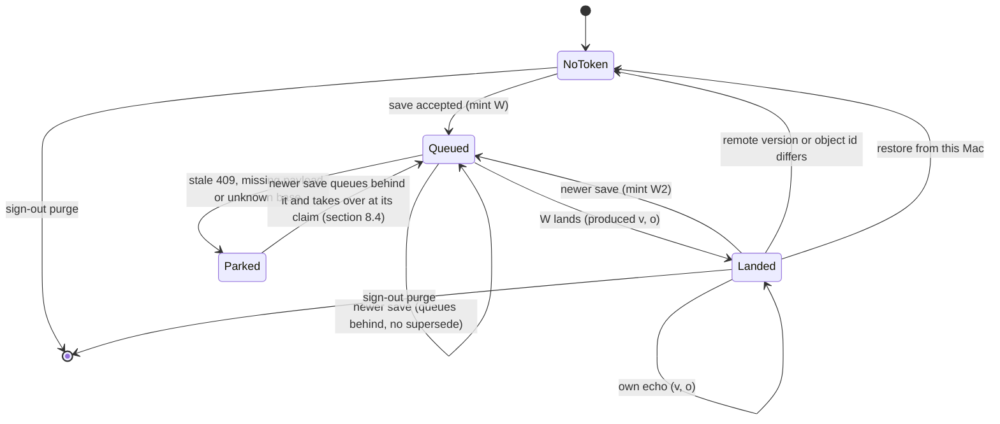
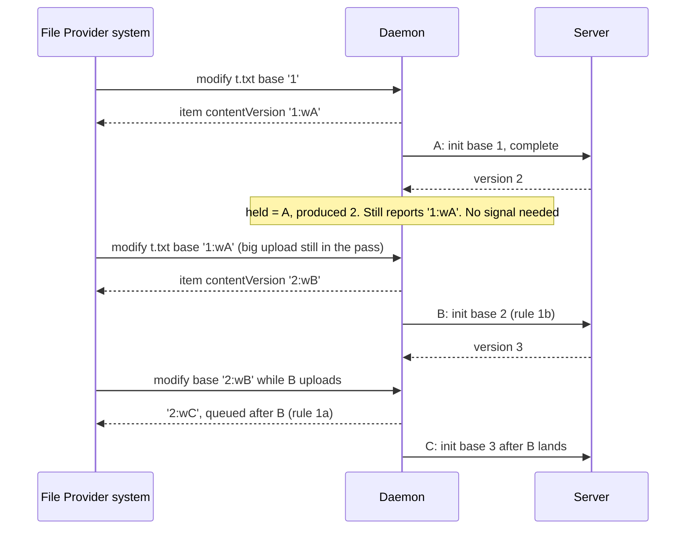
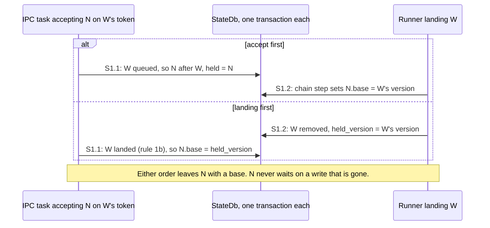
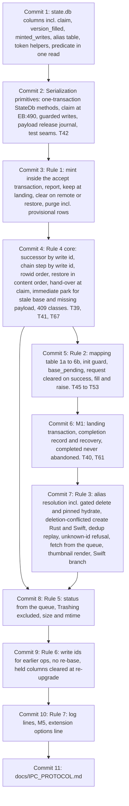

# 2026-10-09 — macOS: the version of the bytes Finder holds (task 1873, round 4)

**Status:** ~~design for review. No code yet. The lead reviews this spec and rules before anyone implements it.~~
~~design for review, revision 4b. No code yet. The spec review approved round 4 with changes; this revision applies the lead's ten rulings on it. The lead reviews the revision before anyone implements it. — lead ruling, 2026-10-10 (spec review)~~
design, revision 4c. No code yet. The lead reviewed revision 4b and ruled on it; this revision applies those rulings (see "Revision 4c" below). Implementation follows the plan `docs/superpowers/plans/2026-10-10-macos-finder-write-versions.md`. — lead ruling, 2026-10-10 (spec r4b)
**Date:** 9 Oct 2026; revised 10 Oct 2026 (4b, 4c)
**Repo:** desktop. The macOS File Provider path only. Windows (Cloud Files) and Linux behaviour is unchanged.
**Task:** 1873 (P0: files saved in the Finder location upload reliably), round 4.
**Read at:** desktop `931b885` (branch `fix/1873-finder-create-staging`). API server (private repository) `46e5054c`, read-only. FileProvider headers from the macOS 27.0 SDK (Xcode 27.0, `27A266a`).
- **Server re-checked at `62157c52`** (revision 4b), 4 commits past `46e5054c`. None of them touches version numbers, bases or op emission, and the three 409 messages are unchanged (`uploads.rs:816`, `:857`, `:861` at `62157c52`).
  - One of them does touch the lease path. Commit `f998c79e` adds a 7-day absolute session lifetime (`upload_lease.rs`, `DEFAULT_SESSION_LIFETIME_SECS`, at `62157c52`). After that, chunk PUT, `complete` and heartbeat answer 404.
  - ~~That is one more way for `complete` to answer 404, and §8.6 rule 5 already covers it.~~
    That is one more way for `complete` to answer 404. §8.6 rule 5, which would have covered it, is split off (§12, 1879). Until then such a 404 takes today's path (§8.6). — lead ruling, 2026-10-10 (spec r4b)
  - So the review's "none of them touches the lease path" is not quite right. It changes nothing in this design.
**Builds on:** round 3. Writes complete with `shouldFetchContent: false`, identifiers lead with the server version, old identifiers are accepted, a queued modify records its size and mtime, uploads of one file form a chain, and refusals are logged. All of it is described in `docs/IPC_PROTOCOL.md`, "Versions and queued writes".
**Replaces:** three passages in `docs/IPC_PROTOCOL.md`: the "rebase on an equal base" chain, the "queued, no item" reply row and the "Not covered" note on provisional ids. Also the round-3 review's partial fixes: the C1 floor rule and the I1 "hold `Uploading`" fix.
**Ruling it implements:** [1873-identity], a local-write token. This changes a wire identifier (Trigger 1). It was decided under the standing delegation and surfaced in the lead's status message.

**Citations.**
- Desktop paths:
  - `EB` = `src-tauri/src/engine_bridge.rs`
  - `IPC` = `src-tauri/src/ipc_socket.rs`
  - `SD` = `src-tauri/src/state_db.rs`
  - `RUN` = `src-tauri/src/runner.rs`
  - `FPE` = `BeebeebFileProvider/FileProviderExtension.swift`
  - `FPI` = `BeebeebFileProvider/FileProviderItem.swift`
  - `XPC` = `BeebeebFileProvider/XPCBridge.swift`
- Headers:
  - `ITEM.h` = `NSFileProviderItem.h`
  - `REPL.h` = `NSFileProviderReplicatedExtension.h`
  - `THUMB.h` = `NSFileProviderThumbnailing.h`
- Server paths, under `beebeeb-api/src/`:
  - `UP` = `routes/uploads.rs`
  - `FILES` = `routes/files.rs`
  - `VER` = `routes/versions.rs`
  - `SY` = `routes/sync.rs`
  - `VD` = `routes/version_download.rs`
  - `DB` = `db.rs`
- `QA/…` = the device evidence for task 1873, kept with the task in the private workspace.
- Line numbers are at the commits above.
- **Unverified** marks a claim that no source or run here establishes.

## Revision 4b (10 Oct 2026): what the spec review changed

The review found one critical issue, five important ones and sixteen minor ones. The lead ruled on them on 10 Oct 2026. Changed rules keep their old text struck through, with the new text beneath it and the signature "— lead ruling, 2026-10-10 (spec review)". Finding ids (C-1, I-1 … I-5, m-1 … m-16) are the review's.

| Ruling | What changed | Where |
| --- | --- | --- |
| 1. No save-time supersede | A newer save always queues behind its predecessor. One upload per save; the last one wins. I4 is closed by the immediate park and the hand-over alone | §5.4, §6.1, §8.2, §8.3, §8.4, §10.5, §11, §13, §14 |
| 2. No automatic re-base of timestamp bases | Old timestamp-based ops get a stale 409 and park | §10.3, §11, §13, §14 D1 |
| 3. Serialization (C-1) | New §8.7: which decisions share one transaction, how the runner claims an op, guarded writes | §5.3, §6, §8.1, §8.4, §8.6, §8.7 |
| 4. Deletion-conflicted create (I-1) | Resolved through the alias to a content modify of the server file | §7.2, §7.5 |
| 5. Version 0 (I-2) | A save just after a snapshot lands; a failed snapshot never parks | §6.1, §6.3 |
| 6. Legacy replace from another device (I-3) | A re-snapshot raises the version and clears the token | §5.4, §6.3, §12 |
| 7. Fetch counting (I-4) | An instrument shown to see successful fetches, with a positive control | §3, §14 |
| 8. Tests (I-5) | Concurrency tests and the missing rule tests | §13 |
| 9. Minor findings | Each applied or declined in one line | §5–§14, and the list below |
| 10. Cost | Recomputed | §15 |

**The minor findings, one line each:**
- ~~**m-1** applied: rule 1c (a lost reply) and rule 3's "newest write of the file's chain" (§6.1). It needs a small `minted_writes` table (§5.2).~~
  **m-1** partly applied: rule 3's "newest write of the file's chain" (§6.1) stays. Rule 1c and its `minted_writes` table are split off to 1879 (§12). — lead ruling, 2026-10-10 (spec r4b)
- **m-2** applied: a hand-over only ever comes from a write this spec minted (§8.4).
- **m-3** applied: the predicate requires both object version ids to be equal and not NULL (§5.3).
- **m-4** applied: (a) waiting ops store `b` as their base; (b) is named in the downgrade note; (c) held columns are cleared at a re-upgrade (§5.6, §10.2).
- **m-5** moot: §10.3's re-base is dropped by ruling 2.
- **m-6** applied: a delete resolves through the alias only with the held token as its base (§7.2).
- ~~**m-7** applied: a dedup replay of a landed create answers the server item (§7.2).~~
  **m-7** split off to 1879 (§12); today's behaviour ships. — lead ruling, 2026-10-10 (spec r4b)
- **m-8** applied: `Trashing` rows are excluded from the `uploading` presentation (§9.1).
- **m-9** applied: a restore runs in the file's upload order, and the held token is cleared only when no write is queued (§5.4 row 10, §8.5).
- ~~**m-10** applied: a queued write's thumbnail is rendered from its staged bytes, never answered "no thumbnail" (§5.6).~~
  **m-10** partly applied: a queued write's thumbnail is never answered "no thumbnail". It is answered with a per-item error; the render from staged bytes is split off to 1879 (§5.6, §12). — lead ruling, 2026-10-10 (spec r4b)
- **m-11** applied: a completed session is never abandoned, at give-up either (§8.6).
- **m-12** applied in this spec's scope: §10.5 names sign-out as the exception, and the purge removes provisional rows. The sign-out confirmation belongs to spec A and is a follow-up there (§12).
- **m-13** applied: header citations corrected (§5.5, §7.4).
- ~~**m-14** applied: a hydrate of a landed token is pinned to its object version (§7.2, §12).~~
  **m-14** split off to 1879 (§12); today's behaviour ships. — lead ruling, 2026-10-10 (spec r4b)
- **m-15** applied: D2, D4b and D5 are corrected (§14).
- **m-16** applied: the traps are named (§8.8). `NSFileProviderModifyItemFailOnConflict` is opt-in through an Info.plist key we do not declare, so the system should never pass it. It is logged if it does.

**Premises found false in this revision:**
- **I-4:** "the system log probably cannot show successful fetches". It can. A plain `log show` on this Mac recorded successful `fetch-content` jobs at Default level on 9 Oct (`QA/inv2-fp-modify-window.log:8`, `:13`, `:29`, `:34`). See §14.
- **The server delta:** "none of the 4 commits touches the lease path". One does (header above). It changes nothing here.

## Revision 4c (10 Oct 2026): the lead's rulings on revision 4b

The lead reviewed revision 4b on 10 Oct 2026 and ruled on it. Changed rules keep their old text struck through, with the new text beneath it and the signature "— lead ruling, 2026-10-10 (spec r4b)".

| Ruling | What changed | Where |
| --- | --- | --- |
| 1. The hand-over happens at the successor's claim | Accepted as written, lazily, in one runner transaction. Its cost is named: at most one pass (≤ 30 s) of delay | §8.4 |
| 2. Six pieces split off to a follow-up | Rule 1c with `minted_writes`, the thumbnail render, pinned hydrates, the dedup replay, §8.6 rule 5 and the save-time presentation. Each ships today's behaviour or a safe default, and its tests and device steps move to the follow-up | the table below; §5–§16 |
| 3. D8b without a mobile client | A script drives the legacy chunked replace against the local API, through the endpoints the mobile app calls, with the test account's session | §14 D8b |
| 4. Spec A's open points | The sign-out confirmation that counts queued Finder saves is task 1887. The preserving domain removal is task 1882. Neither is designed here | §10.5, §12, §16 Q8 |
| 5. Cost and order | 9.45 engineering days plus about 1.25 device days; a new commit order | §15 |

**Must stay in this spec** (ruling 2): §8.7, the hand-over (§8.4), I-1, I-2, I-3, m-9 and m-11.

**The split.** Every piece goes to task 1879, the 1873 follow-ups (§12).

| Piece | Why it can wait | What ships instead | Moved out of this spec's plan |
| --- | --- | --- | --- |
| Rule 1c with `minted_writes` (m-1) | Rare: it needs a reply lost to an IPC timeout. Its failure is visible, not silent | Rule 5 (§6.1): the old token's `b` is sent and the server decides. A stale `b` meets 409, and the write parks with its bytes kept (§8.4). A false park, never a lost save | T51; the `minted_writes` table |
| The thumbnail render (m-10) | It is an icon, not bytes | The safe default §15 named: while the held write is queued, `FetchThumbnail` answers a per-item error and asks the server nothing (§5.6). T56 becomes T56′ | T56; D2's PNG step |
| Pinned hydrates (m-14) | The behaviour predates this spec | Today's: a hydrate asks for the file's current version | T63; the `pinned` log field |
| The dedup replay (m-7) | Rare: a create re-sent after its own landing, within the dedup TTL (30 min, `ipc_write_dedup.rs:44`). Nothing is lost | Today's: the replay runs the create again, so a second server file appears | T59; the `create_replay` log value |
| §8.6 rule 5 | It needs a lost `complete` answer followed by a swept session | Today's: the session is abandoned (§8.6). Rule 6 (m-11) still holds for a recorded completion | T28 |
| The save-time presentation | Cosmetic: a metadata field that moves no content (`ITEM.h:110`) | Today's: Finder shows `max(modified_at, remote_updated_at)` (`IPC:2585`) | T32; the `held_mtime` column; D2's `stat` check |

## 1. Why

Round 3 made Finder saves reach the server. Its device rungs R1–R4 passed: a create plus two saves landed with the right bytes, and a save on an old-format row kept working. The round-3 review then found one design decision underneath three of its findings. The version we report for bytes our own upload produced is wrong by design.

- The reply to a save keeps the version the system already held, for example `"1"`, because the content version does not move until the upload lands (`SD:2010-2031`).
- The landing then renames those same bytes to `"2"` (`EB:1182-1184`), and enumeration reports the new name (`IPC:2642-2643`).
- To the system, `"2"` is a remote change:
  - it evicts the item and downloads it again (I1);
  - a save made before it re-reads the item still carries `"1"` and is refused with 409 (C1);
  - and the timing of the provisional-id swap gets worse (I3).

The same review found four more problems:
- I2: a replace with no base for rows whose version is 0.
- I3: a modify of the provisional id after the create landed deletes the file on disk and makes a second server file.
- I4: a doomed earlier upload blocks the newest save for about 5.6 hours.
- Five minors, M1–M5.

The device rung added one more finding, R2a:
- After a save to a just-created item, the system fetched the provisional id 12 ms after the save completed.
- The fetch got a 404, three times.
- The item was read-only for 24 s.

This spec settles all of them with one identity rule and the rules that follow from it.

## 2. What we found (verified at `931b885`)

1. **The reply names new bytes with the old version, and the landing renames them.**
   - `record_local_write` sets size and mtime and leaves the content version (`SD:2010-2031`).
   - The framing test asserts the reply's content version stays `"1"` (`ipc_socket_framing_tests.rs:900-905`).
   - `apply_completed_upload` sets `current_version` from the server, stamps `modified_at` and `remote_updated_at` with "now", and marks the row `Local` (`EB:1149-1152`, `EB:1182-1184`).
2. **Apple's contract makes that rename a remote change.**
   - "if the contentVersion changes, the system assumes that the contents have changed and will trigger a redownload if necessary. The exception to this is the case where the extension accepts a content sent by the system when replying to a createItemBasedOnTemplate or modifyItem call with shouldFetchContent set to NO." (`ITEM.h:93-97`)
   - The root reports `.downloadLazily` (`FPI:251-253`): "Download remote content updates eagerly if this file is not dataless." (`ITEM.h:263-264`)
   - An earlier build's own landing produced `update-item … diffs:dataless) why:eviction|itemChangedRemotely|contentUpdate|evictWithOldVersion` (`QA/inv2-fp-modify-window.log:177`).
3. **The system learns of a landing only once per pass.**
   - A pass runs every 30 s (`RUN:117`).
   - Remote changes are applied first (`RUN:1293`), then the queue runs (`RUN:1315`), then one working-set signal goes out (`RUN:1322-1323`).
4. **R2a, read from the logs.**
   - Create of the provisional item `859b9a45…`: `shouldFetch:false` (`QA/R2-fp.log:28`).
   - Save at 16:01:45.861: `update-item … target:<… cver:0> … → <actual: … cver:0 …> stillPending: shouldFetch:false` (`QA/R2-fp.log:54`).
   - `fetch-content(859b9a45…) why:itemChangedRemotely sched:utility#1791554505.822088`. That is the update job's own schedule id. It failed at .898 after 24.55 ms, so it started about 12 ms after the save completed. Cause: `404 Not Found … /api/v1/files/859b9a45…`.
   - The item became `m:r--el … deco:error` at 16:01:47.793. It went back to `rw` at 16:02:11.824.
   - The app logged `Finder hydrate failed … reason="not_found"` three times, at 14:01:45.898Z, 14:01:47.830Z and 14:02:12.677Z (`QA/R0-app-stdout.log`).
   - **Premise correction:** the save came during the create's *queue wait*, not its upload. The save was at 14:01:45Z. The create's server row appeared at 14:02:10.862Z, at the next pass (`QA/R2-run.txt`).
5. **The id swap still replaces the created file with a new item.**
   - In R1 the create was docID 131211 (`QA/R1-fp.log:33`). Both later saves targeted docID 131213 (`QA/R1-fp.log:164`, `:193`).
   - Between them the system "provid[ed]" the item for a claim at 16:00:14.226 (`QA/R1-fp.log:124`). That is a materialization of a file that had become dataless, as investigation Q2 found on the earlier build.
6. **A hydrate rewrites the status of a row that has a queued upload.**
   - It sets `Downloading` (`EB:2584`).
   - On success it sets `Local` (`EB:2647`, `hydrate_final_status` `EB:4233-4238`).
   - On failure it sets `Error` (`EB:2609`, `EB:2633`, `EB:2681`).
   - It never reads the server's version (`EB:2816-2826`).
7. **Startup turns every `Uploading` row into `Error`** (`SD:2041-2053`, called at `RUN:997`). That makes a file with a queued save read-only after any relaunch.
8. **Remote rows for `Uploading`, `Error` and `Conflict` rows are ignored** (`EB:6383-6392`).
   - Snapshot rows never update `Local` rows either.
   - The snapshot's `updated_at` is an RFC 3339 string, so `as_i64()` gives 0 (`EB:6274`), and the `remote_updated <= entry.remote_updated_at` short-circuit always fires (`EB:6326`).
9. **The content hash is never set in production code.** `content_hash: Some(` appears only in tests (`SD:4484`, `EB:8715` and others), so the `{current_version}:{hash}` form exists only in tests.
10. **Version sources** (fixes M4):

    | Source | `version_number` | Object version id | Notes |
    | --- | --- | --- | --- |
    | Upload `complete` response (our own uploads) | yes (`UP:1602`) | yes (`UP:1601`) | an idempotent repeat answers `already_completed` with neither (`UP:1299-1306`, `UP:1347-1353`) |
    | `file_create` / `file_update` op from the upload route | yes (`UP:1576`) | yes (`UP:1575`) | |
    | Legacy one-shot replace (`file_update`) | yes (`FILES:2273-2283`) | no | the mobile app uses the legacy endpoints (review I2) |
    | Legacy one-shot create (`file_create`) | **no** (`FILES:2286-2297`) | no | always version 1: `FILES:1987`, column default 1 at `DB:1174` |
    | Legacy chunked complete (`file_create`) | **no** (`FILES:3656-3667`) | no | can be a **replace**: the legacy init bumps `version_number` on a reused id (server `CLAUDE.md:72`) |
    | `/sync/snapshot` node | yes (`SY:197`, `SY:213`) | no | the desktop skips `Local` rows (item 8) |
    | `GET /files/{id}` | inside `download_version` when the file has an object version (`FILES:4724`, `FILES:4756`, `VD:23`) | yes | not for one-shot (V1) files |
    | Version restore | response only (`VER:614`, `VER:689`) | first branch only | **no op at all**: event bus only (`VER:604-610`, `VER:679-685`) |
    | Rename / move ops | no; the desktop keeps the contract's (`EB:6163-6166`) | no | |

11. **The two ops on the QA Mac** (state.db copy, `QA/inv2-statedb-copy-queries.log`):

    | Op | File | Base | Row: version | Row: `remote_updated_at` | Payload size |
    | --- | --- | --- | --- | --- | --- |
    | `905b6d55…` | `89da2556…` | `1791550250` | 1 | 1791550250 | 40 B |
    | `e5cec976…` | `bdfa53ed…` | `1791550190` | 1 | 1791550220 (re-stamped after the save) | 24 B |

    - The server still held version 1 of both (`QA/inv2-devdb-rows.log`).
    - Both were still retrying at attempt 10/25 at 14:10–14:11Z (`QA/R0-app-stdout.log`).

## 3. Rulings and premises

- **[1873-identity]** (lead, 2026-10-09), recorded verbatim in the ledger:
  > "do the structural fix — a stable local content version (local-write token: the reply names the accepted bytes; enumeration keeps that name while the server version is the one our own upload produced; a remote change clears it) — designed on paper first, reviewed by the lead, then implemented"
- **The same ruling** covers I2, I3 (alias), I4 (supersede), R2a and M1–M5. Follow-up D (task 1880) stays a follow-up "unless the design shows the alias is not enough".
  - (4b) The 10 Oct ruling 1 dropped supersede. I4 is now closed by the immediate park and the hand-over (§8.4).
- **Premise that is false: "the supersede rule must rescue" the two old QA ops.**
  - Their bytes are not on disk any more. The build they were queued under completed the save with `shouldFetchContent: true`, which fetched version 1 back over the edit (investigation Q3, step 4: 40 B → 28 B).
  - A later save of either file is therefore built on version 1, without the queued edit. Superseding the old op with it would drop that edit.
  - ~~They are rescued by **re-basing** instead (§10.3). Supersede is limited to writes whose bytes the system provably held (§8.2).~~
  - They are not rescued automatically. Like any stale base, they get a 409 and park with their bytes (§10.3). There is no supersede at all (§8.2). — lead ruling, 2026-10-10 (spec review)
- **Premise corrected:** R2a happened during the create's queue wait, not its upload (§2 item 4). The design covers both cases.
- **Candidate trigger refuted:** "the provisional row's identifier changes when B2 records the new size/hash".
  - R1 made the same B2 change on a server-id item, and no fetch followed:
    - A fetch there could only have returned the server's 21-byte version 1, and the local file was 45 B at every sample until the landing (`QA/R1-run.txt`).
    - ~~The fileproviderd capture alone cannot show it. It lists failed fetch jobs (`QA/R2-fp.log`) but no successful ones: R1's own materialization appears only as a file-coordination "providing" line (`QA/R1-fp.log:124`). §14 corrects that instrument.~~
    - Correction (revision 4b): fileproviderd does log successful fetches, at Default level, which a plain `log show` keeps.
      - The investigation capture, taken with plain `/usr/bin/log show`, has `✍️  persist job: <FP1 ⏯  fetch-content(89da2556…) …` and `┳… ✅  done executing <FP1 ✅  fetch-content(89da2556…) …`, both of type `Default` (`QA/inv2-fp-modify-window.log:8`, `:13`; again at `:29`/`:34` and `:121`/`:126`).
      - `QA/R2-fp.log` has only the failed jobs, at Error level, because R2's fetches failed.
      - `QA/R1-fp.log` has no `fetch-content` line at all. Its capture command was not recorded. **Unverified:** whether its filter would have kept a `fetch-content` line for the server id.
      - R1's no-fetch conclusion therefore still rests on the byte samples. §14 now counts fetches with the job lines above, behind a positive control. — lead ruling, 2026-10-10 (spec review)
  - B2 changes only the metadata version and `version_identifier`. The extension builds the item version from `contentVersion` (`FPI:222-226`).
  - Of the metadata version, Apple says: "The system will store this version, but otherwise ignore it" (`ITEM.h:109-112`).

## 4. Goal and non-goals

**Goal.** On a Mac:
- A save in the Finder location reaches the server once, with the right base, whatever the timing.
- The bytes stay on disk, and the item stays writable.
- Our own upload never makes the system evict or re-download what it already holds.
- A real remote change still reaches the disk.
- Nothing a person saved is lost, reverted or overwritten silently.

**Non-goals** (§12):
- what the person is offered when a save meets a real remote change (1881);
- shared items in Finder (1701);
- packages (1879);
- removing the id swap (1880);
- Windows.

## 5. Rule 1: the identity of the bytes the system holds

**Rule.**
- Every content write the daemon accepts from the File Provider gets a fresh *write token*. The reply's content version is that token.
- Enumeration, the working set, item lookups and the item returned by a fetch keep reporting the token while one of two things is true:
  - the write is still in the queue; or
  - the server's current version is the one this write produced.
- Anything else clears it.

**Reason.** Apple's model is that a reply names the bytes it accepted, and the name changes only when the content changes elsewhere (`ITEM.h:93-97`). Naming our own bytes twice (C1, I1) is the bug.

### 5.1 Format

`{b}:w{W}`, for example `2:w9f1c0e3a5b7d4f2e8a6c4b2d0e9f7a1c`.

- **`b`** is the server version these bytes derive from, in decimal:
  - for a replace, its resolved base;
  - for a write queued behind an earlier write that has not landed, the earlier write's `b`;
  - `0` for a create, and for writes queued behind a create that has not landed.
- **`W`** is 32 lowercase hex digits: a fresh random (v4) UUID without hyphens. One is minted per accepted content write. It is never reused and never derived from a name or path.
- **Size.** At most 10 + 2 + 32 = 44 bytes. Apple limits a version component to 128 bytes (`ITEM.h:85`).
- **Older code** reads the first segment (`parse_base_version_number`, `EB:4718-4726`). `b` is safe there because it is an ancestor of the bytes:
  - older code sends a base the server accepts only when nothing in this chain has landed, and then the bytes are a valid replacement;
  - otherwise the server refuses it with 409.

  The exception is `b = 0` after a create landed: older code sends no base (§5.6, downgrade).
- **Matching** is by exact string equality with the row's held token, never by pattern.
  - The `w` only keeps the string apart from the other forms: `{v}`, `{v}:{hash}`, and the old `max(current_version, remote_updated_at)` forms.
  - It is not a hex digit, so no hash form can equal a token.

**Rejected:**
- *A content hash.* The server cannot hash plaintext, and hashing the staged copy before the reply reads the whole file inside the 600 s write budget. This agrees with the review, Focus 1.
- *The queue's `op_id`.* ~~A supersede updates an op in place with new bytes (§8.2), and the name must change with the bytes.~~
  Without supersede (§8.2), an op carries the same bytes for its whole life, so the op id would now work too. A separate write id is kept for two reasons:
  - the token outlives the op: it is still held after the landing removes the op;
  - logs, tests and the guarded writes of §8.7 can then name bytes and queue rows apart.
  — lead ruling, 2026-10-10 (spec review)
- *The predicted landing version (`b + 1`).* Older code would parse it as a base. If this write never lands and a remote change takes the server to `b + 1`, older code would overwrite that change. `b` can only ever be refused.

### 5.2 What is stored (the migration)

The columns are additive and nullable, added with `ensure_column` (the `SD:899-924` pattern), with no backfill:

| Table | Column | Meaning |
| --- | --- | --- |
| `files` | `held_write_id TEXT` | `W` of the write whose bytes the system was last told about; NULL = no token |
| `files` | `held_base INTEGER` | `b` |
| `files` | `held_version INTEGER` | the server version `W` produced; NULL until it lands |
| `files` | `held_object_version_id TEXT` | the object version `W` produced; NULL until it lands |
| ~~`files`~~ | ~~`held_mtime INTEGER`~~ | ~~seconds; mtime of `W`'s staged copy (the save time; the extension stamps the copy "now", `UploadStaging.swift:92-93`)~~ (4c) split off with the save-time presentation (§12, 1879) — lead ruling, 2026-10-10 (spec r4b) |
| `operation_queue` | `write_id TEXT` + index | the write this upload carries; NULL for non-content ops and for Windows/watcher uploads |
| `operation_queue` | `after_write_id TEXT` | this upload's base is the version that write produces; NULL once resolved |
| `operation_queue` | `base_pending INTEGER NOT NULL DEFAULT 0` | the base is not known yet for a server-known file (§6.3) |
| `upload_resume` | `completed_version INTEGER`, `completed_object_version_id TEXT` | the landing the server confirmed, recorded before local bookkeeping (§8.6) |
| new `id_aliases` | `provisional_id TEXT PRIMARY KEY, server_id TEXT NOT NULL, created_at INTEGER NOT NULL` | §7.1 |
| `files` (4b) | `version_filled INTEGER NOT NULL DEFAULT 0` | the version was filled from 0 by a snapshot, and no content op, landing or restore has touched the row since (§6.1 rule 6a, I-2) |
| `operation_queue` (4b) | `claim_id TEXT`, `claimed_at INTEGER` | the runner's claim on the op for one attempt (§8.7); cleared at engine start |
| ~~new `minted_writes` (4b)~~ | ~~`write_id TEXT PRIMARY KEY, file_id TEXT NOT NULL, minted_at INTEGER NOT NULL` + index on `file_id`~~ | ~~every token minted for a file since its last remote change (§6.1 rule 1c, m-1). Cleared with the held columns, re-keyed at the id swap, purged at sign-out, swept after 30 days~~ (4c) split off with rule 1c (§12, 1879) — lead ruling, 2026-10-10 (spec r4b) |

- There is no `file_state` table; the contract columns already live on `files` (`SD:774-800`).
- `upsert_file` (`SD:974-1048`) and `set_file_contract_state` (`SD:2226`) list their columns explicitly, so they never overwrite the new ones. Only new, dedicated `StateDb` functions write them.
- The token string is derived (`{held_base}:w{held_write_id}`) and never stored.

### 5.3 One predicate decides what is reported

`held_token(row, queue) -> Option<String>` is `Some` exactly when `held_write_id` is set and one of these holds:
- an upload op with `write_id = held_write_id` exists, whether queued, running, paused, backing off or parked; or
- ~~`held_version == current_version`, and the two object version ids are equal or one of them is NULL.~~
  `held_version == current_version`, and the two object version ids are equal and not NULL. — lead ruling, 2026-10-10 (spec review)
  - Why (m-3): after a landing the held object id is always known: from the `complete` response (`UP:1601`), from the session for `already_completed` (§8.6.1)~~, or from `GET` (§8.6.5)~~ (§8.6 rule 5 is split off, §12 — lead ruling, 2026-10-10 (spec r4b)).
  - Ops without an object id keep the row's (`EB:6169-6174`).
  - So the NULL case could only mask a bug.

**One read (revision 4b).** The predicate reads the row and the queue in **one** `StateDb` call, so both come from the same moment (§8.7).
- Suppose the row is read before a landing and the queue after it. The row shows `held_version` NULL and the old `current_version`, and the queue no longer has W.
- The predicate would then report the old `{cv}`, a content change to the system, for bytes that did not change.

Otherwise:
- The caller reports `item_content_version(current_version, hash)` (`EB:4661-4666`), as round 3 does.
- ~~The held columns are cleared then. That is housekeeping; correctness comes from the predicate.~~
  ~~A builder that finds the predicate false may clear the held columns, and the file's `minted_writes`, only with `UPDATE files SET held_… = NULL WHERE file_id = ? AND held_write_id = ?`, using the value it read. So it can never clear a token that a concurrent save has just set. This is housekeeping; correctness comes from the predicate. — lead ruling, 2026-10-10 (spec review)~~
  A builder that finds the predicate false may clear the held columns only with `UPDATE files SET held_… = NULL WHERE file_id = ? AND held_write_id = ?`, using the value it read. So it can never clear a token that a concurrent save has just set. This is housekeeping; correctness comes from the predicate. (`minted_writes` is split off, §12.) — lead ruling, 2026-10-10 (spec r4b)

Every builder uses it:
- `file_entry_payload` (`IPC:2602-2679`) and `file_entry_payload_without_contract` (`IPC:2681-2737`), which serve enumeration, the change feed (`IPC:2404-2445`), item lookups, the dedup replay (`IPC:2279-2318`) and write replies (`IPC:2364-2396`);
- the base mapping (§6).

`version_identifier` keeps its round-3 meaning. The bundled extension never sends it as a base: the base is `contentVersion` (`FPE:592-594`).

### 5.4 Every state, and what each surface reports

The reply is the item in the `WriteQueued` answer. "Others" means enumeration, the working set, item lookups and the item returned with a fetch: one builder, one answer.

| # | State | What changes on the row | Reply | Others |
| --- | --- | --- | --- | --- |
| 0 | No write since the upgrade, or the token was cleared | nothing | n/a | `{cv}` |
| 1 | Create queued (provisional id P) | row P with no contract; held `(W, b=0)`; size and mtime from the copy | `0:wW` | `0:wW`, status `uploading` |
| 2 | Modify queued | held `(W, b)`; size and mtime of W (B2) | `b:wW` | `b:wW`, `uploading` |
| 3 | ~~Save queued behind a live upload (§8.3)~~ Save queued behind any queued write, whatever its state (§8.3) — lead ruling, 2026-10-10 (spec review) | held `W2`; op `after_write_id = W1` | `b:wW2` | `b:wW2` |
| 4 | ~~Save superseded a queued one (§8.2)~~ — removed: there is no supersede (§8.2). Instead: **the predecessor parked and the save took over at its claim (§8.4)** — lead ruling, 2026-10-10 (spec review) | ~~the earlier op carries W2's bytes; held `W2`~~ W1's op is retired; W2's op carries W1's base (or W1's create); held `W2` | `b:wW2` | `b:wW2` |
| 5 | W landed, nothing later queued | `held_version`/`held_object_version_id` = produced; status `Local`; the server's size (same bytes); ~~`modified_at` kept (§9.3)~~ `modified_at` stamped as today (§9.3; the save-time presentation is split off, §12) — lead ruling, 2026-10-10 (spec r4b) | n/a | `b:wW` unchanged, `local` |
| 6 | W1 landed, W2 still queued | held stays `W2`; status `Uploading`; W2's size and mtime | n/a | `b:wW2`, `uploading` |
| 7 | Echo of our own landing (op or snapshot with the produced version) | nothing | n/a | unchanged |
| 8 | Remote content change (new version or object id), W not queued | held cleared | n/a | `{cv'}`: the system re-downloads |
| 8b (4b) | Remote **versionless** replace: the legacy chunked complete, a `file_create` op for a row that exists (`FILES:3656-3667`), W not queued | the op cannot tell it from an echo; it requests a re-snapshot, whose node raises `current_version` (§6.3.2, I-3); held cleared then | n/a | `{cv'}` one pass later: the system re-downloads |
| 9 | Remote change while W is still queued | ignored, because the row is `Uploading` (`EB:6383-6392`); W gets a stale 409 later and parks (§8.4) | n/a | `b:wW` (the disk holds W's bytes) |
| 10 | Restore from this Mac (`RestoreVersion` op) | `current_version` := the response's `version_number` (`VER:614`, `VER:689`; today it is discarded, `EB:632-642`); ~~held cleared~~ held cleared only when no write of the file is queued. The restore runs in the file's content order (§8.5), so a queued W lands first and the restore follows as r = v + 2 (m-9) — lead ruling, 2026-10-10 (spec review) | n/a | `{r}`: re-download |
| 11 | Restore from another device | nothing: no op exists (`VER:604-610`, `VER:679-685`) | n/a | `b:wW`. Known gap (§12); the next save meets 409 and parks |
| 12 | Rename or move | held unchanged | token (reply of the metadata modify) | token; metadata version moves |
| 13 | Trash from Finder | row `Trashing`; held unchanged | n/a | token, listed under the trash container; status never `uploading` (§9.1, m-8) |
| 14 | Create lands (id swap) | in one transaction: S's row gets P's held columns plus produced version 1 and object id; alias P→S; ~~P's `minted_writes` re-keyed to S;~~ row P deleted (§8.6) — lead ruling, 2026-10-10 (spec r4b) | n/a | S: `0:wW`; P: deleted |
| 15 | Sign-out by choice | held columns cleared and aliases deleted, in the purge transaction (`SD:2874-2944`); also ~~`minted_writes`, and~~ provisional rows without a contract (m-12) — lead ruling, 2026-10-10 (spec r4b) | n/a | the domain is removed (spec A) and rebuilt from `{cv}`. Queued saves are purged by design (§10.5) |
| 16 | Re-install, existing domain, `state.db` kept | nothing | n/a | unchanged |
| 17 | Local data reset (spec A §5.6: reset, then Repair) | no held columns | n/a | `{cv}`; a stale token in the replica parses to `b` (§6.1, rule 5) |

While `Queued`, `Landed` or `Parked`, every surface reports the token. In `NoToken` they report `{cv}`.

### 5.5 Apple's own words: our landing no longer moves anything, a remote change still does

- **Our landing.** The reply already named the bytes with the token, under the exception Apple grants to "a content sent by the system when replying to a createItemBasedOnTemplate or modifyItem call with shouldFetchContent set to NO" (`ITEM.h:95-97`).
  - At the landing the predicate holds, so the content version does not change.
  - "if the contentVersion changes, the system assumes that the contents have changed and will trigger a redownload" (`ITEM.h:93-95`) cannot fire.
  - ~~What changes is metadata: status and size. "The system will store this version, but otherwise ignore it" (`ITEM.h:109-112`).~~
    What changes is metadata: status, and the size, which is the same bytes' size (§9.3). Changed metadata *fields* are applied (`ITEM.h:110`). Only the metadata *version* is "store[d] … but otherwise ignore[d]" (`ITEM.h:109-112`). Neither moves content. — lead ruling, 2026-10-10 (spec review)
  - **Inferred, not stated by Apple (m-13):** that a later enumeration reporting the *same* content-version string causes no fetch. It is the converse of `ITEM.h:93-95`, not a sentence in the header.
    - On the device it is supported by round 3's R1: 45 B at every sample, and an unchanged `"1"` across status changes.
    - R2a shows the system fetching for a reason the header does not document (§7.4). D2 and D6 (§14) count fetches to check this inference.
  - `isUploaded` turns true, and the item becomes evictable ~~"when the item is fully uploaded" (`ITEM.h:155-157`)~~ (`ITEM.h:530-533`: "uploaded is used to inform whether the item may be evicted from the local disk"; the earlier citation, `ITEM.h:155-157`, sits under a capability deprecated since macOS 13, `ITEM.h:166`) — lead ruling, 2026-10-10 (spec review). Eviction is then the system's ordinary choice: disk pressure, or "Remove Download". It is no longer a reaction to a version change, which is what `evictWithOldVersion` was (`QA/inv2-fp-modify-window.log:177`).
- **A remote change.** The predicate fails, and the content version becomes `{cv'}`.
  - `ITEM.h:93-95` applies.
  - Under the root's `.downloadLazily`, a materialized item is downloaded again "eagerly if this file is not dataless" (`ITEM.h:263-264`).

### 5.6 Consequences

- **Thumbnails.** The thumbnail cache "will be invalidated when itemVersion.contentVersion changes" (`THUMB.h:37-38`). The token changes at the reply, so the system drops the old thumbnail at the save, not at the landing.
  - Until the write lands, the server holds only the previous version's thumbnail.
  - ~~Rule: `FetchThumbnail` for an item whose held write has not landed answers "no thumbnail" (nil data, nil error: `THUMB.h:29-31`).~~
  - ~~**Unverified:** whether the system caches that answer under the token until the next content change (§16, Q3).~~
  - ~~Rule (m-10): `FetchThumbnail` for an item whose held write is still queued answers a thumbnail **rendered from that write's staged bytes**. Those are the bytes the token names, so the system may cache the answer for the token's whole life (`THUMB.h:37-38`).~~
    - ~~The renderer is the one uploads already use, before its encryption step (`prepare_thumbnail_uploads_for_plaintext_media`, `EB:3664`; called from `EB:1078`).~~
    - ~~For a type the renderer does not handle, the answer is "no thumbnail" (nil data, nil error: `THUMB.h:29-31`). That is the truth for such a type on the server too.~~
    - ~~A render that fails for a handled type answers a per-item error, never nil/nil. A "no thumbnail" answer would be cached until the next content change (`THUMB.h:37-38`), and the token does not change at the landing.~~
    - ~~**Unverified:** whether the system asks again after a per-item error (§16, Q3).~~
    - ~~— lead ruling, 2026-10-10 (spec review)~~
  - **Rule (4c, the safe default):** `FetchThumbnail` for an item whose held write is still queued answers a per-item error, and asks the server nothing.
    - Why not the server's thumbnail: the server holds only the previous version's, and an answer is cached under the token until the next content change (`THUMB.h:37-38`). The landing no longer changes the token, so a stale icon would stay for the token's whole life.
    - Why not "no thumbnail" (nil data, nil error, `THUMB.h:29-31`): it would be cached the same way.
    - The daemon answers `IpcResponse::Error`; the extension turns every daemon error into a per-item error (`FPE:1019`, `XPC:534-535`). No Swift change.
    - Once the write has landed, the server holds the new version's thumbnail (uploaded after `complete`, `EB:1078`), and a request goes to the server as today.
    - **Unverified:** whether the system asks again after a per-item error (§16, Q3). If it does not, the icon stays generic until the next content change. The render from staged bytes is split off to 1879 (§12).
    - — lead ruling, 2026-10-10 (spec r4b)
- ~~**Finder's modification date.** While the predicate holds, the payload's `modified_at` is `held_mtime`. Today it is `max(modified_at, remote_updated_at)` (`IPC:2585`), which shows the upload time (R1: 16:01:10), or an echo's "now" (`EB:6181`, `EB:5430`, `EB:6351`). The creation date falls back to it (`IPC:2586-2588`).~~
- **Finder's modification date (4c).** Unchanged: `max(modified_at, remote_updated_at)` (`IPC:2585`), which shows the upload time (R1: 16:01:10), or an echo's "now" (`EB:6181`, `EB:5430`, `EB:6351`). The creation date falls back to it (`IPC:2586-2588`). It is a metadata field: changed fields are applied, and no content moves (`ITEM.h:110`). Showing the save time is split off to 1879 (§12). — lead ruling, 2026-10-10 (spec r4b)
- **Downgrade.** A build from before this spec parses `0:wW` as no base. So the first save on that build of a file created under this spec, before the system re-reads it, is a replace without a base: round 3's I2 hole.
  - **Unverified:** whether the updater can install an older build (§16, Q4).
  - **More downgrade effects (m-4), added in revision 4b:**
    - (a) An op waiting on `after_write_id` or `base_pending` has no resolved base. An older build would send it as a replace with no base. So while it waits, its `base_version` holds the token's `b` (`0` for a create's chain or a `base_pending` op). The new code ignores that value while `after_write_id` or `base_pending` is set. An older build then sends a base the server refuses with 409 (`UP:775-778`), never no base.
    - (b) An older build reports `{cv}` for a row whose minted write is still queued. To the system that is a content change, so until that write lands it downloads the server's bytes over the queued write's bytes. This belongs in the release-notes guidance of Q4.
    - (c) A re-upgrade could revive stale held columns. At engine start, before earlier ops get write ids (§10.2), the held columns ~~and `minted_writes`~~ are cleared for every file that has an upload op without a `write_id`. Such an op is one an older build queued after a downgrade. (`minted_writes` is split off, §12. — lead ruling, 2026-10-10 (spec r4b))
    - — lead ruling, 2026-10-10 (spec review)

## 6. Rule 2: from the base the system sends to the server's `base_version_number`

**Rule.**
- The decision is made from the row as it is before the write changes it. The row is the alias target when there is one (§7).
  - Revision 4b: the decision is read **inside** the accept transaction that also mints the token and enqueues the op (§8.7 S1). It is never taken from a row read in an earlier `StateDb` call. — lead ruling, 2026-10-10 (spec review)
- The first matching row of the table wins.
- A replace of a file the server knows is never sent without a base.
- "The newest write of the file's chain" means `held_write_id`, the last token minted for the file (it is set in the same transaction that enqueues it).

### 6.1 The mapping

| # | Incoming base identifier | Condition | Base of the new upload |
| --- | --- | --- | --- |
| 1a | the row's held token | its write W is still queued | ~~*after W*: W's successor (§8); resolved when W lands, unless N supersedes W~~ *after W*: W's successor (§8), whatever W's state (running, waiting, backing off, paused or parked). Resolved when W lands (the chain step), or by the hand-over when W has parked (§8.4). — lead ruling, 2026-10-10 (spec review) |
| 1b | the row's held token | W landed | `held_version` |
| ~~1c (4b)~~ | ~~a token `{b}:w{W}` that is in `minted_writes` for this file (or its alias target), but is not the held one~~ | ~~the held columns are set~~ | ~~as if the base were the held token: rule 1a or 1b. This is a reply lost to an IPC timeout (m-1). The disk holds the newest local bytes, and with no remote change since (the held columns are set) they contain every write of this chain — lead ruling, 2026-10-10 (spec review)~~ (4c) split off to 1879 (§12). Such a token falls to rule 5: its `b` is sent, a stale `b` meets 409, and the write parks with its bytes kept (§8.4). A visible, false park; never a lost save — lead ruling, 2026-10-10 (spec r4b) |
| 2 | anything | the row is provisional: no contract, and its create is queued | ~~*after the create's write*~~ *after the newest write of the file's chain* (the create's, or a later save's). This device is the file's only lineage; the server has no file yet — lead ruling, 2026-10-10 (spec review) |
| 3 | `{v}` (or `{v}:{hash}`) | the file has an upload queued **by this spec's code** whose resolved base is `v` | ~~*after the newest such write*~~ *after the newest write of the file's chain*, not just the newest one with a resolved base. A successor whose base is not resolved yet is newer still (m-1). The system sent this save before it recorded that write's reply. Only this device's chain exists, and the disk kept those bytes (round 3, item 1) — lead ruling, 2026-10-10 (spec review) |
| 4 | an old-format identifier that exactly matches the round-3 rule (`modify_base_version`, `EB:4693-4717`) | | `current_version`, then rule 3 with `v = current_version` |
| 5 | anything whose first segment is `v > 0`, including an older or unknown token's `b` | | `v`; the server decides (409 when stale, §8.4) |
| ~~6a~~ | ~~`0`, none or unparseable~~ | ~~the row is server-known with `current_version > 0`~~ | ~~queued and **parked at once** (`base_unknown`), bytes kept; nothing is sent~~ |
| 6a (4b) | `0`, none or unparseable | the row is server-known, `current_version > 0`, and `version_filled = 1`: the version came from a snapshot fill and nothing has touched the row since | `current_version`; the server decides. This is the same trust `base_pending` gets (§6.3.3), with the same named residual (I-2) — lead ruling, 2026-10-10 (spec review) |
| 6a′ (4b) | `0`, none or unparseable | the row is server-known, `current_version > 0`, and `version_filled = 0` | queued and **parked at once** (`base_unknown`), bytes kept; nothing is sent. Either the row's version came from a content op after the system last read `"0"` (a real conflict), or the builder failed to read the contract (`IPC:2578`, `.ok().flatten()`; a false park that needs a state-DB read error). Both keep every byte — lead ruling, 2026-10-10 (spec review) |
| 6b | `0`, none or unparseable | the row is server-known with `current_version = 0` | queued with `base_pending` (§6.3) |

- **Rule 3 excludes ops from earlier builds.** Their bytes may not be on disk (§3), so a later save may not contain them.
- **Why ~~6a~~ 6a′ parks rather than refuses.** A refusal leaves the edit pending in the system, which retries with the same `"0"` base. Parking keeps the bytes and gives the same end state as a stale base. 1881 decides what the person is offered.
- **Why 6a and 6b now agree (I-2).** A save with `"0"` just after the fill (6a) and one just before it (6b, which waits for the same snapshot) both end on the filled version.
  - Before revision 4b, a save inside the queue run that follows the fill was parked. The system re-reads the item only at that pass's end-of-pass signal (`RUN:1315-1323`). Every phone-uploaded row after the upgrade had that window.
- **`version_filled`** is set by the 0→N fill (§6.3.2). It is cleared by any content op on the row (versioned or not), by a landing and by a restore.
- **Deletes are unchanged.** A delete still parses its base, and that base is not sent to the server (`EB:1775`).

### 6.2 C1 is closed by construction

Every save's base names its predecessor's bytes exactly, through the token in the predecessor's reply. Equal numbers are never compared. The system therefore never needs to re-read the item to learn a version: the working-set timing (`RUN:1315-1323`) no longer matters.

(4b) "By construction" needs one more condition: the decision and the landing must not interleave. That timing is the review's C-1 sequence C, a save decided just before its predecessor lands. §8.7 (S1, S5) closes it. — lead ruling, 2026-10-10 (spec review)

- **The review's two-pass case:** B maps to version 2 through rule 1b.
- **The three-saves-in-one-pass case:** C maps to after B through rule 1a, never to `1`.

### 6.3 I2: never a replace without a base

1. **A guard where the request is built.** `upload_init_request_for_operation` (`EB:3640-3660`) refuses a non-create upload whose `write_id` is set and that reaches `init` without a base; that op is parked as `base_unknown`. (An upload still waiting on `after_write_id` or `base_pending` never reaches `init`: the claim skips it, §8.7 S3. Its stored `base_version` is the downgrade value of §5.6 (m-4a) and is never sent by this code.)
   - A base that does not fit the server's `i32` is no longer dropped silently. Today `i32::try_from(..).ok()` turns it into "no base" (`EB:3660`).
   - Uploads without a `write_id` (Windows, the watcher) keep their current `None` bases.
2. **The version is learned where the server left it out.**
   - A `file_create` op without `version_number` that inserts a row, or any server row that leaves a server-known row at version 0, requests a re-snapshot (`request_resnapshot`, `SD:1733`).
   - **(4b, I-3)** A `file_create` op for a row that **already exists**, and any content op without `version_number`, also requests a re-snapshot.
     - That is the legacy chunked complete. It is a replace when the legacy init reused the id: the init bumps `version_number` (`FILES:2814-2830`).
     - The op carries `id`, `name_encrypted`, `parent_id`, `size_bytes` and `storage_pool_id` (`FILES:3656-3667`), but no version and no object version id.
     - **No field of the op can tell a replace apart.** `size_bytes` can be equal for different bytes, and the other fields are not content. Only the op's kind on an existing row hints at it. The snapshot node's `version_number` (`SY:197`, `SY:213`) settles it.
     - Server line item S1 (§12) closes this at the source.
   - A requested re-snapshot runs instead of the next ops pull (`EB:5605-5619`), so no content op can change the version first.
   - ~~A snapshot node sets `current_version` on a row whose version is 0 even when the row is `Local`. Only that field changes; the `EB:6326` short-circuit stays for everything else.~~
   - **(4b) The fill and the raise.** A snapshot node sets `current_version`, and `size_bytes` from the node, in two cases:
     - the row's version is 0 (the fill; it also sets `version_filled = 1`);
     - the node's `version_number` is greater than the row's `current_version` (the raise; I-3).

     Rules for both:
     - They apply to rows in any status except `Trashing` and `Conflict`. That covers `Local` rows, and `Uploading` rows whose op is `base_pending` (I-2(c)).
       - Today branch 3 skips `Uploading` rows (`EB:6383-6392`), and branch 2 short-circuits `Local` ones (`EB:6326`).
       - A `Conflict` row stays with its own resolution path, which "own[s] its transitions" (`EB:6384-6386`). A raised version there could turn a Keep Mine into an overwrite of the remote change.
     - On an `Uploading` row with a queued write, the raise changes `current_version` only. The held token is kept by the queued op (§5.4 row 9), and that write meets the server's 409 on its own.
     - A node with `is_uploading = true` is skipped for both, and the request stays set. The legacy init bumps `version_number` before the bytes exist (`FILES:2814-2830`), and the snapshot reports `is_uploading` (`SY:193`).
     - Nothing else changes; the `EB:6326` short-circuit stays for every other field.
     - On a `Local` row with no queued write, the raise makes the predicate false (`held_version ≠ current_version`). The token clears, the item reports `{cv'}`, and the system re-downloads: the phone's bytes reach this Mac's disk.
     - There is no ordering hazard: the re-snapshot runs at the start of a pass, before that pass's landings (`EB:5605-5619`; `RUN:1293` before `RUN:1315`).
     - — lead ruling, 2026-10-10 (spec review)
   - At engine start, if any server-known row has version 0, a re-snapshot is requested.
   - ~~(implicit: the request is consumed when taken)~~ **(4b, I-2(b)) The request is cleared only after a snapshot succeeds.**
     - Today `take_needs_resnapshot` deletes the flag (`EB:5605`, `SD:1748-1760`) before `bootstrap_from_snapshot(...).await?` (`EB:5617`). A failed snapshot consumes it.
     - Rule: the flag is read at `EB:5605` and deleted only after the bootstrap returns `Ok`.
     - The flag's value becomes a request counter, and the delete is `WHERE value = <the value read>`. A request made during the bootstrap then survives it.
     - While any `base_pending` upload exists, every pass requests one.
     - A failed snapshot fails the whole sync tick, and the queue does not run in that pass (`RUN:1293-1315`: `process_due_operations` runs only inside `Ok(tick)`). So nothing uploads on a guessed base.
     - — lead ruling, 2026-10-10 (spec review)
3. **`base_pending` uploads.**
   - They wait. Waiting is not an attempt.
   - Their base becomes the version the snapshot reports.
   - ~~They park as `base_unknown` after 10 passes without a version.~~
   - **(4b) What waits, for how long, and what happens next (I-2):**
     - What waits: only the `base_pending` op and its successors. The item stays `uploading`: writable, not evictable (§9.1). Every other file's queue runs.
     - For how long: until a snapshot succeeds. A failed snapshot (offline, a 5xx) costs nothing and parks nothing; the next pass, 30 s later (`RUN:117`), asks again. Offline, nothing could upload anyway.
     - On the next success: a node for the file with `is_uploading = false` gives the base. The op runs in that same pass, because the snapshot precedes the queue (`RUN:1293`, `RUN:1315`).
     - The op parks as `base_unknown` only after 10 **successful** snapshots that did not report the file. That bounds the extra snapshots at 10 per such file.
     - — lead ruling, 2026-10-10 (spec review)
   - **Residual, named:** a legacy chunked replace (`FILES:3656-3667`) or a restore (`VER:604-610`) between the system's last read of the file and the snapshot is invisible to the desktop. A save in that window lands over a version the person did not see. That version stays in the history. Rule 6a (§6.1) carries the same residual.
4. **Rows with version 0 today:**
   - rows first learned from a legacy `file_create` op (`FILES:2286-2297`, `FILES:3656-3667`);
   - rows whose contract could not be read when they were reported (`IPC:2705`).

   After the snapshot, each reports `{N}` once instead of `"0"`. A materialized one is downloaded once (§10.1). A save that arrives with `"0"` before the system re-reads it lands on `N` (rule 6a).
5. **Shared items** (I2(b)) are out of scope (§12).

## 7. Rule 3: provisional ids

### 7.1 The alias

- **Written** in the landing transaction (§8.6) whenever the server id differs from the local one.
- **Kept** for 30 days, swept at startup and once a day, and deleted by the sign-out purge.
- **Why not "until the system applies the swap":**
  - The daemon cannot see the system's cursor. The anchor it serves is its own (`IPC:1991-2025`), and the extension keeps the system's cursor App-Group side (`FPE:791`, `FPE:873`).
  - The swap is signalled only at the end of a pass, which can last minutes behind a large upload (`RUN:1315-1323`).
  - A provisional id is a random v4 UUID (`EB:1522-1525`), never reused, so an old alias can only match a request for that same id.

### 7.2 What resolves through it

| Request, id P after its create landed as S | Today | With the alias |
| --- | --- | --- |
| Content modify | queued under P; reply with no item (`IPC:2381-2383`), so the system deletes the item on disk (`REPL.h:629-634`); the op creates a second server file (`UP:664`) | resolved to S; base by §6.1 on S's row (P's create token is S's held token, so the base is 1); reply = S's item **presented under identifier P**, with the new token |
| Rename / move | op under P | resolved to S; the name is encrypted for S |
| Delete (trash) | "unknown item, idempotent success" (`EB:1750-1758`): S stays on the server and comes back when the swap is applied | ~~resolved to S; trashes S~~ resolved to S and trashes S **only when the delete's base is S's held token**. That is the token P's reply named and S carries (§5.4 row 14); the extension already passes the base (`queueServerTrash`, `FPE:427-436`). Any other base keeps today's answer, an idempotent success, with a warn line. The swap's own resolution (`itemWasPathMatching`, investigation Q2) is undocumented, so a delete under P that does not name our bytes must never trash the person's new file (m-6) — lead ruling, 2026-10-10 (spec review) |
| Hydrate | `GET /files/P` → 404 (§2, item 4) | resolved to S (§7.4). ~~When S's held write has landed, the request is **pinned**: `GET /files/S?object_version_id=<held_object_version_id>` (`FILES:4724`: `query.object_version_id.or(current_object_version_id)`). The bytes returned are then the bytes the token names, never newer server bytes under an old token (m-14). This applies to every hydrate of a row with a landed held token, not only through the alias — lead ruling, 2026-10-10 (spec review)~~ (4c) Not pinned: the request asks for S's current version, as every hydrate does today. Pinning is split off to 1879 (§12) — lead ruling, 2026-10-10 (spec r4b) |
| Item lookup | not found | S presented as P |
| Thumbnail | 404 | resolved to S |
| Enumeration and change feed | never list P | unchanged: S, plus P's deletion |
| **(4b) Create with `.deletionConflicted`** (I-1) | the extension ignores `options` (`FPE:449`, never read in `FPE:445-483`). `queueCreateItem` mints a new provisional id and a second server file with the same name | see "Deletion-conflicted create" below — lead ruling, 2026-10-10 (spec review) |
| **(4b) Dedup replay of a create** after it landed (m-7) | `refresh_cached_write` returns `None` when P's row is gone (`IPC:2288-2290`), so the create runs again: a second server file | ~~resolved through the alias. While S's filename equals the cached one, the replay answers S's item **under identifier S**, and nothing is queued. With no alias the replay is unchanged — lead ruling, 2026-10-10 (spec review)~~ (4c) unchanged from today: the create runs again and a second server file appears. That needs a create re-sent within the dedup TTL (30 min, `ipc_write_dedup.rs:44`) after its own landing. Nothing is lost. Split off to 1879 (§12) — lead ruling, 2026-10-10 (spec r4b) |

**Deletion-conflicted create (revision 4b, I-1).**
- **What Apple does.**
  > "In case the deletion of an item from the working set could not be applied to the disk by the system because it conflicted with a local edit of the file, the system will attempt to create the edited item. In that case the creation call will receive the NSFileProviderCreateItemDeletionConflicted option and the itemIdentifier in the template will be set to the itemIdentifier of the item deleted from the working set. The itemVersion will also be set to the last itemVersion of the item that was made available on disk before the item was edited locally. If such a conflict happens on a dataless item on disk, the item will be immediately deleted from the disk instead of issuing a new creation." (`REPL.h:462-470`)

  The option: "This item is recreated after the system failed to apply a deletion requested by the extension because the item was found to be edited locally. This happens only if the edit wasn't yet known by the system at the time the deletion was requested." (`REPL.h:60-65`)

  On reusing an identifier: "If the provider reuses an existing identifier, the item that used that identifier will be removed from disk, replaced by the createdItem." (`REPL.h:442-443`)
- **When it happens here.** The swap reaches the system as "insert S, delete P" (`FPE:777`, `FPE:780`). If the person saved P after the system last synced it, and the system has not yet sent `modifyItem(P)` for that save, the delete of P conflicts with the edit.
- **Extension.** `createItem` passes three fields in `QueueFinderCreate`:
  - `deletion_conflicted: options.contains(.deletionConflicted)`;
  - `template_identifier: itemTemplate.itemIdentifier`;
  - `template_content_version`: the template's `itemVersion.contentVersion`, decoded as for a modify (`FPE:592-594`).

  The fields are additive. An older daemon ignores them and keeps today's behaviour: a second file.
- **Daemon.** With `deletion_conflicted` set, the template identifier is resolved through the alias (P→S), or taken as is if a live row has that id.
  - **Resolved to a live, non-`Trashing` row:** the request is a **content modify of that row** (S).
    - The base comes from the template's content version by §6.1. P's create token is S's held token, so this is rule 1a or 1b.
    - It is minted, enqueued and replied to in one accept transaction (§8.7).
    - The reply is S's item under identifier **S**, the provider's identifier, as a create reply must be (`REPL.h:438-441`). Apple's reuse rule then replaces the on-disk item S with the edited file (`REPL.h:442-443`).
    - One file, one server file, one new version.
  - **Not resolved** (no alias, no row): an ordinary create, as today. That is right for a file deleted elsewhere: the person's edit becomes a new file.
  - **Resolved to a `Trashing` row:** an ordinary create. The file is going to the trash, and the edit must not follow it there.
- **What the person sees.** `t2.txt` keeps its name and their edit, and no `t2 2.txt` appears. Finder may briefly show the item replaced, since it is a new item for the system. The server gets the edit as the next version of the same file.
- **Not verified on this macOS:** whether the system ever sends `.deletionConflicted` at our swap. D5 records it (§14).

For the content-modify row of the table: presenting S under P keeps the system's item P consistent until it applies the swap: an insert of S and a delete of P, in that order (`FPE:777`, `FPE:780`). That mechanism is unchanged; it is follow-up D's concern.

### 7.3 An unknown id without an alias is refused

- **A modify** answers `IpcResponse::Error`, category `unknown_item`, and queues nothing.
  - The extension maps a daemon error to `cannotSynchronize` (`XPC:88-92`, `XPC:688-691`). The system "will present an appropriate error message and back off until the next time it is signalled" (`REPL.h:731-736`), and the edit stays on disk.
  - It is never `NoSuchItem`. With that error "the system will attempt to delete the item on disk" (`REPL.h:710-714`).
- **A delete** of an unknown id stays an idempotent success. That is the existing ruling, "unknown items report success".
- **No write reply carries `item: None` unless the write was ignored.** A queued outcome whose row cannot be read back becomes an error (`IPC:2364-2396`).
- **The Swift side follows suit.** `queuedWriteCompletion`'s "queued, no item" branch (`FPE:405-411`, `FPE:419`) becomes the transient `serverUnreachable` error instead of a nil item. Even a daemon from another build can then never make the system delete a file through this branch.

### 7.4 R2a: trigger and removal

**What the log proves:**
- The fetch is fileproviderd's own follow-up to the update job: same schedule id, about 12 ms later.
- It is not `shouldFetchContent`, which was false.
- It is not our working-set signal: none was sent between 14:01:10Z and 14:02:14Z (`QA/R0-app-stdout.log`).

**What the code makes of it:**
- The daemon hydrates the provisional id from the server, and gets 404 because the server never knew it (`EB:2825`).
- It sets `Downloading`, then `Error` (`EB:2584`, `EB:2681`). `Error` grants read only (`IPC:2739-2755`).
- The pass sets `Uploading` again at 14:02:10 (`EB:662`), which is why the item became writable at 16:02:11.

**Trigger: not established (unverified).**
- R1 had the same B2 change and no fetch; the byte samples show it, not the log (§3).
- Between R1 and R2, the only difference in what we reported: R2's item was the system's own create, never uploaded, and its content version was `"0"` both as base and in the reply.
- `"0"` is the value every row without a contract reports (`IPC:2705`). R1's item reported `"1"`.
- Why fileproviderd fetches in that case is not documented.

**Removal, whatever the trigger:**
1. **Fetch from the queue.** A fetch of an item whose held write is still queued is served from that write's staged bytes, the bytes the token names. It never goes to the server, and the returned item names the token.
   - ~~Apple: "Except for the error case, the version of the returned item is assumed to be identical to what was requested" (`REPL.h:330-332`).~~
     Apple: "A nil value means that the latest known version should be returned … requestedVersion is currently always set to nil" (`REPL.h:330-334`). For a file with a queued write, the latest version this provider knows is that write's bytes, and the returned item names them with the token. The earlier citation was about a requested version, which the system never sends (m-13). — lead ruling, 2026-10-10 (spec review)
   - **(4b) Serialization with the landing.** The fetch reads the op's payload path and the predicate in one `StateDb` call (§8.7 S1), then opens the file.
     - ~~If the landing commits and unlinks the payload between that read and the open, the open fails with `NotFound`. The fetch then decides once more: the predicate now holds through `held_version`, and the hydrate is pinned to `held_object_version_id` (§7.2). That gives the same bytes.~~
       If the landing commits and unlinks the payload between that read and the open, the open fails with `NotFound`. The fetch then decides once more: the write is no longer queued, so it goes to the server for the current version (not pinned, §12). Unless a remote change landed in that same instant, those are the same bytes. — lead ruling, 2026-10-10 (spec r4b)
     - An open that succeeded keeps reading after an unlink, by POSIX semantics.
   - The staged payload is the plaintext copy the queue already holds for upload. The hydrate handover through the App Group and the system's temporary directory is unchanged (`FPE:75-213`).
2. **No status change.** A hydrate never changes the status of a row that has a live upload of its own: no `Downloading`, `Local` or `Error` (`EB:2584`, `EB:2609`, `EB:2633`, `EB:2647`, `EB:2681` today).
3. **No more shared `"0"`.** A provisional item reports its write token.

In R2's sequence, the fetch, if it still happens, gets the same 8,388,618 bytes. The item stays writable, and nothing reaches the server. D4 and D4b (§14) record whether the fetch still happens.

### 7.5 Is follow-up D (task 1880, no id swap) still needed?

**Yes**, for one symptom: after every create the system replaces the person's materialized file with a new item for the server id (§2, item 5; investigation Q2). That costs one download of the file and, in the moment, a dataless file.

~~**No**, for correctness: once the alias exists, nothing is lost or duplicated, and every operation reaches the right file.~~
**No**, for correctness, once deletion-conflicted creates resolve through the alias (§7.2). Then nothing is lost or duplicated, and every operation reaches the right file. Without that rule, the system's choice between `modifyItem(P)` and a deletion-conflicted create would decide whether a second file appears, and Apple does not promise `modifyItem(P)` (`REPL.h:462-470`). — lead ruling, 2026-10-10 (spec review)

**Unverified:** S now carries P's content version (the token, §5.4 state 14). That might make the system keep the materialized file at the swap. D10 records it. If it does, 1880's urgency drops (§16, Q2).

## 8. Rule 4: queue order ~~and supersede~~, hand-over and serialization

### 8.1 The successor relation

- A write N is the **successor** of write W when its base maps to "after W" (§6.1 rules 1a, ~~1c,~~ 2, 3; rule 1c is split off, §12 — lead ruling, 2026-10-10 (spec r4b)).
- That is recorded on N's op as `after_write_id = W`.
- When W lands, the chain step sets `base_version` (and the object version id) on every op with `after_write_id = W`, and clears `after_write_id`. Today the chain matches equal bases instead (`EB:1239`).
  - (4b) The chain step runs inside the landing transaction and addresses ops by write id (§8.7 S1, S2).
- Re-keying across the id swap (`EB:1216-1265`, `SD:3122-3142`) is kept.

### 8.2 ~~Supersede: when~~ No supersede

~~**N supersedes W when both hold:**~~
~~- N is W's successor; and~~
~~- W has **no live server session**: no `upload_resume` row (`SD:949-963`). That row is written right after `init` (`EB:798`).~~

~~**How:** in one transaction, W's op is updated in place.~~
~~- It takes N's staged payload, `write_id`, size, encrypted name, content type and display name.~~
~~- It keeps W's base (`base_version`, `after_write_id`, or being a create), its file id and its queue position.~~
~~- `attempts` goes to 0, `next_retry_at` to now, and `last_error` is cleared.~~
~~- `paused_reason` is kept, because an account-level pause applies to the new bytes too.~~
~~- W's old staged payload is released.~~

~~**Also at the start of each pass:** a waiting successor supersedes its predecessor when the predecessor still has no live session, for example after its `init` failed and it is backing off.~~

~~**Why it is safe.** When the person saved N, the system held W's bytes: it had W's token. With `shouldFetchContent: false` nothing replaced them on disk. So N, a full file, contains W's changes. N on W's base ends at the same content as W followed by N. That holds only for writes this spec minted. Hence §3 and §10.3.~~

~~The R2 case (a save during the create's queue wait) becomes a single upload: the create carries the newest bytes.~~

**A newer save never replaces a queued one.** It always queues behind its predecessor as that write's successor (§8.3), and every save is its own upload. — lead ruling, 2026-10-10 (spec review)
- **What the person sees: one upload per save, and the last one wins.**
  - The server's current version is the newest save.
  - Every earlier save is a version in the file's history.
  - In R2's case (a save during the create's queue wait) there are two uploads: the create's bytes as version 1, the save as version 2. The item stays `uploading` (writable) until the second one lands.
- **Why.** Supersede is where C-1's main race lived: sequences A and B, where a save is dropped from the queue and then reverted on disk. All it saved was uploads.
- **I4** (a doomed earlier upload blocks the newest save for hours) is closed by §8.4 alone: a stale-base 409 parks at once, a missing payload parks at once, and a parked predecessor hands over to its successor.
- The safety argument for "N contains W" is kept. It is still true, and the hand-over (§8.4) relies on it: when the person saved N, the system held W's bytes (it had W's token), and with `shouldFetchContent: false` nothing replaced them on disk. It holds only for writes this spec minted (§3).

### 8.3 Wait: ~~when~~ always

~~When W has a live session, N is queued with `after_write_id = W`. It runs after W in queue order (`SD:3102-3118`) and gets its base when W lands.~~
N is queued with `after_write_id = W` whatever W's state: running, waiting, backing off, paused or parked. — lead ruling, 2026-10-10 (spec review)
- It runs after W in queue order (`SD:3102-3117`).
- It gets its base when W lands (the chain step, §8.1), or takes W's role when W has parked (§8.4).
- The claim skips it while W is queued and not parked (§8.7 S3). Being skipped is not an attempt.

### 8.4 Never blocks a newer save for hours

- **A doomed predecessor is passed at once:**
  - ~~With no session, N supersedes it (§8.2).~~ (no supersede, §8.2) — lead ruling, 2026-10-10 (spec review)
  - **A stale-base 409 at `init` parks the op at once,** not after 25 attempts, about 5.6 h (`EB:4933-4936`). A stale base never becomes valid again: the server's version only grows (`UP:782-787`).
  - **(4b) A missing staged payload parks the op at once** (`payload_missing`).
    - "Missing" means `metadata()` on the payload path returns `NotFound`. The staged copy lives in the app's own container and cannot come back.
    - Any other error reading it (permission, I/O) retries as today.
    - Today a missing payload is an ordinary failure (`EB:709-713`), retried 25 times (`EB:517-533`). That is I4's own case.
  - ~~**A predecessor that parks for any reason** (stale base, missing payload, another 4xx) hands its place, base and position to its direct successor, as in §8.2. A successor that inherits a stale base meets 409 and parks too. Its bytes contain the predecessor's, so keeping them is enough.~~
  - **(4b) The hand-over, at the successor's claim.** A predecessor W may park for any reason: a stale base, a missing payload, a base it cannot know, or its 25 attempts used up. When the runner next claims W's direct successor N, the claim transaction (§8.7 S3) acts as follows:
    - **W was minted by this spec and has no recorded completion (§8.6):** N takes W's role.
      - N takes W's resolved base (`base_version` and object version id), or W's own `after_write_id`, or W's `base_pending`.
      - If W is a create, N takes W's create instead: kind `upload_file`, W's parent and create metadata, and the provisional id.
      - W's op is removed, and its staged payload is released after the commit (§8.7 S6).
      - N's bytes contain W's (§8.2, last point), so no byte the person saved is lost.
      - One warn line: `queued write took over a parked one`.
    - **W is from an earlier build (§10.2):** no hand-over. N parks as `predecessor_parked`, with its bytes. N's bytes may not contain W's (§3) (m-2).
    - **W has a recorded completion:** W never parks (§8.6 rule 6). N waits, and the chain step resolves it when W's local landing succeeds.
    - A successor that inherits a stale base meets 409 and parks too. Its bytes contain the predecessor's, so keeping them is enough.
  - **Why at the claim and not at the park.** The claim is the one place where the runner reads the successor and its predecessor's current state in one transaction.
    - A save accepted after W parked is simply queued after W (rule 1a). It is taken over at its own claim.
    - So there is no eager hand-over that a new save could race (§8.7).
    - A parked W never blocks N: `has_earlier_live_upload` skips ops that used up their attempts (`SD:3102-3117`).
  - — lead ruling, 2026-10-10 (spec review)
  - **(4c) Accepted as written: the hand-over happens at the successor's claim, lazily, in one runner transaction.** Its cost: a successor that was not in the current pass's list of due ops is claimed in the next pass. That is at most one pass, 30 s (`RUN:117`), of extra delay before it uploads. — lead ruling, 2026-10-10 (spec r4b)
- **What still waits:** a successor behind a predecessor ~~with a live session~~ that has not parked and whose last attempt failed transiently (network, 5xx, timeout). The successor would fail the same way.
- **409 classes.** The server answers 409 for:
  - a stale base: "stale base version for replacement upload" (`UP:777`);
  - another upload in progress: "upload is already in progress for this file" (`UP:732`, `UP:773`);
  - an id that is trashed or belongs to a folder (`UP:675-690`).

  `init` keeps the response message (today `error_for_status` drops it) and classifies it:
  - `stale_base` parks at once;
  - `in_progress` retries and blocks;
  - anything else retries, as today.

  A changed server message falls back to "retry", today's behaviour. A test pins the two strings.

### 8.5 Order is insertion order (M2)

- Queue order becomes `rowid` alone, everywhere: `SD:2677`, `SD:3091`, `SD:3112-3113`.
- `enqueue_operation`'s `ON CONFLICT DO UPDATE` keeps the `rowid` (`SD:2622-2646`).
- A new row gets a `rowid` above every live row's. That is SQLite's documented allocation, not re-checked here.
- The code runs no `VACUUM` (grep: 0 hits). A future `VACUUM` may renumber the rowids of a table without an `INTEGER PRIMARY KEY` (SQLite documentation, unverified here), so it would have to be weighed against this rule.
- **(4b, m-9) A restore is a content op for ordering.** `has_earlier_live_upload` (`SD:3102-3117`) today counts only `upload_version` and `upload_file`. It also counts `RestoreVersion`, both ways:
  - a restore waits for the earlier uploads of its file;
  - uploads queued after it wait for it.

  The restore's enqueue reads the queue in its own transaction (§8.7 S1.6), and the claim enforces the order (§8.7 S3).

  So a queued W lands first and the restore follows as r = v + 2, and W stays in the history. Before, the restore could land first: the held token was cleared under a queued W, the system downloaded the restored bytes over W's, and W then parked. W's bytes reached no server version.

  A successor of W whose base resolved to v + 1 then meets the restore's v + 2 and parks with its bytes. That is a real conflict between the restore and the later edit, and 1881 decides what is offered. — lead ruling, 2026-10-10 (spec review)

### 8.6 A landing is committed once `complete` returns (M1)

**Today:**
- The landing is three separate calls (`EB:1121-1194`), with no transaction.
- The chain step's `?` (`EB:828`) can fail after the server completed: `metadata_rekeyed_to` bails (`EB:4038-4044`), and that happens before `clear_upload_resume` (`EB:833`).
- The retry then resumes a completed session. If the session is gone, `upload_session_is_gone` abandons it, which for a create **trashes the server file** and starts again (`EB:859-866`, `EB:1040-1055`, `EB:3982-3988`).

**Rule:**
1. When `complete` answers, whether fresh or `already_completed` (`UP:1299-1306`, `UP:1347-1353`), the resume row records the produced version and object version id. That is one small write.
   - For `already_completed`, the object id comes from the session, and the version is base + 1 (1 for a create; `UP:782-787`).
2. One SQLite transaction then applies everything else (§8.7 S1.2):
   - the row and contract;
   - the held columns (only `WHERE held_write_id = W`; a later save's token stays held, §5.4 row 6);
   - the id swap and the alias;
   - the chain step (re-key and rebase);
   - removal of the op and its resume row; (4b) the delete is `WHERE op_id = ? AND write_id = ? AND claim_id = ?` and asserts one row (§8.7 S2) — lead ruling, 2026-10-10 (spec review);
   - ~~release of the staged payload.~~ marking the staged payload for release; the unlink follows the commit (§8.7 S6) — lead ruling, 2026-10-10 (spec review).
3. **The chain step never fails the landing.** A successor that cannot be re-keyed is parked, with its bytes and a warn line.
4. A retry that finds a recorded completion skips the network and repeats step 2.
5. ~~Suppose a resumed session has every chunk acknowledged and `complete` answers 404 (the session was swept). The daemon then reads `GET /files/{S}`. If the current object version is the session's, it applies the landing. It never abandons such a session.~~
   - ~~(4b) Since server `f998c79e`, a session older than 7 days also answers 404 at `complete` (header, "Server re-checked"). The same `GET` decides. If the session's object version is not current, this is the ordinary swept-session path.~~
   - **(4c) Split off to 1879 (§12).** What ships is today's path: a resumed session whose `complete` answers 404 is abandoned (`upload_session_is_gone`, `EB:3982-3988`; `EB:859-866`).
     - For a create, the abandon trashes the server file the session made (`EB:1040-1055`), and the retry uploads the same staged bytes as a new create. If the lost `complete` had in fact landed, the person finds one copy in the server trash and one live file. Nothing is lost.
     - For a replace, the retry starts a fresh session on the same base. If the lost `complete` had landed, that base is stale: 409, and the write parks with its bytes (§8.4).
     - Rule 6 still holds: a resume row with a recorded completion is never abandoned. This case only arises when the `complete` answer itself never arrived, so no completion was recorded.
     - — lead ruling, 2026-10-10 (spec r4b)
6. **(4b, m-11) A resume row with a recorded completion is never abandoned, at give-up either.**
   - Today give-up (`EB:530-531`) abandons any resume row (`EB:1063-1076` → `EB:1040-1055`). For a create, that trashes a completed server file after 25 failed local landings, for example on a full disk.
   - Rule: such an op never parks and is never abandoned. It keeps retrying step 2 on the normal backoff, with one warn line per attempt.
   - — lead ruling, 2026-10-10 (spec review)

### 8.7 Serialization (revision 4b, C-1) — lead ruling, 2026-10-10 (spec review)

Every rule that reads or changes the queue or the held columns cites this section: §5.3, §6, §6.3, §7.2, §7.4, §8.1, §8.4, §8.5 and §8.6.

**What the code does today (verified at `931b885`):**
- The daemon has one `StateDb`, opened once (`RUN:988`): one SQLite connection behind one `Mutex` (`SD:751-759`).
  - Every `StateDb` method holds that mutex for its whole body.
  - So a transaction inside one method is atomic against every other reader and writer in the process. Two calls are not.
- IPC connections run as their own tokio tasks (`IPC:1615`), concurrently with the runner. The runner is the only caller of `process_due_operations` (`RUN:1315`).
- The accept path takes the mutex three times: it reads the row (`EB:1674-1675`), writes it (`EB:1684`) and enqueues (`EB:1694`).
- The landing is three separate calls (`EB:1121-1194`).
- The runner re-reads each op once (`EB:490`). It then works from that copy across network awaits until it removes the op by `op_id` (`EB:504`):
  - the payload check (`EB:709`);
  - `init` (`EB:776`);
  - the resume row (`EB:780-798`);
  - the payload open (`EB:914`).
- Only the runner removes single ops (`remove_operation`, `SD:3144`; its one production caller is `EB:504`). Finder enqueues use fresh random op ids (`EB:2382`).
- Bulk deletes: the sign-out purge (`SD:2883`), revoked shared content (`SD:2613`) and a backup source's disable (`SD:2752`).

**S1. One transaction per decision.**

Each decision below is ONE `StateDb` method. The method:
- takes the mutex once;
- opens `BEGIN IMMEDIATE` (rusqlite `TransactionBehavior::Immediate`, so the rule still holds if a second connection ever appears);
- reads its preconditions inside;
- decides with a pure function;
- writes, and commits.

Nothing inside awaits or touches the network. Its preconditions are never read in an earlier call.

1. **Accept a Finder content write** (create, modify, deletion-conflicted create):
   - the alias lookup and the §6.1 decision;
   - minting W ~~and its `minted_writes` row~~, and the held columns (`minted_writes` is split off, §12 — lead ruling, 2026-10-10 (spec r4b));
   - the status, size and mtime `record_local_write` sets today;
   - the enqueue, with `write_id` and `after_write_id`, `base_version` or `base_pending`; or the op parked at once (rule 6a′, the `init` guard's cases).
2. **The landing**, after the completion record (§8.6.1):
   - the row and contract, and the held columns (§8.6.2);
   - the id swap and the alias ~~and the re-key of `minted_writes`~~ (— lead ruling, 2026-10-10 (spec r4b));
   - the **chain step**;
   - `version_filled := 0`;
   - removal of the op and its resume row, and marking the payload for release.
3. **A park**: stale base, missing payload, unknown base, a lost predecessor, or the last attempt used up. The claim is cleared in the same statement.
4. **The claim** (S3), with the hand-over (§8.4) and the orphan check (S5).
5. **A snapshot fill or raise of one row** (§6.3.2), with the resolution of that row's `base_pending` ops.
6. **A restore's enqueue**, which reads whether a write of the file is queued (§5.4 row 10).
7. **The guarded clear** of held columns ~~and `minted_writes`~~ (§5.3). — lead ruling, 2026-10-10 (spec r4b)
8. **A fetch served from the queue**: the predicate and the payload path, in one read (§7.4).
9. **The predicate** for every builder: the row and the queue, in one read (§5.3).
10. **The alias write**: only inside the landing (2).

**S2. After enqueue, an op is addressed by `(op_id, write_id)`.**
- Every UPDATE or DELETE of a Finder upload op is `WHERE op_id = ? AND write_id = ?`. From the runner it also has `AND claim_id = ?`.
- Each one asserts exactly one affected row.
- Zero rows means the state moved since the decision read it. The caller rolls back. Then the IPC side re-runs its decision, and the runner ends the attempt without writing (S4).
- No path rewrites an op from an in-memory copy. `enqueue_operation`'s upsert (`ON CONFLICT(op_id) DO UPDATE`, `SD:2622-2646`) is for new ops only, and is never called with a copy read from the queue.
- Ops are never deleted by `file_id` on the Finder path.

**S3. How the runner claims an op.** `claim_operation(op_id, claim_id)` replaces `get_operation` + `has_earlier_live_upload` (`EB:490-497`) with one transaction. It:
1. re-reads the op, and skips it if it is gone;
2. for an upload or a restore, skips it while an earlier content op of the same file is queued and not parked (by `rowid`, §8.5). That is not an attempt;
3. skips it while `base_pending` is set. That is not an attempt;
4. if `after_write_id = W`:
   - W is queued and not parked → skip;
   - W has parked → the hand-over, or `predecessor_parked` (§8.4);
   - no op carries W → S5;
5. sets `claim_id` (a fresh random id per attempt) and `claimed_at`, and returns the op as stored.

The claim ends in the transaction that records the outcome:
- the landing deletes the op;
- a park, an attempt record or a pause clears `claim_id` in the same guarded statement.

Engine start clears every `claim_id`, because no runner survives a restart.

What the claim protects, honestly:
- Under ruling 1, nothing on the IPC side rewrites or removes an existing op. So today it guards the runner's copy against the bulk deletes above, and against any future second writer.
- It costs one column pair and one `WHERE` clause.
- It also gives "running" a definition that does not depend on the resume row. That row exists only after `init`'s round trip (`EB:798`).

**S4. The runner's stale copy never resurrects or drops a save.**
- The copy from S3 serves the network work only.
- Every write after that is guarded (S2) and matches the op as claimed: the resume row, the completion record, the landing, a park, an attempt record, a pause.
  - The resume row is an upsert keyed by `op_id` (`put_upload_resume`, `SD:3152-3160`). It is written only while the claimed op exists: `INSERT … SELECT … WHERE EXISTS (the op with this op_id, write_id and claim_id)`, asserting one row.
- A write that matches no row means a purge removed the op during the attempt. Then the runner:
  - writes nothing more for that op;
  - logs `queue state moved` once, with `op_id` and the step;
  - never re-inserts the op.
- A purge removes the file's local state with the op. The server keeps whatever was uploaded, and the next sync reports it.

**S5. No successor is orphaned.** The accept (S1.1) and the landing (S1.2) are serialized, so there are two orders:
- **Accept commits first:** N is queued with `after_write_id = W`, and the landing's chain step resolves it.
- **Landing commits first:** the accept reads "W landed" and uses rule 1b, with base `held_version`. That is review sequence C, closed.

An op whose `after_write_id` names a write that no op carries can therefore only come from a bug. The claim parks it as `predecessor_lost` with its bytes and a warn line, so a bug shows as a parked file, never as a file that shows `uploading` forever.

**S6. A staged payload is unlinked only after the transaction that removed its last reference has committed.**
- The transaction records the path in a release journal. The unlink follows the commit.
- Engine start unlinks any journalled path that no op references.
- The existing `staged_payloads` table (`SD:944-948`) is a candidate for the journal. Its sign-out semantics (`SD:2808-2813`) must be checked before reuse. **Unverified** that it fits.
- A fetch that loses the race to an unlink falls back as §7.4 says.

**Tests:** T39–T42 (§13).

### 8.8 Implementation traps (revision 4b, m-16) — lead ruling, 2026-10-10 (spec review)

- **Minting** is keyed on the IPC entries (`QueueFinderCreate`, `QueueFinderModify`), not on `queue_finder_*`. Those are shared with the upload driver (`EB:2050`) and the watcher (`watcher.rs:862`). Watcher and Windows uploads keep no write id.
- **Column lists are explicit**, like `upsert_file`'s. That applies to `enqueue_operation` (`SD:2622-2646`), `list_due_operations` (`SD:2672-2674`) and `PENDING_OPERATION_COLUMNS` (`SD:359`). New op columns are added to them on purpose. The hand-over is never built on `enqueue_operation` (S2).
- **`modifyItem` ignores `options`** (`FPE:490`).
  - `NSFileProviderModifyItemFailOnConflict` is opt-in: "To support the fail-on-conflict behavior in your file provider, indicate the support by adding the following key/value pair to the extension's Info pane … `NSExtensionFileProviderSupportsFailingUploadOnConflict`" (`NSFileProviderModifyItemOptions.h:16-28`).
  - `BeebeebFileProvider/Info.plist` does not declare that key (grep: 0 hits). So the system should never pass the option.
  - `NSFileProviderModifyItemIsImmediateUploadRequestByPresentingApplication` asks "to require the upload to complete before calling the completion handler" (`NSFileProviderModifyItemOptions.h:30-33`). We reply as soon as the write is queued, so it is not honoured.
  - The extension logs the options of every create and modify when they are not empty (§11), and the write is handled as usual. **Unverified:** whether any app passes either option on macOS 27. D9 (§14) records it.

## 9. Rule 5: eviction safety and what the person sees

1. **Status follows the queue, not `files.status`.**
   - Whenever the file has an upload in the queue that the File Provider path queued (it has a `write_id`) and that has not parked (queued, running, backing off or paused), `file_entry_payload_for_db` (`IPC:2573-2600`) presents status `uploading`. That means `isUploaded` false (`FPI:228-235`) and full write capabilities (`IPC:2753`).
     - (4b) "Not parked" includes an op waiting on `after_write_id` or `base_pending`.
     - (4b, m-8) **Except a `Trashing` row.** It keeps today's presentation under the trash container, so an item in the trash never gets write capabilities. Its queued write's `init` meets the server's 409 "file is in trash" (`UP:675-690`). That is class `other`, so it retries as today.
     - — lead ruling, 2026-10-10 (spec review)
   - Apple: "If you choose to finish uploading items after calling the completion handler of creteItem/modifyItem, you must set the uploaded flag to false, in order for the item to be excluded from eviction." (`ITEM.h:531-533`)
   - A parked upload presents `error`: read-only, and still not evictable.
     - (4b) When a successor is waiting to take over a parked predecessor (§8.4), the file has an unparked upload, so it presents `uploading`.
2. **The writers of `files.status` change:**
   - the landing sets `Local` only when no later upload of the file is queued (`EB:1149`), read inside the landing transaction (§8.7 S1.2);
   - the rollback guard keeps `Uploading` while the op will retry, and sets `Error` only when it parks (`EB:662-690`);
   - a hydrate leaves a row with a live upload alone (§7.4);
   - the startup reconcile leaves a row with such an upload `Uploading` (`SD:2041-2053`).
   - Keep Mine uploads of a `Conflict` row have no `write_id` and keep today's behaviour; `Conflict` already reports `isUploaded` false (`FPI:228-235`).
3. **Size and modification time are those of the newest bytes:**
   - B2 records them when the save is queued (`SD:2010-2031`);
   - the landing writes the server's size, and ~~keeps `modified_at`~~ stamps `modified_at` as today, only when no later write is queued (`EB:1150-1152`). When one is queued it leaves both alone, so the row keeps the newer write's size and time (§5.4 row 6) — lead ruling, 2026-10-10 (spec r4b);
   - ~~while the token is held, the payload's modification date is `held_mtime` (§5.6). The person sees their save time, not the upload's completion time or an echo's stamp.~~ (4c) the payload's modification date stays `max(modified_at, remote_updated_at)` (`IPC:2585`); showing the save time is split off to 1879 (§5.6, §12) — lead ruling, 2026-10-10 (spec r4b).

## 10. Rule 6: the upgrade path

### 10.1 From 0.8.11

0.8.11 never queued a Finder write. Every create or modify that carried contents failed with -2005 before it was queued (investigation Q4).

- **No ops to migrate.**
- **Materialized rows with `remote_updated_at > current_version` download once.** That is round 3's rollout caveat (`docs/IPC_PROTOCOL.md:168-172`): the first enumeration reports `{cv}` instead of the old `max(cv, remote_updated_at)`.
  - These are rows the desktop uploaded, or touched through an op echo. In 0.8.11 that means only echoes, such as files renamed, moved or edited elsewhere while the app ran.
- **Materialized server-known rows at version 0** (§6.3) download once, when the startup snapshot fills their version.
- **Nothing else.** No row gets a token until it is written.
- **A save before the system re-reads the item** goes through round 3's old-identifier rule (`EB:4693-4717`). Its limit (M3: an op echo in between makes it a false refusal, which is safe) is unchanged, and only the first save after the upgrade depends on it.

**Rejected:** freezing each row's old identifier as a held token at the migration, to avoid those re-downloads. The migration cannot tell a replica that holds the old strings (0.8.11) from one that has already re-read `{cv}` (round 3). The freeze would then force the re-download on round-3 replicas instead.

### 10.2 From a round-3 build (QA and dev Macs only; round 3 never shipped)

- Items the system has re-read hold `{cv}`, the same string as before.
- Ops round 3 queued get a `write_id` at engine start, are marked as from an earlier build, and keep their numeric bases.
- They get no held token, because the system was never given one for their bytes. So the content version moves once at their landing, and that file downloads once: round-3 behaviour, only for ops in flight at the upgrade.
- (4b, m-4c) Before those write ids are assigned, the held columns ~~and `minted_writes`~~ are cleared for every file that has an upload op without a `write_id` (§5.6). (— lead ruling, 2026-10-10 (spec r4b)) On a first upgrade there are no held columns yet, so this changes nothing. It matters only on a re-upgrade after a downgrade. — lead ruling, 2026-10-10 (spec review)
- (4b) Engine start also clears every `claim_id` (§8.7 S3) and unlinks journalled payloads no op references (§8.7 S6).

### 10.3 Ops already queued with old bases: the two on the QA Mac

~~**At engine start:**~~
~~1. Every upload op without a `write_id` gets one and is marked as from an earlier build. Rule 3 of §6.1 and §8.2 never treat it as minted by this spec.~~
~~2. A base of `10^9` or more cannot be a server version: it is a wall-clock second. (Versions grow by one per content change.) Such an op is **re-based** on the row's current version **if and only if** the op's recorded base object version id equals the row's current one. The modify path records it when the save is queued (`EB:1702-1704`). Equal ids prove that no content version arrived since the save. When re-based: `attempts := 0` and `next_retry_at := now` (a parked op runs again), and a warn line names the op, the file and both bases.~~
~~3. Otherwise the op parks at once as `stale_base`. Its bytes are kept, and 1881 decides.~~

~~**What happens to the two.** `905b6d55…` and `e5cec976…` should both re-base to version 1, and their edits (40 B and 24 B) land as version 2. The rows' versions and the server agree (§2, item 11). The object ids are checked on the device (D1). They get no held token, so the content version moves to `"2"` and the system downloads the saved bytes back onto the disk. Those bytes had been reverted by the old build. Round 3's old-identifier rule could not rescue `e5cec976…`: its row was re-stamped after the save (1791550220 against 1791550190). That is the M3 window.~~

~~**Why not supersede them:** see §3. A later save does not contain their edits.~~

**No automatic re-base (ruling 2).** — lead ruling, 2026-10-10 (spec review)
- **At engine start**, every upload op without a `write_id` gets one and is marked as from an earlier build (§10.2). ~~Rules 1c and 3 of §6.1~~ Rule 3 of §6.1, and the hand-over of §8.4, never treat it as minted by this spec (rule 1c is split off, §12 — lead ruling, 2026-10-10 (spec r4b)).
- **Its base is left as it is.** A timestamp-based base (`10^9` or more, a wall-clock second) is sent like any base. The server answers 409 "stale base version for replacement upload" (`UP:775-778`), and the op parks at once with its bytes (§8.4). This is the same path as any stale base.
  - The two QA bases (`1791550250`, `1791550190`) fit the server's `i32`, so the §6.3.1 guard does not refuse them first.
- **Who is affected.** Only round-3 builds and the `d4a5ffe` QA build ever queued such ops, and neither shipped.
  - The upgrade from 0.8.11 is unaffected: 0.8.11 refused every Finder content write before queueing it (§10.1; investigation Q4).
- **Why.** The re-base was proved safe only for the two QA ops, behind D1's pre-check. In general it is not safe (m-5):
  - a legacy one-shot replace emits `file_update` with a version but no object id (`FILES:2273-2283`);
  - the desktop keeps the old object id (`EB:6169-6174`);
  - so "equal object ids" does not prove that no content arrived.
- **The QA Mac, in one sentence:** the two test edits (`905b6d55…` 40 B and `e5cec976…` 24 B) park at their first attempt after the upgrade with their bytes kept in the queue, their two files (`89da2556…`, `bdfa53ed…`) show as read-only with the error badge, and the edits reach the server only if someone recovers them by hand or through 1881.
- **Why not supersede them:** see §3. A later save does not contain their edits.

### 10.4 Re-install with an existing domain

- `state.db` lives in the app's container (`QA/R0-app-stdout.log`, "state dir resolved").
- Deleting and reinstalling the app keeps it. **Unverified:** that macOS never removes the container with the app; it does not do so routinely. So held tokens and aliases survive.
- Local data that was reset goes through spec A §5.6: reset, then Repair. That rebuilds the replica.
- A token that survives in a replica without its row parses to `b` (§6.1, rule 5), so the worst case is a false 409, never an accepted stale base.

### 10.5 Nothing a person saved is lost or reverted

- A reply never asks for a fetch (round 3) and never names bytes the daemon does not hold.
- Our own landing no longer changes the version, so nothing is downloaded over newer local bytes (I1).
- ~~A supersede replaces only bytes that the newer save contains (§8.2).~~ No save replaces another in the queue (§8.2). A hand-over retires only a parked write that this spec minted, whose bytes the successor contains (§8.4). — lead ruling, 2026-10-10 (spec review)
- No replace of a known file is sent without a base. A stale write parks with its bytes instead of overwriting (§6.3).
- An unknown id is refused, never deleted (§7.3).
- A modify of a provisional id after the swap reaches the right file (§7.2). So does a deletion-conflicted create (§7.2, I-1).
- ~~An op from an earlier build is re-based or parked, never dropped (§10.3).~~ An op from an earlier build is parked, never dropped (§10.3). — lead ruling, 2026-10-10 (spec review)
- No queue decision races the runner: §8.7.
- Parked bytes stay in the queue. What the person is then offered is 1881.
- (4b, m-12) **The one exception is a sign-out by choice (spec A).** It purges the queue, queued saves included (`SD:2878-2883`), and removes the domain without a preserve mode (`src-tauri/macos/FileProviderBridge.m:82`). — lead ruling, 2026-10-10 (spec review)
  - The header documents no default for the mode-less `removeDomain:` (`NSFileProviderManager.h:231-234`). A `PreserveDirtyUserData` mode exists (`NSFileProviderManager.h:24-26`).
  - **Unverified** on this macOS: what happens on disk to an item whose save is queued.
  - The purge also deletes provisional rows that have no contract, together with their aliases ~~and `minted_writes`~~. (— lead ruling, 2026-10-10 (spec r4b))
    - Today the purge keeps `files` rows (`SD:2868-2870`), and `prune_absent` never prunes `uploading` rows (`SD:1854`).
    - So a provisional row would survive a same-account sign-in as a ghost: read-only after the startup reconcile, and 404 on open.
  - ~~Spec A's sign-out confirmation should count queued Finder saves. That belongs to spec A (§12).~~
    Spec A's sign-out confirmation that counts queued Finder saves is task 1887; a removal that preserves unsynced files is task 1882 (§12). Neither is designed here. 1873 is not released until 1887 is fixed (the plan's release preconditions). — lead ruling, 2026-10-10 (spec r4b)

## 11. Rule 7: observability

Every line is a `warn!`, except the hydrate count (`info!`), with ids and fixed categories only. No name, path, URL or error text appears (the round-3 style, `EB:4004-4027`, `IPC:1406`, `IPC:2194-2203`). There is at most one line per write or per attempt, and a parked op stops logging.

| Event | Message | Fields |
| --- | --- | --- |
| A write refused by the daemon | `Finder write refused` (existing) | `op`, `reason`, now also `unknown_item`, `base_unknown` |
| `init` refused with 409 | `upload refused by the server (409 Conflict); will retry` (existing) | existing fields + `class` (`stale_base`, `in_progress`, `other`) |
| Parked | `… parked with its bytes kept in the queue` (existing) | + `reason` (`stale_base`, `base_unknown`, `payload_missing` (4b), `predecessor_parked`, `predecessor_lost` (4b), `rekey_failed`) |
| ~~Supersede~~ | ~~`queued write superseded by a newer save`~~ | ~~`op_id`, `file_id`, `superseded_write`, `write`~~ — removed with supersede (§8.2). — lead ruling, 2026-10-10 (spec review) |
| Successor takes over a parked predecessor | `queued write took over a parked one` | `op_id`, `file_id`, `parked_op_id` |
| Alias resolution | `provisional id resolved to the server id` | `request` (`modify`, `delete`, `hydrate`, `item`, `thumbnail`, and in 4b `deletion_conflicted_create`~~, `create_replay`~~ (split off, §12 — lead ruling, 2026-10-10 (spec r4b))), `provisional_id`, `file_id` |
| (4b) Delete under a provisional id refused by the alias gate (§7.2, m-6) | `delete of a provisional id not applied to the server file` | `provisional_id`, `file_id` |
| Unknown id | `Finder write refused`, `reason="unknown_item"` | `id` |
| Base resolved from the snapshot | `queued write based on the version the snapshot reported` | `op_id`, `file_id`, `base_version` |
| (4b) Version raised from the snapshot (§6.3.2, I-3) | `file version raised from the snapshot` | `file_id`, `old_version`, `new_version` |
| ~~Upgrade re-base~~ | ~~`queued write re-based after the upgrade`~~ | ~~`op_id`, `file_id`, `old_base`, `new_base`~~ — removed with the re-base (§10.3). — lead ruling, 2026-10-10 (spec review) |
| (4b) A guarded queue write matched no row (§8.7 S2, S4) | `queue state moved` | `op_id`, `step` (`resume`, `completion`, `landing`, `park`, `attempt`, `pause`, `accept`) |
| (4b) Completed on the server, local landing failed (§8.6 rule 6) | `upload completed on the server; local landing will be retried` | `op_id`, `file_id`, `attempt` |
| Every hydrate over the socket (`info!`, the one line that is not a warning: it is the device plan's count of fetches) | `Finder hydrate served` | `file_id`, `source` (`queue`, `server`)~~, and in 4b `pinned` (`true` when the request named `object_version_id`, §7.2)~~ (pinning is split off, §12 — lead ruling, 2026-10-10 (spec r4b)) |
| (4b) Extension: write options that are not empty (§8.8, m-16) | `BeebeebFileProvider: write options` (`NSLog`, Default level) | `call` (`create`, `modify`), `options` (the raw bitmask), item id |

**M5.** A line that logs an id taken from the wire logs it only when it parses as a UUID. Otherwise it logs `id_kind="non_uuid"`.
- This also applies to the existing hydrate warning on Linux.
- There the identifier check is a no-op (`IPC:2064-2067`), and the warning logs any caller-supplied text (`IPC:2195-2199`).

## 12. Out of scope, named

- **1881, a real stale base.** What the person is offered when a save parks: a conflict copy, keep-mine, or something else. This spec only guarantees that the bytes are kept and nothing is overwritten.
- **1701, shared items in Finder.** To record on 1701, the I2(b) caveat. If shared items ever return to Finder, three things must change first; until then a save would be a replace with no base:
  - their listing carries no version (`FILES:4016-4166`, per the round-3 review);
  - recipients receive no ops, because ops go to the owner's tenant (`UP:1561-1578`);
  - the upload path encrypts with the recipient's key (`EB:912`, `EB:1672`), while shared reads use the share key (`EB:2763-2813`).
- **1879, packages.**
- **1880, removing the id swap.** Still needed for the dataless replacement after a create (§7.5).
- **Windows Cloud Files and watcher uploads.** No `write_id`; their `None` bases are unchanged.
- **Optional server line item S1, separate from this spec.**
  - Legacy `file_create` ops would carry `version_number`.
  - (4b, I-3) The legacy chunked complete's `file_create` (`FILES:3656-3667`) would also carry `current_object_version_id`. Today a replace by that path reaches this Mac only through the re-snapshot of §6.3.2, one pass late.
  - A version restore would emit a versioned `file_update` op.
  - Init 409s would carry an error code, not just a message.
  - (4b) The legacy one-shot replace reads and bumps `version_number` with no `is_uploading` check and no lock (`FILES:1956-1987`, `FILES:2077-2095`). So it can write the same number as an in-flight v2 upload, and the phone's bytes are then lost on the server. This is a server bug, independent of this spec (review, answer 1).
  - It closes the residuals in §6.3 and state 11 of §5.4. Nothing here depends on it.
- ~~**Pinned hydrates** (`GET /files/{id}?object_version_id=`, `FILES:4724`). A hydrate can still deliver bytes newer than the row's version until the next op arrives. That predates this spec and is unchanged.~~
  ~~**Pinned hydrates** are now a rule for rows with a landed held token (§7.2, m-14). A hydrate of a row without a held token still asks for the current version and can deliver bytes newer than the row's version until the next op arrives. That predates this spec and is unchanged. — lead ruling, 2026-10-10 (spec review)~~
  (4c) Pinned hydrates are split off to 1879 (next item). — lead ruling, 2026-10-10 (spec r4b)
- **(4c) Split off to task 1879, the 1873 follow-ups** (ruling 2). One line each: the piece, why it can wait, what ships instead, and what moved with it. — lead ruling, 2026-10-10 (spec r4b)
  - **Rule 1c with `minted_writes` (m-1).** Why: it needs a reply lost to an IPC timeout, and its failure is visible. Ships instead: rule 5; a stale `b` meets 409 and the write parks with its bytes kept (§6.1, §8.4). Moved: T51, the `minted_writes` table.
  - **The thumbnail render from staged bytes (m-10).** Why: an icon, not bytes. Ships instead: a per-item error while the held write is queued, and no server request (§5.6, T56′). Moved: T56, D2's PNG step, and §16 Q3's device check.
  - **Pinned hydrates (m-14).** Why: the behaviour predates this spec. Ships instead: today's; a hydrate asks for the current version and can deliver bytes newer than the row's version until the next op arrives. Moved: T63, the `pinned` log field.
  - **The dedup replay through the alias (m-7).** Why: it needs a create re-sent within 30 min after its own landing (`ipc_write_dedup.rs:44`), and nothing is lost. Ships instead: today's; a second server file. Moved: T59, the `create_replay` log value.
  - **§8.6 rule 5, a swept session after a lost `complete` answer.** Why: it needs both a lost answer and a swept session. Ships instead: today's abandon (§8.6). Moved: T28.
  - **The Finder save-time presentation.** Why: cosmetic; a metadata field moves no content (`ITEM.h:110`). Ships instead: `max(modified_at, remote_updated_at)` (`IPC:2585`). Moved: T32, the `held_mtime` column, D2's `stat -f %Sm` check.
- ~~**(4b) Spec A follow-ups (m-12).**~~
  - ~~The sign-out confirmation should count queued Finder saves, and warn that a sign-out discards them.~~
  - ~~Spec A should decide whether `removeDomain:` gets a preserve mode (`NSFileProviderManager.h:239`).~~
  - ~~Not part of this spec's code.~~
- **(4c) Spec A follow-ups (m-12), now tasks** — lead ruling, 2026-10-10 (spec r4b):
  - **1887:** the sign-out confirmation counts queued Finder saves and warns that a sign-out discards them. 1873 is not released until 1887 is fixed.
  - **1882:** every domain removal preserves unsynced files (`removeDomain:` with a preserve mode, `NSFileProviderManager.h:239`).
  - Neither is designed here, and neither is part of this spec's code.
- **(4b) Whether apps pass `NSFileProviderModifyItemIsImmediateUploadRequestByPresentingApplication`** (§8.8). It is logged, not honoured.

## 13. Test plan

Every test is seen RED before it passes, and its mutation is seen RED on the intended assertion. Logs go to the 1873 evidence folder under `r4-*`.

**Rust styles:**
- `VersionedServerMock` (`EB:12657-12800`), `seed_uploaded_row` (`EB:13147`), `queue_save` (`EB:13168`), the existing drain helper, and `init_summary`;
- IPC payload tests (`IPC:4065`);
- framing tests (`ipc_socket_framing_tests.rs:853`);
- `state_db` unit tests (`SD:5352`);
- log capture with the second dispatcher (`EB:13352`, `IPC:4993`).

**Swift style:** `check(…)` in `BeebeebFileProviderTests/main.swift`. `EXPECTED_TESTS` goes from 94 to ~~95~~ 96 (`scripts/test-ipc-framing.sh:20`): T20 and T44. — lead ruling, 2026-10-10 (spec review)

**Concurrency tests (4b, §8.7).** Each one forces its interleaving deterministically with a test-only hook, a `#[cfg(test)]` callback in `EngineBridge` at a named seam:
- `accept:before_tx`: the accept path, just before its one `StateDb` call;
- `landing:after_complete`: after `complete` answers, before the landing transaction;
- `claim:before_tx`: before the claim transaction.

How a seam is used:
- In the correct implementation the seam sits outside the transaction, so another thread's `StateDb` call can only run before or after it.
- A naive implementation, with its reads and writes in separate calls, exposes the gap the seam fires in. The mutation listed for each test places the seam inside that gap.
- The hook starts the competing action on a second thread. It waits until that action's `StateDb` call has returned, or for 500 ms when the correct implementation blocks it on the mutex.
- Pass and fail are decided by the final state, not by timing.

**Base taken from the reply.** In the C1 and I3 tests, every save's base is the content version of the previous reply, as the system would send it. It is never hard-coded.

| # | Rule | Test | Asserts | Red today because | Mutation that must turn it red |
| --- | --- | --- | --- | --- | --- |
| T1 | 1 | `a_landing_keeps_the_content_version_the_reply_named` | after the landing, the payload's content version equals the reply's (`…:w…`) | `"2"` vs `"1"` | report `{cv}` once landed |
| T2 | 1 | `a_remote_change_replaces_the_token` (guard) | `file_update` op v3 with another object id: `"3"` | green today | predicate ignores a version mismatch |
| T3 | 1 | `our_own_echo_keeps_the_token` | echo with v2 and our object id: token unchanged | `"2"` ≠ reply | clear the token on every op |
| T4 | 1 | `a_restore_from_this_mac_replaces_the_token` | `RestoreVersion` with a mocked v3: `"3"` | response discarded | ignore the response |
| T5 | 1 | `the_token_survives_rename_move_and_trash` (guard) | token unchanged | n/a (new) | clear on metadata ops |
| T6 | 1 | `sign_out_clears_tokens_and_aliases` | after `purge_all_local_state`: held columns NULL, 0 aliases | new columns | skip the clear |
| T7 | 1 | `token_format_and_older_parse` (pure) | matches `^\d+:w[0-9a-f]{32}$`; ≤ 128 B; `parse_base_version_number` gives `Some(b)`, or `None` for 0 | new | emit `b + 1` |
| T8 | 2 | `c1_a_save_after_the_first_landed_is_based_on_what_it_produced` (the review's two passes) | inits `[(f,1,201),(f,2,201)]`; latest = second save | `(f,1,409)` repeated | map a landed token to `b` instead of `held_version` |
| T9 | 2 | `c1_three_saves_in_one_pass` (C queued from a thread while the mock holds B's first chunk, the 400 ms delayed-answer style) | inits base 1, 2, 3, all 201; latest = C | C gets `(1,409)` | successor by equal base (round-3 rule) |
| T10 | 2 | existing old-identifier tests (`EB:13041-13114`) | stay green | n/a | n/a |
| T11 | 2 | `i2_a_row_without_a_version_never_uploads_without_a_base` (row from a legacy `file_create` op) | no `init` until the mocked snapshot gives v1; then `base_version_number: 1` | init without a base | drop the `base_pending` gate |
| T12 | 2 | `i2_a_zero_base_on_a_versioned_row_parks` (4b: a row with `version_filled = 0`, rule 6a′) | parked `base_unknown`; 0 inits | replace without a base | read `"0"` as the current version (4b: even when `version_filled = 0`) — lead ruling, 2026-10-10 (spec review) |
| T13 | 2 | `a_versionless_create_op_requests_a_snapshot_that_fills_local_rows` | flag set; snapshot sets version on a `Local` row, content untouched | never filled | keep the `EB:6326` short-circuit for it |
| T14 | 2 | `the_init_guard_refuses_a_finder_replace_without_a_base` (also a base beyond `i32`) | no init; parked | sent without a base | remove the guard |
| T15 | 3 | `i3_create_lands_then_a_modify_under_the_provisional_id` | reply has an item, identifier P, new token; 1 server file with 2 versions; latest = the modify | 2 files; reply item None | skip the alias lookup |
| T16 | 3 | `a_delete_of_the_provisional_id_after_landing_trashes_the_server_file` | mock receives `DELETE /files/S` | idempotent success, S kept | skip the alias for delete |
| T17 | 3 | `an_unknown_id_is_refused_never_answered_without_an_item` | `IpcResponse::Error`, `unknown_item`; nothing queued | `WriteQueued{item: None}` | answer `Ignored` |
| T18 | 3 | `r2a_a_fetch_during_the_creates_queue_wait_is_served_locally` (mock answers 404) | bytes = staged bytes; row `Uploading`; 0 server requests | 404, row `Error` | hydrate from the server |
| T19 | 3, 5 | `a_failed_hydrate_never_changes_a_row_with_a_live_upload` (payload removed) | status `uploading` | `Error` | keep today's `set_status` calls |
| T20 | 3 | Swift: `a queued write without an item is an error, never a nil item` | `serverUnreachable`, transient | nil item | restore the nil branch |
| ~~T21~~ | ~~4~~ | ~~`a_newer_save_supersedes_a_queued_write_without_a_session`~~ | ~~1 init on the earlier write's base; latest = newer~~ | ~~2 inits~~ | ~~require a session to supersede~~ |
| T21 (4b) | 4 | `a_newer_save_queues_behind_a_write_without_a_session_and_both_land` (ruling 1) | 2 inits in rowid order; the second's base = the first's produced version; latest = newer; both versions in the history | guard: plausibly green today, because round 3's equal-base chain (`EB:1239`) gives the same result in this sequential case. Its job is to fail if supersede comes back | supersede the waiting write (one init) |
| T22 | 4 | `a_newer_save_waits_behind_a_live_session` (guard) | 2 inits in order; second base = first's version | n/a | ~~supersede despite a resume row~~ resolve the successor's base at enqueue (before the landing) — lead ruling, 2026-10-10 (spec review) |
| T23 | 4 | `i4_a_doomed_earlier_write_never_blocks_hours` (its payload deleted) | ~~successor lands in the same or next pass~~ the predecessor parks `payload_missing` after 1 attempt; the successor takes over at its claim and lands in the same or next pass on the predecessor's base; 1 `took over` line — lead ruling, 2026-10-10 (spec review) | waits through backoff | ~~count a parked op as live~~ treat a missing payload as an ordinary failure (retried) |
| T24 | 4 | `a_stale_base_409_parks_at_once` | `attempts == max_attempts` after 1 attempt; park line with `class=stale_base` | retried 25× | classify as `other` |
| T25 | 4 | `an_in_progress_409_is_retried` (guard) | retried, not parked | n/a | treat every 409 as stale |
| T26 | 4 | ~~`an_earlier_builds_op_is_never_superseded`~~ `an_earlier_builds_op_is_never_handed_over` (op without a minted token + newer save on `"1"`; and a provisional row whose earlier-build create parks with a save queued after it) | ~~no supersede;~~ no hand-over; both sets of bytes on the server or parked, none dropped; the successor of the parked earlier-build create parks `predecessor_parked` (m-2) — lead ruling, 2026-10-10 (spec review) | new | hand over from an earlier-build op |
| T27 | 4 | `m1_a_chain_failure_after_complete_never_duplicates` (successor with an unencryptable name) | 1 server file; landing applied; successor parked with a warn line | second init | propagate the chain error |
| ~~T28~~ | ~~4~~ | ~~`m1_a_completed_session_is_applied_not_abandoned` (all chunks acked; `complete` 404; `GET` shows the session's object version)~~ | ~~landing applied; no trash, no init~~ | ~~trash + re-init~~ | ~~abandon on 404~~ (4c) moved to 1879 with §8.6 rule 5 (§12) — lead ruling, 2026-10-10 (spec r4b) |
| T29 | 4 | `m2_order_is_insertion_order_when_the_clock_steps_back` | newest bytes land last | older last | order by `created_at` |
| T30 | 5 | `i1_a_landing_with_a_later_write_queued_keeps_it_uploading` | payload `uploading`, size of B, token of B | `local`, A's size | set `Local` at every landing |
| T31 | 5 | `startup_keeps_a_row_with_a_live_upload_uploading` | `Uploading` | `Error` | today's reconcile |
| ~~T32~~ | ~~5~~ | ~~`finder_shows_the_save_time`~~ | ~~payload `modified_at` = staged mtime after the landing and after the echo~~ | ~~"now"~~ | ~~`max(modified_at, remote_updated_at)`~~ (4c) moved to 1879 with the save-time presentation (§12) — lead ruling, 2026-10-10 (spec r4b) |
| T33 | 5 | `a_retrying_upload_keeps_the_item_writable` (one transient failure) | payload `uploading` with write capability | `error`, read-only | rollback to `Error` |
| ~~T34~~ | ~~6~~ | ~~`an_old_timestamp_base_is_rebased_when_the_object_version_is_unchanged`~~ | ~~base 1, attempts 0, lands v2~~ | ~~409~~ | ~~skip the object-id check (T35 red)~~ |
| ~~T35~~ | ~~6~~ | ~~`an_old_timestamp_base_parks_when_the_object_version_moved`~~ | ~~parked `stale_base`; no init with the timestamp~~ | ~~retried~~ | ~~always re-base~~ |
| T34 (4b) | 6 | `an_old_timestamp_base_parks_at_its_first_attempt` (ruling 2; the two QA shapes: an earlier-build op with base `1791550250` on a v1 row) | 1 init with the timestamp base; mock 409 stale; parked `stale_base` with `attempts == max_attempts`; payload present; the op has a `write_id` marked earlier-build; no held token | retried 25× | re-base the timestamp |
| T36 | 6 | `the_migration_is_additive_and_idempotent` (fixture DB without the columns, opened twice) | columns present; rows unchanged | new | non-idempotent `ALTER` |
| T37 | 7 | one capture test per new line | message and fields; a planted file name and path never appear | new | log the name or path |
| T38 | 7 | `m5_a_non_uuid_wire_id_is_never_logged` (all targets) | `id_kind="non_uuid"` | raw id logged | log the raw id |

**Added in revision 4b** (ruling 8). The concurrency tests first, then one test per rule the review listed as untested, then the minor findings' tests. — lead ruling, 2026-10-10 (spec review)

| # | Rule | Test | Asserts | Red today because | Mutation that must turn it red |
| --- | --- | --- | --- | --- | --- |
| T39 | §8.7 S1, S5 | `enqueue_vs_runner_a_save_accepted_while_its_predecessor_lands_is_never_orphaned`. Seam `accept:before_tx` on save N (base = W's reply token); the hook lets W's landing commit | N's base = W's produced version; N lands within 2 passes; 2 server versions, latest = N; no `predecessor_lost` line; 0 ops left | today N is sent with base 1 after W made v2: `(f,1,409)` | read the §6.1 preconditions in a separate `StateDb` call before the seam (today's three calls, `EB:1674-1694`) |
| T40 | §8.7 S1, §8.6 | `landing_vs_new_save_the_chain_step_sees_every_successor`. The mock holds `complete` 400 ms; seam `landing:after_complete`; the hook accepts N (base = W's token) and waits for it | N lands next pass on W's produced version; at the seam and after the landing the payload reports W's then N's token, never a numeric content version | today the item reports `"2"` after the landing (the I1 symptom) | split the landing into separate calls with the chain step before the op removal, the seam between them (N is orphaned, then parks `predecessor_lost`) |
| T41 | §8.4, §8.7 S3 | `handover_vs_new_save_the_newest_bytes_land_last`. W's payload is deleted, so W parks `payload_missing`; N is queued after W; seam `claim:before_tx` on N; the hook accepts N2 (base = N's token) | N takes over and lands on W's base; N2 lands after it; the server's latest = N2's bytes; one `took over` line | today W retries 25 times, so neither N nor N2 lands within the test | the hand-over moves N's write into W's op row in two calls (delete N's op, then rewrite W's), seam between them: N2 then resolves to a numeric base, meets 409 and parks while N lands last |
| T42 | §8.7 S2, S4 | `the_runners_copy_never_resurrects_or_drops_a_save`. The mock holds `init` 400 ms; during it the test deletes W's op (the revoked-share purge path) | no resume row for W's `op_id`; no op re-inserted; 1 `queue state moved` line with `step=resume`; a second file's queued save is untouched | `put_upload_resume` (`SD:3152-3160`) upserts a resume row for the deleted op | write the resume row unguarded |
| T43 | 3 | `a_deletion_conflicted_create_of_the_provisional_id_modifies_the_server_file` (I-1). Create P lands as S; then `QueueFinderCreate` with `deletion_conflicted`, template id P, template content version = P's reply token. Plus a case with no alias: an ordinary create (guard) | reply identifier S with a new token; 1 server file with 2 versions; no new provisional row | the fields are ignored: a second server file | ignore `deletion_conflicted` |
| T44 | 3 | Swift: `createItem passes deletionConflicted, the template id and its content version` | with the option set, the request carries the three fields; without it, `deletion_conflicted: false` | not passed | drop the option |
| T45 | 2 | `i2_a_zero_base_save_after_the_fill_lands_on_the_filled_version` (rule 6a). Row at v0, snapshot fills v1, then a save with base `"0"` | `base_version_number: 1`; lands v2; nothing parks | today: sent without a base | treat `version_filled = 1` like 6a′ |
| T46 | 2 | `i2_a_failed_snapshot_keeps_the_request_and_base_pending_resolves_on_the_next_success`. The mocked snapshot fails once, then succeeds | the queue does not run in the failed pass; the next pass resolves the base and the op lands; 0 parks | the flag is consumed before the bootstrap (`EB:5605`) | delete the flag before the bootstrap |
| T47 | 2 | `i2_the_fill_reaches_an_uploading_row` | an `Uploading` row at v0 with a `base_pending` op gets v1, and the op is based on 1 | branch 3 skips `Uploading` rows (`EB:6383-6392`) | fill `Local` rows only |
| T48 | 2 | `i3_a_versionless_replace_from_another_device_reaches_the_disk`. A `Local` row with landed token W at v2; a `file_create` op for that id with no version; then a snapshot node at v3 | a re-snapshot is requested; `current_version` = 3; the payload reports `"3"`; a node with `is_uploading = true` changes nothing and keeps the request | the content version stays `"2"` | do not request a snapshot for a `file_create` on an existing row |
| T49 | 2 | `a_numeric_base_while_a_minted_write_is_queued_follows_the_newest_write` (rule 3, positive). W1 queued on base 1, W2 after W1 (unresolved), then a save with base `"1"` | the save is after W2; 3 inits in order; no 409 | the save goes out on base 1: 409 | "after the newest write whose base is resolved" (the old rule 3 text, m-1) |
| T50 | 2 | `an_unknown_token_is_sent_as_its_b` (rule 5; a row without held columns; base `3:w<32 hex>`) | `base_version_number: 3` | guard: plausibly green today (`EB:4718-4726` reads the first segment) | treat an unknown token as no base |
| ~~T51~~ | ~~2~~ | ~~`a_lost_reply_base_follows_the_newest_write_of_the_chain` (rule 1c, m-1). A landed, B accepted with its reply discarded, then a save with A's token~~ | ~~the save is after B; B and then the save land; no 409~~ | ~~the save goes out on A's version: 409~~ | ~~drop rule 1c (rule 5 applies)~~ (4c) moved to 1879 with rule 1c (§12) — lead ruling, 2026-10-10 (spec r4b) |
| T52 | 2 | `engine_start_requests_a_snapshot_for_version_zero_rows` | the flag is set at start exactly when a server-known v0 row exists | never requested | skip the startup check |
| T53 | 2 | `base_pending_parks_after_ten_successful_snapshots_without_the_file` (failed snapshots in between) | parked `base_unknown` after the 10th success, not before | new | count passes instead of successful snapshots |
| T54 | 3 | `the_alias_resolves_rename_move_item_thumbnail_and_hydrate` (table-driven, one case per request kind) | each request under P reaches S | P is unknown | skip the alias for that kind (one mutation per kind, each turning its own case red) |
| T55 | 3 | `aliases_older_than_30_days_are_swept` (at start and daily) | a 29-day alias is kept, a 31-day one is gone | new | no sweep |
| ~~T56~~ | ~~1~~ | ~~`the_thumbnail_of_a_queued_write_is_rendered_from_its_staged_bytes` (m-10)~~ | ~~an image save: a thumbnail decoded from the staged bytes, 0 server requests; an unsupported type: nil/nil; a forced render failure: a per-item error~~ | ~~the server's old thumbnail, or a 404~~ | ~~answer nil/nil~~ (4c) moved to 1879 with the render (§12) — lead ruling, 2026-10-10 (spec r4b) |
| T56′ (4c) | 1 | `the_thumbnail_of_a_queued_write_is_an_error_without_a_server_request` (the safe default, §5.6). A server-known image row with a queued save; then the same row after its write landed | while queued: `IpcResponse::Error`, 0 requests to the mock; after the landing: one thumbnail request, served | the server's old thumbnail is fetched and returned | ask the server while the write is queued — lead ruling, 2026-10-10 (spec r4b) |
| T57 | 4 | `a_restore_with_a_queued_write_runs_after_it_and_keeps_both_versions` (m-9) | order: W, then the restore; history W = v+1, restore = v+2; held cleared only after W landed; the payload then reports `{v+2}` | the restore is not ordered | leave `RestoreVersion` out of the content order |
| T58 | 3 | `a_delete_through_the_alias_needs_the_held_token_as_base` (m-6) | base = held token: `DELETE /files/S`; any other base: idempotent success, the warn line, S kept | new | drop the gate |
| ~~T59~~ | ~~3~~ | ~~`a_dedup_replay_of_a_landed_create_answers_the_server_item` (m-7)~~ | ~~reply identifier S; 1 server file; no new op~~ | ~~a second server file~~ | ~~return `None` as today (`IPC:2288-2290`)~~ (4c) moved to 1879 with the dedup replay (§12) — lead ruling, 2026-10-10 (spec r4b) |
| T60 | 5 | `a_trashing_row_is_never_presented_uploading` (m-8) | a `Trashing` row with a queued write: not `uploading`, no write capabilities, under the trash container | new | apply the override to `Trashing` |
| T61 | 4 | `a_completed_session_is_never_abandoned_at_give_up` (m-11). A recorded completion; the local landing fails 25 times (injected DB error) | no trash request; the op is not parked; the resume row is kept | trashed at give-up (`EB:1040-1055`) | abandon at give-up |
| T62 | 1 | `sign_out_purges_provisional_rows_without_a_contract` (m-12) | after the purge: 0 provisional rows, 0 aliases~~, 0 `minted_writes`~~; server-known rows kept (— lead ruling, 2026-10-10 (spec r4b)) | provisional rows kept (`SD:2868-2870`) | skip that delete |
| ~~T63~~ | ~~3~~ | ~~`a_hydrate_of_a_landed_token_is_pinned_to_its_object_version` (m-14)~~ | ~~the mock sees `object_version_id = held_object_version_id`; the log line has `pinned=true`; a row without a held token is not pinned~~ | ~~unpinned~~ | ~~drop the parameter~~ (4c) moved to 1879 with pinned hydrates (§12) — lead ruling, 2026-10-10 (spec r4b) |
| T64 | 1 | `a_builder_clears_held_columns_only_for_the_write_it_read` (§5.3). A seam between the builder's read and its clear; a save sets held = N there | the clear matches 0 rows; N's token is kept | new | clear `WHERE file_id = ?` only |
| T65 | 1 | `the_predicate_reads_row_and_queue_together` (§5.3). A seam between a naive builder's two reads lands W | the payload never reports the old `{cv}` | new | read the row and the queue in separate calls |
| T66 | 6 | `a_re_upgrade_clears_stale_held_columns_and_waiting_ops_store_b` (m-4a, m-4c) | a fixture with held columns and an upload op without a `write_id`: cleared at start; a waiting op's `base_version` = its `b` | new | skip the clear |
| T67 | 4 | `a_stale_base_predecessor_hands_over_and_the_successor_parks_with_the_newest_bytes` (the stale-base hand-over) | W gets 409 stale and parks; N takes over on W's base, gets 409 and parks; one parked op carrying N's bytes; W's op gone; 2 inits; N's payload present | today W retries 25 times and N waits | no hand-over (N never attempts) |

**Gates:**
- whole-crate `cargo test --locked` with the per-binary truth lines and the count guard;
- `cargo clippy --locked --all-targets`: no new warnings against 146;
- Swift harness ~~`95 passed, 0 failed (expected 95)`~~ `96 passed, 0 failed (expected 96)`, plus its self-test — lead ruling, 2026-10-10 (spec review);
- the extension build, as CI does it;
- `check-ipc-timeouts.py` and its self-test.

## 14. Device plan

**Environment:**
- A signed, sandboxed QA build of the implementation, installed **over the `931b885` build** with the domain kept. That is the upgrade path.
- The local API and a test account.
- `state.db` is read only from a copy made outside the container, as before.
- Captures:
  - `/usr/bin/log show --start <T> --predicate 'process == "fileproviderd" OR process == "BeebeebFileProvider"'`, grepped by item id;
  - the app's stdout to `R5-app-stdout.log`;
  - dev-DB `SELECT id, size_bytes, version_number, is_uploading, updated_at FROM files`.
- Evidence goes to the 1873 evidence folder as `R5-*`.
- Sampling `ls -l` and `wc -c` every second needs no Finder interaction.
- ~~**The fetch count has to be proven before it is trusted.** The fileproviderd capture used for R1–R4 lists failed fetch jobs but no successful ones (§3). Each step therefore counts fetches three ways: the daemon's `Finder hydrate served` lines (§11); download rows in `transfer_activity`, from a `state.db` copy; a capture taken with `/usr/bin/log show --info --debug`.~~
- ~~**Positive control first.** "Remove Download" on one untouched file, then read it. The control must appear in all three counts. If it does not, the capture is void and is taken again before any "0 fetches" result counts.~~

**Fetch counting (revision 4b, I-4).** — lead ruling, 2026-10-10 (spec review)

The fetch count has to be proven before it is trusted.

- **Instrument 1, the system's side: fileproviderd's own job lines, at Default level.**
  - Each fetch is two lines:
    - `✍️  persist job: <FPn ⏯  fetch-content(<id>) why:… sched:…>` when it is scheduled;
    - `┳… ✅  done executing <FPn ✅  fetch-content(<id>) …` when it ends (`‼️` and an `error:` when it fails).
  - **Evidence that the system log shows successful fetches:** both lines are type `Default` in a plain `/usr/bin/log show` capture on this Mac (`QA/inv2-fp-modify-window.log:8`, `:13`, `:29`, `:34`). Failed ones appear as Error-level `done executing` lines (`QA/R2-fp.log`, `QA/P1-fp-full.log:202`).
  - So the review's worry, that a successful fetch might be logged only at Info or Debug, does not apply to these job lines.
  - **Capture:** a live stream started before the step and stopped after it, so retention cannot void it:
    `/usr/bin/log stream --style compact --predicate 'process == "fileproviderd" AND eventMessage CONTAINS "fetch-content("' > R5-<step>-fetch.log`
    - No `--level` flag: `log stream` shows Default and above by default, and these lines are Default.
    - For a stream that was not running, `/usr/bin/log show --start <T>` with the same predicate is the fallback, because Default lines are persisted.
  - **Count:** `grep -c 'done executing.*fetch-content(<id>)' R5-<step>-fetch.log`.
- **Instrument 2, our side: the daemon's `Finder hydrate served file_id=<id> source=…` line** (`info!`, §11) in `R5-app-stdout.log`. (The `pinned=…` field is split off, §12. — lead ruling, 2026-10-10 (spec r4b))
  - The app's default filter is `info` (`src-tauri/src/lib.rs:8825`).
  - Every fetch the system makes for our domain enters the extension's `fetchContents` (`FPE:75`), which asks the daemon exactly once (`FPE:163`).
  - The one exception fails before the daemon is asked: the App Group destination could not be created (`FPE:115-119`). That fetch still shows in instrument 1, as a failed job.
- **Dropped:** download rows in `transfer_activity`. A fetch served from the queue never writes one, so the table cannot show "no fetch" on the path that matters.
- **Positive control, before every step that claims "no fetch".**
  - On an untouched, materialized control file `ctl-<step>.txt`: Finder "Remove Download", then `cat` the file.
  - Pass: exactly 1 `done executing … ✅ … fetch-content(<ctl-id>)` in instrument 1, and exactly 1 `Finder hydrate served file_id=<ctl-id> source=server` in instrument 2.
- **A void control changes the instrument; it is never repeated as is.** The order:
  1. the live stream above;
  2. the same predicate with `log stream --level debug`;
  3. instrument 2 alone. The step's result is then written as "no fetch reached the daemon", and the system-side gap is stated in the evidence.
- **Fetches served from the queue.** No control can produce one on demand, because an item with a queued write is not evictable (§9.1).
  - Instrument 1 counts them like any other fetch: the job line does not depend on where the bytes come from.
  - Instrument 2 logs them from the same statement as server fetches, with `source=queue`; T37 proves that field.
  - So for queue-served fetches, instrument 1 plus the code path is the evidence. A control is not.

**Greps used in every step** (`<id>` is the item, `<fp>` the step's fileproviderd capture):

| Check | Grep |
| --- | --- |
| no re-download of our own bytes | `grep -c 'Finder hydrate served.*<id>' R5-app-stdout.log` and ~~`grep -E 'fetch-content\(<id>\)\|evictWithOldVersion' <fp>`~~ `grep -c 'done executing.*fetch-content(<id>)' R5-<step>-fetch.log` plus `grep -c 'evictWithOldVersion.*<id>' <fp>` → 0 after the save's `update-item`; the positive control above counted exactly 1 in both instruments — lead ruling, 2026-10-10 (spec review) |
| one name for our bytes | `grep -o 's:<id>[^>]*cver:[^ ]*' <fp> \| sort -u` → one value from the reply on (it may print as `{blobNN}`) |
| never read-only | `grep -E 's:<id>.*m:r--' <fp>` → 0; every `ls -l` sample `-rw-` |
| no refusal | `grep -E '409 Conflict\|Finder hydrate failed\|Finder write refused' R5-app-stdout.log \| grep <id>` → 0 |
| bytes | `shasum -a 256` of the local file = the hash of the bytes the step wrote |

| # | Step | Pass |
| --- | --- | --- |
| D1 | **Upgrade with the two old ops.** Before installing: dev DB shows `89da2556…` v1 28 B and `bdfa53ed…` v1 6 B; a `state.db` copy shows ops `905b6d55…` and `e5cec976…` ~~, their attempts and base object version ids against the rows'~~ and their attempts. Install and launch. | ~~Two `queued write re-based after the upgrade` lines naming the ops, `new_base=1`. Within two passes the dev DB shows v2 at 40 B and 24 B. The local files reach 40 B and 24 B (re-downloaded), `-rw-`. A `state.db` copy shows no ops left. No 409 line for either op after launch. If an object id differs: a `parked … reason=stale_base` line instead, and the payload is still present.~~ (ruling 2) For each op that had not already used up its attempts: one 409 line with `class=stale_base`, then one `parked … reason=stale_base` line naming the op. Ops already parked under the old build log nothing. Afterwards: the dev DB is unchanged (v1 28 B, v1 6 B); a `state.db` copy shows both ops parked, with `write_id`s marked earlier-build, and both payloads present at 40 B and 24 B; both items are `r--` with the error badge; no other file's upload is held up. — lead ruling, 2026-10-10 (spec review) |
| D2 | **Create, then two saves 1 s apart** (R1 again), plus the landing. Record P (the provisional id, from the create's `update-item` line) and S (the server id, from the dev DB) before grepping. | 45 B local at every sample; server v3 45 B; the first and second checks pass from the first save on; ~~`stat -f %Sm` shows the second save's second, not the landing's;~~ ~~no fetch of `<id>` after the first save, by the three counts (the one materialization after the swap is D10's)~~ instruments 1 and 2: 0 fetches of P after the first save; **at most one** fetch of S, the swap's materialization, which D10 records; any other fetch fails the step (m-15) — lead ruling, 2026-10-10 (spec review). ~~**Plus (m-10):** a PNG saved into the domain shows its own thumbnail in Finder's icon view while its upload is queued and after it lands (screenshot evidence).~~ (4c) The `stat` check and the PNG step move to 1879 with the save-time presentation and the thumbnail render (§12). — lead ruling, 2026-10-10 (spec r4b) |
| D3 | **C1, forced.** Append to `t.txt`; at once copy a 1–2 GB file into the domain so the same pass uploads `t.txt` and then the big file. When the dev DB shows `t.txt` at v+1 while the big upload still runs, append again. | Within two passes `t.txt` is v+2 with the second save's bytes (sha); no 409 line for it; `-rw-` at every sample; one name for its bytes after each save. |
| D4 | **Save during the create's upload.** Copy a ≥ 500 MB new file in; once the dev DB shows its row `is_uploading = true`, append to it. | Exactly one new server file; latest version = the appended bytes (sha after D7's read-back); never `r--` or `deco:error`; no `Finder hydrate failed`. Record whether the system fetches the provisional id (instruments 1 and 2); if it does, the fetch succeeds and the app logs `Finder hydrate served … source=queue`. |
| D4b | **Save during the create's queue wait** (R2 again: a create and a save within the same 30 s window, before the pass). | ~~One `init` for the file (dev DB: one row, version 1 = the appended bytes); `queued write superseded by a newer save`; the rest as D4.~~ (ruling 1, m-15) **Two** `init`s for the file, in order: dev DB one row, version 1 = the created bytes, then version 2 = the appended bytes (the last one wins); no 409; the item stays `-rw-` and `uploading` until version 2 lands; the rest as D4. — lead ruling, 2026-10-10 (spec review) |
| D5 | **Save in the seconds after the create lands.** Create `t2.txt` together with a 1–2 GB file queued after it, so the signal waits for the big upload. Poll the dev DB every 200 ms; when `t2.txt`'s row ~~appears~~ shows `is_uploading = false` (the row appears at `init`, not at the landing, m-15), append. | `t2.txt` never disappears (`ls` every 200 ms); one server file, no `t2 2.txt`; ~~`provisional id resolved to the server id request=modify`~~ one `provisional id resolved to the server id` line with `request=modify` **or** `request=deletion_conflicted_create` (I-1; record which, and whether the extension's `write options` line showed the deletion-conflicted bit); latest version = the appended bytes. — lead ruling, 2026-10-10 (spec review) |
| D6 | **Two saves across a pass boundary.** Save A into a ≥ 200 MB file just before a pass; during A's upload, save B. | Until B lands in the next pass, every local sample has B's hash, never A's; no fetch of `<id>` by instruments 1 and 2; status `uploading` until B lands; server: A then B. |
| D7 | **Evict and read back** (Finder "Remove Downloads"; `fileproviderctl` has no evict on this macOS, `QA/R4-evict.txt`) on `t.txt`, D4's file and `d2-fixture.txt`. Also try it on a file whose save is still queued. | `ls -lO` shows `compressed,dataless`; `cat` hydrates; the sha equals the pre-evict sha. The file with a queued save stays materialized. |
| D8 | **A remote change still reaches the disk.** Upload a new version of `t.txt` from the web app (the upload route emits `file_update` with a version). | Within a pass and its signal, the item's content version changes to `{cv}` and the system fetches it; local sha = the web version. |
| D8b (4b) | ~~**A versionless replace from another device reaches the disk (I-3).** With the mobile app (simulator or phone) against the local API, replace `t.txt`'s contents. The mobile app uses the legacy endpoints (review I2).~~ **(4c) A versionless replace from another device reaches the disk (I-3), driven by a script.** The script replaces `t.txt` (server id S, read from the dev DB) through the legacy chunked endpoints the mobile app calls, against the local API, with the test account's session. It runs from a scratch directory and is never committed. Steps: (1) sign the `bb` CLI in as the test account against the local API with an isolated `HOME` (`bb --api http://localhost:3001 login`); the CLI stores `session_token` and `master_key` in its config (`repos/cli/src/commands/login.rs:144-147`); (2) `GET /api/v1/files/S` for its `name_encrypted` and `parent_id`; (3) `POST /api/v1/files/upload/init` with `{"file_id": S, "name_encrypted": <as read>, "parent_id": <as read>, "is_media": false, "size_bytes": <plaintext length>, "chunk_count": 1, "created_at": null}` (mobile `repos/mobile/src/lib/api.ts:1674-1689`); with a known `file_id` this is the legacy replace, which bumps `version_number` (`FILES:2814-2830`); (4) `PUT /api/v1/files/S/chunks/0`, `Content-Type: application/octet-stream`, body = nonce ‖ ciphertext from `encrypt_chunk_raw(derive_file_key(master_key, S), plaintext)` (core `encrypt.rs:321`, `kdf.rs:109`), the wire format the mobile app sends (`api.ts:1737-1740`, `:1421`); (5) `POST /api/v1/files/S/upload/complete` with `{}` (`api.ts:1871-1878`), which emits `file_create` with no version (`FILES:3656-3667`). Every request carries `Authorization: Bearer <session_token>`. Before the desktop's next pass, the dev DB shows S at v + 1 with `is_uploading = false`. — lead ruling, 2026-10-10 (spec r4b) | Within two passes: a `file version raised from the snapshot` line for the file; the item's content version changes to `{cv}`; the system fetches it (instrument 1: 1 `fetch-content`); local sha = ~~the phone's bytes~~ the script's plaintext (— lead ruling, 2026-10-10 (spec r4b)). ~~If no mobile client can run against the local API, the line is amended in place.~~ It is never satisfied with the web app, which uses the versioned upload route. — lead ruling, 2026-10-10 (spec review) |
| D9 | **Logs.** | Every new line from D1–D8b matches §11; `grep -E '\.txt\|\.bin\|/Users/'` on those lines → 0. (4b, m-16) Record every extension `write options` line and its bitmask. Any `FailOnConflict` (bit 1) or immediate-upload (bit 2) bit is written down for §16. |
| D10 | **Record only:** after D2's create, does the item for the server id keep the materialized file (docID unchanged, no `providing` claim before the first save)? | Recorded as observed. Decides §16, Q2. |

**What counts as done:** every gate in §13 is green with counts, and ~~D1–D9~~ D1–D9 (including D8b) pass with their evidence. Every "no fetch" claim has its positive control in the same evidence folder. A step that cannot run gets its line amended in place, per `.claude/tasks/README.md`. It is never satisfied badly.

## 15. Cost and order of the implementation commits

Engineering days include the RED tests and mutations. The device rung is separate.

**Round-4 estimate, kept for the record.** It is replaced by the recomputation below the table.

| Rule | Work | Days |
| --- | --- | --- |
| 1 Identity | migration, minting on create and modify, the predicate in both payload builders, the landing and the swap carry it, the restore clears it, sign-out purge, thumbnail and mtime presentation | 1.5 |
| 2 Base mapping | the §6.1 table, successor by write id, the `init` guard, `base_pending`, the re-snapshot on a versionless op, the snapshot fill, the startup request | 1.5 |
| 3 Provisional ids | alias written and resolved in modify, delete, hydrate, item and thumbnail; unknown-id refusal; no item-less replies; fetch served from the queue; hydrate status rules; the Swift branch | 1.25 |
| 4 Queue | supersede in place (at queue time and per pass), 409 classes and immediate park, handover from a parked op, rowid order (M2), the landing transaction with completion record and recovery (M1) | 2.0 |
| 5 Eviction safety | status from the queue; landing, rollback and startup writers; size and mtime | 0.5 |
| 6 Upgrade | write ids for earlier ops; timestamp re-base by object id; un-park | 0.5 |
| 7 Observability | the §11 lines and M5, with capture tests | 0.5 |
| Docs | `docs/IPC_PROTOCOL.md` "Versions and queued writes" rewritten, skew rows, tests table | 0.5 |
| **Total** | | ~~**8.25 days**, plus about 1 day of device rung~~ |

That is well above the 1.5–3 days the ruling expected. That figure covered the token alone; this design also closes I2, I3, I4, M1, M2, M5 and R2a, which the ruling folded into it. See §16, Q6.

**Recomputed after rulings 1–9 (revision 4b).** — lead ruling, 2026-10-10 (spec review)

| Rule | What changed against round 4 | Days |
| --- | --- | --- |
| 1 Identity | + the `minted_writes` table; the predicate in one read; the guarded clear; thumbnails rendered from staged bytes (m-10); provisional rows in the sign-out purge (m-12) | 1.75 (was 1.5) |
| 2 Base mapping | + rule 1c and rule 3's new text (m-1); 6a / 6a′ with `version_filled`; the request cleared only on success; the fill for any status (I-2); the raise for a versionless replace (I-3); m-4a | 2.0 (was 1.5) |
| 3 Provisional ids | + the deletion-conflicted create, in Rust and Swift (I-1); the gated delete (m-6); the dedup replay through the alias (m-7); pinned hydrates (m-14) | 2.0 (was 1.25) |
| 4 Queue | − supersede at queue time and per pass (ruling 1, about −0.5); + the immediate park for a missing payload; the hand-over at the claim; restores in content order (m-9); completed sessions never abandoned (m-11) | 1.75 (was 2.0) |
| 4b Serialization (§8.7) | one-transaction `StateDb` methods for accept, landing, park, claim and fill; claim columns; guarded writes; payload release after commit; the test seams | 0.75 (new) |
| 5 Eviction safety | + `Trashing` excluded (m-8) | 0.5 |
| 6 Upgrade | − the timestamp re-base (ruling 2, about −0.3); + clearing held columns at a re-upgrade (m-4c) | 0.25 (was 0.5) |
| 7 Observability | + the new lines of §11; the extension's options line (m-16) | 0.5 |
| Tests beyond each rule's own (I-5) | T39–T42 with their seams; T45–T55, T67 for the rules the review found untested | 0.75 (new) |
| Docs | | 0.5 |
| **Total** | | **10.75 engineering days**, plus about **1.25 days** of device rung (D8b and the positive controls are new): **12 days** in all |

- **Against round 4:** +2.5 engineering days.
  - Rulings 1 and 2 remove about 0.8.
  - Serialization and the concurrency tests add 1.5.
  - The three important rule gaps (I-1 0.5, I-2 0.25, I-3 0.25) add about 1.0.
  - The minor findings and the immediate park for a missing payload add about 0.8.
  - The per-rule figures are rounded to quarter days.
- **What could still be split into its own task,** without touching "saves reach the server and stay on disk" — about 1.4 days in all:
  - the thumbnail render (0.25; fallback: answer a per-item error while the write is queued);
  - rule 1c and `minted_writes` (0.35; fallback: a lost reply parks falsely, bytes kept);
  - pinned hydrates (0.1);
  - the dedup replay (0.1; fallback: a duplicate server file after a replay);
  - §8.6 rule 5's swept-session recovery (0.5, as in Q6);
  - the Finder save-time presentation (0.1).
- **What must stay,** because it decides whether bytes are lost or reverted: §8.7, the hand-over, I-1, I-2, I-3, m-9 and m-11.

**Recomputed after the split (revision 4c).** The lead took the whole split list (ruling 2). — lead ruling, 2026-10-10 (spec r4b)

| Change | Days |
| --- | --- |
| Revision 4b total | 10.75 |
| − rule 1c and `minted_writes` | −0.35 |
| − the thumbnail render | −0.25 |
| + its safe default: a per-item error while the held write is queued (§5.6, T56′) | +0.1 |
| − pinned hydrates | −0.1 |
| − the dedup replay | −0.1 |
| − §8.6 rule 5 | −0.5 |
| − the save-time presentation | −0.1 |
| **Engineering total** | **9.45 days** |

- **Device rung: about 1.25 days, unchanged.** D2's PNG and `stat` checks move to 1879 (about −0.1). Writing the D8b script and dry-running it against the local API costs about 0.1 more than driving an existing client would have.
- **In all: about 10.7 days.** Task 1879 carries the 1.4 days that were split off. Its thumbnail render replaces this spec's safe default.
- **Commit order (4c).** The 4b order below did not leave every commit green.
  - Its commit 3 reported the token before commit 5 accepted it as a base. In between, a save would send the token's `b` where the server had moved on.
  - The round-3 test `a_modify_after_a_desktop_upload_sends_the_server_version_as_its_base` (`EB:12914`) would turn red there: the landed create reports `0:wW`, which older parsing reads as no base.
  - 4c therefore takes the base mapping before the reporting, and the snapshot side after the queue rules. The 4c graph follows the 4b one.

~~**Commit order:** one commit each, each with its RED tests.~~ ~~(round-4 graph)~~ ~~— lead ruling, 2026-10-10 (spec review)~~ (4b order, superseded by the 4c order below — lead ruling, 2026-10-10 (spec r4b))

- ~~The alias is written inside the landing transaction, so commit 7 follows commit 6.~~
- ~~The serialization primitives come before any rule that uses them (commit 2). Each concurrency test lands with the code it exercises.~~

**Commit order (4c):** one commit each, each with its RED tests, each green on its own. The plan `docs/superpowers/plans/2026-10-10-macos-finder-write-versions.md` has one task per commit, in this order. — lead ruling, 2026-10-10 (spec r4b)

```mermaid
flowchart TD
    K1[Commit 1: state.db columns, the alias table, the token helpers, the one-read presentation. T7, T36] --> K2[Commit 2: serialization primitives: the claim at EB:490, rowid order, restores in content order, guarded writes, the release journal, test seams. T29, T42]
    K2 --> K3[Commit 3: the accept transaction and the base mapping: rules 1a, 1b, 2, 3, 4, 5, 6a-prime, 6b, successor and chain step by write id, the init guard. T12, T14, T21, T22, T49, T50]
    K3 --> K4[Commit 4: Rule 1 reporting: the predicate in every builder, held at the landing, the guarded clear, the restore, the sign-out purge. T1 to T6, T8, T9, T39, T57, T62, T64, T65]
    K4 --> K5[Commit 5: Rule 4: 409 classes, the immediate parks, the hand-over at the claim. T23 to T26, T41, T67]
    K5 --> K6[Commit 6: Rule 2 snapshot side: version_filled and rule 6a, the request counter, fill and raise, base_pending resolution. T11, T13, T45 to T48, T52, T53]
    K6 --> K7[Commit 7: M1: the landing transaction with the alias write, the completion record, completed never abandoned. T27, T30, T40, T61]
    K7 --> K8[Commit 8: Rule 3: alias resolution, gated delete, deletion-conflicted create in Rust and Swift, unknown-id refusal, fetch from the queue, thumbnail safe default. T15 to T20, T43, T44, T54, T55, T56-prime, T58]
    K8 --> K9[Commit 9: Rule 5: status from the queue, Trashing excluded, rollback and startup writers. T31, T33, T60]
    K9 --> K10[Commit 10: Rule 6: earlier-build write ids, held columns cleared at a re-upgrade. T34, T66]
    K10 --> K11[Commit 11: Rule 7: a capture test for every new log line, M5, the extension options line. T37, T38]
    K11 --> K12[Commit 12: docs/IPC_PROTOCOL.md]
```

- The serialization primitives come before any rule that uses them (commit 2).
- The alias is written inside the landing transaction (commit 7) before anything resolves through it (commit 8).
- Each log line of §11 is emitted by the commit that adds its event. Commit 11 adds the systematic capture tests.
- T10 (the existing old-identifier tests) stays green at every commit.

## 16. Open questions

Only the ones the code and headers cannot settle, each with a recommendation.

1. **What triggers R2a's fetch?** Unverified (§7.4). *Recommendation:* ship the trigger-independent handling. D4 and D4b record whether the fetch still happens (instruments 1 and 2, §14). Investigate further only if it reappears with a visible effect.
2. **Does carrying the create's token to the server id keep the file materialized at the swap?** Unverified (§7.5). *Recommendation:* record it in D10 and keep 1880 planned. If D10 shows the file is kept, lower 1880's priority.
3. ~~**Does the system cache a "no thumbnail" answer under the token?** Unverified (§5.6). *Recommendation:* ship the nil answer. In D2, save an image and check its icon after the landing. If it stays generic, render the thumbnail from the staged bytes as a follow-up.~~
   ~~**(4b) Does the system ask again for a thumbnail after a per-item error?** Unverified (§5.6). The rule no longer depends on it: a queued write's thumbnail is rendered from its staged bytes, and the error path is only for a failed render. *Recommendation:* check it in D2 with the PNG save. If the icon stays generic after a forced render failure, the only cost is a generic icon until the next content change. — lead ruling, 2026-10-10 (spec review)~~
   **(4c) Does the system ask again for a thumbnail after a per-item error?** Unverified (§5.6). With the render split off, the safe default depends on it: every queued write's thumbnail is answered with that error. *Recommendation:* ship the safe default. If the system does not ask again, the cost is a generic icon until the next content change. The PNG check moves to 1879 with the render (§12). — lead ruling, 2026-10-10 (spec r4b)
4. **Can the updater install an older build?** Unverified (§5.6). *Recommendation:* if it can, say in the release notes that a file created under this build should be re-read (opened) before a downgrade, or refuse downgrades. If it cannot, nothing to do. (4b, m-4b) The release note also names this: until a queued save lands, an older build can download the server's bytes over it.
5. **Server line item S1** (§12): versioned ops for legacy creates and restores, error codes on 409, the object version id on the legacy chunked op, and the legacy one-shot replace's missing lock. *Recommendation:* a separate server task after launch. This spec does not depend on it.
6. **Scope against time (Trigger 5).** ~~About 8.25 engineering days plus a device day~~ About 10.75 engineering days plus 1.25 device days (§15), against the 1.5–3 the ruling named. *Recommendation:* keep the full scope of "what must stay" in §15. If time forces a cut, the split list in §15 (about 1.4 days) is the only safe one. Each item there would become its own task. — lead ruling, 2026-10-10 (spec review)
   **(4c) Answered:** the lead took the split list (ruling 2). It goes to 1879. This spec is now 9.45 engineering days plus about 1.25 device days (§15). — lead ruling, 2026-10-10 (spec r4b)
7. **(4b) Does the system ever send `.deletionConflicted` at our swap, or `FailOnConflict` / an immediate-upload request on a modify?** The header allows the first (`REPL.h:462-470`). The second is opt-in and should not happen (§8.8). *Recommendation:* ship the rules; D5 and D9 record what is seen.
8. **(4b) Spec A: what does `removeDomain:` without a mode do to an item whose save is queued?** The header names no default (`NSFileProviderManager.h:231-234`). *Recommendation:* spec A decides, together with the sign-out confirmation that counts queued saves (§12).
   **(4c)** Now tasks: the preserving removal is 1882, the sign-out confirmation is 1887 (§12). — lead ruling, 2026-10-10 (spec r4b)

## 17. Docs that change with the code

- `docs/IPC_PROTOCOL.md`:
  - "Versions and queued writes" is rewritten: the token format, the predicate, the base mapping, the chain by write id, ~~supersede~~ the hand-over and the serialization rules (§8.7), the alias, the deletion-conflicted create, the refusals and the log table — lead ruling, 2026-10-10 (spec review);
  - (4b) `QueueFinderCreate`'s three new optional fields (§7.2);
  - the version-skew rows: an older extension is unaffected, because the token is opaque to it (`FPI:222-226`, `FPE:592-594`); an older daemon reads the first segment;
  - the where-tested table.
- `RELEASE_NOTES.md` for the release that carries this: the one-time re-download in §10.1, with the counted test results.
- `CLAUDE.md`, "Current macOS integration state", if it describes the version identifiers.
