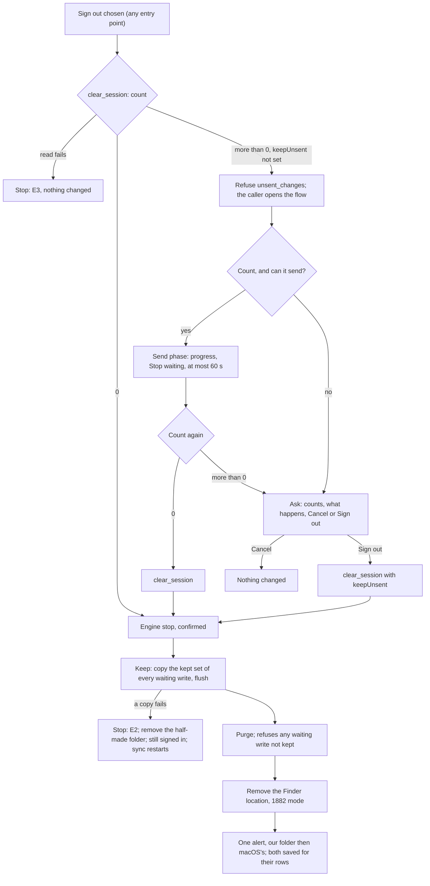

# 2026-10-10 — macOS: a sign-out never loses a Finder save that is still waiting

**Status:** design (task 1887, P0), written before the code. The lead reviews it before anyone implements it.
**Date:** 10 Oct 2026
**Repo:** desktop. macOS only; Windows and Linux do not have this loss (§10).
**Task:** 1887. It gates the release of task 1873: 1873 may merge, but it is not released until this ships.
**Amended 2026-10-10 (amend 1):** the lead accepted the kept folder's location ([1887-location], §7.1) and answered the
open question with a 1873 ruling ([staging-durable]): staged copies move out of `Library/Caches` before 1873 releases.
§1, §2, §7.1, §7.2, §8, §12, §13.1 and §15 change. Old text is struck and kept, and the new text is signed beneath it.
**Read at:**
- `main:` = desktop `main` at `8f7e91e` (task 1882 merged);
- `1873:` = the 1873 branch at `c4a24f9` (round 4, still being implemented; read only);
- `A:` = spec A's branch at `90ee66a` (the Finder setup reconciler; read only).

Paths are short: `lib.rs`, `state_db.rs`, `engine_bridge.rs`, `ipc_socket.rs`, `runner.rs`, `link_health.rs`,
`finder_removal.rs` and `staged_payload.rs` live in `src-tauri/src/`; `.tsx`/`.ts` files live in `src/`.

**Builds on:**
- the 1873 spec, `docs/specs/2026-10-09-macos-finder-write-versions.md` on the 1873 branch (cited `1873 spec §…`);
- spec A, `docs/specs/2026-10-06-macos-finder-setup-reconciler.md` (cited `spec A §…`);
- the 1882 spec, `docs/specs/2026-10-09-macos-removal-keeps-unsynced-files.md` (cited `1882 §…`).

**Unverified** marks a claim that no source or run here establishes. Each one has a device step (§13.4) or an open question (§15).

## 1. Why

Once 1873 ships, a save in the Finder location is finished for macOS as soon as the app has queued it: the extension
replies `WriteQueued` and macOS counts the item as synced (1882 §3, "A limit this fix does not change"). The bytes then
live in one place only: the daemon's staged copy of the write, ~~under the app's cache directory
(`1873:engine_bridge.rs:5264-5281`, `…/beebeeb/finder-writes/<uuid>`).~~ in the app's container. At `1873:` that is the
cache directory (`1873:engine_bridge.rs:5264-5281`, `dirs::cache_dir()/beebeeb/finder-writes/<uuid>`). Before 1873
releases it is `dirs::data_dir()/beebeeb/finder-writes/<uuid>`, under `Library/Application Support` (ruling
[staging-durable], §7.1).
— lead ruling, 2026-10-10 ([staging-durable])

A sign-out by choice then:

1. purges every queued operation and its staged copy (`purge_all_local_state`, `1873:state_db.rs:3875`, reading the
   payload paths at `:3897`; the files are deleted by `purge_local_state_files`, `1873:lib.rs:2480`);
2. removes the Finder location. 1882's preserving mode keeps what macOS still holds as not synced, and a queued save is
   not that (1882 §3).

The save is then neither on the server nor on this Mac. The 1873 spec names this as the one exception to "nothing a person
saved is lost" and hands it to this task (`1873 spec §10.5`, lines 970-977; §5.4 row 15, line 343).

**What a person is told today.** Nothing that mentions unsent changes:

- Settings › Account asks "Sign out of this Mac?" / "Sync stops until you sign in again." (`main:MacSettings.tsx:422-430`);
- the compact window's Account page signs out on the click (`main:pages/Account.tsx:126-141`);
- the app menu's "Sign out" (⌘⇧L) signs out at once (`main:lib.rs:9842-9851`).

Spec A computes a count for the account switch (`A:state_db.rs:2893`, `pending_changes_count`), but no surface shows it yet
(no use of `account_mismatch` under `src/` at `A:`), and a plain sign-out has none. The lead's reading ("a plain sign-out
does not show a count") is right.

## 2. Words used here

| Word | Meaning, in the code's terms |
| --- | --- |
| **Waiting write** | An `upload_file` or `upload_version` op in `operation_queue` whose upload has no recorded completion: no `upload_resume` row with `completed_version` set (`1873 spec §8.6` rule 1, line 734; column at `1873:state_db.rs:1646`). On macOS every such op is a Finder write: it carries a `write_id`, minted at the accept or given at engine start to an op an earlier build queued (`1873 spec §5.2`, §10.2) |
| **Waiting file** | A file (`file_id`) with at least one waiting write. **The ask counts files, not writes** (§3, W2) |
| **Other waiting change** | An op of kind `create_folder`, `rename_file`, `move_file`, `trash_file`, `restore_file` or `restore_version` (`1873:state_db.rs` `OperationKind`). `hydrate_file` and `pin_tree` are downloads, not changes the person made, and are never counted |
| **Waiting change** | A waiting file, or one other waiting change. The unit of the progress line |
| **Live** | Not parked (`attempts < max_attempts`; a park sets `attempts = max_attempts`, `1873:state_db.rs:986`) and not paused (`paused_reason IS NULL`). A successor waiting on its predecessor or on a snapshot is live |
| **Staged copy** | A waiting write's `payload_path`: the daemon's own copy (`1873:engine_bridge.rs:5264-5281`). It is an absolute path, so a copy staged before [staging-durable] still points into `Library/Caches`, and a later one into `Library/Application Support` (§7.1; amend 1). Not the App Group `upload-staging` hand-over copies (`1873:ipc_socket.rs:686`, `:702-706`), see §8 |
| **Missing** | A waiting file whose newest waiting write's staged copy does not exist (`metadata()` is `NotFound`, the test 1873 uses for `payload_missing`, `1873 spec §8.4` line 676) |
| **Kept folder** | The folder this spec makes for waiting writes (§7) |
| **macOS's folder** | The folder macOS reports when 1882's preserving removal kept files (1882 §4) |

## 3. Rulings and rules

**The lead's rulings for 1887** (10 Oct 2026), restated:

1. Nothing waiting is ever discarded silently. Every path that purges the queue on a sign-out by choice follows rules 2-4.
   Lock keeps the queue and is out of scope; so is a session the server revoked (spec A R8 keeps the queue).
2. Send first, bounded: when writes wait and the server is reachable, the sign-out first tries to send them, with visible
   progress and a way to stop waiting. The bound is a number.
3. Then ask, with the real count, before anything is purged: the count, what happens, Cancel and Sign out. The count comes
   from the queue at that moment; a count of 0 is never shown while a write waits.
4. Kept, not lost: on "Sign out" with writes still waiting, each waiting write's newest bytes (its staged copy) are copied
   into a kept folder before the purge, surfaced as 1882 surfaces a kept folder, with its own sentences. A failed copy
   stops the sign-out; no write is purged that could not be kept.
5. Windows and Linux: state whether the loss exists there; design for them only if it does.

**The rules this spec makes of them.** Each one is testable; §13 names the tests.

- **W1, no silent discard.** On every entry point in §4, no code deletes a waiting write's queue row or staged copy
  unless the person was asked (W4) and the write was kept (W6). An other waiting change is deleted only after the person
  was asked. Spec A's R10 reset (§4, row 8) keeps without asking (W12).
- **W2, one count, never 0.** Every number a person sees comes from one function, `waiting_changes`, read in one
  `StateDb` call (the `1873 spec §8.7` S1 style: one mutex hold, one transaction). The ask counts **waiting files** and
  **other waiting changes**; the progress line counts **waiting changes**. A sentence whose number would be 0 is left out.
  A phase whose number reaches 0 ends before it can render it. A failed read is never a 0: it stops the flow (E3).
  - Why files and not writes: one upload per save (`1873 spec §8.2`), so an autosaving editor queues dozens of writes
    for one document. "24 changes" for one document helps nobody. The kept folder holds one file per file (§7.2), so
    the number a person reads is the number of files they will find.
- **W3, send first, bounded.** When changes wait and the app can send (§6.1), the sign-out first sends them, showing
  "Sending N changes before signing out…" and "Stop waiting", for at most **60 seconds** (`SIGN_OUT_SEND_LIMIT`, §6.3).
  A change is never sent under a session other than the one that made it.
- **W4, then ask.** If changes still wait when the send phase ends, or none could be sent, the person is asked before
  anything is purged, with the counts read at that moment (§11, A0-A5): Cancel, or Sign out. Cancel changes nothing.
- **W5, the gate.** `clear_session` reads `waiting_changes` before it changes anything. While changes wait, it refuses
  with the code `unsent_changes` unless the caller passes `keepUnsent: true` (the person chose "Sign out" at the ask). Every
  macOS caller answers the refusal by running the flow (§5.1). No entry point, present or future, can skip the ask.
- **W6, keep before purge.** After the engine stop is confirmed and before the purge, the kept set (§7.2) of every
  waiting write still in the queue is copied to a new kept folder, whatever the earlier counts said, and flushed to disk.
  The purge refuses to delete a waiting write that is not in the kept set or not counted as missing.
- **W7, missing copies.** A waiting file whose newest staged copy is already gone cannot be kept in full. The ask says so
  (A3) before the person chooses. A copy found missing only at the copy step is a failed copy (W8).
- **W8, a failed copy stops.** If any copy fails, the sign-out stops: the half-made kept folder is removed (it holds only
  copies of bytes still in the queue), nothing is purged, the person stays signed in, sync starts again, and the error says
  so (E2).
- **W9, surfaced like 1882.** A sign-out that kept files raises one alert that names the kept folder and the number of
  files in it, and saves the folder for its own row in Settings › Sync. When macOS also kept files, the same alert names
  both folders, ours first, and each has its own row (§9).
- **W10, the folder is the person's.** Beebeeb never moves, reads back, deletes or uploads the kept folder. No purge,
  sweep or reset can reach it. Logs never carry its path or a file name.
- **W11, the account switch.** The switch shows the ask in its own wording (A0s, A1s), never sends, and keeps (W6) on
  "Sign out and switch".
- **W12, spec A's R10 reset.** The reset that clears another account's local data before an engine starts (spec A §5.6) keeps
  (W6) without sending or asking, and surfaces the folder like 1882's app-start sweep.

## 4. Every path that purges the queue

The queue is emptied in bulk by `purge_all_local_state` only (`DELETE FROM operation_queue`, `1873:state_db.rs:3901`;
`A:state_db.rs:3084`). Its callers, and every way a person reaches them on macOS:

| # | Entry point | Where (`main:` unless marked) | Reaches the purge through | What 1887 does |
| --- | --- | --- | --- | --- |
| 1 | Settings › Account › "Sign out…", then the sheet's "Sign out" | `MacSettings.tsx:300-303` (handler), `:416` (button), `:422-430` (sheet); same lines at `A:` | `clear_session` (`lib.rs:2008-2014`; `A:lib.rs:3266-3277`; `1873:lib.rs:1941`) → `clear_session_impl` (`lib.rs:1670`; `A:lib.rs:2810`; `1873:lib.rs:1622`) | Runs the flow (§5.1) in this sheet |
| 2 | Compact window, Account page, "Sign out" | `pages/Account.tsx:126-141`, button `:333-336` | `clear_session` | On `unsent_changes`: opens Settings › Account and runs the flow there |
| 3 | Auth-expired banner, "Sign in again" | `AuthExpiredBanner.tsx:46` → `forceReauth`, `desktopApi.ts:1032-1035` (`clearSession`, then the sign-in window) | `clear_session` | Same as 2; when the sign-out completes, the sign-in window opens as before. Spec A's R8 replaces this path on macOS with a re-sign-in that never purges (spec A §10, line 301; `A:lib.rs:1360` `open_reauth_window`), but at `A:` the frontend still calls `forceReauth` |
| 4 | Version Center, "Sign in again" | `pages/VersionCenter.tsx:140` → `forceReauth` | `clear_session` | Same as 3 |
| 5 | App menu "Sign out" (⌘⇧L) | item `lib.rs:9494-9495`; handler `lib.rs:9842-9851` (`A:lib.rs:13696-13700`; `1873:lib.rs:9676`) | `clear_session_impl` directly | On `unsent_changes`: opens Settings › Account and runs the flow; never the "Sign-out paused" error dialog |
| 6 | Account switch: signing in as another account (spec A R8) | Rust only at `A:`: `desktop_login` / `desktop_login_2fa` return `account_mismatch` (`A:lib.rs:1677-1681`, `:1875-1881`, from `:5094`), the browser sign-in emits it (`A:browser_login.rs:495-502`); "Sign out and switch" = `clear_session` with `forget_email` (`A:lib.rs:2818`) | `clear_session` | The switch warning is the ask (W11). `pending_changes_count` (`A:lib.rs:4726`, `A:state_db.rs:2893`) is replaced by `waiting_changes` |
| 7 | An already-signed-out sign-out (no session, but data left, e.g. after a startup 401 that kept it, spec A R2) | `clear_session_impl` purges on both paths (`lib.rs:1685-1695` and the purge at `:1866-1890`; `A:lib.rs:3032`) | `clear_session_impl` | Covered by the gate (W5): the flow cannot send (§6.1, `session`), so it asks |
| 8 | R10 reset before an engine starts (spec A §5.6) | `A:account_binding.rs:155`, reset arm `:182`; `StateDbLocalData::reset`, `A:lib.rs:5752` → `purge_local_state_files_in`, `A:lib.rs:4071` | the purge directly | Keeps, no send, no ask (W12) |

**Not purges of waiting writes, and unchanged:**

- **Lock** keeps the queue and the staged copies. Its engine stop empties only the App Group `upload-staging` directory
  (`1873:lib.rs:2039`, `:2060`, `:2108`), which holds hand-over copies of requests not yet accepted (§8, item 9).
- **A same-account re-sign-in (spec A R8)** never purges (spec A §13.1, "a re-sign-in never purges the queue").
- **Repair** keeps the queue (`pending_operations_preserved`, 1882 §3).
- **Revoked shared content** deletes the ops of `shared_with_me` files only (`A:state_db.rs:2559-2585`). Shared items take no
  Finder writes today (`1873 spec §12`, task 1701).

## 5. The flow, in order

Count → send → ask → copy → purge → remove the Finder location. Steps 1-3 change nothing on this Mac. Steps 4-9 are
`clear_session_impl`.



### 5.1 Before anything changes (the flow)

The flow runs in one place: Settings › Account. Entry points 2-5 call `clear_session` as today. When the answer is
`unsent_changes`, they open Settings on the Account tab and start the flow there. Entry point 1 starts it in its own
sheet after the person confirms "Sign out". Entry point 6 shows the ask (switch wording) in the sign-in window, with no send
phase. One flow runs at a time; a second request brings Settings to the front.

1. **Count.** `waiting_changes` → `{ files, others, missing, live, can_send, not_sending }` (§6.1). A failed read stops the
   flow with E3.
2. **Send** (only when `can_send`): §6. When the phase ends, count again.
3. **Ask** (only when the count is not 0): §11, A0-A5. "Cancel" ends the flow; nothing changed. "Sign out" calls
   `clear_session` with `keepUnsent: true` (and `forgetEmail` for the switch). A count of 0 after the send phase skips
   the ask and calls `clear_session` without `keepUnsent`.

### 5.2 Inside the sign-out

4. **Gate** (W5). First in `clear_session_impl`, before the switch forgets the email (`A:lib.rs:2818`), before
   `end_sessions_in_flight`, and before spec A's Finder removal (`A:lib.rs:2831`).
5. **Engine stop**, as today (`main:lib.rs:1723-1760`; `A:lib.rs:3122`, called at `:2891` and `:2914`). An unconfirmed
   stop refuses as today; nothing is copied or purged. After a confirmed stop no IPC listener and no runner exist
   (`1873:lib.rs:1881-1886`), so the queue cannot change until the purge.
6. **Keep** (W6, §7). Reads the queue once, copies the kept set, flushes, and hands the purge the set of op ids it kept
   (plus those counted missing).
7. **Purge**, as today, with one guard: inside its transaction, `purge_all_local_state` re-reads the waiting writes and
   rolls back if any of them is neither kept nor missing. With the engine stopped this cannot happen; if it ever does, it
   is a failed copy (W8).
8. **Remove the Finder location**, 1882 mode.
9. **Keychain clear and the rest**, as today. The result and the failure both carry the kept folder and its file count,
   next to 1882's `preserved_location`, so a sign-out that fails after step 6 still surfaces the folder (as 1882 review I1
   does for macOS's folder).

**Where the Finder removal sits differs by tree, and both keep every write.**

| Step | `main` (and the 1873 branch, which predates 1882) | With spec A |
| --- | --- | --- |
| Remove the Finder location | Last: after the purge (`main:lib.rs:1906`; `1873:lib.rs:1817`) | First: the reconciler removes it before the engine stops (`A:lib.rs:2831`, spec A §5.3 (5), line 118) |
| Engine stop → keep → purge | Adjacent, in that order | Adjacent, in that order |
| A failed purge | Logged, and the sign-out goes on (`main:lib.rs:1878-1880`) | Stops the sign-out (`A:lib.rs:3214-3252`, spec A §5.6) |

The order this task was given (removal last) is `main`'s. Spec A puts the removal first so no check can start an engine while the keys
are cleared; this spec does not move it. What must hold in both is **stop → keep → purge with nothing between them**:

- **Removal last (`main`).** A Finder write either reached the queue before the stop (it is kept), or its request failed
  at the stop. Then the extension never replied `WriteQueued`, macOS still holds the item as not synced, and the later
  preserving removal keeps it in macOS's folder.
- **Removal first (spec A).** A write in flight at the removal either reaches the queue before the stop (it is kept), or
  it was not synced when the domain was removed, and macOS's folder keeps it.

A source pin checks the adjacency, not the removal's position (U10).

### 5.3 What each step does on failure

| Step | Failure | The person sees | State afterwards |
| --- | --- | --- | --- |
| 1. Count | Read fails | E3 (a toast in Settings; the dialog for the menu) | Nothing changed |
| 2. Send | Ends early: link lost, session refused, engine stopped, everything on hold, time limit, "Stop waiting" | The ask, with one reason line (A5) | Nothing changed, except changes that landed |
| 3. Ask | "Cancel" | The sheet closes | Nothing changed |
| 4. Gate | Read fails | E3 | Nothing changed |
| 4. Gate | Changes wait, no `keepUnsent` | The flow starts (§5.1) | Nothing changed |
| (spec A) Removal first | Not confirmed | Spec A's warning, `finder_removal_unconfirmed` | As spec A |
| 5. Engine stop | Not confirmed | Today's message (`UNCONFIRMED_ENGINE_STOP_ERROR`) | Keys in memory; nothing copied or purged |
| 6. Keep | A copy, a flush or the folder creation fails; or a staged copy vanished since the count | E2 | Half-made folder removed; queue and staged copies intact; still signed in; sync restarts (below) |
| 7. Purge guard | A waiting write is neither kept nor missing | E2 | As for 6 |
| 7. Purge | Fails otherwise | As each tree does today | The kept folder exists, so it is surfaced (step 9) |
| 8. Removal (`main`) | Fails | Logged, as 1882 | — |
| 9. Keychain and the rest | Fails | The alert first, then the error | The kept folder is surfaced |

**Sync restarts after a failed keep.** The sign-out stopped the engine but kept the keys. With spec A, the existing
`FinderRestoreOnAbort` (`A:lib.rs:6201-6216`) tells the reconciler the keys are here; it puts Finder back and starts the
engine (spec A §5.6, line 176). On a tree without spec A, the sign-out restarts the engine from the session still in
memory, through `start_engine_if_possible` (`main:lib.rs:807`); the Finder location was never removed.

## 6. The send phase

### 6.1 When it runs

`waiting_changes` reports `can_send` when all of these hold, read at the start of the flow:

1. an engine runs for this account and the vault is unlocked;
2. the server accepts the session: `AuthHealth::is_expired()` is false (`main:runner.rs:80`);
3. the link monitor shows no failure since its last successful check (`LinkMonitor::snapshot`, `main:link_health.rs:240`);
4. sync is not paused (`acct.sync_paused`, `main:lib.rs:831`);
5. at least one waiting change is live.

Otherwise `not_sending` names the first one that failed: `engine_stopped`, `session`, `offline`, `paused`, `held`. The ask
shows its line (A5). The switch (entry 6) never sends: the session signing in belongs to another account, and a change is never
sent under a session other than the one that made it (W3).

### 6.2 What the runner does

- At the start, every live waiting change is made due now, once (`next_retry_at := now`; `attempts` unchanged). Parked and
  paused ops are not touched.
- While the phase runs, the runner's queue step (`process_due_operations`) runs again as soon as its last run ends, at
  most once a second, instead of once per 30 s tick (`TICK_INTERVAL`, `main:runner.rs:117`). The rest of the pass keeps its
  tick.
- A change that fails during the phase follows its normal backoff. So the phase costs each change at most one extra
  attempt and never parks a change by using up its attempts.
- When the phase ends, the runner goes back to its tick.

### 6.3 The bound: 60 seconds

`SIGN_OUT_SEND_LIMIT = 60 s`, from the start of the phase. One constant, read through an injected clock in the tests.

- **Long enough for the common case.** It is two of the runner's 30 s periods (`main:runner.rs:117`), and twice the API
  request timeout (`API_REQUEST_TIMEOUT_SECS = 30`, `main:link_health.rs:35`). One request that hangs to its timeout still
  leaves a full retry inside the limit. A document-sized save is sent well within it on an ordinary connection.
- **Short enough to be a pause, not a wait.** The person chose to sign out. A minute with a visible count and a
  "Stop waiting" button is the longest that still reads as finishing up; the hint says so ("This takes at most a minute.").
- **Nothing is lost when it runs out.** The ask follows, and its reason line (A5, `time_limit`) offers the alternative:
  "Choose Cancel to let it finish, then sign out again." The upload carries on after Cancel, because nothing was stopped.
- **Rejected: "while bytes are moving".** A limit that stretches with progress is not a number, cannot be stated to the
  person, and leaves a slow but moving 2 GB upload in front of them for many minutes.

### 6.4 How it ends

Checked at least once a second, and on every landing:

| End | When | Next |
| --- | --- | --- |
| `all_sent` | No change waits | `clear_session`, no ask |
| `held` | Changes wait, none is live | The ask, A5 `held` |
| `time_limit` | 60 s have passed | The ask, A5 `time_limit` |
| `stopped` | The person chose "Stop waiting" (or pressed Esc) | The ask, no reason line |
| `offline` | An attempt during the phase fails at the link level (`link_health::classify_error`, `main:link_health.rs:174`), or the link monitor records a failure. The first is needed because chunk requests do not reach the monitor (`main:link_health.rs`, "Known limit") | The ask, A5 `offline` |
| `session` | The server refuses the session | The ask, A5 `session` |
| `engine_stopped` | The engine stops (a Lock, a crash) | The ask, A5 `engine_stopped` |

The progress line re-reads the count at least once a second and changes when it changes. It never shows 0: the phase
ends first.

One `info` line when the phase ends: `sign-out send phase ended`, with `reason`, `changes_at_start`, `changes_left` and
`elapsed_ms`. Counts only, no names.

## 7. The kept folder

### 7.1 Where it is

```
<the app's container>/Data/Documents/Changes not sent/<YYYY-MM-DD> at <HH.MM.SS>/<the file's path in the vault>
```

On a Mac, the app's container is `/Users/<name>/Library/Containers/io.beebeeb.app`, so a kept file looks like
`/Users/<name>/Library/Containers/io.beebeeb.app/Data/Documents/Changes not sent/2026-10-10 at 14.05.12/Work/report.docx`.

- The folder is the sandboxed app's `Documents` directory (`dirs::document_dir()` under the sandbox's home). Tests pass a
  temporary root instead.
- The date and time are local, at the start of the keep step, in the style macOS uses for screenshots (dots, not colons,
  which Finder shows as slashes). If the folder exists, " (2)", " (3)" and so on are added.
- The folder is made only when at least one file is copied.
- The path shown to the person is absolute, never `~`, because `~` inside the sandbox is the container.

**Why a sandboxed app can write it, and a person can find it.**

- **Writable.** It is inside the app's own container. There, `Data/Documents` is a real directory, mode `0700`,
  owned by the user (checked with `ls -la` on the QA Mac). `Downloads`, `Desktop` and the others there are symbolic
  links out of the container, and those need entitlements the app does not have (`src-tauri/entitlements.plist:38-49`:
  sandbox, app group, user-selected files, network).
- ~~**On the same volume as the staged copies** (`Data/Library/Caches/beebeeb/finder-writes`). `std::fs::copy` on macOS first
  tries an APFS clone (`fclonefileat`), as `1873:staged_payload.rs:118-119` notes. A clone uses no new data blocks, so a
  full disk rarely fails it.~~
  **On the same volume as the staged copies.** Ruling [staging-durable] (1873, before it releases) moves the staged copies
  to `dirs::data_dir()/beebeeb/finder-writes`, which is `Data/Library/Application Support/beebeeb/finder-writes` in the
  container, excluded from backup and mode `0700`.
  - The ruling drops the temp-directory fallback: if that root is not writable, the accept fails, so macOS keeps the item
    as not synced.
  - Old journal rows keep their absolute paths under `Data/Library/Caches/beebeeb/finder-writes`, and the orphan purge
    scans both roots.
  - All three places are in the same container: Application Support, the old Caches root and `Data/Documents`. So the
    copy is on one volume whichever root a write's staged copy is in. `std::fs::copy` on macOS first tries an APFS clone
    (`fclonefileat`), as `1873:staged_payload.rs:118-119` notes, and a clone uses no new data blocks, so a full disk
    rarely fails it.
  - The keep step copies from the op's stored `payload_path` as it is. It never rebuilds the path from the current root
    (U27).
  — lead ruling, 2026-10-10 ([staging-durable])
- **Out of reach of every purge.** It is under none of the roots the sign-out purge may delete (`disposable_cache_roots`:
  the temp directory, the cache directory, the hydrate cache, `1873:lib.rs:2402-2426`), and it is never written to the
  `staged_payloads` journal, which the engine-start repair sweeps (`1873:state_db.rs:4386`). U12 pins both.
  Under [staging-durable] the purge also has to delete staged copies under the new root, so its roots grow by that root.
  `Data/Documents` is under neither staging root, and U12 checks the kept root against every root the purge accepts,
  whatever that list is. — lead ruling, 2026-10-10 ([staging-durable])
- **Findable.** The alert and the Settings › Sync row show the full path in mono (1882 §5). The row also has
  **"Show in Finder"**, which reveals the event folder. 1882 left that button out because macOS's folder is outside the
  container and no header says a sandboxed app may reveal such a path (1882 §5). This folder is inside the container, and
  the app already reveals a file in its own container: the support bundle in the state directory (`main:lib.rs:5542-5550`,
  revealed at `:5581`). **Unverified** on a sandboxed build for this folder; device step D2 checks it. If it does not work,
  the button is struck from this section and the path alone remains.

**Accepted.** The lead accepted this location as designed. "Show in Finder" stays a device step (D2).
— lead ruling, 2026-10-10 ([1887-location])
- **It outlives the app.** macOS does not remove a container when the app is deleted. **Unverified**, as the 1873 spec
  also says (`1873 spec §10.4`).

**Rejected:**

- **`~/Downloads`.** Easy to find, but it needs `com.apple.security.files.downloads.read-write`. That grants read and write
  to all of `~/Downloads`, and process execution there, for the app's whole life (`application.sb:290-294` in
  `/System/Library/Sandbox/Profiles`). It would permanently widen what a compromised Beebeeb could read, for a rare event.
- **A folder the person picks** (the existing user-selected entitlement). Least privilege, and easy to find. But it adds a
  step and new failures to every sign-out that keeps something, and it cannot run where there is no window (the R10 reset).
  The picker could also be pointed into the Finder location being removed. It is untested on macOS in this app:
  `pick_sync_root` refuses on macOS (`main:lib.rs:5067-5075`).
- **The App Group container.** The extension shares it, and has no business with these files.
- **Inside macOS's folder.** It is not ours to write, and it may not exist.

### 7.2 What is copied, and under which name

**The kept set, per waiting file:**

- the newest waiting write whose staged copy exists;
- plus every earlier waiting write of that file with `write_origin = earlier_build` whose staged copy exists.

Earlier writes that this build minted are not copied: the newest one contains their bytes. That is 1873's own argument
for the hand-over: when the newer save was made, the system held the older write's bytes, and nothing replaced them on disk
(`1873 spec §8.2`, line 661). An earlier-build write is the exception the 1873 spec names: a newer save may not contain it
(`1873 spec §8.4`, line 688).

**Names.** `kept_relative_path(file_path, role)`, a pure function:

- `file_path` is the row's vault path (`files.path`), for example `/Work/report.docx`. It is split on `/`, and empty
  components are dropped. The provisional row of a create that never landed has one too. The keep step reads it before the
  purge deletes that row (`1873:state_db.rs:3875` onward, the m-12 provisional rows).
- A component that is `.` or `..`, or holds a NUL, becomes `_`. A component longer than 255 bytes is cut at a character
  boundary, and the last component keeps its extension.
- The file's newest waiting write gets the plain name. Every other kept write of the file gets
  `<stem> (earlier save <N>)<.ext>`, with N = 1 for the next-newest kept write. A name that starts with a dot and has no
  other dot has no extension (`.env (earlier save 1)`).
- Two kept writes that map to the same path get " (2)", " (3)" before the extension.
- A row with no path (a bug) gets `Unnamed <first 8 characters of the op id>`.

**How.**

- Each copy is `std::fs::copy` from the staged copy, then `sync_all` on the new file.
- Every directory the step made is fsynced before the purge starts.
- Modification times come from the copy (the staged copy's own).
- Kept files are the person's, so they are backed up.
  - A clone has "its own copy of attributes and extended attributes which are identical to those of" the source
    (`man 2 clonefile`).
  - Today the backup exclusion is set on a staging directory, not on its files (`macos_exclude_from_backups`,
    `1873:ipc_socket.rs:523-551`), so a copy carries none.
  - If a staged file itself ever carries `com.apple.metadata:com_apple_backup_excludeItem`, the keep step removes that
    attribute from the copy.
  — lead ruling, 2026-10-10 ([staging-durable]: the new root is excluded from backup)
- Nothing is read back, and nothing is decrypted: staged copies are plaintext on this Mac already.
- One `info` line: `kept unsent changes`, with `files`, `missing` and `kept` counts only. No path and no name (W10; the
  1873 spec §11 and 1882 §5 logging rules).

### 7.3 After the sign-out

- The folder is the person's. Beebeeb never moves, reads, deletes or uploads it (W10).
- "Dismiss" on the row forgets the folder; it does not delete it.
- The next sign-in, whatever the account, does not look at it.

## 8. With 1873: write tokens, claims, the hand-over and the release journal

1. **Write tokens and the held columns.** The keep step reads `operation_queue` and `files.path` only. It never reads or
   writes `held_*`. The purge clears them as the 1873 spec says (§5.4 row 15; `1873:state_db.rs:3962-3968`).
2. **A write mid-claim.** During the count and the send phase the runner claims ops. The count is one read, so it sees
   each op once whatever its claim. At the keep step the engine stop is confirmed, so no attempt runs. A `claim_id` left
   by an aborted attempt does not matter: the op is kept like any other, and the purge deletes it. Claims are cleared at
   the next engine start anyway (`1873 spec §8.7` S3, line 828).
3. **A completed upload whose local landing has not committed** (`upload_resume.completed_version` set, `1873 spec §8.6`
   rule 1). It reached the server: it is not counted and not kept. The next sign-in finds it on the server.
4. **A parked write and its successor.** Until the successor's claim retires the parked write (the hand-over,
   `1873 spec §8.4`), both are queued. Both count as one waiting file. The kept set copies the successor (the newest),
   which contains the parked write's bytes. A parked write from an earlier build is copied as well.
5. **After a hand-over.** The retired write's op is gone, and its payload is marked released in the journal
   (`1873:state_db.rs:1069`, `hand_over_conn`). It is not a waiting write and not a source: its bytes are in the
   successor.
6. **The release journal.** The keep step's sources are `operation_queue.payload_path` values only. A path marked
   released (`staged_payloads.completed = 1`) has no op, so it is never a source. Such a path is unlinked after a landing
   commit, or at the next engine start (`1873:state_db.rs:4362`, `:4386`). The keep step writes nothing to the journal.
7. **A copy the journal holds with no op** (`completed = 0`, no `payload_path` points at it). It exists only when the accept
   never committed: a crash between `track_staged_payload` and the enqueue (`1873:staged_payload.rs:27`), or a failed
   accept whose copy could not be compared and was retained (`1873:staged_payload.rs:80-91`). In both cases the extension
   never got `WriteQueued`. macOS still holds the item as not synced, and 1882's removal keeps it. It is not a waiting
   write. Spec A's switch count did include it (`A:state_db.rs:2890-2902`); `waiting_changes` does not.
8. **Successors waiting on a predecessor or a snapshot** (`after_write_id`, `base_pending`). They are queued, live, counted
   and kept like any waiting write. They may not resolve inside the send phase's limit; the ask then follows.
9. **`upload-staging` hand-over copies** (the App Group directory, `1873:ipc_socket.rs:686`). They are never a source. Each
   is a request the daemon has not accepted, deleted once it is answered (`1873:ipc_socket.rs:702-706`). The sign-out's
   engine stop and Lock empty that directory (`1873:lib.rs:1933`, `:2060`). The extension never got `WriteQueued` for
   them, so macOS still holds those items as not synced, and 1882's removal keeps them (§5.2).
10. **A staged copy that vanished before the sign-out** (a write parked `payload_missing`, `1873 spec §8.4`). It counts as
    missing (W7). ~~Whether macOS can purge an app container's `Library/Caches`, where these copies live, is open (§15).~~
    The question of macOS purging `Library/Caches` is answered by moving the copies out of it ([staging-durable], §7.1,
    §15). A copy can still go missing by other means, and W7 still covers it.
    — lead ruling, 2026-10-10 ([staging-durable])

## 9. With 1882: two folders from one sign-out

One sign-out can keep files in two places:

- **macOS's folder** holds what macOS still held as not synced at the removal: writes the extension never finished
  handing over (1882);
- **the kept folder** holds what was in the queue.

They hold different writes, except in one case. The 1873 spec presents a queued write with `isUploaded` false
(`1873 spec §9`, line 886). Whether `NSFileProviderDomainRemovalModePreserveDirtyUserData` also keeps such an item is not
stated in the header ("dirty corresponding user data", `NSFileProviderManager.h:20-31`, quoted in 1882 §2). **Unverified**;
D2 records it. If macOS keeps it, the same file appears in both folders, which loses nothing.

**Neither folder wins: both are shown.**

- **The alert** stays one alert per sign-out, titled "Files kept on this Mac" (1882's title, `main:finder_removal.rs:31`).
  - Its body is our paragraph (K1) when the kept folder exists, then a blank line, then 1882's body unchanged
    (`PRESERVED_FILES_SENTENCE`, a blank line, the path; `main:finder_removal.rs:375-382`) when macOS's folder exists.
  - Ours comes first because it is the folder the ask promised.
  - When only macOS kept files, the alert is byte for byte 1882's (U23).
- **The rows.** Settings › Sync shows one row per folder, ours first, each with its own sentence and "Dismiss":
  - ours: K2, the path in mono with wrapping, "Show in Finder", "Dismiss";
  - 1882's row is unchanged (`main:MacSettings.tsx:723-732`).
- **The records.** 1882 saves macOS's folder as `kept_unsynced_folder` (`main:config.rs:282`).
  - The kept folder gets its own key, `kept_unsent_folder`, with 1882's rules: a newer folder replaces an older one;
    "Dismiss" clears only the folder the row showed and returns `{ cleared, current }`; the write is one load-change-save
    under the config-write lock; no settings save can clear it (`main:finder_removal.rs:309-372`).
  - Saving one key never touches the other (U22).
  - "Show in Finder" (`show_kept_unsent_folder(path)`) reveals a path only when it equals the saved record. The webview
    cannot have the app reveal any other path.
- **Where they are raised.** In the same two places 1882 raises its alert: the `clear_session` command and the menu
  handler. `surface_kept_folder` (`main:lib.rs:2042`) takes both folders. The R10 reset surfaces the way the app-start
  sweep does (spec A §5.3, line 126).

## 10. Windows and Linux

Neither has this loss, so neither changes.

- **Windows refuses to sign out while anything waits.** `windows_cf::signout::purge` calls `windows_signout_preflight`
  (`main:windows_cf/signout.rs:24`). That refuses while any op is queued, or any file is `uploading`, `conflict`, `error` or
  `trashing` (`main:state_db.rs:2769-2780`), with "Pending changes remain. Unlock, finish syncing and resolve failed changes
  before signing out." It deletes a file in the sync folder only while an exclusive handle proves it clean
  (`main:windows_cf/signout.rs:56-60`). Spec A keeps Windows fail-closed (R11 there).
- **Linux has no local write that only Beebeeb holds.**
  - Its FUSE view is mounted read-only (`MountOption::RO`, `main:linux_fuse/mod.rs:228`), and nothing outside the module
    calls `mount`.
  - The upload watcher runs on Windows only (`main:runner.rs:1157-1158`).
  - No client sends writes over the Linux socket (`1873:ipc_socket.rs:999-1001`).

  So the Linux queue never holds a write whose bytes exist only in Beebeeb's local state. Spec A's switch count on
  Linux comes from `waiting_changes` too, which on Linux can only report other changes.

## 11. Copy

All strings use the typographic apostrophe (’) and the single-character ellipsis (…). No provider name, no emoji, no "don’t
worry". Every string is one constant, mirrored in Rust and in `src/macSettingsModel.ts` where both sides need it, with a
test pinning the two equal (as 1882 does). `{n}` is never 0 (W2).

**Send phase (Settings sheet)**

| Id | Text |
| --- | --- |
| P0 | Title: "Sending changes first" |
| P1 | n = 1: "Sending 1 change before signing out…" · n > 1: "Sending {n} changes before signing out…" |
| P2 | "This takes at most a minute." |
| P3 | Button: "Stop waiting" (Esc does the same) |

**The ask**

| Id | Text |
| --- | --- |
| A0 | Title: "Sign out with changes not sent?" |
| A0s | Title (switch): "Switch accounts with changes not sent?" |
| A1s | First line (switch only): "These changes belong to the account that was signed in before." |
| A2 | Files (n ≥ 1). n = 1: "1 file you changed in Finder hasn’t reached the server. Before signing out, Beebeeb copies it to a folder on this Mac and shows you where." · n > 1: "{n} files you changed in Finder haven’t reached the server. Before signing out, Beebeeb copies them to a folder on this Mac and shows you where." The second sentence is left out when every one of them is missing (k = n, A3) |
| A3 | Missing (k ≥ 1). n = k = 1: "Beebeeb’s copy of that change is missing, so it can’t be kept." · k = 1, n > 1: "Beebeeb’s copy of the latest change to 1 of these files is missing, so that change can’t be kept." · k > 1: "Beebeeb’s copy of the latest change to {k} of these files is missing, so those changes can’t be kept." |
| A4 | Other changes (m ≥ 1). m = 1: "1 other change (a rename, move, deletion, new folder or restore) hasn’t reached the server{ either}. Signing out drops it, and the server keeps that item as it was." · m > 1: "{m} other changes (renames, moves, deletions, new folders or restores) haven’t reached the server{ either}. Signing out drops them, and the server keeps those items as they were." " either" only when A2 is shown |
| A5 | At most one reason line. `offline`: "This Mac can’t reach the server right now." · `session`: "The server no longer accepts this Mac’s sign-in." · `paused`: "Sync is paused." · `held`: "These are on hold after earlier failures." · `engine_stopped`: "Sync stopped before everything was sent." · `time_limit`: "Sending took longer than a minute. Choose Cancel to let it finish, then sign out again." · `stopped`: none. The switch shows no reason line |
| — | Buttons: "Cancel" · "Sign out" (red, as Dialog 3) · switch: "Cancel" · "Sign out and switch". Enter on open resolves to Cancel, Esc cancels (the destructive-Enter rule of `docs/specs/2026-10-02-macos-settings-dialogs.md`) |

**After the sign-out**

| Id | Text |
| --- | --- |
| K0 | Alert title: "Files kept on this Mac" (1882's) |
| K1 | Alert paragraph, n = files in the kept folder (≥ 1). n = 1: "1 file with changes that hadn’t reached the server was copied to this folder on this Mac:" · n > 1: "{n} files with changes that hadn’t reached the server were copied to this folder on this Mac:" then a blank line and the path |
| K2 | Row: "Changes that had not reached the server were copied to this folder:" then the path in mono; buttons "Show in Finder" and "Dismiss". No "your", as 1882's row (1882 §5, re-review D3): after a switch, another account reads it |
| K3 | Toast if "Show in Finder" fails: "Couldn’t show that folder in Finder" |

**Errors.** Each one is prefixed with its code, as Repair's `REPAIR_FAILED_AFTER_REMOVAL_CODE` is (`main:finder_removal.rs:16-28`).

| Id | Code | Text |
| --- | --- | --- |
| E1 | `unsent_changes` | "Some changes haven’t reached the server yet. Sign out from Settings › Account to send or keep them first." Shown only by a caller that does not know the code; every macOS caller does |
| E2 | `unsent_copy_failed` | "Beebeeb couldn’t copy the changes that haven’t reached the server, so it didn’t sign out. They’re still waiting to upload. Check that this Mac has free space, then try again." |
| E3 | `unsent_count_failed` | "Beebeeb couldn’t check for changes that haven’t reached the server, so it changed nothing. Try again. If it keeps happening, restart Beebeeb." |

The menu shows E2 and E3 in its existing dialog, titled "Sign-out paused". Settings shows them in its existing toast,
"Couldn’t sign out".

**Dialog 3 is amended first.** `docs/specs/2026-10-02-macos-settings-dialogs.md`, Dialog 3, gets the send phase and the
ask with this copy before the frontend change merges. The hifi drawing is a design follow-up, as it was for 1882.

## 12. Out of scope

- **Lock, a same-account re-sign-in, Repair** keep the queue (§4).
- **What a person is offered for a parked save** (task 1881). This spec keeps the bytes and says so; it does not resolve
  conflicts.
- ~~**Moving the staged copies out of `Library/Caches`.** That is 1873's design; see §15.~~
  **Moving the staged copies out of `Library/Caches`** is 1873's work, under its ruling [staging-durable]. This spec only
  has to work with both roots (§7.1, U27). — lead ruling, 2026-10-10 ([staging-durable])
- **A "Delete" for the kept folder.** "Dismiss" forgets it; the files are the person's.

## 13. Verification (written before the code)

Every new test is seen red before it passes, and its mutation is seen red on the intended assertion. Failure and pass
output go into the task's notes and QA evidence.

### 13.1 Rust

| # | Test (behaviour) | Mutation that must turn it red |
| --- | --- | --- |
| U1 | `waiting_changes_counts_files_and_other_changes_once`: two saves of one file, one create, one rename, one trash, one hydrate, one pin, and a completed upload of a third file → `files = 2`, `others = 2` | Count writes instead of files (`files = 3`); count `hydrate_file`/`pin_tree` (`others = 4`); drop the completion filter (`files = 3`) |
| U2 | `parked_and_paused_writes_are_waiting_but_not_live`: a parked write and a quota-paused write → `files = 2`, `live = 0`, `can_send = false`, `not_sending = held` | Leave parked ops out of the count (`files = 1`: a 0-while-waiting class bug) |
| U3 | `a_missing_staged_copy_counts_as_missing_never_as_nothing`: the newest staged copy deleted → `files = 1`, `missing = 1` | Count only existing copies (`files = 0`) |
| U4 | `waiting_changes_is_one_read`: a source pin. The function is one `StateDb` method, with one mutex hold and one transaction | Split it into two calls |
| U5 | `can_send_follows_each_condition`: a table of no engine, session expired, link failure, paused, nothing live, all good → `can_send` and `not_sending` | Drop any one condition (one row red) |
| U6 | `clear_session_refuses_while_changes_wait`: a queued Finder write, no `keepUnsent` → `Err` starting `unsent_changes:`. Queue, staged copy, keys, Keychain session and the email prefill are untouched; with spec A, the reconciler got no remove | Remove the gate (the sign-out completes, the queue is empty) |
| U7 | `the_gate_comes_before_anything_changes`: a source pin. In `clear_session_impl` the gate precedes `forget_last_signed_in_email`, `end_sessions_in_flight`, the reconciler's remove, the engine stop and the purge | Move the gate below the engine stop |
| U8 | `sign_out_keeps_the_kept_set_before_the_purge`: two minted saves of `/Work/report.docx`, a create `/New/notes.txt`, an earlier-build write of `/Old/a.txt` and a later save of it. With `keepUnsent` → the kept folder holds `Work/report.docx` (the newest save's sha256), `New/notes.txt`, `Old/a.txt` and `Old/a (earlier save 1).txt`, each sha256 equal to its staged copy; the queue is empty | Skip the copy; copy every minted save (an extra `report (earlier save 1).docx`); skip earlier-build writes (no `a (earlier save 1).txt`) |
| U9 | `a_write_that_arrives_after_the_count_is_kept_too`: the gate reads 0, then a write is enqueued before the engine stop → the sign-out completes and the kept folder has it | Keep only the ops the gate counted |
| U10 | `stop_keep_purge_are_adjacent`: a source pin. The engine stop, the keep step and the purge run in that order with no other statement between them, wherever the Finder removal is | Swap keep and purge; put the Keychain clear between keep and purge |
| U11 | `kept_names_follow_the_rule`: plain name; ` (earlier save N)` numbering; a dotfile; `.` and `..` → `_`; a NUL → `_`; a 300-byte name cut with its extension kept; a collision → ` (2)`; no path → `Unnamed …` | Each rule alone (one case red) |
| U12 | `the_kept_folder_is_out_of_every_purges_reach`: `is_disposable_cache_path(kept root)` is false, and the engine-start repair never lists a kept file. Amend 1: checked against every root the purge accepts, both staging roots included | Put the kept root under the cache directory, or under either staging root |
| U13 | `a_failed_copy_stops_the_sign_out`: an injected copier that fails on the second file → `Err` starting `unsent_copy_failed:`; the half-made folder is gone; queue and staged copies intact; keys in memory; the restart is requested (spec A: `KeysArrived`; without spec A: the engine start) | Ignore the copy error (the queue is purged); keep the half-made folder |
| U14 | `the_purge_refuses_a_waiting_write_that_was_not_kept`: an op inserted between keep and purge (test seam) → the purge rolls back, and the sign-out stops with E2 | Drop the guard |
| U15 | `completed_and_released_payloads_are_never_sources`: a completed upload, a released journal path and an orphan journal copy → none copied, none counted | Read sources from `staged_payloads` |
| U16 | `the_send_phase_ends_on_each_condition`: injected clock and state → `all_sent`, `held`, `stopped`, `offline` (from the monitor, and from an attempt's link failure alone), `session`, `engine_stopped`; `time_limit` at exactly 60 s and not at 59.9 s | A limit of 59 or 61 s; ignore `live` (no `held`); read only the monitor (the attempt-only case runs to the limit) |
| U17 | `the_send_phase_makes_live_changes_due_once`: a live write backing off for 10 min lands within the phase against a stub server; a write that keeps failing is attempted at most once more than its backoff allows, and never parks because of the phase | Do not reset `next_retry_at` (it never lands); reset it before every run (attempts burn) |
| U18 | `the_send_phase_never_touches_parked_or_paused_changes` | Reset `attempts` at the start |
| U19 | `the_switch_uses_the_same_count_and_keeps`: `account_mismatch` carries `files`/`others`/`missing` from `waiting_changes`; "Sign out and switch" passes `keepUnsent`; no send is started | Keep `pending_changes_count` (it counts the hydrate); start a send |
| U20 | `the_r10_reset_keeps_before_it_purges`: `StateDbLocalData::reset` with a queued write → kept folder, then purge; a failing copier → the reset fails and nothing is purged | Reset without the keep step |
| U21 | `the_menu_never_purges_a_waiting_write`: the menu handler with a waiting write → Settings is asked to open the flow; no "Sign-out paused" dialog; the queue is intact | Handle `unsent_changes` as an error |
| U22 | `kept_unsent_folder_follows_1882s_rules_and_its_own_key`: newer replaces older; dismiss clears only the shown folder and reports `{cleared, current}`; it survives a settings save; saving it never changes `kept_unsynced_folder`, and the reverse | Store both in one key |
| U23 | `one_alert_names_both_folders_ours_first`: ours only, macOS's only (byte for byte 1882's body), both (K1, a blank line, 1882's body) | Swap the order; change 1882's body |
| U24 | `no_count_string_renders_zero`: every builder (P1, A2, A3, A4, K1) returns nothing for 0 and singular text for 1 | Render "0 files" |
| U25 | `logs_never_carry_a_kept_path_or_name`: a log capture across a keeping sign-out holds no path component and no file name | Log the folder path |
| U26 | `show_in_finder_reveals_only_the_saved_folder`: any other path is refused | Reveal the given path |
| U27 | `the_keep_step_copies_from_either_staging_root` (amend 1, [staging-durable]). A sign-out is made while a pre-ruling journal row and its op still point into `Library/Caches/beebeeb/finder-writes`, and another write's staged copy is under `Application Support/beebeeb/finder-writes`. Both are kept, each sha256 equal to its source, and the purge then removes both sources | Rebuild the source path from the current staging root and the file name (the Caches copy is not found, and the sign-out stops with E2 instead of keeping it) |
| U28 | `kept_copies_carry_no_backup_exclusion` (amend 1): a staged file that carries `com.apple.metadata:com_apple_backup_excludeItem` → its kept copy does not | Copy the attributes as the clone leaves them |

### 13.2 Frontend (bun)

| # | Test | Mutation |
| --- | --- | --- |
| F1 | The Settings flow: confirm → progress (P1 follows the events, P3 present) → ask → "Sign out" calls `clear_session` with `keepUnsent: true`; "Cancel" calls nothing | Call `clear_session` with `keepUnsent` from the progress phase |
| F2 | The ask's copy, exact, for: files only, others only, both, missing, each reason, the switch; singular and plural | Drop " either" |
| F3 | Enter on open resolves to Cancel; Esc cancels; Esc in the progress phase is "Stop waiting" | Focus "Sign out" on open |
| F4 | The compact page, the banner and the Version Center open Settings › Account on `unsent_changes` and never call `clear_session` with `keepUnsent` themselves | Show the refusal as a toast |
| F5 | Settings › Sync renders both rows, ours first, each with its own Dismiss; ours has "Show in Finder"; neither row says "your" | Render one row |
| F6 | The TypeScript constants equal the Rust ones (P0-P3, A0-A5, K0-K3, E1-E3) | Change one character |
| F7 | A progress event with 0 never renders | Render the event as is |

### 13.3 Gates

- `cargo test --locked` in `src-tauri`, with each binary's `test result: ok. N passed; 0 failed` line;
- `bun test` with `N pass / 0 fail`;
- `bunx tsc --noEmit`, eslint, and no new clippy warnings against a `main` baseline;
- `src-tauri/Cargo.lock` and `bun.lock` unchanged (no new dependency).

### 13.4 Device rung

**Setup.**

- A signed QA build of `main` with 1873 and this fix (and spec A, if it has merged), against the local API with a test
  account.
- The API is started by the operator, who records its process id. It is stopped with `kill <that pid>`, never by name.
- Each test file is made in a scratch directory with `head -c 1048576 /dev/urandom`, and its sha256 is recorded there
  first.
- The file is then copied into the Finder location with Finder (drag) or `cp`; the evidence records which. Both reach
  `createItem`.
- "Before the next engine tick" means: start the sign-out within 5 s of the copy (the tick is 30 s).
- Evidence goes to `QA/1887/`: screenshots, the log lines (counts only), `ls -la` of the kept folder, and every
  `shasum -a 256` output.

| # | Step | Pass means |
| --- | --- | --- |
| D1 | **Server reachable.** Copy `d1.bin` in; sign out from Settings › Account within 5 s | The phase ran: the sending sheet ("Sending 1 change before signing out…") in a screenshot, or, if it was too quick to capture, the `sign-out send phase ended` line with `reason = all_sent`. The sign-out then completes with no ask; no K1 paragraph and no `Changes not sent/<this event>` folder; after signing in again, `d1.bin` is listed, and opening it (a download from the server) gives the recorded sha256 |
| D2 | **Server stopped.** Stop the API; copy `d2.bin` in; sign out within 5 s | No sending sheet, or one that ends within seconds (the link monitor may not have seen the stop yet; the first attempt then ends the phase); the ask reads A2 for 1 file plus A5 `offline`; "Sign out" → a `UserNotificationCenter` window titled "Files kept on this Mac" with K1 and a path; `shasum -a 256 "<path>/d2.bin"` equals the recorded sha256. After signing in again: the K2 row; record whether "Show in Finder" reveals the folder (if not, amend §7.1); "Dismiss" removes the row and leaves the folder. Record whether macOS's dated folder exists and whether it holds `d2.bin` (§9) |
| D3 | **Cancel keeps everything.** API stopped; copy `d3.bin` in; sign out; "Cancel" at the ask | Still signed in; `d3.bin` still in the Finder location; start the API; it reaches the server after its retry backoff (checked as in D1) |
| D4 | **The menu.** API stopped; copy `d4.bin` in; ⌘⇧L | Settings opens on Account with the ask; no "Sign-out paused" dialog; "Cancel" |
| D5 | **A failed copy.** API stopped; copy `d5.bin` in; `chmod 500` the container's `Documents/Changes not sent` (make it first if it does not exist); sign out; "Sign out" at the ask | E2 shown; still signed in; Finder location present (with spec A: back within one check); restore the mode and start the API → `d5.bin` reaches the server with its sha256 |
| D6 | **Several saves of one file.** API stopped; copy `d6.txt` in, then overwrite it in place twice (`cat` of two other scratch files into it, so each is a modify, not an editor's save-and-rename), recording each sha256; sign out | The ask counts 1 file; the kept folder holds one `d6.txt` with the third save's sha256 and no "(earlier save)" file |
| D7 | **The time limit** (only with a throttled link, e.g. Network Link Conditioner; otherwise U16 carries it). A file large enough to take more than a minute; sign out | The ask appears after about 60 s with A5 `time_limit`; "Cancel"; the upload finishes and reaches the server |

The lead's required rung is D1 and D2. D3-D6 are required for this task; D7 is optional, with its reason recorded if it
is skipped.

## 14. Docs that change with the code

- This spec, amended in place (struck text kept) if a device step changes it.
- `docs/specs/2026-10-02-macos-settings-dialogs.md`, Dialog 3: the send phase and the ask (§11), before the frontend merges.
- 1882 §3, "A limit this fix does not change": a line under it saying this spec closes the limit.
- The 1873 spec, §5.4 row 15 and §10.5 (m-12): once 1873 and this fix are both on `main`, queued saves are kept, not
  discarded.
- `CLAUDE.md` ("Current macOS integration state") and `docs/IPC_PROTOCOL.md` if the progress event is documented there.
- `RELEASE_NOTES.md` for the release that carries 1873: what a sign-out now does with unsent changes, with counted test
  results.

## 15. Open questions

None remain.

1. ~~**Can macOS empty an app container's `Library/Caches` under storage pressure?** 1873 keeps every waiting write's only
   copy there (`1873:engine_bridge.rs:5277-5281`: `dirs::cache_dir()/beebeeb/finder-writes`). No header or code read
   here settles it.~~
   - ~~If it can, a write's bytes can vanish before any sign-out. 1873 then parks the write `payload_missing`, and this
     spec can only report it as missing (W7).~~
   - ~~This spec does not depend on the answer.~~
   - ~~Owner: the lead, for 1873 or its follow-ups (1879). A staged-copy root under `Library/Application Support` would
     close it.~~

   **Answered by [staging-durable]:** before 1873 releases, staged copies live in
   `dirs::data_dir()/beebeeb/finder-writes`, excluded from backup and mode `0700`, with no temp-directory fallback. Old
   journal rows keep their Caches paths, and the orphan purge scans both roots. This spec's consequences are in §7.1,
   §7.2 and U27-U28.
   — lead ruling, 2026-10-10 ([staging-durable])
