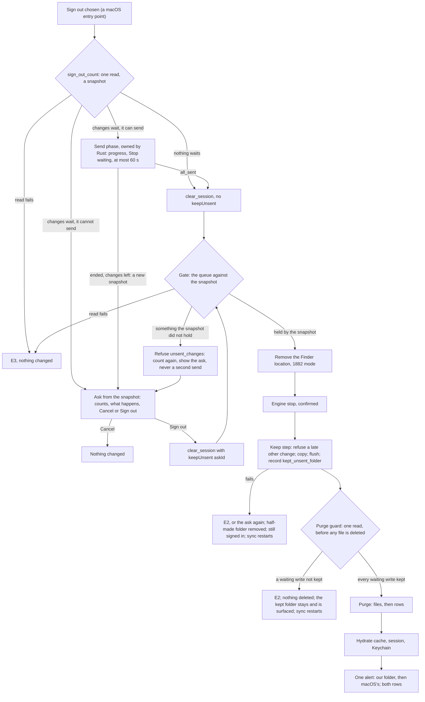
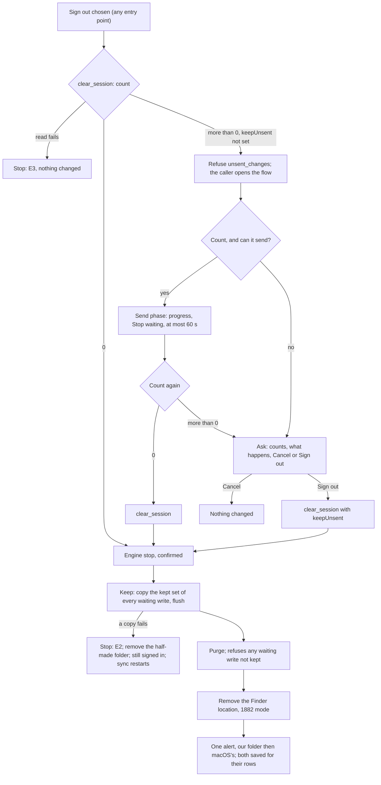

# 2026-10-10 — macOS: a sign-out never loses a Finder save that is still waiting

**Status:** design (task 1887, P0), written before the code. The lead reviews it before anyone implements it.
**Date:** 10 Oct 2026
**Repo:** desktop. macOS only; Windows and Linux do not have this loss (§10).
**Task:** 1887. It gates the release of task 1873: 1873 may merge, but it is not released until this ships.
**Amended 2026-10-10 (amend 1):** the lead accepted the kept folder's location ([1887-location], §7.1) and answered the
open question with a 1873 ruling ([staging-durable]): staged copies move out of `Library/Caches` before 1873 releases.
§1, §2, §7.1, §7.2, §8, §12, §13.1 and §15 change. Old text is struck and kept, and the new text is signed beneath it.
**Revised 2026-10-10 (revision 1):** the spec review (verdict Not ready: 1 Critical, 8 Important, 9 Minor) is answered
in place. Each changed rule keeps its old text struck (`~~…~~`), with the new text beneath it tagged by the finding it
answers, for example "(review C1)". The main changes:
- the purge guard moves before any file is deleted, and a completed keep step never deletes its folder (C1);
- the baseline is `main` with spec A merged, including its sign-in and account-switch screens (I1, M1);
- the gate is macOS only (I2);
- the ask is a snapshot the app holds, so the sign-out knows what the person was shown (I3);
- the kept folder is recorded before the purge (I4);
- copies never overwrite (I5);
- the Rust ↔ webview contract is named (I6);
- "Show in Finder" and the device steps can fail (I7, I8).

**Revised 2026-10-10 (revision 2):** the re-review of revision 1 (17 of 18 findings addressed, I6 still open for a
window close, ten Minors N1-N10, one out-of-scope note on U10) is answered in place, marked the same way: old text
struck, new text beneath, tagged "(re-review I6)", "(re-review N3)" and so on. The main changes:
- closing the Settings window ends the flow. On macOS a close hides that window and never destroys it, so the phase now
  ends on `CloseRequested`, the window's ask snapshot is dropped, and the sheet resets (I6; U34, F11, D10);
- the keep step uses the snapshot the gate accepted, by value, never a newer one (N3);
- A2's copy sentence follows the number of files that have a copy (N1);
- no name can fail a sign-out any more: a file and a directory that collide, in either order, and a path too long for
  macOS each get a free name (N4);
- a purge failure after the keep step leaves every waiting write's staged copy in place, unless it fails on one of
  those copies itself, and the next ask names the folder that sign-out made (N8);
- U10 names what may run between the engine stop, the keep step and the purge (the out-of-scope note);
- the tests, the device steps and one citation are fixed where they could pass without proving anything (N2, N5, N6,
  N7, N9, N10).

**Revised 2026-10-10 (revision 3):** the second re-review (verdict Ready, seven Minors Q1-Q7) is answered in place,
tagged "(re-review 2 Q1)" and so on: the device steps read the app's lines from its stdout file (Q1); the path-length
bound is exact, 1024 bytes and up (Q2); U34 and U10 pin what they claim (Q3, Q4); U12's first core takes `data_dir`
(Q5); D10b proves a close without the proxy (Q6); and a sign-out that fails after its window closed is shown in a
dialog (Q7).

**Revised 2026-10-10 (revision 4):** the two review threads on PR #121 (lead ruling [1887-pr121]) are answered in
place, tagged "(PR #121 review 1)" and "(PR #121 review 2)", old text struck:
- **Review 1.** The "sign-out was interrupted after keeping" marker, `kept_unsent_unfinished`, is saved by the keep
  step before the purge's first deletion, durably, and cleared only by a purge that cleared the rows. Before, it was
  saved only when `clear_session_impl` returned `Err`, so a crash or a power loss left nothing. It is now a list a later
  keep adds to and never replaces, so the ask names every folder (`earlierFolders`). W9, W13, §5.2 steps 7 and 10, §5.3,
  §7.3, §9, A3e, U30, U39, new U42 and U43.
- **Review 2.** A sign-out result that came back before its window closed stays pending until that window
  acknowledges it, and a close, a reload or a destroy of that window shows it in the native dialog. Before, tracking
  stopped when the call returned, so a result could be shown nowhere. §5.1 "A late result", the contract, F11, new U44
  and F12.

~~**Read at:**~~
~~- `main:` = desktop `main` at `8f7e91e` (task 1882 merged);~~
~~- `1873:` = the 1873 branch at `c4a24f9` (round 4, still being implemented; read only);~~
~~- `A:` = spec A's branch at `90ee66a` (the Finder setup reconciler; read only).~~

**Read at** (review M1):
- `main:` = desktop `main` at `af9b351`. Spec A merged there as `91a875f`, on top of 1882 (`8f7e91e`), so `main` now
  carries spec A's sign-out, its sign-in and account-switch screens, and 1882's kept folder.
- `1873:` = the 1873 branch at `75e0de9`, read through `git show` (its tree is being merged with `main`). Its sign-out
  and purge code is the same as at `c4a24f9`.
- `A:` is retired: spec A is on `main`, and a struck `A:` citation is now cited as `main:`. Citations in struck text
  keep their old trees.
- After this revision was read, the 1873 lane merged `main` into its branch as `b00adb5`. That merge carries `main`'s
  purge order (files first, then rows: `b00adb5:lib.rs:4183-4232`), so every `main:` purge citation here holds for it.
- Crates, read from the local registry: `tauri-plugin-opener` 2.5.4, `dirs` 6.0.0, `libc` 0.2.189 (the version
  `src-tauri/Cargo.lock` pins).
- Revision 2 (re-review): `main` is still `af9b351`, read through `git show`. The 1873 branch's head is now `b00adb5`;
  this revision adds no `1873:` citation. The new `main:` citations are the window handling (`lib.rs`,
  `surfaces/policy.rs` and `surfaces/registry.rs` under `src-tauri/src/`, `src-tauri/tauri.conf.json`,
  `src-tauri/capabilities/default.json`) and the public CI (`.github/workflows/ci.yml`). Two macOS SDK headers were read
  on the authoring Mac: `sys/clonefile.h` and `sys/syslimits.h`.
- Revision 3 (re-review 2): the same `main` `af9b351`. Newly cited: `src-tauri/src/lifecycle_log.rs`, the sign-out
  dialogs and the no-parent alert note in `lib.rs`, and `tracing-subscriber` 0.3.23 (the version `Cargo.lock` pins)
  from the local registry.

Paths are short: `lib.rs`, `state_db.rs`, `engine_bridge.rs`, `ipc_socket.rs`, `runner.rs`, `link_health.rs`,
`finder_removal.rs` and `staged_payload.rs` live in `src-tauri/src/`; `.tsx`/`.ts` files live in `src/`.

**Builds on:**
- the 1873 spec, `docs/specs/2026-10-09-macos-finder-write-versions.md` on the 1873 branch (cited `1873 spec §…`);
- spec A, `docs/specs/2026-10-06-macos-finder-setup-reconciler.md` (cited `spec A §…`);
- the 1882 spec, `docs/specs/2026-10-09-macos-removal-keeps-unsynced-files.md` (cited `1882 §…`).

**Unverified** marks a claim that no source or run here establishes. Each one has a device step (§13.4) or an open question (§15).

## 1. Why

Once 1873 ships, a save in the Finder location is finished for macOS as soon as the app has queued it: the extension
replies `WriteQueued` and macOS counts the item as synced (1882 §3, "A limit this fix does not change"). The bytes then
live in one place only: the daemon's staged copy of the write, ~~under the app's cache directory
(`1873:engine_bridge.rs:5264-5281`, `…/beebeeb/finder-writes/<uuid>`).~~ in the app's container. At `1873:` that is the
cache directory (`1873:engine_bridge.rs:5264-5281`, `dirs::cache_dir()/beebeeb/finder-writes/<uuid>`). Before 1873
releases it is `dirs::data_dir()/beebeeb/finder-writes/<uuid>`, under `Library/Application Support` (ruling
[staging-durable], §7.1).
— lead ruling, 2026-10-10 ([staging-durable])

A sign-out by choice then:

1. ~~purges every queued operation and its staged copy (`purge_all_local_state`, `1873:state_db.rs:3875`, reading the
   payload paths at `:3897`; the files are deleted by `purge_local_state_files`, `1873:lib.rs:2480`);~~
   deletes every staged copy, then every queued operation (review C1, M1). On `main`, `purge_local_state_files_as`
   (`main:lib.rs:4080-4128`) first collects every path the rows point at (`local_state_file_paths`,
   `main:state_db.rs:3028-3048`: every `operation_queue.payload_path` and every `staged_payloads.path`) plus every orphan
   in the staging directories (`orphan_staged_files`, `main:lib.rs:4055`, `:4094`). It unlinks them all
   (`main:lib.rs:4100-4119`), and only then calls `purge_all_local_state` (`main:lib.rs:4128`;
   `main:state_db.rs:3075`). The 1873 branch, which predates spec A, has the opposite order (`1873:lib.rs:2466-2491`);
   the merge carries `main`'s;
2. removes the Finder location. 1882's preserving mode keeps what macOS still holds as not synced, and a queued save is
   not that (1882 §3). ~~(After the purge.)~~ On `main` the removal runs first, before the engine stop
   (`main:lib.rs:2831`, spec A §5.3 (5)); the order does not change what it keeps (§5.2). (review M1)

The save is then neither on the server nor on this Mac. The 1873 spec names this as the one exception to "nothing a person
saved is lost" and hands it to this task (`1873 spec §10.5`, lines 970-977; §5.4 row 15, line 343).

**What a person is told today.** Nothing that mentions unsent changes:

- Settings › Account asks "Sign out of this Mac?" / "Sync stops until you sign in again." (~~`main:MacSettings.tsx:422-430`~~
  `main:MacSettings.tsx:466-475`, review M1);
- the compact window's Account page signs out on the click (~~`main:pages/Account.tsx:126-141`~~
  `main:pages/Account.tsx:149-170`, review M1);
- the app menu's "Sign out" (⌘⇧L) signs out at once (~~`main:lib.rs:9842-9851`~~ `main:lib.rs:13696-13743`, review M1).

~~Spec A computes a count for the account switch (`A:state_db.rs:2893`, `pending_changes_count`), but no surface shows it yet
(no use of `account_mismatch` under `src/` at `A:`), and a plain sign-out has none. The lead's reading ("a plain sign-out
does not show a count") is right.~~

The account switch does show a count, and it promises the loss (review I1). Spec A's switch step
(`AccountSwitchStep`, `main:Onboarding.tsx:472-503`) renders `accountSwitchBody(pendingChanges)`. For one change or more
that says "Switching signs that account out of this Mac and removes it" / "…removes them"
(`main:accountSwitchCopy.ts:26-34`). The number is `pending_changes_count` (`main:state_db.rs:2893`), read once at sign-in
(`gather_local_facts`, `main:lib.rs:4801-4802`). That sentence becomes false the day this spec lands, and §11 replaces it on
macOS. A plain sign-out has no count anywhere, so the lead's reading ("a plain sign-out does not show a count") is right.

## 2. Words used here

| Word | Meaning, in the code's terms |
| --- | --- |
| **Waiting write** | An `upload_file` or `upload_version` op in `operation_queue` whose upload has no recorded completion: no `upload_resume` row with `completed_version` set (`1873 spec §8.6` rule 1, line 734; column at `1873:state_db.rs:1646`). On macOS every such op is a Finder write: it carries a `write_id`, minted at the accept or given at engine start to an op an earlier build queued (`1873 spec §5.2`, §10.2) |
| **Waiting file** | A file (`file_id`) with at least one waiting write. **The ask counts files, not writes** (§3, W2) |
| **Other waiting change** | An op of kind `create_folder`, `rename_file`, `move_file`, `trash_file`, `restore_file` or `restore_version` (`1873:state_db.rs` `OperationKind`). `hydrate_file` and `pin_tree` are downloads, not changes the person made, and are never counted |
| **Waiting change** | A waiting file, or one other waiting change. The unit of the progress line |
| **Live** | Not parked (`attempts < max_attempts`; a park sets `attempts = max_attempts`, `1873:state_db.rs:986`) and not paused (`paused_reason IS NULL`). A successor waiting on its predecessor or on a snapshot is live |
| **Staged copy** | A waiting write's `payload_path`: the daemon's own copy (`1873:engine_bridge.rs:5264-5281`). It is an absolute path, so a copy staged before [staging-durable] still points into `Library/Caches`, and a later one into `Library/Application Support` (§7.1; amend 1). Not the App Group `upload-staging` hand-over copies (`1873:ipc_socket.rs:686`, `:702-706`), see §8 |
| **Missing** | ~~A waiting file whose newest waiting write's staged copy does not exist (`metadata()` is `NotFound`, the test 1873 uses for `payload_missing`, `1873 spec §8.4` line 676)~~ A waiting write whose staged copy does not exist (`metadata()` is `NotFound`, the test 1873 uses for `payload_missing`, `1873 spec §8.4` line 676) and that is not covered. A **missing file** is a waiting file with at least one missing write. Missing is decided per write, so the sign-out can compare what the ask showed with what it finds (review I3) |
| **Copied** | Per waiting file: the newest waiting write whose staged copy exists; plus every waiting write of that file with `write_origin = earlier_build` whose staged copy exists (§7.2). (review C1) |
| **Covered** | A waiting write with `write_origin = minted` that is older than a copied write of the same `file_id`. The newer write holds its bytes (`1873 spec §8.2`, line 661), so a covered write counts as kept for W1, W6 and the purge guard. (review C1) |
| **Kept** | Copied or covered. (review C1) |
| **File with a copy** | A waiting file with at least one copied write, so the keep step puts a file for it in the kept folder. The ask counts these as `copiedFiles` (c), and A2's second sentence follows c (§11). A file can be missing and have a copy at once: an earlier-build write's copy is gone, a newer write's copy exists. (re-review N1) |
| **Ask snapshot** | ~~What one ask showed the person, held by the app (never by the webview) under an `ask_id`: the counts, the `file_id` of every waiting file, the op id of every other waiting change, and the op id of every missing write. Only the newest snapshot is valid; a newer count replaces it (§5.1). (review I3)~~ What one ask showed the person, held by the app (never by the webview) under an `ask_id`: the counts (`files`, `copiedFiles`, `others`, `missingFiles`), ~~the earlier folder A3e names~~ the earlier folders A3e names (§7.3; PR #121 review 1), the `file_id` of every waiting file, the op id of every other waiting change, the op id of every missing write, and its **owner**, the label of the window it was counted for. The app holds one; a newer count replaces it (§5.1). It leaves the store in three ways: the gate that accepts it takes it out and hands it, by value, to that sign-out's keep step (re-review N3); a close or reload of its owner window drops it (re-review I6); a sign-out that completes empties the store (re-review N3). (review I3) |
| **Kept folder** | The folder this spec makes for waiting writes (§7) |
| **macOS's folder** | The folder macOS reports when 1882's preserving removal kept files (1882 §4) |

## 3. Rulings and rules

**The lead's rulings for 1887** (10 Oct 2026), restated:

1. Nothing waiting is ever discarded silently. Every path that purges the queue on a sign-out by choice follows rules 2-4.
   Lock keeps the queue and is out of scope; so is a session the server revoked (spec A R8 keeps the queue).
2. Send first, bounded: when writes wait and the server is reachable, the sign-out first tries to send them, with visible
   progress and a way to stop waiting. The bound is a number.
3. Then ask, with the real count, before anything is purged: the count, what happens, Cancel and Sign out. The count comes
   from the queue at that moment; a count of 0 is never shown while a write waits.
4. Kept, not lost: on "Sign out" with writes still waiting, each waiting write's newest bytes (its staged copy) are copied
   into a kept folder before the purge, surfaced as 1882 surfaces a kept folder, with its own sentences. A failed copy
   stops the sign-out; no write is purged that could not be kept.
5. Windows and Linux: state whether the loss exists there; design for them only if it does.

**The rules this spec makes of them.** Each one is testable; §13 names the tests.

- ~~**W1, no silent discard.** On every entry point in §4, no code deletes a waiting write's queue row or staged copy
  unless the person was asked (W4) and the write was kept (W6). An other waiting change is deleted only after the person
  was asked. Spec A's R10 reset (§4, row 8) keeps without asking (W12).~~
  **W1, no silent discard** (review M4). On every entry point in §4, no code deletes a waiting write's queue row or
  staged copy unless:
  - the write is kept (copied or covered, W6), or it is a missing write the ask showed (W7); and
  - the person was asked (W4), or the write arrived after the gate's count. Such a write is kept and counted in the
    alert (K1), and the person reads it there (U9).

  An other waiting change is deleted only when the ask the person answered counted it. One that arrives later stops the
  sign-out before anything is purged, and the ask is shown again (W6). Spec A's R10 reset (§4, row 8) is not a sign-out
  by choice and asks nobody (W12): it keeps writes as W6 does, and it drops other changes as it does today, with their
  count in its log line.
- **W2, one count, never 0.** Every number a person sees comes from one function, `waiting_changes`, read in one
  `StateDb` call (the `1873 spec §8.7` S1 style: one mutex hold, one transaction). The ask counts **waiting files** and
  **other waiting changes**; the progress line counts **waiting changes**. A sentence whose number would be 0 is left out.
  A phase whose number reaches 0 ends before it can render it. A failed read is never a 0: it stops the flow (E3).
  - Why files and not writes: one upload per save (`1873 spec §8.2`), so an autosaving editor queues dozens of writes
    for one document. "24 changes" for one document helps nobody. The kept folder holds one file per file (§7.2), so
    the number a person reads is the number of files they will find.
- **W3, send first, bounded.** When changes wait and the app can send (§6.1), the sign-out first sends them, showing
  "Sending N changes before signing out…" and "Stop waiting", for at most **60 seconds** (`SIGN_OUT_SEND_LIMIT`, §6.3).
  A change is never sent under a session other than the one that made it.
- **W4, then ask.** If changes still wait when the send phase ends, or none could be sent, the person is asked before
  anything is purged, with the counts read at that moment (§11, A0-A5): Cancel, or Sign out. Cancel changes nothing.
- ~~**W5, the gate.** `clear_session` reads `waiting_changes` before it changes anything. While changes wait, it refuses
  with the code `unsent_changes` unless the caller passes `keepUnsent: true` (the person chose "Sign out" at the ask). Every
  macOS caller answers the refusal by running the flow (§5.1). No entry point, present or future, can skip the ask.~~
  **W5, the gate** (review I2, I3). macOS only: the gate, `keepUnsent`, the flow commands, the callers' handling, the
  keep step and the purge guard are `#[cfg(target_os = "macos")]`. Windows and Linux keep today's sign-out, switch and
  count (§10, U32). On macOS, `clear_session` reads `waiting_changes` before it changes anything, and refuses with the
  code `unsent_changes` when:
  - changes wait and the caller passed no `keepUnsent`; or
  - the caller passed `keepUnsent: { askId }`, and `askId` is not the newest ask snapshot, or the queue now holds a
    waiting file, an other waiting change or a missing write that the snapshot did not hold.

  A newer write to a file the snapshot held does not refuse, so an autosaving editor cannot loop the ask. Every macOS
  caller answers the refusal by showing the ask again with a fresh count (§5.1), never with a toast. No entry point,
  present or future, can skip the ask.
- ~~**W6, keep before purge.** After the engine stop is confirmed and before the purge, the kept set (§7.2) of every
  waiting write still in the queue is copied to a new kept folder, whatever the earlier counts said, and flushed to disk.
  The purge refuses to delete a waiting write that is not in the kept set or not counted as missing.~~
  **W6, keep before purge** (review C1, I3, I4). After the engine stop is confirmed, the keep step reads the queue once.
  - **It refuses first.** It refuses with `unsent_changes`, before any copy, when an other waiting change is not in the
    ask snapshot (or, with no snapshot, when any other change waits).
  - **It copies.** It copies the copied set of every waiting write still in the queue (§7.2) into a new kept folder,
    whatever the earlier counts said. It flushes the files and directories, and records the folder (W9).
  - **It returns a `KeptSet`:** the op ids it copied, those covered, and those missing that the snapshot acknowledged.
  - **The purge guard.** The purge takes the `KeptSet`. Its first statement is one `StateDb` read that checks every
    waiting write is in the `KeptSet` and every other waiting change is acknowledged. If not, it refuses before it
    collects or deletes any path (§5.2, step 8).
  - **Which snapshot** (re-review N3). "The snapshot" in W6, W7 and §5.2 step 7 is the one the gate accepted and handed
    over by value (§5.2, step 4). The keep step never re-reads the store. Between the gate and the keep step the Finder
    removal and the engine stop take seconds, and another window can record a newer count then: Settings opening (F9),
    the switch's sign-in (U19) or a send phase ending. That count cannot change what this sign-out keeps, acknowledges or
    refuses.
- ~~**W7, missing copies.** A waiting file whose newest staged copy is already gone cannot be kept in full. The ask says so
  (A3) before the person chooses. A copy found missing only at the copy step is a failed copy (W8).~~
  **W7, missing copies** (review I3). A missing write cannot be kept. The ask says so (A3) before the person chooses, and
  the snapshot records the op id of each one shown. At the keep step:
  - a missing write the snapshot holds is acknowledged;
  - a write found missing that the snapshot does not hold is a failed keep (E2, W8), and nothing is purged;
  - a staged copy that disappears between the keep step's read and its copy is a failed copy (W8).
- ~~**W8, a failed copy stops.** If any copy fails, the sign-out stops: the half-made kept folder is removed (it holds only
  copies of bytes still in the queue), nothing is purged, the person stays signed in, sync starts again, and the error says
  so (E2).~~
  **W8, a failed keep stops; a finished keep stays** (review C1).
  - **A failed keep.** If the keep step fails (a refusal, a missing write not acknowledged, or a failed directory,
    copy, flush or record), the sign-out stops before the purge starts. The half-made kept folder is removed (it holds
    only copies of bytes still in the queue). Nothing is purged, the person stays signed in, sync starts again, and the
    error says so (E2), or the ask is shown again (`unsent_changes`).
  - **A finished keep.** Once the keep step has completed (every copy flushed, the folder recorded), nothing deletes
    the kept folder. A purge guard refusal, a purge failure or a later failure stops the sign-out with the folder kept,
    recorded and surfaced (alert and row).
- ~~**W9, surfaced like 1882.** A sign-out that kept files raises one alert that names the kept folder and the number of
  files in it, and saves the folder for its own row in Settings › Sync. When macOS also kept files, the same alert names
  both folders, ours first, and each has its own row (§9).~~
  **W9, recorded first, then surfaced like 1882** (review I4). The keep step's last act, after its flushes and before the
  purge, records the folder as `kept_unsent_folder` (only when it made one: the folder exists only when a file was
  copied, §7.1). It is one load-change-save under the config-write lock, as
  `remember_kept_folder` does (`main:finder_removal.rs:296-307`, `DesktopConfig::update_at`). A crash after that point
  still leaves the row. (PR #121 review 1) That same save also adds the folder to `kept_unsent_unfinished` (W13), and
  it is durable, which `update_at` is not today (§7.3). Once the sign-out returns, it raises one alert that names the kept folder and the number of
  files in it, and tells the windows the row changed. When macOS also kept files, the same alert names both folders,
  ours first, and each has its own row (§9).
- ~~**W10, the folder is the person's.** Beebeeb never moves, reads back, deletes or uploads the kept folder. No purge,
  sweep or reset can reach it. Logs never carry its path or a file name.~~
  **W10, the folder is the person's** (review M4). After the keep step completes, Beebeeb never moves, reads back,
  deletes or uploads the kept folder. Before then, only W8's failed keep may remove the half-made folder. No purge,
  sweep or reset can reach it. Logs never carry its path or a file name.
- ~~**W11, the account switch.** The switch shows the ask in its own wording (A0s, A1s), never sends, and keeps (W6) on
  "Sign out and switch".~~
  **W11, the account switch** (review I1). The switch step shows the ask in its own wording (§11, A0s-A4s). It renders
  the ask snapshot that `account_mismatch` carries on macOS. It never sends. "Sign out and switch" passes
  `keepUnsent: { askId }` and keeps (W6). On `unsent_changes` it renders the ask again with a fresh count, never the
  "Couldn’t sign out" toast.
- ~~**W12, spec A's R10 reset.** The reset that clears another account's local data before an engine starts (spec A §5.6) keeps
  (W6) without sending or asking, and surfaces the folder like 1882's app-start sweep.~~
  **W12, spec A's R10 reset** (review C1, I4, M4). The reset that clears another account's local data before an engine
  starts (spec A §5.6; `StateDbLocalData::reset`, `main:lib.rs:5752`) runs the keep step without sending or asking.
  - No engine runs then, so the queue cannot change.
  - Nobody can be asked, so its keep step counts every missing write and every other change as acknowledged. The
    missing bytes are already gone. The other changes are dropped, as today, with their count in its log line.
  - It records the folder (W9), and its purge runs the same guard (§5.2, step 8).
  - The folder is surfaced the way 1882's app-start sweep surfaces macOS's folder.
  - A failed keep fails the reset, and nothing is deleted. The engine then does not start, as spec A §5.6 already does
    for a failed reset.
- **W13, a sign-out that stops after its keep step** (re-review N8). A purge that fails after a completed keep step may
  already have removed some waiting writes' staged copies; then the kept folder holds their only copy (§5.3, row 8).
  - The purge removes a waiting write's staged copy only after every other file it removes is gone (§5.2, step 8). A
    failure on any other file leaves every waiting write as it was.
  - ~~When the sign-out stops after a completed keep step, it saves that folder as `kept_unsent_unfinished` (§7.3). The
    next ask names it (A3e) when that ask shows a missing write, because such a write's bytes may be in that folder.~~
  - ~~A sign-out that completes clears it.~~
  - **The marker is saved first** (PR #121 review 1). The keep step saves the folder in `kept_unsent_unfinished` as its
    last act, in the same durable save as `kept_unsent_folder` (§7.3). That is before the purge's first deletion, so a
    crash, a kill or a power loss at any later point leaves it set, with no `Err` return needed. Saved only when the
    sign-out returned `Err`, it was never written by a process that died: some waiting writes' staged copies could be
    gone, their rows still queued, the writes counted missing, no earlier folder named, and the ask would not say where
    their bytes were.
  - **A set marker means "a sign-out was interrupted after keeping".** The next count names its folders (A3e) when that
    ask shows a missing write, because such a write's bytes may be in one of them.
  - **A later keep never replaces it** (PR #121 review 1). It adds its own folder to the marker, which is a list
    (§7.3). A retry that replaced a single record would leave the older folder, possibly the only copy of a write,
    named nowhere.
  - **Only a purge that cleared the rows clears it.** After that no write can look missing (§7.3).

## 4. Every path that purges the queue

The queue is emptied in bulk by `purge_all_local_state` only (`DELETE FROM operation_queue`, `1873:state_db.rs:3901`;
~~`A:state_db.rs:3084`~~ `main:state_db.rs:3084`, review M1). Its callers, and every way a person reaches them on macOS:

| # | Entry point | Where (`main:` unless marked) | Reaches the purge through | What 1887 does |
| --- | --- | --- | --- | --- |
| ~~1~~ | ~~Settings › Account › "Sign out…", then the sheet's "Sign out"~~ | ~~`MacSettings.tsx:300-303` (handler), `:416` (button), `:422-430` (sheet); same lines at `A:`~~ | ~~`clear_session` (`lib.rs:2008-2014`; `A:lib.rs:3266-3277`; `1873:lib.rs:1941`) → `clear_session_impl` (`lib.rs:1670`; `A:lib.rs:2810`; `1873:lib.rs:1622`)~~ | ~~Runs the flow (§5.1) in this sheet~~ |
| ~~2~~ | ~~Compact window, Account page, "Sign out"~~ | ~~`pages/Account.tsx:126-141`, button `:333-336`~~ | ~~`clear_session`~~ | ~~On `unsent_changes`: opens Settings › Account and runs the flow there~~ |
| ~~3~~ | ~~Auth-expired banner, "Sign in again"~~ | ~~`AuthExpiredBanner.tsx:46` → `forceReauth`, `desktopApi.ts:1032-1035` (`clearSession`, then the sign-in window)~~ | ~~`clear_session`~~ | ~~Same as 2; when the sign-out completes, the sign-in window opens as before. Spec A's R8 replaces this path on macOS with a re-sign-in that never purges (spec A §10, line 301; `A:lib.rs:1360` `open_reauth_window`), but at `A:` the frontend still calls `forceReauth`~~ |
| ~~4~~ | ~~Version Center, "Sign in again"~~ | ~~`pages/VersionCenter.tsx:140` → `forceReauth`~~ | ~~`clear_session`~~ | ~~Same as 3~~ |
| ~~5~~ | ~~App menu "Sign out" (⌘⇧L)~~ | ~~item `lib.rs:9494-9495`; handler `lib.rs:9842-9851` (`A:lib.rs:13696-13700`; `1873:lib.rs:9676`)~~ | ~~`clear_session_impl` directly~~ | ~~On `unsent_changes`: opens Settings › Account and runs the flow; never the "Sign-out paused" error dialog~~ |
| ~~6~~ | ~~Account switch: signing in as another account (spec A R8)~~ | ~~Rust only at `A:`: `desktop_login` / `desktop_login_2fa` return `account_mismatch` (`A:lib.rs:1677-1681`, `:1875-1881`, from `:5094`), the browser sign-in emits it (`A:browser_login.rs:495-502`); "Sign out and switch" = `clear_session` with `forget_email` (`A:lib.rs:2818`)~~ | ~~`clear_session`~~ | ~~The switch warning is the ask (W11). `pending_changes_count` (`A:lib.rs:4726`, `A:state_db.rs:2893`) is replaced by `waiting_changes`~~ |
| ~~7~~ | ~~An already-signed-out sign-out (no session, but data left, e.g. after a startup 401 that kept it, spec A R2)~~ | ~~`clear_session_impl` purges on both paths (`lib.rs:1685-1695` and the purge at `:1866-1890`; `A:lib.rs:3032`)~~ | ~~`clear_session_impl`~~ | ~~Covered by the gate (W5): the flow cannot send (§6.1, `session`), so it asks~~ |
| ~~8~~ | ~~R10 reset before an engine starts (spec A §5.6)~~ | ~~`A:account_binding.rs:155`, reset arm `:182`; `StateDbLocalData::reset`, `A:lib.rs:5752` → `purge_local_state_files_in`, `A:lib.rs:4071`~~ | ~~the purge directly~~ | ~~Keeps, no send, no ask (W12)~~ |

The table above is struck as a whole: it was read before spec A's frontend reached `main` (review I1, M1). It stays
for the re-review. The table below replaces it.

**Re-baselined on `main` `af9b351`** (review I1, M1). Every row is macOS; Windows and Linux are unchanged (W5, §10).

| # | Entry point | Where (`main:`) | Reaches the purge through | What 1887 does |
| --- | --- | --- | --- | --- |
| 1 | Settings › Account › "Sign out…", then the sheet's "Sign out" | `MacSettings.tsx:319-326` (handler), `:460` (button), `:466-475` (sheet) | `clear_session` (`lib.rs:3266-3278`) → `clear_session_impl` (`lib.rs:2810`) | Runs the flow (§5.1) in this sheet |
| 2 | Compact window, Account page, "Sign out" | `pages/Account.tsx:149-170`, button `:367-370` | `clear_session` | On `unsent_changes`: opens Settings › Account with a flow request (§5.1) |
| 3 | Auth-expired banner, "Sign in again" | `AuthExpiredBanner.tsx:48` → `forceReauth`, `desktopApi.ts:1155-1170` | macOS: none directly. `forceReauth` checks the platform and on macOS calls only `open_reauth_window` (`desktopApi.ts:1162-1165`) | Nothing on its own. A different account signing in there reaches the purge only through row 6. Windows/Linux: unchanged (`clearSession`, then onboarding; I2) |
| 4 | Version Center, "Sign in again" | `pages/VersionCenter.tsx:141` → `forceReauth` | As row 3 | As row 3 |
| 5 | App menu "Sign out" (⌘⇧L) | item `lib.rs:13347-13352`; handler `lib.rs:13696-13743` | `clear_session_impl` directly | On `unsent_changes`: opens Settings › Account with a flow request (§5.1); never the "Sign-out paused" dialog for it |
| 6 | Account switch: another account signs in (spec A R8) | Routed by `afterSignIn` (`Onboarding.tsx:148-154`, `setStep('switch')`) from `account_mismatch`: `desktop_login` (`lib.rs:1677-1681`), `desktop_login_2fa` (`:1875-1881`), both from `:5094`; the browser sign-in emits it (`browser_login.rs:495-502`). The step: `AccountSwitchStep`, `Onboarding.tsx:472-503`, which calls `clearSession({ forgetEmail: true })` at `:481` and shows a "Couldn’t sign out" toast on `Err` at `:484`. Its copy: `accountSwitchCopy.ts:7-10`, `:26-34`. Its count: `gather_local_facts` → `pending_changes_count` (`lib.rs:4725-4732`, `state_db.rs:2893`) | `clear_session` with `forget_email` (`lib.rs:2818-2820`) | The step is the ask (W11): it renders the ask snapshot `account_mismatch` carries, passes `keepUnsent: { askId }`, and re-renders on `unsent_changes`. Drawn as dialog 4 of `design/hifi/macos-settings-dialogs.html` (line 147), amended first (§14) |
| 7 | An already-signed-out sign-out (no session, but data left, e.g. after a startup 401 that kept it, spec A R2) | `already_signed_out`, `lib.rs:2870-2874`; it stops any engine (`:2885-2898`) and reaches the same purge (`:3032`) | `clear_session_impl` | Covered by the gate (W5): the flow cannot send (§6.1, `session`), so it asks |
| 8 | R10 reset before an engine starts (spec A §5.6) | `bind_before_engine_start`, `account_binding.rs:155-187`, reset arm `:182-188`; `StateDbLocalData::reset`, `lib.rs:5752-5765` → `purge_local_state_files_in`, `lib.rs:4071` | The purge directly | Keeps, no send, no ask (W12); the guard takes its `KeptSet` too |

**Surfaces with no sign-out** (review M9). The tray menu has none: its items are "Open Beebeeb", "Hide", "Start at
login" and "Quit" (`build_tray_menu`, `main:lib.rs:13853-13876`). The menu-bar popover has none either: no sign-out
item or command in `main:src/popoverContract.ts`. `clear_session` is the only webview command that purges (review,
"What I checked and found sound").

**Not purges of waiting writes, and unchanged:**

- **Lock** keeps the queue and the staged copies. Its engine stop empties only the App Group `upload-staging` directory
  (`1873:lib.rs:2039`, `:2060`, `:2108`), which holds hand-over copies of requests not yet accepted (§8, item 9).
- **A same-account re-sign-in (spec A R8)** never purges (spec A §13.1, "a re-sign-in never purges the queue").
- **Repair** keeps the queue (`pending_operations_preserved`, 1882 §3).
- **Revoked shared content** deletes the ops of `shared_with_me` files only (~~`A:state_db.rs:2559-2585`~~ `main:state_db.rs:2559-2585`, review M1). Shared items take no
  Finder writes today (`1873 spec §12`, task 1701).

## 5. The flow, in order

~~Count → send → ask → copy → purge → remove the Finder location. Steps 1-3 change nothing on this Mac. Steps 4-9 are
`clear_session_impl`.~~

Count → send → ask → gate → remove the Finder location → engine stop → keep (copy, flush, record) → purge (guard first)
→ the rest. Steps 1-3 change nothing on this Mac. Steps 4-10 are `clear_session_impl`, in `main`'s order (spec A's
removal first). (review C1, I3, I4, I6, M1)



Not drawn: closing or reloading the window ends the flow at any step before the gate, with nothing changed (§5.1, "A
close ends the flow"). (re-review I6)

<details>
<summary>Struck: the diagram before revision 1 (review C1, I3, I4, I6). Kept for the re-review.</summary>



</details>

### 5.1 Before anything changes (the flow)

~~The flow runs in one place: Settings › Account. Entry points 2-5 call `clear_session` as today. When the answer is
`unsent_changes`, they open Settings on the Account tab and start the flow there. Entry point 1 starts it in its own
sheet after the person confirms "Sign out". Entry point 6 shows the ask (switch wording) in the sign-in window, with no send
phase. One flow runs at a time; a second request brings Settings to the front.~~

1. ~~**Count.** `waiting_changes` → `{ files, others, missing, live, can_send, not_sending }` (§6.1). A failed read stops the
   flow with E3.~~
2. ~~**Send** (only when `can_send`): §6. When the phase ends, count again.~~
3. ~~**Ask** (only when the count is not 0): §11, A0-A5. "Cancel" ends the flow; nothing changed. "Sign out" calls
   `clear_session` with `keepUnsent: true` (and `forgetEmail` for the switch). A count of 0 after the send phase skips
   the ask and calls `clear_session` without `keepUnsent`.~~

**Where the flow runs** (review I1, I6). On macOS it runs in two places: Settings › Account (entry points 1, 2 and 5)
and the switch step in the sign-in window (entry point 6). Entry points 3 and 4 reach the purge only through 6 (§4).

- Entry point 1 starts the flow in its own sheet after the person confirms "Sign out".
- Entry points 2 and 5 sign out as today. On `unsent_changes` they hand Settings a flow request (below); the menu shows
  no dialog for that code.
- Entry point 6 renders the ask snapshot that `account_mismatch` carries on macOS (§11, A0s-A4s), and never sends.

**The steps** (review I3, I6):

1. **Count.** ~~`sign_out_count` reads `waiting_changes` once (§6.1) and records an ask snapshot. It answers
   `{ askId, files, others, missingFiles, canSend, notSending }`.~~ `sign_out_count` reads `waiting_changes` once (§6.1)
   and records an ask snapshot, owned by the window that called it. It answers
   `{ askId, files, copiedFiles, others, missingFiles, ~~earlierFolder~~ earlierFolders, canSend, notSending }`
   (re-review N1, N8, I6; `earlierFolders`: PR #121 review 1). A failed read stops the flow with E3.
2. **Send** (only when `canSend`): `sign_out_send_start({ askId })`, §6. The phase's end event carries a fresh snapshot,
   or none when nothing waits.
3. **Ask** (only when something waits): §11, A0-A5, from the newest snapshot. "Cancel" ends the flow, and nothing
   changed. "Sign out" calls `clear_session` with `keepUnsent: { askId }` (and `forgetEmail` for the switch). ~~When the
   phase ended with nothing waiting, the flow calls `clear_session` without `keepUnsent`.~~ When the phase ended
   `all_sent`, the flow calls `clear_session` without `keepUnsent`. A phase that ended `closed` ends the flow instead,
   with no ask and no call (below, "A close ends the flow"). (re-review I6)
4. **A refusal goes straight to the ask.** `clear_session` may answer `unsent_changes`: a change arrived after the count,
   or the snapshot is no longer the newest. The caller then calls `sign_out_count` and shows the ask from the new
   snapshot.
   - It never starts a second send phase, so an autosaving editor cannot keep the person in a loop of sending.
   - It never shows the refusal as a toast.

**The contract between Rust and the webview** (review I6). macOS only (W5). Every name here is a Tauri command or event.

| Name | Kind | Payload | Owner |
| --- | --- | --- | --- |
| ~~`sign_out_count`~~ | ~~command~~ | ~~→ `{ askId: string, files: number, others: number, missingFiles: number, canSend: boolean, notSending: 'engine_stopped' \| 'session' \| 'offline' \| 'paused' \| 'held' \| null }`~~ | ~~Rust records the snapshot; a newer one replaces it~~ |
| `sign_out_count` | command | the calling window (Tauri passes it, as it does to `consume_menu_update_check`, `main:lib.rs:13645`) → `{ askId: string, files: number, copiedFiles: number, others: number, missingFiles: number, ~~earlierFolder: string \| null~~ earlierFolders: string[] (oldest first, empty when none; PR #121 review 1), canSend: boolean, notSending: 'engine_stopped' \| 'session' \| 'offline' \| 'paused' \| 'held' \| null }` | Rust records the snapshot with that window's label as its owner; a newer one replaces it (re-review I6, N1, N8) |
| `sign_out_send_start` | command | `{ askId }` → `Ok`, or `Err` starting `unsent_changes:` when `askId` is not the newest snapshot. While a phase runs, a second start changes nothing and answers `Ok` | Rust: the phase, its 60 s deadline (§6.3) and its end |
| `sign_out_send_stop` | command | none → `Ok`. Ends the phase with `stopped`; nothing happens when no phase runs | Rust |
| `sign-out-send-progress` | event, to the window that started the phase | `{ changesLeft: number }`, sent when the number changes; never 0 (the phase ends first) | Rust |
| ~~`sign-out-send-ended`~~ | ~~event, to the same window~~ | ~~`{ reason, ask: { askId, files, others, missingFiles } \| null }`. Rust counts again when the phase ends and records that snapshot~~ | ~~Rust~~ |
| `sign-out-send-ended` | event, to the same window | `{ reason, ask: { askId, files, copiedFiles, others, missingFiles, ~~earlierFolder~~ earlierFolders } \| null }` (`earlierFolders`: PR #121 review 1). `ask` is null for `all_sent` and for `closed`. For every other reason Rust counts again and records that snapshot. The flow calls `clear_session` only on `all_sent` (re-review I6, N1, N8) | Rust |
| `sign-out-flow-closed` | event, to the window that was closed or reloaded | none. Sent on every close or reload of a window (below), whether or not a flow runs there | Rust sends it; the Settings flow resets on it (re-review I6) |
| ~~`clear_session`~~ | ~~command (exists)~~ | ~~adds `keepUnsent?: { askId: string }`; accepted and ignored on Windows and Linux (W5)~~ | ~~Rust: the gate~~ |
| `clear_session` | command (exists) | adds `keepUnsent?: { askId: string }`, accepted and ignored on Windows and Linux (W5); and, on macOS, takes the calling window, ~~so a result that returns after that window closed is shown by Rust~~ so a result that needs showing stays pending until that window acknowledges it, and Rust shows it if that window closes first (below, "A late result"; re-review 2 Q7, PR #121 review 2) | Rust: the gate, and the late result |
| `sign_out_result_ack` | command | none (Tauri passes the calling window) → `Ok`. Sent after the window displayed an outcome of its `clear_session` that needed showing (a failure message, or a completed sign-out's warning). It removes that window's pending result. It does nothing when there is none (PR #121 review 2) | Rust |
| `request_sign_out_flow` | command | none → `Ok`. For the compact window (entry point 2): stores the flow request and opens Settings | Rust |
| `menu:sign-out-flow`, `consume_sign_out_flow_request` | event, command | none; → `boolean` | Rust holds one pending request; Settings consumes it |

- **Rust owns the phase.** The 60 s deadline is a Rust timer, so a webview that hangs, reloads or closes cannot keep the
  phase alive. ~~The phase also ends, with `stopped`, when the window that started it is destroyed
  (`WindowEvent::Destroyed`) or starts loading a page again (Tauri's `on_page_load`, `PageLoadEvent::Started`).~~ The
  phase also ends, with `closed`, when the window that started it is closed or reloads (next bullet; re-review I6).
  However it ends, the runner goes back to its tick within a second (§6.2).
- **A close ends the flow** (re-review I6).
  - **Why `Destroyed` was not enough.** On macOS a close never destroys the Settings window. `MACOS_LABEL_AWARE_CLOSE`
    is `false` (`main:surfaces/policy.rs:81`), so `close_policy` answers `Hide` for every label on macOS (`:93-100`).
    The global window-event handler then calls `api.prevent_close()` and `window.hide()` (`main:lib.rs:13159-13165`),
    and the next open shows the same webview again (`show_macos_settings_window`, `main:lib.rs:12736-12752`). Once
    slice 6 makes the policy label-aware, `macos-settings` still answers `Hide`: it is not a registry label
    (`main:surfaces/registry.rs:39`, `:58-60`), and an unknown label falls back to `Hide` (`policy.rs:97-99`). The
    sign-in window, `onboarding`, will be destroyed then (`registry.rs:62-66`).
  - **That handler is the only place the Settings window is hidden.** The tray's "Hide" and the tray click hide the
    compact `settings` window (`main:lib.rs:13955-13967`, `:14037-14054`). The popover's hide on focus loss is
    registered on the compact window only (`:14218-14229`, inside `show_compact_app_window_with_nav`, `:14117`). The
    native menu has no Close or Hide item (`setup_native_menu`, `:13517-13612`), so ⌘W and ⌘H do nothing in this app.
    `MacSettings.tsx` never hides or closes its own window (it does not import `@tauri-apps/api/window`), although the
    default capability would allow a hide (`src-tauri/capabilities/default.json:11`, `:16`). Any later change that
    hides the Settings window another way calls the same hook.
  - **The hook.** The global handler calls `sign_out_flow_window_closed(app, label)` on every
    `WindowEvent::CloseRequested`, whatever `close_policy` then does with the window, and on `WindowEvent::Destroyed`.
    Tauri's `on_page_load` calls it on `PageLoadEvent::Started` (a reload). It is macOS only (W5). It does ~~three~~
    four things (PR #121 review 2):
    1. a send phase that window started ends with `closed` (§6.4): its `sign-out-send-ended` carries `ask: null`, and
       no new snapshot is recorded;
    2. the ask snapshot that window owns is dropped, so a "Sign out" pressed later from that screen answers
       `unsent_changes`, and the flow counts again (W5);
    3. `sign-out-flow-closed` is sent to that window;
    4. the result of that window's `clear_session`, when it is pending, is shown in the native dialog and removed; a
       `clear_session` still running for that window is marked `closed` (below, "A late result").

    A phase or a snapshot owned by another window is left alone. A sign-out already past its gate is not affected: the
    gate took its snapshot out of the store (§5.2, step 4), so the hook finds nothing of it to drop.
  - **The flow resets.** On `sign-out-flow-closed`, or a `sign-out-send-ended` with `closed`, the Settings flow ends at
    whatever step it is on. It closes the sheet and makes no further call (`sign_out_count`, `sign_out_send_start` or
    `clear_session`), also not from an answer that arrives after the event (F11). When Settings shows again, the Account
    tab has no sheet, and "Sign out…" starts a new flow at the count.
  - **A late result** (re-review 2 Q7). A sign-out whose `clear_session` is already running when its window closes goes
    on (above). Its result could then only be shown in a hidden window, so Rust shows it:
    - ~~while `clear_session` runs, it holds the label of the window that called it (Tauri passes the calling window, as
      for `sign_out_count`), and the hook marks that record when that window closes;~~
    - ~~when the call returns and the record is marked, Rust raises the dialogs the menu's sign-out already uses
      (`main:lib.rs:13708-13723`): a failure in the "Sign-out paused" error dialog with its message (E1, E2, E3,
      `SIGN_OUT_PURGE_FAILED`, an unconfirmed engine stop), and a completed sign-out with a warning in the "Signed out"
      dialog with the warning's sentence. With no parent window, macOS draws these in its own UserNotificationCenter
      process, never in a Beebeeb window (`main:lib.rs:3287-3290`), so they show while Settings is hidden;~~
    - ~~a completed sign-out with no warning needs no dialog: a kept folder raises its own alert as always (§9), and the
      app shows it is signed out the next time a window opens;~~
    - ~~the reset flow drops that late result, with no toast, because Rust shows what needs showing (F11);~~
    - ~~the menu's sign-out runs no flow and already raises these dialogs, so it does not change.~~
    - **The record outlives the call** (PR #121 review 2). Tracking used to stop when `clear_session` returned. A call
      that returned just before `CloseRequested` then left the hook nothing to mark, while the webview could handle the
      close first and drop the returned result (F11): a failure or a warning showed in neither the hidden window nor a
      dialog. Now Rust holds one record for the window that called `clear_session`, keyed by that window's label (Tauri
      passes the calling window, as for `sign_out_count`), from the call's start until the result is acknowledged or
      shown. A new `clear_session` from the same window replaces its record: the webview that sent it has handled the
      earlier answer. The record is:
      - *running*, while the call runs. The hook marks it `closed` when that window closes;
      - *pending*, from the call's return, when its result needs showing: a failure (E1, E2, E3,
        `SIGN_OUT_PURGE_FAILED`, an unconfirmed engine stop) or a completed sign-out with a warning. A failure with the
        code `unsent_changes` is not pending (nothing changed, and a hidden window cannot show the ask), and a completed
        sign-out with no warning needs no dialog: a kept folder raises its own alert as always (§9), and the app shows
        it is signed out the next time a window opens. Neither is kept: the record is dropped when the call returns.
    - **A pending result leaves in one of two ways** (PR #121 review 2).
      - The webview acknowledges it. `sign_out_result_ack` (the contract above) is sent after the window displayed the
        outcome: the toast, the warning, the switch step's line. A window that drops the answer because its flow was
        reset (F11) displays nothing and does not acknowledge.
      - Rust shows it, in the dialogs the menu's sign-out already uses (`main:lib.rs:13708-13723`): a failure in the
        "Sign-out paused" error dialog with its message, and a completed sign-out with a warning in the "Signed out"
        dialog with the warning's sentence. It does this when the hook runs for that window (a close, a destroy or a
        reload) while the result is pending, and when a call returns while its record is marked `closed`. It then
        removes the record. The menu's dialogs use the callback form `.show(|_| {})` (`main:lib.rs:13714`, `:13723`),
        which does not wait for the person, so the hook can raise one from the window-event handler. With no parent
        window, macOS draws these in its own UserNotificationCenter process, never in a Beebeeb window
        (`main:lib.rs:3287-3290`), so they show while Settings is hidden.
    - **Taking the record out is the one atomic step** (PR #121 review 2). The hook, the acknowledgement and the call's
      return each take the record out under one lock, and only the one that took a pending result shows it. The hook
      runs for `CloseRequested` and again for `Destroyed`, and a second run finds nothing. An acknowledgement that loses
      the race does nothing.
    - **The failure direction is a duplicate, never a loss** (PR #121 review 2). A webview that displayed the result
      and could not acknowledge it (it hung or crashed), or that acknowledges just after Rust showed the dialog, can
      leave the same result shown twice: a toast in a window the person was closing, and the dialog. The case this rule
      removes is zero times.
    - The reset flow drops a result that arrives after the event, with no toast and no acknowledgement, because Rust
      shows what needs showing (F11, F12).
    - The menu's sign-out runs no flow, has no window and already raises these dialogs, so it does not change.
  - **The switch step** keeps its screen when the sign-in window closes, as today (the window outlives a close,
    `main:Onboarding.tsx:104-135`). Its snapshot is dropped, so "Sign out and switch" pressed after the window comes
    back answers `unsent_changes`, and the step re-renders from a fresh count (W11, F8).
  - **What is not a close.** Minimizing the window, or another app hiding Beebeeb (Hide Others), leaves the flow
    running, as a macOS sheet keeps running while its window is out of sight. The phase still ends within 60 s, and the
    ask then waits in the window. Quitting ends the process and the phase with it; nothing on this Mac changed.
  - **One race is accepted.** If a phase ends `all_sent` a moment before the window closes, the webview handles
    `all_sent` first and calls `clear_session` from a window that is already hidden. The sign-out then goes ahead: the
    person pressed "Sign out", nothing waits, and the gate still runs, so nothing can be lost. Whichever of the two
    events the webview handles first decides; neither order loses a write.
- **A flow request survives a window that has not loaded yet.** Entry points 2 and 5 store one pending request (an
  `AtomicBool`) and open Settings (`show_macos_settings_window`, `main:lib.rs:12736`). Then they emit
  `menu:sign-out-flow` to it. Settings calls `consume_sign_out_flow_request` when it mounts and on that event. `true`
  selects the Account tab and starts the flow at step 1. The menu's "Check for updates…" already uses this pattern for a
  webview that may not have loaded yet: `MENU_UPDATE_CHECK_PENDING` and `consume_menu_update_check`
  (`main:lib.rs:13614-13651`), consumed by `main:MacSettings.tsx:945-952`.
- **One flow at a time.** A second request while a flow runs brings Settings to the front. It is consumed into the
  running flow and does not start another.

### 5.2 Inside the sign-out

4. ~~**Gate** (W5). First in `clear_session_impl`, before the switch forgets the email (`A:lib.rs:2818`), before
   `end_sessions_in_flight`, and before spec A's Finder removal (`A:lib.rs:2831`).~~
5. ~~**Engine stop**, as today (`main:lib.rs:1723-1760`; `A:lib.rs:3122`, called at `:2891` and `:2914`). An unconfirmed
   stop refuses as today; nothing is copied or purged. After a confirmed stop no IPC listener and no runner exist
   (`1873:lib.rs:1881-1886`), so the queue cannot change until the purge.~~
6. ~~**Keep** (W6, §7). Reads the queue once, copies the kept set, flushes, and hands the purge the set of op ids it kept
   (plus those counted missing).~~
7. ~~**Purge**, as today, with one guard: inside its transaction, `purge_all_local_state` re-reads the waiting writes and
   rolls back if any of them is neither kept nor missing. With the engine stopped this cannot happen; if it ever does, it
   is a failed copy (W8).~~
8. ~~**Remove the Finder location**, 1882 mode.~~
9. ~~**Keychain clear and the rest**, as today. The result and the failure both carry the kept folder and its file count,
   next to 1882's `preserved_location`, so a sign-out that fails after step 6 still surfaces the folder (as 1882 review I1
   does for macOS's folder).~~

**The steps on `main`** (review C1, I3, I4, M1). Every step is in `clear_session_impl` (`main:lib.rs:2810`), macOS only
where it is new (W5).

4. **Gate** (W5). It runs first: before the switch forgets the email (`main:lib.rs:2818-2820`), before
   `end_sessions_in_flight` (`:2823`) and before the Finder removal (`:2831`). It is one `waiting_changes` read
   compared with the snapshot `keepUnsent` names. When it accepts a snapshot, it takes it out of the store and hands it,
   by value, to step 7; a refusal leaves the store as it was (re-review N3).
5. **Remove the Finder location**, 1882 mode, as today (spec A §5.3 (5), `main:lib.rs:2831`). From here on,
   `FinderRestoreOnAbort` (`main:lib.rs:2855`, `:6201-6216`) puts Finder back and restarts sync on any return that leaves
   the keys in memory.
6. **Engine stop**, as today (`take_slot_and_stop_engine_for_sign_out`, `main:lib.rs:3122`, called at `:2891` and
   `:2914`). An unconfirmed stop refuses as today; nothing is copied or purged. After a confirmed stop no IPC listener
   and no runner exist (`1873:lib.rs:1881-1886`), so the queue cannot change until the purge.
7. **Keep** (W6, W7, W9, §7). One read of the queue. Then:
   - it refuses, before any copy, on a late other change (`unsent_changes`) or on a missing write the snapshot did not
     hold (E2);
   - it copies the copied set and calls `sync_all` on each new file and on every directory it made;
   - ~~it records `kept_unsent_folder`;~~
   - it records `kept_unsent_folder` and, in the same durable save, adds the folder to `kept_unsent_unfinished` (W9,
     W13, §7.3; PR #121 review 1). That save is the keep step's last act and returns before step 8 starts, so the
     purge's first deletion always comes after the marker is on disk;
   - it returns a `KeptSet`: the op ids copied, covered, and acknowledged missing, the acknowledged other changes, the
     folder and its file count.

   `purge_local_data_for_sign_out` (`main:lib.rs:3214`) takes the `KeptSet` and hands it down through
   `purge_local_state_files` and `purge_local_state_files_in` to `purge_local_state_files_as` (`main:lib.rs:3966`,
   `:4071`, `:4080`).
8. **Purge, guard first.** The first statement of `purge_local_state_files_as` is one `StateDb` read,
   `unkept_waiting_changes(&KeptSet)`, in one transaction. It is empty only when every waiting write is copied, covered
   or acknowledged missing, and every other waiting change is acknowledged. Otherwise the purge returns `Err` (E2)
   before it collects or deletes any path. ~~Then, as today, it deletes the files (`main:lib.rs:4100-4119`), clears the
   rows (`purge_all_local_state`, `:4128`) and calls `clear_account_data` (`main:lib.rs:3229`).~~ Then it deletes the
   files in two groups (W13; re-review N8):
   - first every path except the staged copies of waiting writes: released and orphan copies, cache files. That is
     today's loop (`main:lib.rs:4103-4118`) over that group. If a removal fails, it returns `Err` as today
     (`:4119-4125`), and no waiting write's staged copy has been touched;
   - only then the staged copies of the waiting writes (the `payload_path` of every op the guard read), with the same
     loop and the same `Err`.

   Then it clears the rows (`purge_all_local_state`, `:4128`) and calls `clear_account_data` (`main:lib.rs:3229`). The
   same files are removed, each behind the same `is_disposable_cache_path` check (`:4104`); only their order changes.
   The split applies when the purge is given a `KeptSet` (macOS, W5). Without one the purge is today's. The R10 reset
   uses the same guard (W12).
9. **The rest**, as today: the hydrate cache (`main:lib.rs:3043`), the session clear, then the Keychain clear and its
   check (`:3100`).
10. **The result.** `SignedOut` and `SignOutFailure` (`main:lib.rs:2740`, `:2765`) both carry
    `kept_unsent: Option<{ folder, files }>` next to 1882's `preserved_location`. A sign-out that fails after step 7
    still surfaces the folder, as 1882 review I1 does for macOS's folder. The record was already written in step 7
    (W9). ~~A sign-out that returns `Err` after step 7 completed also saves the folder as `kept_unsent_unfinished`; a
    sign-out that completes clears that key after its purge (W13, §7.3; re-review N8).~~ The marker was saved in step 7
    too, so a return of `Err` writes nothing more there, and a process that died before any return has still left it
    (W13). A sign-out whose purge cleared the rows clears the marker then, before step 9 (W13, §7.3; re-review N8, PR
    #121 review 1).

~~**Where the Finder removal sits differs by tree, and both keep every write.**~~

| ~~Step~~ | ~~`main` (and the 1873 branch, which predates 1882)~~ | ~~With spec A~~ |
| --- | --- | --- |
| ~~Remove the Finder location~~ | ~~Last: after the purge (`main:lib.rs:1906`; `1873:lib.rs:1817`)~~ | ~~First: the reconciler removes it before the engine stops (`A:lib.rs:2831`, spec A §5.3 (5), line 118)~~ |
| ~~Engine stop → keep → purge~~ | ~~Adjacent, in that order~~ | ~~Adjacent, in that order~~ |
| ~~A failed purge~~ | ~~Logged, and the sign-out goes on (`main:lib.rs:1878-1880`)~~ | ~~Stops the sign-out (`A:lib.rs:3214-3252`, spec A §5.6)~~ |

~~The order this task was given (removal last) is `main`'s. Spec A puts the removal first so no check can start an engine while the keys
are cleared; this spec does not move it. What must hold in both is **stop → keep → purge with nothing between them**:~~

- ~~**Removal last (`main`).** A Finder write either reached the queue before the stop (it is kept), or its request failed
  at the stop. Then the extension never replied `WriteQueued`, macOS still holds the item as not synced, and the later
  preserving removal keeps it in macOS's folder.~~
- ~~**Removal first (spec A).** A write in flight at the removal either reaches the queue before the stop (it is kept), or
  it was not synced when the domain was removed, and macOS's folder keeps it.~~

**One order now: the removal comes first** (review M1). `main` has spec A's order: the reconciler removes the Finder
location before the engine stops (`main:lib.rs:2831`), so no check can start an engine while the keys are cleared, and a
failed purge stops the sign-out (`main:lib.rs:3214-3252`, spec A §5.6). This spec does not move the removal. It keeps
every write:

- a write in flight at the removal either reaches the queue before the engine stop, and is kept;
- or it was not synced when the domain was removed, and macOS's folder keeps it;
- a write that reaches the queue after the gate and before the removal is kept as well (U9).

~~What must hold is **stop → keep → purge with nothing between them**, and the guard before any deletion.~~

What must hold (re-review O1): the keep step runs **after the confirmed engine stop and before the purge**, and
**nothing between the stop and the purge deletes a file, writes the queue, clears a session or the Keychain, or starts
an engine**. The guard runs before any deletion. A few statements do run there on `main`; U10 names them and says why
none can purge or lose a write.

A source pin checks the adjacency, not the removal's position (U10).

### 5.3 What each step does on failure

| ~~Step~~ | ~~Failure~~ | ~~The person sees~~ | ~~State afterwards~~ |
| --- | --- | --- | --- |
| ~~1. Count~~ | ~~Read fails~~ | ~~E3 (a toast in Settings; the dialog for the menu)~~ | ~~Nothing changed~~ |
| ~~2. Send~~ | ~~Ends early: link lost, session refused, engine stopped, everything on hold, time limit, "Stop waiting"~~ | ~~The ask, with one reason line (A5)~~ | ~~Nothing changed, except changes that landed~~ |
| ~~3. Ask~~ | ~~"Cancel"~~ | ~~The sheet closes~~ | ~~Nothing changed~~ |
| ~~4. Gate~~ | ~~Read fails~~ | ~~E3~~ | ~~Nothing changed~~ |
| ~~4. Gate~~ | ~~Changes wait, no `keepUnsent`~~ | ~~The flow starts (§5.1)~~ | ~~Nothing changed~~ |
| ~~(spec A) Removal first~~ | ~~Not confirmed~~ | ~~Spec A's warning, `finder_removal_unconfirmed`~~ | ~~As spec A~~ |
| ~~5. Engine stop~~ | ~~Not confirmed~~ | ~~Today's message (`UNCONFIRMED_ENGINE_STOP_ERROR`)~~ | ~~Keys in memory; nothing copied or purged~~ |
| ~~6. Keep~~ | ~~A copy, a flush or the folder creation fails; or a staged copy vanished since the count~~ | ~~E2~~ | ~~Half-made folder removed; queue and staged copies intact; still signed in; sync restarts (below)~~ |
| ~~7. Purge guard~~ | ~~A waiting write is neither kept nor missing~~ | ~~E2~~ | ~~As for 6~~ |
| ~~7. Purge~~ | ~~Fails otherwise~~ | ~~As each tree does today~~ | ~~The kept folder exists, so it is surfaced (step 9)~~ |
| ~~8. Removal (`main`)~~ | ~~Fails~~ | ~~Logged, as 1882~~ | ~~—~~ |
| ~~9. Keychain and the rest~~ | ~~Fails~~ | ~~The alert first, then the error~~ | ~~The kept folder is surfaced~~ |

**Re-made on `main`'s order** (review C1, I3, I4). The rule that changed: a failure inside the keep step removes the
half-made folder, and nothing after a completed keep step does.

| Step | Failure | The person sees | State afterwards |
| --- | --- | --- | --- |
| 1. Count | Read fails | E3: a toast in Settings, the menu's dialog, a line in the switch step | Nothing changed |
| ~~2. Send~~ | ~~Ends early: link lost, session refused, engine stopped, everything on hold, time limit, "Stop waiting", window closed~~ | ~~The ask, with one reason line (A5)~~ | ~~Nothing changed, except changes that landed~~ |
| 2. Send | Ends early: link lost, session refused, engine stopped, everything on hold, time limit, "Stop waiting" | The ask, with one reason line (A5) | Nothing changed, except changes that landed |
| 1-3. Count, send or ask | The window the flow runs in is closed (on macOS: hidden) or reloads (re-review I6) | Nothing: the window is out of sight. When Settings shows again, the Account tab has no sheet | Nothing changed, except changes that landed. A phase ended `closed`; the snapshot that window owned is dropped (§5.1, "A close ends the flow") |
| 3. Ask | "Cancel" | The sheet (or the switch step) closes | Nothing changed |
| 4. Gate | Read fails | E3 | Nothing changed |
| 4. Gate | Changes wait and no `keepUnsent`; or the queue holds something the snapshot did not; or the snapshot is not the newest | The ask, from a fresh count (§5.1, step 4) | Nothing changed |
| 5. Removal | Not confirmed | Spec A's warning, `finder_removal_unconfirmed` | As spec A |
| 6. Engine stop | Not confirmed | Today's message (`UNCONFIRMED_ENGINE_STOP_ERROR`) | Keys in memory; nothing copied or purged. `FinderRestoreOnAbort` does not restart sync while a stop is unconfirmed (`main:lib.rs:6212-6215`) |
| 7. Keep | A late other change | The ask, from a fresh count (`unsent_changes`) | Nothing copied, nothing purged; still signed in; sync restarts |
| 7. Keep | A missing write the snapshot did not hold; a directory, copy, flush or record failure; a staged copy gone between the read and its copy | E2 | The half-made folder is removed (it holds only copies of bytes still in the queue); ~~no record is written (the record is the keep step's last act)~~ no record and no marker is written (they are the keep step's last act; when their save fails after its rename, the keep step takes the entries out again before it removes the folder, §7.3; PR #121 review 1). Queue and staged copies intact; still signed in; sync restarts |
| 8. Purge guard | A waiting write that is not kept, or an other change that is not acknowledged. Only a test seam can cause it: with the engine stopped, nothing adds one | E2 | Nothing deleted: the guard runs before any file is touched. The kept folder stays, recorded and surfaced. Still signed in; sync restarts |
| ~~8. Purge~~ | ~~A file cannot be removed, or the rows cannot be cleared~~ | ~~`SIGN_OUT_PURGE_FAILED` (`main:lib.rs:3252`), as today~~ | ~~The rows stay (the purge clears them only after every file is gone, `main:lib.rs:4120-4127`); some staged copies may be gone. Every waiting write is in the kept folder, which stays, recorded and surfaced. Sync restarts; a write whose staged copy was removed parks `payload_missing` (`1873 spec §8.4`), and its bytes are in the kept folder~~ |
| 8. Purge | A file that is not a waiting write's staged copy cannot be removed (re-review N8) | `SIGN_OUT_PURGE_FAILED` (`main:lib.rs:3252`), as today | Every waiting write's staged copy is still there (step 8's order), and the rows stay. The kept folder stays, recorded and surfaced, ~~and is saved as `kept_unsent_unfinished` (W13)~~ and is already named in `kept_unsent_unfinished`, saved by the keep step before the purge began (W13; PR #121 review 1). Sync restarts, and the writes upload as before; the folder only duplicates them |
| 8. Purge | A waiting write's staged copy cannot be removed after other waiting writes' copies were; or every file is gone and the rows cannot be cleared (re-review N8) | `SIGN_OUT_PURGE_FAILED`, as today | The rows stay (the purge clears them only after every file is gone, `main:lib.rs:4119-4128`). The writes whose staged copies were removed park `payload_missing` when sync restarts (`1873 spec §8.4`); their bytes are in the kept folder, which stays, recorded and surfaced, ~~and is saved as `kept_unsent_unfinished`~~ and is named in `kept_unsent_unfinished` (saved before the purge began; PR #121 review 1). The next sign-out's ask shows those writes as missing (A3) and names that folder (A3e), so the person reads where they may be before choosing. If that sign-out keeps files, its folder takes over the Settings › Sync row (a newer folder replaces an older one, §9). The earlier folder stays on disk beside it, in `Changes not sent/`, and was named in its own alert and in that ask |
| 8. Purge | The app is killed, crashes or loses power after the keep step's save, at any point of the purge, before any return (PR #121 review 1) | Nothing: the process is gone | `kept_unsent_folder` and `kept_unsent_unfinished` already name the kept folder (one durable save, before the first deletion). The queue holds every row; some staged copies may be gone. After a restart the next ask shows those writes as missing (A3) and names every unfinished folder (A3e), and a later keep adds its own folder to the list and never replaces it (W13, U42) |
| 9. The rest | Fails | The alert first, then the error | The kept folder stays, recorded and surfaced |

**Sync restarts after a failed keep.** The sign-out stopped the engine but kept the keys. ~~With spec A, the existing
`FinderRestoreOnAbort` (`A:lib.rs:6201-6216`) tells the reconciler the keys are here; it puts Finder back and starts the
engine (spec A §5.6, line 176). On a tree without spec A, the sign-out restarts the engine from the session still in
memory, through `start_engine_if_possible` (`main:lib.rs:807`); the Finder location was never removed.~~
`FinderRestoreOnAbort` (`main:lib.rs:6201-6216`) tells the reconciler the keys are here; it puts Finder back and starts
the engine (spec A §5.6, line 176). Every tree this spec lands on has spec A, so there is no other arm. (review M1)

## 6. The send phase

### 6.1 When it runs

`waiting_changes` reports `can_send` when all of these hold, read at the start of the flow:

1. an engine runs for this account and the vault is unlocked;
2. the server accepts the session: `AuthHealth::is_expired()` is false (~~`main:runner.rs:80`~~ `main:runner.rs:79`,
   review M1);
3. the link monitor shows no failure since its last successful check (`LinkMonitor::snapshot`, `main:link_health.rs:240`);
4. sync is not paused (`acct.sync_paused`, ~~`main:lib.rs:831`~~ the flag the runner reads at `1873:runner.rs:1272`,
   review M1);
5. at least one waiting change is live.

Otherwise `not_sending` names the first one that failed: `engine_stopped`, `session`, `offline`, `paused`, `held`. The ask
shows its line (A5). The switch (entry 6) never sends: the session signing in belongs to another account, and a change is never
sent under a session other than the one that made it (W3).

### 6.2 What the runner does

- ~~At the start, every live waiting change is made due now, once (`next_retry_at := now`; `attempts` unchanged). Parked and
  paused ops are not touched.~~
- ~~While the phase runs, the runner's queue step (`process_due_operations`) runs again as soon as its last run ends, at
  most once a second, instead of once per 30 s tick (`TICK_INTERVAL`, `main:runner.rs:117`). The rest of the pass keeps its
  tick.~~
- ~~A change that fails during the phase follows its normal backoff. So the phase costs each change at most one extra
  attempt and never parks a change by using up its attempts.~~
- ~~When the phase ends, the runner goes back to its tick.~~

**Made due, with a margin** (review M2).
- At the start, every live waiting change with `attempts + 2 < max_attempts` is made due now, once
  (`next_retry_at := now`; `attempts` unchanged). Parked and paused ops are not touched. A live change closer to its
  limit keeps its own schedule.
- **Why the margin is 2.** Every failure that is not a pause adds one attempt (`1873:engine_bridge.rs:690-705`); a link
  failure is `Retryable`, not a pause (`classify_operation_error`, `1873:engine_bridge.rs:5556-5586`). After its first
  failure an op waits `retry_delay_seconds(1)` = 30 s, after its second 60 s (`1873:engine_bridge.rs:5588-5591`).
  - Three attempts would need 30 + 60 = 90 s, more than the 60 s limit, so one op gets at most two attempts in the
    phase.
  - An op made due therefore ends the phase with at most `attempts + 2 < max_attempts`, and the phase never parks it.
  - The phase ends on the first link failure anyway (§6.4, `offline`).
  - `max_attempts` differs between ops (5, 25 and 1 occur), so the rule is relative, not a number.
- An op that falls due by itself during the phase is attempted as the runner's next tick would attempt it. The phase
  only brings that attempt forward, by less than a tick.

**The queue step runs on its own** (review I6). On the 1873 branch the queue step runs only inside a successful remote
tick (`process_due_operations`, `1873:runner.rs:1336`, inside `Ok(tick)` of `sync_tick_outcome`, `:1314-1315`), in the
`tokio::select!` of `:1221`.
- The phase adds a third arm to that `select!`. It is a `tokio::sync::Notify` held by the account runtime's
  `SendPhase`, armed only while a phase is active.
- The arm runs the queue step alone: `process_due_operations` and the bookkeeping that follows it at `:1336` onward
  (the working-set signal and the landing events). It never runs the remote tick, the sweeps or the shared-root
  refresh.
- It skips the step while sync is paused, as the tick does (`1873:runner.rs:1272-1279`).
- The phase notifies once a second; the arm records its last run and runs at most once a second.
- The arm is in the runner's own loop, so the queue step never runs twice at once, and 1873's claims (`1873 spec §8.7`)
  are unchanged.
- When the phase ends, for any reason (§6.4) including its Rust deadline, `SendPhase` disarms. The next loop turn sees
  it inactive, and the runner is back on its 30 s tick (`TICK_INTERVAL`, `main:runner.rs:116`).

### 6.3 The bound: 60 seconds

`SIGN_OUT_SEND_LIMIT = 60 s`, from the start of the phase. One constant, read through an injected clock in the tests.

- **Long enough for the common case.** It is two of the runner's 30 s periods (~~`main:runner.rs:117`~~
  `main:runner.rs:116`, review M1), and twice the API
  request timeout (`API_REQUEST_TIMEOUT_SECS = 30`, `main:link_health.rs:35`). One request that hangs to its timeout still
  leaves a full retry inside the limit. A document-sized save is sent well within it on an ordinary connection.
- **Short enough to be a pause, not a wait.** The person chose to sign out. A minute with a visible count and a
  "Stop waiting" button is the longest that still reads as finishing up; the hint says so ("This takes at most a minute.").
- **Nothing is lost when it runs out.** The ask follows, and its reason line (A5, `time_limit`) offers the alternative:
  "Choose Cancel to let it finish, then sign out again." The upload carries on after Cancel, because nothing was stopped.
- **Rejected: "while bytes are moving".** A limit that stretches with progress is not a number, cannot be stated to the
  person, and leaves a slow but moving 2 GB upload in front of them for many minutes.

### 6.4 How it ends

Checked at least once a second, and on every landing:

| End | When | Next |
| --- | --- | --- |
| `all_sent` | No change waits | `clear_session`, no ask |
| `held` | Changes wait, none is live | The ask, A5 `held` |
| `time_limit` | 60 s have passed | The ask, A5 `time_limit` |
| ~~`stopped`~~ | ~~The person chose "Stop waiting" (or pressed Esc); or the window that started the phase was destroyed or started a new page load (review I6)~~ | ~~The ask, no reason line (none when the window is gone)~~ |
| `stopped` | The person chose "Stop waiting" (or pressed Esc) (re-review I6: a window event never ends the phase this way) | The ask, no reason line |
| `closed` | The window that started the phase was closed (on macOS a close hides it, §5.1), destroyed, or started a new page load (re-review I6) | No ask: `ask: null`, and the flow ends (§5.1, "A close ends the flow") |
| `offline` | An attempt during the phase fails at the link level (`link_health::classify_error`, `main:link_health.rs:174`), or the link monitor records a failure. The first is needed because chunk requests do not reach the monitor (`main:link_health.rs`, "Known limit") | The ask, A5 `offline` |
| `session` | The server refuses the session | The ask, A5 `session` |
| `engine_stopped` | The engine stops (a Lock, a crash) | The ask, A5 `engine_stopped` |

The progress line re-reads the count at least once a second and changes when it changes. It never shows 0: the phase
ends first.

One `info` line when the phase ends: `sign-out send phase ended`, with `reason`, `changes_at_start`, `changes_left` and
`elapsed_ms`. Counts only, no names.

One `info` line when a flow counts (review I8): `sign-out flow counted`, with `files`, `others`, `missing_files`,
`can_send` and `not_sending`. It comes from `sign_out_count` and from the switch's snapshot. Counts only, no names. A
device step that needs a waiting change reads it to prove one was there (D1). The line also carries `copied_files` and
`earlier_folder` (`true` or `false`, never the path). (re-review N1, N8)

## 7. The kept folder

### 7.1 Where it is

```
<the app's container>/Data/Documents/Changes not sent/<YYYY-MM-DD> at <HH.MM.SS>/<the file's path in the vault>
```

On a Mac, the app's container is `/Users/<name>/Library/Containers/io.beebeeb.app`, so a kept file looks like
`/Users/<name>/Library/Containers/io.beebeeb.app/Data/Documents/Changes not sent/2026-10-10 at 14.05.12/Work/report.docx`.

- ~~The folder is the sandboxed app's `Documents` directory (`dirs::document_dir()` under the sandbox's home). Tests pass a
  temporary root instead.~~
- **The root, and an unsandboxed build** (review M5). The root is `kept_root(document_dir, data_dir, bundle_id)`, a pure
  function.
  - It answers `<document_dir>/Changes not sent` only when `document_dir` is
    `<home>/Library/Containers/<bundle_id>/Data/Documents`, that is, when the app runs in its sandbox
    (`bundle_id` = `io.beebeeb.app`, `src-tauri/tauri.conf.json:5`).
  - Otherwise it answers `<data_dir>/beebeeb/Changes not sent`.
  - Why: `dirs::document_dir()` is `$HOME/Documents` (`dirs-6.0.0/src/mac.rs:21`). An unsandboxed dev build would
    otherwise write plaintext into the person's real Documents folder, which another cloud service may be syncing.
  - Tests pass a temporary root instead (U33 pins the function).
- The date and time are local, at the start of the keep step, in the style macOS uses for screenshots (dots, not colons,
  which Finder shows as slashes). If the folder exists, " (2)", " (3)" and so on are added.
- The folder is made only when at least one file is copied.
- The path shown to the person is absolute, never `~`, because `~` inside the sandbox is the container.

**Why a sandboxed app can write it, and a person can find it.**

- **Writable.** It is inside the app's own container. There, `Data/Documents` is a real directory, mode `0700`,
  owned by the user ~~(checked with `ls -la` on the QA Mac)~~ (**Unverified** here; D2 captures `ls -la` of the container's
  `Data/` as the evidence, review M5). `Downloads`, `Desktop` and the others there are symbolic
  links out of the container, and those need entitlements the app does not have (`src-tauri/entitlements.plist:38-49`:
  sandbox, app group, user-selected files, network).
- ~~**On the same volume as the staged copies** (`Data/Library/Caches/beebeeb/finder-writes`). `std::fs::copy` on macOS first
  tries an APFS clone (`fclonefileat`), as `1873:staged_payload.rs:118-119` notes. A clone uses no new data blocks, so a
  full disk rarely fails it.~~
  **On the same volume as the staged copies.** Ruling [staging-durable] (1873, before it releases) moves the staged copies
  to `dirs::data_dir()/beebeeb/finder-writes`, which is `Data/Library/Application Support/beebeeb/finder-writes` in the
  container, excluded from backup and mode `0700`.
  - The ruling drops the temp-directory fallback: if that root is not writable, the accept fails, so macOS keeps the item
    as not synced.
  - Old journal rows keep their absolute paths under `Data/Library/Caches/beebeeb/finder-writes`, and the orphan purge
    scans both roots.
  - All three places are in the same container: Application Support, the old Caches root and `Data/Documents`. So the
    copy is on one volume whichever root a write's staged copy is in. ~~`std::fs::copy` on macOS first tries an APFS clone
    (`fclonefileat`), as `1873:staged_payload.rs:118-119` notes, and a clone uses no new data blocks, so a full disk
    rarely fails it.~~ The copy is a `clonefile` (§7.2, "How"; review I5), and a clone uses no new data blocks, so a
    full disk rarely fails it.
  - The keep step copies from the op's stored `payload_path` as it is. It never rebuilds the path from the current root
    (U27).
  — lead ruling, 2026-10-10 ([staging-durable])
- **Out of reach of every purge.** It is under none of the roots the sign-out purge may delete (`disposable_cache_roots`:
  the temp directory, the cache directory, the hydrate cache, `1873:lib.rs:2402-2426`), and it is never written to the
  `staged_payloads` journal, which the engine-start repair sweeps (`1873:state_db.rs:4386`). U12 pins both.
  Under [staging-durable] the purge also has to delete staged copies under the new root, so its roots grow by that root.
  `Data/Documents` is under neither staging root, and U12 checks the kept root against every root the purge accepts,
  whatever that list is. — lead ruling, 2026-10-10 ([staging-durable])
  - **The purge has two reaches, and the kept root is outside both** (review M7). On `main`:
    - Every path the rows point at must pass `is_disposable_cache_path`, whose roots are `disposable_cache_roots`
      (`main:lib.rs:3869-3893`, `:3905`).
    - The orphan sweep empties whole directories: `orphan_staged_files` over `release_staging_dirs()` →
      `engine_bridge::finder_staging_candidates()` (`main:lib.rs:3994-3996`, `:4055`; `main:engine_bridge.rs:4513-4518`).

    U12 checks the kept root against both lists. [staging-durable]'s new root has to join **both**:
    `disposable_cache_roots` so a row's staged copy under it is deleted, and `finder_staging_candidates` so an orphan
    under it is swept. Otherwise new staged plaintext outlives the sign-out. That is 1873's Task 6b, and U12 fails until
    both lists hold the new root.

    **U12 reads the release lists, never a test build's** (re-review N6). In a test build `finder_staging_cache_base()`
    is a per-process sandbox (`main:engine_bridge.rs:4505-4508`), so `finder_staging_candidates()` never holds the
    release layout there, and `disposable_cache_roots()` reads the test machine's own directories
    (`main:lib.rs:3869-3893`). So both lists get a pure core that takes the directories as arguments:
    ~~`disposable_cache_roots_in(temp_dir, cache_dir, hydrate_cache_dir)` and~~
    `disposable_cache_roots_in(temp_dir, cache_dir, data_dir, hydrate_cache_dir)` and
    `finder_staging_candidates_in(cache_base, data_dir, temp_dir)` (`data_dir` for [staging-durable]'s root). Both cores
    build that root as `<data_dir>/beebeeb/finder-writes`, never `data_dir` itself: a root of all of `data_dir` would
    take in the unsandboxed kept fallback, `<data_dir>/beebeeb/Changes not sent` (re-review 2 Q5). The
    functions the purge calls become one-line wrappers over them, and a source pin checks that. U12 calls the cores with
    a release layout and checks both `kept_root` answers against them: the container's `Documents/Changes not sent` and
    the fallback `<data_dir>/beebeeb/Changes not sent`, which sits beside [staging-durable]'s
    `<data_dir>/beebeeb/finder-writes`, never under it.
- ~~**Findable.** The alert and the Settings › Sync row show the full path in mono (1882 §5). The row also has
  **"Show in Finder"**, which reveals the event folder. 1882 left that button out because macOS's folder is outside the
  container and no header says a sandboxed app may reveal such a path (1882 §5). This folder is inside the container, and
  the app already reveals a file in its own container: the support bundle in the state directory (`main:lib.rs:5542-5550`,
  revealed at `:5581`). **Unverified** on a sandboxed build for this folder; device step D2 checks it. If it does not work,
  the button is struck from this section and the path alone remains.~~
- **Findable** (review I7). The alert and the Settings › Sync row show the full path in mono (1882 §5). The row also has
  **"Show in Finder"**, which reveals the event folder. 1882 left that button out because macOS's folder is outside the
  container and no header says a sandboxed app may reveal such a path (1882 §5). This folder is inside the container.
  - **The API.** "Show in Finder" calls the opener plugin's `reveal_item_in_dir` (`tauri_plugin_opener::OpenerExt`),
    never `open` or `open -R` (U31).
    - On macOS that function canonicalizes the path, then calls `NSWorkspace activateFileViewerSelectingURLs` and
      returns `Ok(())` without a result to check (`tauri-plugin-opener-2.5.4/src/reveal_item_in_dir.rs:12-13`,
      `:78-82`, `:283-308`).
    - So it avoids 1885's failure class: `/usr/bin/open` spawned from the sandbox, refused by LaunchServices with
      -54 (`main:lib.rs:6783`, `:7380`, `:7432`).
    - It also means the app cannot see a sandbox refusal. Its only error is a path that no longer exists, which is
      what K3 says.
  - **The precedent is weaker than it looked.** The support bundle's reveal discards the result
    (`let _ = app.opener().reveal_item_in_dir(&path)`, `main:lib.rs:9327`; it was `8f7e91e:lib.rs:5581`), and no
    device evidence of it is cited anywhere.
  - **Unverified** on a sandboxed build for this folder. Device step D2 now has a pass/fail for it. If it fails, the
    button is struck from this section with the evidence named, and the path alone remains.
  - **A line a device check can find** (re-review N7). Before it calls the reveal, `show_kept_unsent_folder` logs one
    `info` line, `kept folder reveal requested`, with no path (W10). ~~D2 uses it to prove that its log capture holds the
    presses at all.~~ D2 reads it from the app's stdout file (§13.4 setup), where the app's lines go, to prove that each
    press reached the app (re-review 2 Q1).

**Accepted.** The lead accepted this location as designed. "Show in Finder" stays a device step (D2).
— lead ruling, 2026-10-10 ([1887-location])
- **It outlives the app.** macOS does not remove a container when the app is deleted. **Unverified**, as the 1873 spec
  also says (`1873 spec §10.4`).

**Rejected:**

- **`~/Downloads`.** Easy to find, but it needs `com.apple.security.files.downloads.read-write`. That grants read and write
  to all of `~/Downloads`, and process execution there, for the app's whole life (`application.sb:290-294` in
  `/System/Library/Sandbox/Profiles`). It would permanently widen what a compromised Beebeeb could read, for a rare event.
- **A folder the person picks** (the existing user-selected entitlement). Least privilege, and easy to find. But it adds a
  step and new failures to every sign-out that keeps something, and it cannot run where there is no window (the R10 reset).
  The picker could also be pointed into the Finder location being removed. It is untested on macOS in this app:
  `pick_sync_root` refuses on macOS (~~`main:lib.rs:5067-5075`~~ `main:lib.rs:8818-8826`; the old range was read at
  `8f7e91e`, re-review N10).
- **The App Group container.** The extension shares it, and has no business with these files.
- **Inside macOS's folder.** It is not ours to write, and it may not exist.

### 7.2 What is copied, and under which name

**The kept set, per waiting file:**

- the newest waiting write whose staged copy exists;
- plus every earlier waiting write of that file with `write_origin = earlier_build` whose staged copy exists.

Earlier writes that this build minted are not copied: the newest one contains their bytes. That is 1873's own argument
for the hand-over: when the newer save was made, the system held the older write's bytes, and nothing replaced them on disk
(`1873 spec §8.2`, line 661). An earlier-build write is the exception the 1873 spec names: a newer save may not contain it
(`1873 spec §8.4`, line 688).

**Copied, covered, missing: every waiting write is exactly one** (review C1, I3). The list above is the **copied** set
(§2). A minted write older than a copied write of the same file is **covered**: it is kept, and nothing is copied for
it. A write whose staged copy is gone and that is not covered is **missing**. The keep step returns the three sets by op
id in its `KeptSet`, and the purge guard checks every waiting write against them (§5.2, step 8). Two cases:

- **Two minted saves of one file** (an autosaving editor, D6). The newer is copied and the older is covered. The
  sign-out completes with one file in the folder (U8b). Before this revision the older write was neither kept nor
  missing, so a guard placed as written would have refused it.
- **The newest write is missing, an older one is not.** The newest write whose copy exists is copied, and any minted
  write older than it is covered. The missing newer write is acknowledged only if the ask showed it (A3, W7).

**Names.** `kept_relative_path(file_path, role)`, a pure function:

- `file_path` is the row's vault path (`files.path`), for example `/Work/report.docx`. It is split on `/`, and empty
  components are dropped. The provisional row of a create that never landed has one too. The keep step reads it before the
  purge deletes that row (`1873:state_db.rs:3875` onward, the m-12 provisional rows).
- A component that is `.` or `..`, or holds a NUL, becomes `_`. A component longer than 255 bytes is cut at a character
  boundary, and the last component keeps its extension.
- ~~The file's newest waiting write gets the plain name.~~ The file's newest **copied** write gets the plain name, also
  when a newer write of the file is missing (review I3). Every other ~~kept~~ copied write of the file (an earlier-build
  write) gets `<stem> (earlier save <N>)<.ext>`, with N = 1 for the next-newest ~~kept~~ copied write. A name that starts
  with a dot and has no other dot has no extension (`.env (earlier save 1)`).
- ~~Two kept writes that map to the same path get " (2)", " (3)" before the extension.~~
- **Collisions are decided by the volume, never by comparing strings** (review I5). Every destination is created
  exclusively (below). When the volume answers `EEXIST`, the name gets " (2)", then " (3)" and so on before the
  extension, and the copy is tried again.
  - Two vault paths that differ only in case (`/Work/Report.docx`, `/Work/report.docx`), or only in Unicode
    normalization (NFC and NFD forms of one name), are different paths in the vault. On the default APFS volume
    (case-insensitive, normalization-insensitive) they are one file.
  - Folding names in memory before comparing would need a Unicode normalization crate, a new dependency. On a
    case-sensitive volume it would also add " (2)" where nothing collides. The volume's own answer is exact for the
    volume being written.
  - A directory that collides the same way (`Work/` and `work/`) is one directory, so the files land side by side. A
    file collision inside it is then caught by the same `EEXIST`.
- **A directory that collides with a file** (re-review N4). Directories are made one component at a time with
  `std::fs::create_dir`, never `create_dir_all` (which fails when a file holds the name). When `create_dir` answers
  `AlreadyExists`:
  - if `symlink_metadata` finds a directory there (not a link), the step uses it: that is the case-only or
    normalization-only merge above;
  - otherwise a file the step copied earlier holds the name (`/Notes`, then `/notes/a.txt`, on a case-insensitive
    volume). The directory gets " (2)", " (3)" and so on, never split at a dot, and the step tries again.

  The step remembers, for this event, which directory on disk each vault directory went to, so a later `/notes/b.txt`
  lands next to `a.txt` in `notes (2)`. The other order needs nothing new: with the directory made first, the file's
  clone meets the directory, gets `EEXIST`, and becomes `Notes (2)`.
- **Lengths** (re-review N4). The 255-byte cut applies to the final name with its " (n)": the stem is cut, never the
  suffix or the extension. ~~A destination whose whole path would be longer than `PATH_MAX` (1024 bytes, macOS SDK
  `sys/syslimits.h:103`) is not tried: that file goes to the top of the event folder under its last component, with
  the same collision rule. `clonefile` would otherwise fail with `ENAMETOOLONG` (`man 2 clonefile`) on every try.~~
- **Path length, exact** (re-review 2 Q2). `PATH_MAX` is 1024 (macOS SDK `sys/syslimits.h:103`) and counts the
  terminating NUL, so the longest absolute path that can be made is 1023 bytes. At 1024 bytes `open(O_CREAT|O_EXCL)`
  and `clonefile` both fail with `ENAMETOOLONG` (`man 2 clonefile`); the re-review measured 1023 succeeding and 1024
  failing on a Mac. So:
  - a file goes to the top of the event folder, under its last component and with the same collision rule, when the
    absolute path of its destination is **1024 UTF-8 bytes or more**;
  - this is checked on the planned path before any directory is made for it, and again on the final path after every
    " (n)" added to its directories and to its own name. A " (2)" that takes a 1022-byte path to 1026 sends that file
    to the top;
  - directories already made for it stay, and may be empty;
  - at the top, the path is the event folder's path (§7.1, about 100 bytes plus the user name) and one name of at most
    255 bytes, well under 1024.

  Without the rule, `clonefile` would fail with `ENAMETOOLONG` on every try.
- **No name can fail a sign-out** (re-review N4). The event folder is new and empty when the keep step starts, so every
  entry in it is one the step made. Each " (n)" that fails meets one of those entries, so a free name is found within
  one try more than the number of entries in that directory. In any order, only a real I/O failure can fail the copy
  (E2), never a name.
- ~~A row with no path (a bug) gets `Unnamed <first 8 characters of the op id>`.~~
- A row with no path (a bug), or a path with no component left once empty ones are dropped, gets
  `Unnamed <first 8 characters of the op id>`. (re-review N4)

**How.**

- ~~Each copy is `std::fs::copy` from the staged copy, then `sync_all` on the new file.~~
- **No copy can overwrite** (review I5). `std::fs::copy` must not be used. On macOS it tries `fclonefileat`, and on
  `EEXIST` it falls back to opening the destination with create and truncate, so a second write that maps to the same
  file silently replaces the first. Each copy is instead:
  1. ~~`libc::clonefile(src, dst, CLONE_NOFOLLOW)` (`libc` 0.2.189, already locked; `src/unix/bsd/apple/mod.rs:4919`).~~
     `libc::clonefile(src, dst, CLONE_NOFOLLOW)` (`libc` 0.2.189, already locked; `src/unix/bsd/apple/mod.rs:4919`).
     That `libc` has the function but not the flag, so the keep step defines it: `const CLONE_NOFOLLOW: u32 = 0x0001;`,
     the value in the macOS SDK's `sys/clonefile.h:33`. U40 pins it (re-review N5).
     It never replaces an existing `dst` and fails with `EEXIST`;
  2. when the clone fails with `ENOTSUP` or `EXDEV`: `OpenOptions::new().write(true).create_new(true)`, then
     `std::io::copy` from the staged copy;
  3. on `EEXIST` from either, the collision rule above; on any other error, a failed copy (W8);
  4. then `sync_all` on the new file.
- Every directory the step made is fsynced before the purge starts.
- ~~Modification times come from the copy (the staged copy's own).~~ Modification times are the staged copy's own: a
  clone keeps them, and the `create_new` fallback sets them with `File::set_modified` (review I5).
- Kept files are the person's, so they are backed up.
  - A clone has "its own copy of attributes and extended attributes which are identical to those of" the source
    (`man 2 clonefile`).
  - Today the backup exclusion is set on a staging directory, not on its files (`macos_exclude_from_backups`,
    `1873:ipc_socket.rs:523-551`), so a copy carries none.
  - If a staged file itself ever carries `com.apple.metadata:com_apple_backup_excludeItem`, the keep step removes that
    attribute from the copy.
  — lead ruling, 2026-10-10 ([staging-durable]: the new root is excluded from backup)
- Nothing is read back, and nothing is decrypted: staged copies are plaintext on this Mac already.
- One `info` line: `kept unsent changes`, with `files`, `missing` and `kept` counts only (and `covered`, review C1). No path and no name (W10; the
  1873 spec §11 and 1882 §5 logging rules).

### 7.3 After the sign-out

- The folder is the person's. Beebeeb never moves, reads, deletes or uploads it (W10).
- "Dismiss" on the row forgets the folder; it does not delete it.
- The next sign-in, whatever the account, does not look at it.
- ~~**A sign-out that stopped after its keep step** (W13; re-review N8). The folder is recorded either way (W9). When the
  sign-out then returns `Err`, the folder is also saved as `kept_unsent_unfinished`, a key of its own, written as 1882
  writes its key (one load-change-save under the config-write lock, `main:finder_removal.rs:302-307`).~~
  - ~~The next count reads it. When that ask shows a missing write, `earlierFolder` carries the path, and the ask adds
    A3e under A3. With no missing write, `earlierFolder` is null and nothing is added.~~
  - ~~A sign-out that completes clears the key after its purge.~~
  - ~~It has no row and no alert of its own. Beebeeb never reads the folder it names (W10); A3e only shows the path.~~
  - ~~If saving it fails, the next ask shows A3 without A3e. If clearing it fails, a later ask with a missing write
    shows A3e once more than needed. A3e says the change "may be there", which stays true in both cases.~~
  - ~~The R10 reset does not read it, because it asks nobody.~~
- **A sign-out interrupted after its keep step** (W13; re-review N8; PR #121 review 1). The folder is recorded either way
  (W9). The key `kept_unsent_unfinished` is a list of the folders such sign-outs made, a key of its own beside
  `kept_unsent_folder`. It is absent from the file while empty, as `kept_unsynced_folder` is when unset. It is saved
  before anything is deleted, not after a failure is seen:
  - **When it is written.** By the keep step, as its last act, in the same save as `kept_unsent_folder` (W9): one
    load-change-save under the config-write lock (`DesktopConfig::update_at`, `main:config.rs:651-659`), so both keys
    land or neither does. The folder is added to the list unless it is already there, and the list is never cut.
    The purge's first deletion comes after that save has returned. A kill, a crash or a power loss at any later point
    leaves the folder named, and no `Err` return is needed: a process that dies returns nothing. Writing it only on
    `Err`, as revision 3 did, left a crash with no trace.
  - **The save is durable.** `DesktopConfig::save_to` is atomic (temp file, then rename) but never calls `sync_all`
    (`main:config.rs:662-679`), so a power loss can lose a save that already returned. The keep step's save is a variant
    of `update_at`, `update_at_durable`, that calls `sync_all` on the temp file before the rename and on the config's
    directory after it, as the keep step already flushes every copy and every directory it made (§7.2). Every other
    config save stays as it is. When that save fails, the keep step fails (E2, W8): it first takes its entries out again
    with a plain `update_at` (best effort), then removes the half-made folder, so no key names a folder that was
    removed.
  - **What a set key means.** "A sign-out was interrupted after keeping." Nothing scans it at startup. The next count
    reads it: when that ask shows a missing write, `earlierFolders` carries every path in the list, oldest first, and the
    ask adds A3e under A3. A half-done purge may have removed a write's staged copy, so that write counts missing, and
    its bytes may be in any of those folders. With no missing write, `earlierFolders` is empty and nothing is added.
  - **A later keep never replaces it.** A later keep step adds its own folder to the list, and replaces
    `kept_unsent_folder` as §9 says a newer folder does. The earlier folder stays named in the list, so a retry cannot
    leave it unreferenced. When that later sign-out is interrupted too, the next ask names both.
  - **When it is cleared.** When the purge has cleared the rows (`purge_all_local_state`), by one plain `update_at`: from
    then on no write can look missing, so nothing is left for A3e to explain. Every completed purge clears it, the R10
    reset's too. The clear is not durable: a clear a crash loses leaves the list set, and A3e says a missing change "may
    be there", which stays true. A later failure (step 9) does not bring it back.
  - It has no row and no alert of its own. Beebeeb never reads the folders it names (W10); A3e only shows the paths.
  - If the keep step cannot save it, the sign-out never reaches the purge (above). If clearing it fails, a later ask with
    a missing write shows A3e once more than needed.
  - The R10 reset does not read it, because it asks nobody. Its keep step adds its own folder through the same save,
    so a reset interrupted after keeping is named too. One limit stays, and it is 1882's rule (§9): a folder that no ask
    named, because the reset asked nobody, stays on disk, and its row is replaced by a newer folder.

## 8. With 1873: write tokens, claims, the hand-over and the release journal

1. **Write tokens and the held columns.** The keep step reads `operation_queue` and `files.path` only. It never reads or
   writes `held_*`. The purge clears them as the 1873 spec says (§5.4 row 15; `1873:state_db.rs:3962-3968`).
2. **A write mid-claim.** During the count and the send phase the runner claims ops. The count is one read, so it sees
   each op once whatever its claim. At the keep step the engine stop is confirmed, so no attempt runs. A `claim_id` left
   by an aborted attempt does not matter: the op is kept like any other, and the purge deletes it. Claims are cleared at
   the next engine start anyway (`1873 spec §8.7` S3, line 828).
3. **A completed upload whose local landing has not committed** (`upload_resume.completed_version` set, `1873 spec §8.6`
   rule 1). It reached the server: it is not counted and not kept. The next sign-in finds it on the server.
4. **A parked write and its successor.** Until the successor's claim retires the parked write (the hand-over,
   `1873 spec §8.4`), both are queued. Both count as one waiting file. The kept set copies the successor (the newest),
   which contains the parked write's bytes. The parked write is covered (§2; review C1). A parked write from an earlier build is copied as well.
5. **After a hand-over.** The retired write's op is gone, and its payload is marked released in the journal
   (`1873:state_db.rs:1069`, `hand_over_conn`). It is not a waiting write and not a source: its bytes are in the
   successor.
6. **The release journal.** The keep step's sources are `operation_queue.payload_path` values only. A path marked
   released (`staged_payloads.completed = 1`) has no op, so it is never a source. Such a path is unlinked after a landing
   commit, or at the next engine start (`1873:state_db.rs:4362`, `:4386`). The keep step writes nothing to the journal.
7. **A copy the journal holds with no op** (`completed = 0`, no `payload_path` points at it). It exists only when the accept
   never committed: a crash between `track_staged_payload` and the enqueue (`1873:staged_payload.rs:27`), or a failed
   accept whose copy could not be compared and was retained (`1873:staged_payload.rs:80-91`). In both cases the extension
   never got `WriteQueued`. macOS still holds the item as not synced, and 1882's removal keeps it. It is not a waiting
   write. Spec A's switch count did include it (~~`A:state_db.rs:2890-2902`~~ `main:state_db.rs:2890-2903`, review M1); `waiting_changes` does not. On macOS it stays only as a sign-in trace (§10).
8. **Successors waiting on a predecessor or a snapshot** (`after_write_id`, `base_pending`). They are queued, live, counted
   and kept like any waiting write. They may not resolve inside the send phase's limit; the ask then follows.
9. **`upload-staging` hand-over copies** (the App Group directory, `1873:ipc_socket.rs:686`). They are never a source. Each
   is a request the daemon has not accepted, deleted once it is answered (`1873:ipc_socket.rs:702-706`). The sign-out's
   engine stop and Lock empty that directory (`1873:lib.rs:1933`, `:2060`). The extension never got `WriteQueued` for
   them, so macOS still holds those items as not synced, and 1882's removal keeps them (§5.2).
10. **A staged copy that vanished before the sign-out** (a write parked `payload_missing`, `1873 spec §8.4`). It counts as
    missing (W7). ~~Whether macOS can purge an app container's `Library/Caches`, where these copies live, is open (§15).~~
    The question of macOS purging `Library/Caches` is answered by moving the copies out of it ([staging-durable], §7.1,
    §15). A copy can still go missing by other means, and W7 still covers it.
    — lead ruling, 2026-10-10 ([staging-durable])

## 9. With 1882: two folders from one sign-out

One sign-out can keep files in two places:

- **macOS's folder** holds what macOS still held as not synced at the removal: writes the extension never finished
  handing over (1882);
- **the kept folder** holds what was in the queue.

They hold different writes, except in one case. The 1873 spec presents a queued write with `isUploaded` false
(`1873 spec §9`, line 886). Whether `NSFileProviderDomainRemovalModePreserveDirtyUserData` also keeps such an item is not
stated in the header ("dirty corresponding user data", `NSFileProviderManager.h:20-31`, quoted in 1882 §2). **Unverified**;
D2 records it. If macOS keeps it, the same file appears in both folders, which loses nothing.

**Neither folder wins: both are shown.**

- **The alert** stays one alert per sign-out, titled "Files kept on this Mac" (1882's title, ~~`main:finder_removal.rs:31`~~
  `main:finder_removal.rs:13`, review M1).
  - Its body is our paragraph (K1) when the kept folder exists, then a blank line, then 1882's body unchanged
    (`PRESERVED_FILES_SENTENCE`, a blank line, the path; ~~`main:finder_removal.rs:375-382`~~
    `main:finder_removal.rs:17-18`, `:342-349`, review M1) when macOS's folder exists.
  - Ours comes first because it is the folder the ask promised.
  - When only macOS kept files, the alert is byte for byte 1882's (U23).
  - **Telling the two apart** (review M3). K1 now opens "Beebeeb copied …", and 1882's sentence opens "Files that
    hadn’t reached your vault yet were kept …" (`main:finder_removal.rs:17-18`). The reader can tell which folder holds
    what without being told there are two. ~~Rewording 1882's sentence in the two-folder alert (for example "macOS also
    kept …") would break U23's byte-for-byte rule for 1882's body, so it waits for a ruling (§15, question 2). Until
    then 1882's body stays as it is.~~
  - **The two-folder alert, ruled.** When one sign-out produced both folders, the alert body is two paragraphs:
    1. first, 1887's own sentence (K1) and its path;
    2. then a blank line, then 1882's sentence verbatim and its path. That is `PRESERVED_FILES_SENTENCE` unchanged:
       "Files that hadn’t reached your vault yet were kept on this Mac, in this folder:" (`main:finder_removal.rs:17-18`,
       with its typographic apostrophe).

    There is no "macOS also …" and no other rewording: 1882's pinned constant stays unchanged. U23 pins the order and
    the verbatim sentence.
    — lead ruling, 2026-10-10 ([1887-two-folders])
- **The rows.** Settings › Sync shows one row per folder, ours first, each with its own sentence and "Dismiss":
  - ours: K2, the path in mono with wrapping, "Show in Finder", "Dismiss";
  - 1882's row is unchanged (~~`main:MacSettings.tsx:723-732`~~ `main:MacSettings.tsx:722-731`, review M1). Its
    sentence is `KEPT_FOLDER_ROW_SENTENCE`, "Files that had not reached the server were kept in this folder:"
    (`main:macSettingsModel.ts:184`). K2 opens "Beebeeb copied …", so the two rows read differently (review M3).
- **The records.** 1882 saves macOS's folder as `kept_unsynced_folder` (`main:config.rs:282`).
  - The kept folder gets its own key, `kept_unsent_folder`, with 1882's rules: a newer folder replaces an older one;
    "Dismiss" clears only the folder the row showed and returns `{ cleared, current }`; the write is one load-change-save
    under the config-write lock; no settings save can clear it (~~`main:finder_removal.rs:309-372`~~
    `main:finder_removal.rs:276-339`, review M1).
  - **When it is written** (review I4). 1882 saves its key after the sign-out returns (`surface_kept_folder`,
    `main:lib.rs:3309`, from `clear_session` at `:3274`). This key is written earlier: by the keep step, after its
    flushes and before the purge (W9, §5.2 step 7), through a function shaped like `remember_kept_folder_at`
    (`main:finder_removal.rs:302-307`, `DesktopConfig::update_at`).
    - A crash, a kill or a power loss after the purge therefore still leaves the row.
    - The surface step after the return only raises the alert and tells the windows (`kept-folder-changed`,
      `main:lib.rs:3340`). It does not need to save again.
    - U30 pins it.
    - (PR #121 review 1) The same save writes `kept_unsent_unfinished` (below), and it is durable, which `update_at` is
      not today (§7.3). U30 pins the order, U42 the crash, U43 the save.
  - Saving one key never touches the other (U22).
  - A third key, `kept_unsent_unfinished`, ~~names a folder whose sign-out stopped after its keep step~~ lists the
    folders whose sign-out was interrupted after its keep step (W13, §7.3; PR #121 review 1). It has no row; only A3e
    reads it. (re-review N8) The keep step saves it with `kept_unsent_folder`, a later keep adds to it, and only a purge
    that cleared the rows clears it.
  - "Show in Finder" (`show_kept_unsent_folder(path)`) reveals a path only when it equals the saved record. The webview
    cannot have the app reveal any other path.
- **Where they are raised.** In the same two places 1882 raises its alert: the `clear_session` command and the menu
  handler. `surface_kept_folder` (~~`main:lib.rs:2042`~~ `main:lib.rs:3309`, review M1) takes both folders. The R10 reset surfaces the way the app-start
  sweep does (spec A §5.3, line 126).

## 10. Windows and Linux

Neither has this loss, so neither changes.

- **Windows refuses to sign out while anything waits.** `windows_cf::signout::purge` calls `windows_signout_preflight`
  (`main:windows_cf/signout.rs:24`). That refuses while any op is queued, or any file is `uploading`, `conflict`, `error` or
  `trashing` (~~`main:state_db.rs:2769-2780`~~ `main:state_db.rs:2823-2835`, review M1), with "Pending changes remain. Unlock, finish syncing and resolve failed changes
  before signing out." It deletes a file in the sync folder only while an exclusive handle proves it clean
  (`main:windows_cf/signout.rs:56-60`). Spec A keeps Windows fail-closed (R11 there).
- **Linux has no local write that only Beebeeb holds.**
  - Its FUSE view is mounted read-only (`MountOption::RO`, `main:linux_fuse/mod.rs:228`), and nothing outside the module
    calls `mount`.
  - The upload watcher runs on Windows only (~~`main:runner.rs:1157-1158`~~ `main:runner.rs:1174-1175`, review M1).
  - No client sends writes over the Linux socket (`1873:ipc_socket.rs:999-1001`).

  So the Linux queue never holds a write whose bytes exist only in Beebeeb's local state. ~~Spec A's switch count on
  Linux comes from `waiting_changes` too, which on Linux can only report other changes.~~

**What stays exactly as it is on Windows and Linux** (review I2). Everything this spec adds on the shared code path is
`#[cfg(target_os = "macos")]`: the gate, `keepUnsent` (accepted by `clear_session` and ignored), the flow commands, the
callers' handling, the keep step, the purge guard and the switch's snapshot. (PR #121 reviews 1 and 2) So are the
unfinished-sign-out marker's save and clear, the pending late result and `sign_out_result_ack` (U32's pin covers them).
- `clear_session_impl` is shared by every platform (`main:lib.rs:2810`). A gate on every platform would replace
  Windows' preflight message. On Linux, which has no Settings › Account window to run the flow in, a sign-out with one
  queued rename would refuse into nothing.
- Linux has the account switch too. `gather_local_facts` and `pending_changes_count` are
  `#[cfg(not(target_os = "windows"))]` (`main:lib.rs:4725`, `:4800`), and the sign-in window there is `Onboarding`
  (`main:src/main.tsx`, `HostOnboarding`).
- So on Linux `pending_changes_count` stays the switch's number, `account_mismatch` carries no snapshot, and the step
  keeps today's copy: "…removes it" is still true there, because the Linux sign-out purges.
- On macOS `pending_changes_count` stays only as a sign-in trace (`queued_or_staged`, `main:lib.rs:4816-4817`). The
  number shown comes from the snapshot.
- U32 pins the cfg.

## 11. Copy

All strings use the typographic apostrophe (’) and the single-character ellipsis (…). No provider name, no emoji, no "don’t
worry". Every string is one constant, mirrored in Rust and in `src/macSettingsModel.ts` where both sides need it, with a
test pinning the two equal (as 1882 does). `{n}` is never 0 (W2).

**Send phase (Settings sheet)**

| Id | Text |
| --- | --- |
| P0 | Title: "Sending changes first" |
| P1 | n = 1: "Sending 1 change before signing out…" · n > 1: "Sending {n} changes before signing out…" |
| P2 | "This takes at most a minute." |
| P3 | Button: "Stop waiting" (Esc does the same) |

**The ask**

| Id | Text |
| --- | --- |
| A0 | Title: "Sign out with changes not sent?" |
| ~~A0s~~ | ~~Title (switch): "Switch accounts with changes not sent?"~~ |
| ~~A1s~~ | ~~First line (switch only): "These changes belong to the account that was signed in before."~~ |
| A0s | Title (switch, something waits): "Switch accounts with changes not sent?" It replaces `ACCOUNT_SWITCH_TITLE` (`main:accountSwitchCopy.ts:7`) when the snapshot holds a waiting file or an other change. (review I1) |
| A1s | First line (switch, something waits): "This Mac is signed in to another Beebeeb account. Switching signs that account out of this Mac." It is spec A's own sentence for 0 changes (`accountSwitchBody(0)`, `main:accountSwitchCopy.ts:27-29`), reused. With A2s, A3 and A4s it replaces `accountSwitchBody(n)` for n ≥ 1, whose "…and removes it" / "…and removes them" is no longer true on macOS (`:30-33`). (review I1) |
| — | Switch, nothing waits: spec A's title and `accountSwitchBody(0)` exactly as on `main` (`main:accountSwitchCopy.ts:7`, `:27-29`). No A2-A4. (review I1) |
| ~~A2~~ | ~~Files (n ≥ 1). n = 1: "1 file you changed in Finder hasn’t reached the server. Before signing out, Beebeeb copies it to a folder on this Mac and shows you where." · n > 1: "{n} files you changed in Finder haven’t reached the server. Before signing out, Beebeeb copies them to a folder on this Mac and shows you where." The second sentence is left out when every one of them is missing (k = n, A3)~~ |
| ~~A2~~ | ~~Files (n ≥ 1). n = 1: "1 file you changed in Finder hasn’t reached the server. Before signing out, Beebeeb copies it to a folder on this Mac and shows you where." · n > 1: "{n} files you changed in Finder haven’t reached the server. Before signing out, Beebeeb copies them to a folder on this Mac and shows you where." The second sentence is left out when every one of them is missing (k = n, A3). Unchanged; the switch uses A2s~~ |
| A2 | Files (n ≥ 1), and c = files with a copy (§2, `copiedFiles`). First sentence: n = 1: "1 file you changed in Finder hasn’t reached the server." · n > 1: "{n} files you changed in Finder haven’t reached the server." Second sentence: c = n = 1: "Before signing out, Beebeeb copies it to a folder on this Mac and shows you where." · c = n > 1: "Before signing out, Beebeeb copies them to a folder on this Mac and shows you where." · 0 < c < n: "Before signing out, Beebeeb copies {c} of them to a folder on this Mac and shows you where." · c = 0: left out. The rule follows c, not k: a missing file can still have a copy, and then it is copied (§7.2). A3 follows for the missing files. The switch uses A2s. (re-review N1) |
| ~~A2s~~ | ~~Files, switch (n ≥ 1). n = 1: "1 file changed in Finder while that account was signed in hasn’t reached the server. Before switching, Beebeeb copies it to a folder on this Mac and shows you where." · n > 1: "{n} files changed in Finder while that account was signed in haven’t reached the server. Before switching, Beebeeb copies them to a folder on this Mac and shows you where." No "you changed": the changes belong to the account that was signed in before. Second sentence left out as for A2. (review M3)~~ |
| A2s | Files, switch (n ≥ 1). First sentence: n = 1: "1 file changed in Finder while that account was signed in hasn’t reached the server." · n > 1: "{n} files changed in Finder while that account was signed in haven’t reached the server." Second sentence by A2's rule on c, with "Before switching" for "Before signing out": "Before switching, Beebeeb copies it / them / {c} of them to a folder on this Mac and shows you where.", left out when c = 0. No "you changed": the changes belong to the account that was signed in before. (review M3, re-review N1) |
| ~~A3~~ | ~~Missing (k ≥ 1). n = k = 1: "Beebeeb’s copy of that change is missing, so it can’t be kept." · k = 1, n > 1: "Beebeeb’s copy of the latest change to 1 of these files is missing, so that change can’t be kept." · k > 1: "Beebeeb’s copy of the latest change to {k} of these files is missing, so those changes can’t be kept."~~ |
| A3 | Missing files (k ≥ 1; a missing file has at least one missing write, §2). n = k = 1: "Beebeeb’s copy of a change to that file is missing, so that change can’t be kept." · k = 1, n > 1: "Beebeeb’s copy of a change to 1 of these files is missing, so that change can’t be kept." · k > 1: "Beebeeb’s copies of changes to {k} of these files are missing, so those changes can’t be kept." Not "the latest change": a missing earlier-build write is not the latest (§7.2). Same in the switch. (review I3) |
| ~~A3e~~ | ~~Under A3, only when the ask carries `earlierFolder` (§7.3): "A sign-out that didn’t finish copied changes to this folder, so a change listed as missing may be there:" then a blank line and the path in mono. Same in the switch. (re-review N8)~~ |
| A3e | Under A3, only when the ask carries `earlierFolders` (§7.3; PR #121 review 1). One path: "A sign-out that didn’t finish copied changes to this folder, so a change listed as missing may be there:" then a blank line and the path in mono. Several paths: "Sign-outs that didn’t finish copied changes to these folders, so a change listed as missing may be in one of them:" then a blank line and one path per line in mono, oldest first. Same in the switch. (re-review N8) |
| ~~A4~~ | ~~Other changes (m ≥ 1). m = 1: "1 other change (a rename, move, deletion, new folder or restore) hasn’t reached the server{ either}. Signing out drops it, and the server keeps that item as it was." · m > 1: "{m} other changes (renames, moves, deletions, new folders or restores) haven’t reached the server{ either}. Signing out drops them, and the server keeps those items as they were." " either" only when A2 is shown~~ |
| A4 | Other changes (m ≥ 1). m = 1: "1 other change (a rename, move, deletion, new folder or restore) hasn’t reached the server{ either}. Signing out drops it, and that item stays as it is on the server." · m > 1: "{m} other changes (renames, moves, deletions, new folders or restores) haven’t reached the server{ either}. Signing out drops them, and those items stay as they are on the server." " either" only when A2 is shown. "Stays as it is" is true for a new folder that never reached the server too. (review M3) |
| A4s | Other changes, switch: A4 with "Switching drops it" / "Switching drops them" for "Signing out drops …", and " either" only when A2s is shown. (review M3, I1) |
| A5 | At most one reason line. `offline`: "This Mac can’t reach the server right now." · `session`: "The server no longer accepts this Mac’s sign-in." · `paused`: "Sync is paused." · `held`: "These are on hold after earlier failures." · `engine_stopped`: "Sync stopped before everything was sent." · `time_limit`: "Sending took longer than a minute. Choose Cancel to let it finish, then sign out again." · `stopped`: none. The switch shows no reason line |
| — | Buttons: "Cancel" · "Sign out" (red, as Dialog 3) · switch: "Cancel" · "Sign out and switch". Enter on open resolves to Cancel, Esc cancels (the destructive-Enter rule of `docs/specs/2026-10-02-macos-settings-dialogs.md`) |
| — | The switch step on `unsent_changes`: the step re-renders the ask from a fresh `sign_out_count`, with no extra line. It never shows `ACCOUNT_SWITCH_FAILED` ("Couldn’t sign out") for that code; other errors keep today's toast (`main:Onboarding.tsx:484`). (review I1) |

**After the sign-out**

| Id | Text |
| --- | --- |
| K0 | Alert title: "Files kept on this Mac" (1882's) |
| ~~K1~~ | ~~Alert paragraph, n = files in the kept folder (≥ 1). n = 1: "1 file with changes that hadn’t reached the server was copied to this folder on this Mac:" · n > 1: "{n} files with changes that hadn’t reached the server were copied to this folder on this Mac:" then a blank line and the path~~ |
| K1 | Alert paragraph, n = files in the kept folder (≥ 1). n = 1: "Beebeeb copied 1 file with changes that hadn’t reached the server to this folder on this Mac:" · n > 1: "Beebeeb copied {n} files with changes that hadn’t reached the server to this folder on this Mac:" then a blank line and the path. It opens with "Beebeeb copied" so that, next to 1882's "…were kept on this Mac", the reader can tell the two folders apart (§9). (review M3) |
| ~~K2~~ | ~~Row: "Changes that had not reached the server were copied to this folder:" then the path in mono; buttons "Show in Finder" and "Dismiss". No "your", as 1882's row (1882 §5, re-review D3): after a switch, another account reads it~~ |
| K2 | Row: "Beebeeb copied changes that had not reached the server to this folder:" then the path in mono; buttons "Show in Finder" and "Dismiss". No "your", as 1882's row (1882 §5, re-review D3): after a switch, another account reads it. (review M3) |
| ~~K3~~ | ~~Toast if "Show in Finder" fails: "Couldn’t show that folder in Finder"~~ |
| K3 | Toast if "Show in Finder" fails. On macOS the reveal fails only when the folder no longer exists (§7.1), so the toast says that: "That folder isn’t on this Mac any more. It may have been moved or deleted." The row stays until "Dismiss". (review I7) |

**Errors.** Each one is prefixed with its code, ~~as Repair's `REPAIR_FAILED_AFTER_REMOVAL_CODE` is (`main:finder_removal.rs:16-28`)~~
as `<code>: <sentence>`, and a caller matches the code, never the sentence. The cited precedent is gone: Repair's
`REPAIR_FAILED_AFTER_REMOVAL_CODE` existed at `8f7e91e` (`finder_removal.rs`), but spec A's merge removed it, and `main`
has no code-prefixed sign-out error. The convention is this spec's own. (review M1)

| Id | Code | Text |
| --- | --- | --- |
| E1 | `unsent_changes` | "Some changes haven’t reached the server yet. Sign out from Settings › Account to send or keep them first." Shown only by a caller that does not know the code; every macOS caller does |
| ~~E2~~ | ~~`unsent_copy_failed`~~ | ~~"Beebeeb couldn’t copy the changes that haven’t reached the server, so it didn’t sign out. They’re still waiting to upload. Check that this Mac has free space, then try again."~~ |
| E2 | `unsent_copy_failed` | "Beebeeb couldn’t copy the changes that haven’t reached the server, so it didn’t sign out. They’re still waiting to upload. Try again; if it keeps happening, restart Beebeeb." A clone rarely fails on space (§7.1). The likely causes are a folder or permission failure (D5) and a staged copy that disappeared, and free space fixes neither. The wording follows `SIGN_OUT_PURGE_FAILED` (`main:lib.rs:3252`). (review M3) |
| E3 | `unsent_count_failed` | "Beebeeb couldn’t check for changes that haven’t reached the server, so it changed nothing. Try again. If it keeps happening, restart Beebeeb." |

The menu shows E2 and E3 in its existing dialog, titled "Sign-out paused". Settings shows them in its existing toast,
"Couldn’t sign out".

~~**Dialog 3 is amended first.** `docs/specs/2026-10-02-macos-settings-dialogs.md`, Dialog 3, gets the send phase and the
ask with this copy before the frontend change merges. The hifi drawing is a design follow-up, as it was for 1882.~~

**The design changes first** (review M8, I1). The workspace rule is that a design artefact changes before the code it
governs, and no lead ruling exempts this task as one did for 1882. So the first commit of the frontend task, before any
frontend code, amends:
- `docs/specs/2026-10-02-macos-settings-dialogs.md`, Dialog 3: the send phase and the ask, with this copy;
- `design/hifi/macos-settings-dialogs.html`: Dialog 3's send phase and ask, drawn; and dialog 4, the onboarding-window
  switch step (line 147, "amended 6 Oct 2026"), redrawn with A0s-A4s in place of "…removes them";
- spec A's text for the switch count and "removes them" (§14).

The frontend pull request does not merge without that commit.

## 12. Out of scope

- **Lock, a same-account re-sign-in, Repair** keep the queue (§4).
- **What a person is offered for a parked save** (task 1881). This spec keeps the bytes and says so; it does not resolve
  conflicts.
- ~~**Moving the staged copies out of `Library/Caches`.** That is 1873's design; see §15.~~
  **Moving the staged copies out of `Library/Caches`** is 1873's work, under its ruling [staging-durable]. This spec only
  has to work with both roots (§7.1, U27). — lead ruling, 2026-10-10 ([staging-durable])
- **A "Delete" for the kept folder.** "Dismiss" forgets it; the files are the person's.

## 13. Verification (written before the code)

Every new test is seen red before it passes, and its mutation is seen red on the intended assertion. Failure and pass
output go into the task's notes and QA evidence.

### 13.1 Rust

| # | Test (behaviour) | Mutation that must turn it red |
| --- | --- | --- |
| U1 | `waiting_changes_counts_files_and_other_changes_once`: two saves of one file, one create, one rename, one trash, one hydrate, one pin, and a completed upload of a third file → `files = 2`, `others = 2` | Count writes instead of files (`files = 3`); count `hydrate_file`/`pin_tree` (`others = 4`); drop the completion filter (`files = 3`) |
| U2 | `parked_and_paused_writes_are_waiting_but_not_live`: a parked write and a quota-paused write → `files = 2`, `live = 0`, `can_send = false`, `not_sending = held` | Leave parked ops out of the count (`files = 1`: a 0-while-waiting class bug) |
| U3 | `a_missing_staged_copy_counts_as_missing_never_as_nothing`: the newest staged copy deleted → `files = 1`, `missing = 1` | Count only existing copies (`files = 0`) |
| U4 | `waiting_changes_is_one_read`: a source pin. The function is one `StateDb` method, with one mutex hold and one transaction | Split it into two calls |
| U5 | `can_send_follows_each_condition`: a table of no engine, session expired, link failure, paused, nothing live, all good → `can_send` and `not_sending` | Drop any one condition (one row red) |
| U6 | `clear_session_refuses_while_changes_wait`: a queued Finder write, no `keepUnsent` → `Err` starting `unsent_changes:`. Queue, staged copy, keys, Keychain session and the email prefill are untouched; with spec A, the reconciler got no remove | Remove the gate (the sign-out completes, the queue is empty) |
| U7 | `the_gate_comes_before_anything_changes`: a source pin. In `clear_session_impl` the gate precedes `forget_last_signed_in_email`, `end_sessions_in_flight`, the reconciler's remove, the engine stop and the purge | Move the gate below the engine stop |
| U8 | `sign_out_keeps_the_kept_set_before_the_purge`: two minted saves of `/Work/report.docx`, a create `/New/notes.txt`, an earlier-build write of `/Old/a.txt` and a later save of it. With `keepUnsent` → the kept folder holds `Work/report.docx` (the newest save's sha256), `New/notes.txt`, `Old/a.txt` and `Old/a (earlier save 1).txt`, each sha256 equal to its staged copy; the queue is empty | Skip the copy; copy every minted save (an extra `report (earlier save 1).docx`); skip earlier-build writes (no `a (earlier save 1).txt`) |
| U8b | `two_minted_saves_of_one_file_keep_one_file` (review C1): two minted saves of `/Work/report.docx`, `keepUnsent` → the sign-out completes; the folder holds one `Work/report.docx` with the newer save's sha256; the older op is in the `KeptSet` as covered; the queue is empty | Treat covered as not kept (the guard refuses: `Err` starting `unsent_copy_failed:`, nothing purged) |
| U9 | `a_write_that_arrives_after_the_count_is_kept_too`: the gate reads 0, then a write is enqueued before the engine stop → the sign-out completes and the kept folder has it | Keep only the ops the gate counted |
| ~~U10~~ | ~~`stop_keep_purge_are_adjacent`: a source pin. The engine stop, the keep step and the purge run in that order with no other statement between them, wherever the Finder removal is~~ | ~~Swap keep and purge; put the Keychain clear between keep and purge~~ |
| ~~U10~~ | ~~`nothing_that_deletes_runs_between_stop_keep_and_purge` (re-review O1), a source pin over `clear_session_impl`. The keep step's call comes after both engine-stop calls (`take_slot_and_stop_engine_for_sign_out(`, `main:lib.rs:2891`, `:2914`) and before `purge_local_data_for_sign_out(` (`:3032`).~~ (Struck by re-review 2 Q4: a keep call inside the `else` arm is textually after both stop calls, yet never runs for an already-signed-out sign-out.) | — |
| U10 | `nothing_that_deletes_runs_between_stop_keep_and_purge` (re-review O1, re-review 2 Q4), a source pin over `clear_session_impl`. The two engine-stop calls (`take_slot_and_stop_engine_for_sign_out(`, `main:lib.rs:2891`, `:2914`) sit in the two arms of one expression, `let mut held_engine_slot = if already_signed_out { … } else { … };` (`:2879-2932`). The keep step's call comes after the `};` that closes that expression, so both arms reach it, and before `purge_local_data_for_sign_out(` (`:3032`). The text from the second stop call to the purge call holds none of: `remove_file`, `remove_dir`, `purge_all_local_state(`, `purge_macos_hydrate_cache(`, `clear_session_holding_slot(`, `clear_keychain_session(`, `forget_last_signed_in_email(`, `start_engine`, `KeysArrived`. On `main` that stretch holds only: the end of the `already_signed_out` arms (`Some(engine_slot)`, `:2931`); Windows-only blocks that macOS does not compile (`:2918-2930`, `:2934-2992`); a read of the config's `sync_root` (`DesktopConfig::load()`, `:3016`); `owe_removal`, a bool from the reconciler's earlier answer (`:3019-3022`); and a `#[cfg(test)]` lock (`:3026-3031`). None of them deletes a file, writes `state.db`, clears a session or the Keychain, or starts an engine, and the engine slot is held from the stop to the session clear (`:2875-2878`), so none can purge or lose a write | Swap the keep step and the purge (order red); put `purge_macos_hydrate_cache` or `clear_keychain_session` between the keep step and the purge (deny-list red); put the keep call inside the `else` arm, after `:2914` (the pin is red, and U41 is red) (re-review 2 Q4) |
| ~~U11~~ | ~~`kept_names_follow_the_rule`: plain name; ` (earlier save N)` numbering; a dotfile; `.` and `..` → `_`; a NUL → `_`; a 300-byte name cut with its extension kept; a collision → ` (2)`; no path → `Unnamed …`~~ | ~~Each rule alone (one case red)~~ |
| ~~U11~~ | ~~`kept_names_follow_the_rule` (review I3, I5): plain name for the newest copied write, also when a newer write of the file is missing; ` (earlier save N)` numbering; a dotfile; `.` and `..` → `_`; a NUL → `_`; a 300-byte name cut with its extension kept; no path → `Unnamed …`. Collisions, on the test's own temporary directory, which the test first proves is case-insensitive (it creates `a` and finds it as `A`; otherwise it fails with that message, never skips): `/Work/Report.docx` and `/Work/report.docx`, and an NFC and an NFD spelling of `/Café.txt`. For each pair both files are kept, the second as ` (2)`, each sha256 equal to its staged copy~~ | ~~Each naming rule alone (one case red); overwrite on exists (`std::fs::copy`, or `create(true).truncate(true)`): a collision pair keeps one file, so its sha256 assertion is red~~ |
| U11 | `kept_names_follow_the_rule` (review I3, I5, re-review N4): plain name for the newest copied write, also when a newer write of the file is missing; ` (earlier save N)` numbering; a dotfile; `.` and `..` → `_`; a NUL → `_`; a 300-byte name cut with its extension kept; no path, and a path of only `/`, → `Unnamed …`. Collisions, on the test's own temporary directory, which the test first proves is case-insensitive (it creates `a` and finds it as `A`; otherwise it fails with that message, never skips): `/Work/Report.docx` and `/Work/report.docx`, and an NFC and an NFD spelling of `/Café.txt`; for each pair both files are kept, the second as ` (2)`. A file and a directory: `/Notes` (a file) with `/notes/a.txt` and `/notes/b.txt`, in both orders. File first: the directory is `notes (2)` and holds both `a.txt` and `b.txt`. Directory first: the file is `Notes (2)`. A 255-byte name that collides keeps its ` (2)` and its extension, with a shorter stem. ~~A vault path whose destination would pass 1024 bytes lands at the top of the event folder.~~ Path length (re-review 2 Q2): the test pads vault paths from its own root's real length, so that one destination is exactly 1023 bytes (copied in place, under its own directories), one is exactly 1024 bytes (copied to the top of the event folder), and one is 1022 bytes before its name needs " (2)" (to the top). In every case the sign-out completes and each kept file's sha256 equals its staged copy | Each naming rule alone (one case red); overwrite on exists (`std::fs::copy`, or `create(true).truncate(true)`): a collision pair keeps one file, so its sha256 assertion is red; make directories with `create_dir_all` (the file-first order fails with `unsent_copy_failed:`); cut after adding the suffix (the name passes 255 bytes); ~~try the long path as is (`ENAMETOOLONG`, `unsent_copy_failed:`)~~ try the long path as is; compare with "more than 1024" (the 1024-byte case is tried in place: `ENAMETOOLONG`, `unsent_copy_failed:`); check the length before the " (n)" only (the 1022-byte case stops the same way) (re-review 2 Q2) |
| ~~U12~~ | ~~`the_kept_folder_is_out_of_every_purges_reach`: `is_disposable_cache_path(kept root)` is false, and the engine-start repair never lists a kept file. Amend 1: checked against every root the purge accepts, both staging roots included~~ | ~~Put the kept root under the cache directory, or under either staging root~~ |
| ~~U12~~ | ~~`the_kept_folder_is_out_of_every_purges_reach` (review M7): the kept root is under no root in `disposable_cache_roots()` and no directory in `finder_staging_candidates()` (the orphan sweep's list, `main:lib.rs:3994-3996`), and the engine-start repair never lists a kept file. Both lists are read from the code, so a root that 1873's Task 6b adds is checked without changing the test. It also asserts that both lists hold the [staging-durable] root once 1873 has it~~ | ~~Put the kept root under the cache directory or under either staging root; leave the new staging root out of `finder_staging_candidates`~~ |
| U12 | `the_kept_folder_is_out_of_every_purges_reach` (review M7, re-review N6), on the pure cores of §7.1 with a release layout: `cache_base` = `/Users/a/Library/Containers/io.beebeeb.app/Data/Library/Caches`, `data_dir` = `…/Data/Library/Application Support`, `temp_dir` = `…/Data/tmp`, and an App Group hydrate cache. Both `kept_root` answers (`…/Data/Documents/Changes not sent`, and the fallback `<data_dir>/beebeeb/Changes not sent`) are under no root of `disposable_cache_roots_in` and no directory of `finder_staging_candidates_in`. Once 1873 has [staging-durable], it also asserts that both lists hold `<data_dir>/beebeeb/finder-writes` (`disposable_cache_roots_in` takes `data_dir` for it; re-review 2 Q5), that neither holds `data_dir` itself, and that the staging list still holds the Caches root. A source pin checks that `disposable_cache_roots()` and `finder_staging_candidates()` only call their cores. The engine-start repair never lists a kept file | Put the kept root under the cache directory or under either staging root; move the fallback to `<data_dir>/beebeeb/finder-writes/Changes not sent`; leave the new staging root out of `finder_staging_candidates_in`; let `finder_staging_candidates()` build its own list (the pin is red); leave the new staging root out of `disposable_cache_roots_in`; add all of `data_dir` as a disposable root (the fallback kept root is then under it) (re-review 2 Q5) |
| ~~U13~~ | ~~`a_failed_copy_stops_the_sign_out`: an injected copier that fails on the second file → `Err` starting `unsent_copy_failed:`; the half-made folder is gone; queue and staged copies intact; keys in memory; the restart is requested (spec A: `KeysArrived`; without spec A: the engine start)~~ | ~~Ignore the copy error (the queue is purged); keep the half-made folder~~ |
| U13 | `a_failed_copy_stops_the_sign_out`: an injected copier that fails on the second file → `Err` starting `unsent_copy_failed:`; the half-made folder is gone; no `kept_unsent_folder` record; queue and staged copies intact; keys in memory; the restart is requested (`KeysArrived`, through `FinderRestoreOnAbort`). (review C1, M1: spec A is on every tree now) | Ignore the copy error (the queue is purged); keep the half-made folder; write the record before the copies finish |
| ~~U14~~ | ~~`the_purge_refuses_a_waiting_write_that_was_not_kept`: an op inserted between keep and purge (test seam) → the purge rolls back, and the sign-out stops with E2~~ | ~~Drop the guard~~ |
| U14 | `the_purge_guard_runs_before_any_file_is_deleted` (review C1): a test seam inserts a waiting write after the keep step completes, before the purge → `Err` starting `unsent_copy_failed:`. Then it asserts, on disk: the inserted op's staged copy still exists, every kept op's staged copy still exists, the kept folder still exists with its files, the `kept_unsent_folder` record still names it, and no queue row is gone | Run the guard after the unlink loop (red on the staged-copy assertion); delete the kept folder on a guard refusal (red on the folder assertion) |
| U15 | `completed_and_released_payloads_are_never_sources`: a completed upload, a released journal path and an orphan journal copy → none copied, none counted | Read sources from `staged_payloads` |
| U16 | `the_send_phase_ends_on_each_condition`: injected clock and state → `all_sent`, `held`, `stopped`, `offline` (from the monitor, and from an attempt's link failure alone), `session`, `engine_stopped`; `time_limit` at exactly 60 s and not at 59.9 s | A limit of 59 or 61 s; ignore `live` (no `held`); read only the monitor (the attempt-only case runs to the limit) |
| ~~U17~~ | ~~`the_send_phase_makes_live_changes_due_once`: a live write backing off for 10 min lands within the phase against a stub server; a write that keeps failing is attempted at most once more than its backoff allows, and never parks because of the phase~~ | ~~Do not reset `next_retry_at` (it never lands); reset it before every run (attempts burn)~~ |
| U17 | `the_send_phase_makes_live_changes_due_with_a_margin` (review M2): against a stub server, a live write backing off for 10 min lands within the phase. With `max_attempts = 5`, a live write at `attempts = 3` and one at `attempts = 4` are not made due, and keep their `next_retry_at`. Against a stub that answers 500: a write at `attempts = 0` is made due, fails, is tried again when its 30 s backoff ends, and ends at `attempts = 2`; a write at `attempts = 2` is made due, fails once (its next backoff is 120 s) and ends at `attempts = 3`. Across a 60 s phase on the injected clock no op the phase made due is parked | Do not reset `next_retry_at` (it never lands); make due regardless of `attempts` (the `attempts = 4` write parks); reset `next_retry_at` before every run (attempts burn) |
| U18 | `the_send_phase_never_touches_parked_or_paused_changes` | Reset `attempts` at the start |
| ~~U19~~ | ~~`the_switch_uses_the_same_count_and_keeps`: `account_mismatch` carries `files`/`others`/`missing` from `waiting_changes`; "Sign out and switch" passes `keepUnsent`; no send is started~~ | ~~Keep `pending_changes_count` (it counts the hydrate); start a send~~ |
| ~~U19~~ | ~~`the_switch_carries_a_snapshot_on_macos_only` (review I1, I2): on macOS, `account_mismatch` (both `LoginOutcome::account_mismatch`, `main:lib.rs:1451`, and the browser sign-in's event, `main:browser_login.rs:495-502`) carries `pending_changes` and an `unsent` snapshot (`askId`, `files`, `others`, `missingFiles`) from `waiting_changes`, and the snapshot is recorded as the newest. On every other platform it carries `pending_changes` only, from `pending_changes_count`. No send is started. The frontend half is F8~~ | ~~Fill the macOS snapshot from `pending_changes_count` (it counts a hydrate and an orphan journal copy); start a send~~ |
| U19 | `the_switch_carries_a_snapshot_on_macos_only` (review I1, I2, re-review N1, N8, I6): on macOS, `account_mismatch` (both `LoginOutcome::account_mismatch`, `main:lib.rs:1451`, and the browser sign-in's event, `main:browser_login.rs:495-502`) carries `pending_changes` and an `unsent` snapshot (`askId`, `files`, `copiedFiles`, `others`, `missingFiles`, ~~`earlierFolder`~~ `earlierFolders`, PR #121 review 1) from `waiting_changes`, and the snapshot is recorded as the newest, owned by `onboarding` (the window the switch step runs in). On every other platform it carries `pending_changes` only, from `pending_changes_count`. No send is started. The frontend half is F8 | Fill the macOS snapshot from `pending_changes_count` (it counts a hydrate and an orphan journal copy); start a send |
| ~~U20~~ | ~~`the_r10_reset_keeps_before_it_purges`: `StateDbLocalData::reset` with a queued write → kept folder, then purge; a failing copier → the reset fails and nothing is purged~~ | ~~Reset without the keep step~~ |
| U20 | `the_r10_reset_keeps_before_it_purges` (review C1): `StateDbLocalData::reset` with a queued write and a queued rename → the kept folder holds the write, it is recorded, then the purge runs with the guard, and the rename is dropped with its count logged. A failing copier → the reset fails, nothing is deleted, no record | Reset without the keep step (the guard refuses); purge without passing the `KeptSet` |
| ~~U21~~ | ~~`the_menu_never_purges_a_waiting_write`: the menu handler with a waiting write → Settings is asked to open the flow; no "Sign-out paused" dialog; the queue is intact~~ | ~~Handle `unsent_changes` as an error~~ |
| U21 | `the_menu_never_purges_a_waiting_write` (review I6): the menu handler with a waiting write → the flow request is stored, Settings is asked to open, and `menu:sign-out-flow` is emitted to it. No "Sign-out paused" dialog; the queue is intact. A second call while the request is pending stores one request, not two | Handle `unsent_changes` as an error (the dialog is raised) |
| U22 | `kept_unsent_folder_follows_1882s_rules_and_its_own_key`: newer replaces older; dismiss clears only the shown folder and reports `{cleared, current}`; it survives a settings save; saving it never changes `kept_unsynced_folder`, and the reverse | Store both in one key |
| ~~U23~~ | ~~`one_alert_names_both_folders_ours_first`: ours only, macOS's only (byte for byte 1882's body), both (K1, a blank line, 1882's body)~~ | ~~Swap the order; change 1882's body~~ |
| U23 | `one_alert_names_both_folders_ours_first` (lead ruling [1887-two-folders]). Three cases. Ours only: K1, a blank line, our path. macOS's only: byte for byte `finder_removal::preserved_files_message(path)`, 1882's body. Both: the body equals K1 + "\n\n" + our path + "\n\n" + `PRESERVED_FILES_SENTENCE` + "\n\n" + macOS's path, exactly. The test also asserts that `PRESERVED_FILES_SENTENCE` equals the literal "Files that hadn’t reached your vault yet were kept on this Mac, in this folder:", so a reword of the shared constant turns it red too. The title is K0 in every case | Swap the two paragraphs; open 1882's paragraph with "macOS also kept …" (in the constant or in a variant used only after K1); drop the blank line between the paragraphs |
| ~~U24~~ | ~~`no_count_string_renders_zero`: every builder (P1, A2, A3, A4, K1) returns nothing for 0 and singular text for 1~~ | ~~Render "0 files"~~ |
| U24 | `no_count_string_renders_zero`: every builder (P1, A2, A3, A4, K1) returns nothing for 0 and singular text for 1; A2's second sentence is left out for c = 0 and never reads "copies 0 of them" (re-review N1) | Render "0 files"; render "copies 0 of them" |
| U25 | `logs_never_carry_a_kept_path_or_name`: a log capture across a keeping sign-out holds no path component and no file name | Log the folder path |
| U26 | `show_in_finder_reveals_only_the_saved_folder`: any other path is refused | Reveal the given path |
| U27 | `the_keep_step_copies_from_either_staging_root` (amend 1, [staging-durable]). A sign-out is made while a pre-ruling journal row and its op still point into `Library/Caches/beebeeb/finder-writes`, and another write's staged copy is under `Application Support/beebeeb/finder-writes`. Both are kept, each sha256 equal to its source, and the purge then removes both sources | Rebuild the source path from the current staging root and the file name (the Caches copy is not found, and the sign-out stops with E2 instead of keeping it) |
| U28 | `kept_copies_carry_no_backup_exclusion` (amend 1): a staged file that carries `com.apple.metadata:com_apple_backup_excludeItem` → its kept copy does not | Copy the attributes as the clone leaves them |
| ~~U29~~ | ~~`a_copy_missing_since_the_ask_stops_the_sign_out` (review I3): the ask's snapshot holds no missing write; the staged copy of a waiting write is deleted after the ask and before the keep → `Err` starting `unsent_copy_failed:`, nothing copied, nothing purged, no record. A copy missing at the ask and in its snapshot → acknowledged, the sign-out completes, and the other writes are kept~~ | ~~Decide missing at keep time only (the first case completes and the write is dropped unasked)~~ |
| U29 | `a_copy_missing_since_the_ask_stops_the_sign_out` (review I3, re-review N2). Three cases; in the first two the ask's snapshot holds no missing write. (a) A test seam between the gate and the keep step deletes a waiting write's staged copy → `Err` starting `unsent_copy_failed:`; nothing copied, nothing purged, no record. (b) The copy is deleted before `clear_session` is called → the gate refuses with `unsent_changes:` (W5, U37); a fresh `sign_out_count` then answers `missingFiles = 1`, and the ask carries A3. (c) A copy missing at the ask and held by its snapshot → acknowledged; the sign-out completes, and the other writes are kept | Decide missing at keep time only (case a completes and drops the write unasked); drop the gate's missing check (case b reaches the keep step and stops with `unsent_copy_failed:` instead of asking again) |
| U30 | `the_kept_folder_is_recorded_before_the_purge` (review I4): a test seam aborts the sign-out right after the purge → `kept_unsent_folder` names the event folder. A seam that aborts after the copies but before the record → no record, and the half-made folder is gone (W8). (PR #121 review 1) In the first case `kept_unsent_unfinished` also names the event folder, saved in the same write (one rename, U43), and a source pin: the keep step's save sits after its last `sync_all` and before the call of `purge_local_data_for_sign_out(`, and the `Err` arm of `clear_session_impl` writes neither key | Save the record at surface time, after `clear_session_impl` returns (the first case has no record). (PR #121 review 1) Save the marker in the `Err` arm, or just before the purge's second group (the pin is red) |
| U31 | `show_in_finder_uses_the_opener_reveal` (review I7), a source pin: the body of `show_kept_unsent_folder` calls `reveal_item_in_dir` and contains no `Command::new("open")` and no `"/usr/bin/open"` | Replace the reveal with `Command::new("open").arg("-R")` |
| ~~U32~~ | ~~`the_unsent_gate_is_macos_only` (review I2), a source pin: the gate in `clear_session_impl`, the keep step's call and the guard's call each sit under `#[cfg(target_os = "macos")]`. On a non-macOS test build, `clear_session` with a queued rename and no `keepUnsent` behaves as on `main` (Linux: it purges; Windows: the preflight refuses with its own message)~~ | ~~Remove the cfg from the gate~~ |
| U32 | `the_unsent_gate_is_macos_only` (review I2, re-review N9), a source pin: the gate in `clear_session_impl`, the keep step's call and the guard's call each sit under `#[cfg(target_os = "macos")]`. On a non-macOS test build, `clear_session` with a queued rename and no `keepUnsent` behaves as on `main` (Linux: it purges; Windows: the preflight refuses with its own message). That half compiles only off macOS, so it runs in the public repository's CI (§13.3): the `rust-linux` job and the Windows leg of `rust-check`. (PR #121 reviews 1, 2) The pin also covers the marker's save and clear, the late-result record's calls and `sign_out_result_ack`'s definition and registration | Remove the cfg from the gate (the Linux and Windows cases are red in CI); drop the cfg from `sign_out_result_ack` (the pin is red) |
| U33 | `kept_root_is_the_container_or_app_support` (review M5): `kept_root` with `document_dir = /Users/a/Library/Containers/io.beebeeb.app/Data/Documents` → `…/Data/Documents/Changes not sent`; with `/Users/a/Documents` (unsandboxed) → `<data_dir>/beebeeb/Changes not sent`; with another bundle's container → the fallback | Return `document_dir/Changes not sent` unconditionally |
| ~~U34~~ | ~~`the_send_phase_is_owned_by_rust` (review I6): with an injected clock and no webview calls, a phase ends `time_limit` at 60 s and disarms; a `Destroyed` event for the starting window ends it `stopped`; a page load `Started` for it ends it `stopped`; a second `sign_out_send_start` while one runs starts nothing; `sign_out_send_start` with a stale `askId` answers `unsent_changes:`~~ | ~~Leave the deadline to the webview (the phase never ends without a stop call); ignore the window events~~ |
| U34 | `the_send_phase_is_owned_by_rust_and_a_close_ends_the_flow` (review I6, re-review I6). On the pure flow state, with an injected clock and no webview: (a) a phase ends `time_limit` at 60 s and disarms. (b) `window_closed("macos-settings")` during a phase that window started ends it `closed` with `ask: null`, records no snapshot, drops the snapshot that window owns, and yields `sign-out-flow-closed` for it; `clear_session` with that `askId` then answers `unsent_changes:`. (c) The same close at the ask, with no phase running, drops the snapshot. (d) A close of `settings` or `onboarding` leaves a phase and a snapshot owned by `macos-settings` alone; a close of `macos-settings` leaves a snapshot owned by `onboarding` alone. (e) A page load `Started` acts as (b). (f) A second `sign_out_send_start` while one runs starts nothing; a stale `askId` answers `unsent_changes:`. ~~A source pin on the global `.on_window_event(` handler (the same slice `main:surfaces/policy.rs:259-260` reads): `sign_out_flow_window_closed(` is called in its `WindowEvent::CloseRequested` arm and in a `WindowEvent::Destroyed` arm.~~ (g) A close of `onboarding` drops a snapshot `onboarding` owns (re-review 2 Q3). (h) A `clear_session` from `macos-settings` that is still running when that window closes, and then fails, yields the "Sign-out paused" dialog with its error; the same failure with no close yields none (§5.1, "A late result"; re-review 2 Q7). Source pins (re-review 2 Q3): in the global `.on_window_event(` handler (the same slice `main:surfaces/policy.rs:259-260` reads), `sign_out_flow_window_closed(` is called with `window.label()` in its `WindowEvent::CloseRequested` arm and in a `WindowEvent::Destroyed` arm; and the builder has an `.on_page_load(` registration whose body calls `sign_out_flow_window_closed(` with the webview's `label()` under `PageLoadEvent::Started` (main has no `on_page_load` today, so this pin is red until it is added). The test also asserts its premise: `close_policy(Platform::Macos, "macos-settings")` is `Hide`, so a close never destroys the Settings window | Listen for `Destroyed` only (the pin is red; this is the defect revision 1 had); end the phase `stopped` on a close (case b red: a hidden window would show the ask and could sign out); drop the snapshot whatever its owner (case d red); leave the deadline to the webview (case a never ends); pass a constant `"macos-settings"` as the label (the label pin is red); compare the owner with `"macos-settings"` instead of the closed label (case g red); never register `on_page_load` (its pin is red); raise no dialog for a late failure (case h red) (re-review 2 Q3, Q7) |
| U35 | `the_send_phase_runs_the_queue_step_alone` (review I6): while armed, the runner's third `select!` arm runs `process_due_operations` at most once a second on the injected clock, never `sync_tick_outcome` or a sweep (counted through test hooks), and not while sync is paused. Once disarmed, the arm never runs | Call `sync_tick_outcome` from the arm; run the arm without the once-a-second limit (more than 61 runs in 60 s) |
| U36 | `a_late_other_change_stops_the_sign_out_before_any_copy` (review M4, C1): the ask's snapshot holds one rename. A second rename is enqueued after the gate (test seam) → the keep step refuses with `unsent_changes:`, nothing copied, nothing purged, keys in memory, the restart requested. Then a write enqueued after the gate with its staged copy present → kept and counted in K1, no refusal (U9's case, with a snapshot) | Accept any other change at the keep step (the second rename is dropped unasked) |
| ~~U37~~ | ~~`the_gate_compares_the_queue_with_the_snapshot` (review I3, I1): `keepUnsent` with a stale `askId` → `unsent_changes:`. With the newest `askId`: a waiting file the snapshot did not hold → refuse; an other change it did not hold → refuse; a missing write it did not hold → refuse; a newer write to a file it held → no refusal (the autosave case)~~ | ~~Compare op ids for files (the autosave case refuses, a loop); skip the comparison (the new file is kept unasked at the gate)~~ |
| U37 | `the_gate_compares_the_queue_with_the_snapshot` (review I3, I1, re-review N3): `keepUnsent` with a stale `askId` → `unsent_changes:`. With the newest `askId`: a waiting file the snapshot did not hold → refuse; an other change it did not hold → refuse; a missing write it did not hold → refuse; a newer write to a file it held → no refusal (the autosave case). **Which snapshot the keep step uses:** the gate accepts snapshot S, which holds one rename, and the store no longer holds S. A test seam between the gate and the keep step enqueues a second rename and records a newer count S′ that holds both. The keep step compares with S: it refuses with `unsent_changes:`, and nothing is copied or purged (W6). In a second run the seam records S′ without changing the queue; the sign-out completes, and the store then holds nothing | Compare op ids for files (the autosave case refuses, a loop); skip the comparison (the new file is kept unasked at the gate); read the store's newest snapshot at the keep step (S′ holds the second rename, so it is dropped unasked and the sign-out completes); leave the store as it is after a completed sign-out (it still holds S′) |
| U38 | `copied_files_counts_files_with_a_copy` (re-review N1): file X has an earlier-build write whose staged copy is gone and a newer minted write whose copy exists; file Y's only write has lost its copy → `files = 2`, `missingFiles = 2`, `copiedFiles = 1`. The keep step then copies X and not Y, and K1 counts 1 | Compute `copiedFiles` as `files − missingFiles` (it reads 0, and A2 would drop its copy sentence though X is copied) |
| U39 | `a_purge_failure_after_the_keep_step_spares_waiting_copies_and_is_named_next_time` (re-review N8). (a) An injected remover that fails on an orphan copy → `Err`; every waiting write's staged copy still exists, the rows are intact, the kept folder is recorded, and `kept_unsent_unfinished` names it. (b) An injected remover that fails on the second waiting write's staged copy → `Err`, the first copy is gone; with that write's copy missing, `sign_out_count` answers `missingFiles ≥ 1` and ~~`earlierFolder` = that folder~~ `earlierFolders` = [that folder]; with no missing write it answers ~~`earlierFolder: null`~~ `earlierFolders: []` (PR #121 review 1). (c) A later sign-out that completes clears `kept_unsent_unfinished` and never changes `kept_unsynced_folder`. (PR #121 review 1) The key is the one the keep step saved before the purge, not one written on the `Err` return; U42 covers the case with no return | Remove the files in today's single loop (case a: a waiting write's copy is gone); never save the key (case b: ~~`earlierFolder` is null~~ `earlierFolders` is empty); never clear it (case c) |
| U40 | `clone_nofollow_is_the_headers_value` (re-review N5): the keep step's `CLONE_NOFOLLOW` is `0x0001`, the value in `sys/clonefile.h:33`, and the clone call passes it | Define it as `0x0008` (`CLONE_NOFOLLOW_ANY`, line 36 of the same header) |
| U41 | `an_already_signed_out_sign_out_keeps_before_it_purges` (re-review 2 Q4), entry point 7 (§4): no session in memory, no auth flag and no Keychain session, so `clear_session_impl` takes the `already_signed_out` arm (`main:lib.rs:2879-2899`), as the existing `clear_session_when_already_signed_out_skips_the_engine_and_succeeds` test sets it up (`main:lib.rs:17880`). A queued write with its staged copy, a `sign_out_count` snapshot, then `clear_session` with `keepUnsent` → the sign-out completes; the kept folder holds the write with the staged copy's sha256; the queue is empty | Put the keep call inside the `else` arm (the guard finds the write without a `KeptSet` entry, and every try stops with `unsent_copy_failed:`) |
| U42 | `an_interrupted_sign_out_still_names_its_folder_after_a_restart` (PR #121 review 1). A real process death, not a returned `Err`. The test re-executes its own binary as a child with `BB_TEST_CRASH_AT=<point>` and a scratch `HOME`, `data_dir` and config path. At that point the child writes `reached:<point>` to a file and calls `std::process::abort()`, so no destructor, no `FinderRestoreOnAbort`, no `Err` handling and no later write runs. The parent requires the `reached:` line (a child that died elsewhere proves nothing) and a death by signal. It then restarts: fresh state built from what the child left on disk (`state.db`, the staged copies, `config.toml`, the kept folder), then `sign_out_count`. Three waiting writes, each with a staged copy. The points: (a) `AfterKeepSave`, between the keep step's save and the purge's guard; (b) `AfterFirstGroup`, after the first group of deletions, before any waiting write's staged copy; (c) `BetweenWaitingCopies`, after the first waiting write's staged copy is removed and before the second; (d) `BeforeRowClear`, every file gone, the rows not cleared. After each restart, `config.toml` holds `kept_unsent_unfinished = [F1]` and `kept_unsent_folder = F1`, and F1 holds the kept files. The count: at (a) and (b) `missingFiles = 0` and `earlierFolders = []`; at (c) `missingFiles = 1` and `earlierFolders = [F1]`; at (d) `missingFiles = 3` and `earlierFolders = [F1]`. Then, from the files (c) left: (e) a second sign-out, with that count's `askId`, crashes at (c) again → the list is [F1, F2], `kept_unsent_folder` = F2, the next count names F1 then F2, and F1's files still have their sha256; (f) a second sign-out that completes → the key is absent from `config.toml`, `kept_unsent_folder` = F2, and `kept_unsynced_folder` is unchanged | Save the marker only when `clear_session_impl` returns `Err` (revision 3's rule: the child returns nothing, so (a)-(d) are red on `kept_unsent_unfinished`); move the save to just before the purge's second group ((a) and (b) are red); replace the list with the newest folder instead of adding to it ((e) is red on F1); never clear it ((f) is red) |
| U43 | `the_marker_save_is_one_durable_write` (PR #121 review 1). Through a recording file-system seam on `update_at_durable`: the keep step's save does, in this order, write the temp file, `sync_all` on it, rename, `sync_all` on the config's directory. It does exactly one rename for both keys, and `kept_unsynced_folder` is unchanged. A failure injected at `sync_all` on the temp file → the keep step fails with `unsent_copy_failed:`, the half-made folder is gone, queue and staged copies are intact, and `config.toml` holds neither key. A failure injected at `sync_all` on the directory, after the rename → the same, and the best-effort take-back leaves neither key naming the removed folder. Every other config save (`save`, `update_at`) records no `sync_all`: it is unchanged | Drop the `sync_all` on the temp file or on the directory (the order assertion is red); write the two keys in two saves (two renames); skip the take-back after the directory failure (a key names a removed folder); make every config save durable (the unchanged-save assertion is red) |
| U44 | `a_result_that_returned_before_the_close_is_still_shown` (PR #121 review 2). On the pure late-result state, with an injected dialog sink and no webview. (a) The exact race: `begin("macos-settings")`, `complete` with `Err("purge failed")`, then `window_closed("macos-settings")` with no acknowledgement → the sink holds exactly one "Sign-out paused" dialog with that message, and the record is gone. (b) The same with `Ok` and a warning → one "Signed out" dialog with the warning's sentence. (c) An acknowledgement after (a) or (b) → the sink is unchanged, nothing panics, and the call answers that it removed nothing. (d) An acknowledgement first, then the close → no dialog. (e) A result that needs no showing, `Err("unsent_changes: …")` and an `Ok` with no warning, each followed by a close → no dialog and no record. (f) A close while the call runs, then `complete` → one dialog at completion (U34 case h, unchanged). (g) A close of `settings` or `onboarding` leaves a pending record of `macos-settings` alone. (h) A page load `Started` for the window acts as the close. (i) `CloseRequested` then `Destroyed` for the same window → one dialog, not two. (j) A second `begin` from the same window replaces its record. (k) The hook and the acknowledgement raced from a barrier, 200 rounds: the sink holds one dialog when the acknowledgement answered that it removed nothing and none when it removed the record, and never two | Keep tracking only while the call runs, so the record is gone when the close arrives ((a) is red: the result is shown nowhere); have the hook only mark and show nothing for a completed record ((a) is red); drop the record at completion for a failure ((a) is red); let the hook show a result but leave the record ((i) is red); show from the hook and from the acknowledgement without taking the record out under one lock ((k) is red) |

### 13.2 Frontend (bun)

| # | Test | Mutation |
| --- | --- | --- |
| ~~F1~~ | ~~The Settings flow: confirm → progress (P1 follows the events, P3 present) → ask → "Sign out" calls `clear_session` with `keepUnsent: true`; "Cancel" calls nothing~~ | ~~Call `clear_session` with `keepUnsent` from the progress phase~~ |
| F1 | The Settings flow: confirm → `sign_out_count` → `sign_out_send_start({ askId })` → progress (P1 follows `sign-out-send-progress`, P3 present) → `sign-out-send-ended` → the ask from its snapshot → "Sign out" calls `clear_session` with `keepUnsent: { askId }` of that snapshot; "Cancel" calls nothing. (review I6) | Call `clear_session` with `keepUnsent` from the progress phase; pass the first snapshot's `askId` after the phase ended |
| ~~F2~~ | ~~The ask's copy, exact, for: files only, others only, both, missing, each reason, the switch; singular and plural~~ | ~~Drop " either"~~ |
| F2 | The ask's copy, exact, for: files only, others only, both, missing, each reason, the switch; singular and plural. A2's second sentence for c = n, 0 < c < n and c = 0, including n = k = c = 1 (an earlier-build write missing, a newer one copied: A2 keeps its second sentence, then A3). ~~A3e with and without `earlierFolder`.~~ A3e with `earlierFolders` empty, with one path and with two (the plural sentence, one path per line, oldest first). (re-review N1, N8; PR #121 review 1) | Drop " either"; leave A2's second sentence out when k = n (the n = k = c = 1 case is red); show A3e when ~~`earlierFolder` is null~~ `earlierFolders` is empty; show only the first path, or the singular sentence, for two paths (PR #121 review 1) |
| F3 | Enter on open resolves to Cancel; Esc cancels; Esc in the progress phase is "Stop waiting" | Focus "Sign out" on open |
| ~~F4~~ | ~~The compact page, the banner and the Version Center open Settings › Account on `unsent_changes` and never call `clear_session` with `keepUnsent` themselves~~ | ~~Show the refusal as a toast~~ |
| F4 | The compact page calls `request_sign_out_flow` on `unsent_changes` and never calls `clear_session` with `keepUnsent` itself. On macOS `forceReauth` (banner and Version Center) never calls `clear_session` (`main:desktopApi.ts:1162-1165`, pinned as it is). (review I1) | Show the refusal as a toast; call `clear_session` from `forceReauth` on macOS |
| F5 | Settings › Sync renders both rows, ours first, each with its own Dismiss; ours has "Show in Finder"; neither row says "your" | Render one row |
| ~~F6~~ | ~~The TypeScript constants equal the Rust ones (P0-P3, A0-A5, K0-K3, E1-E3)~~ | ~~Change one character~~ |
| ~~F6~~ | ~~The TypeScript constants equal the Rust ones (P0-P3, A0-A5, A0s, A1s, A2s, A4s, K0-K3, E1-E3). (review I1, M3)~~ | ~~Change one character~~ |
| F6 | The TypeScript constants equal the Rust ones (P0-P3, A0-A5, A0s, A1s, A2s, A3e, A4s, K0-K3, E1-E3). (review I1, M3, re-review N8) | Change one character |
| F7 | A progress event with 0 never renders | Render the event as is |
| ~~F8~~ | ~~The switch step (review I1): with a snapshot holding 1 file and 1 rename, it renders A0s, A1s, A2s and A4s and never "removes it" or "removes them"; with an empty snapshot it renders spec A's title and `accountSwitchBody(0)`; "Sign out and switch" passes `forgetEmail: true` and `keepUnsent: { askId }`; on an `Err` starting `unsent_changes:` it calls `sign_out_count` and re-renders with the new counts, with no toast; on any other `Err` it shows today's toast~~ | ~~Drop `keepUnsent` (the gate refuses and the test sees no re-render); show the refusal as the "Couldn’t sign out" toast; render `accountSwitchBody(n)`~~ |
| F8 | The switch step (review I1, re-review N9): with a snapshot holding 1 file and 1 rename, it renders A0s, A1s, A2s and A4s and never "removes it" or "removes them"; with an empty snapshot it renders spec A's title and `accountSwitchBody(0)`; "Sign out and switch" passes `forgetEmail: true` and `keepUnsent: { askId }`; on an `Err` starting `unsent_changes:` it calls `sign_out_count` and re-renders with the new counts, with no toast; on any other `Err` it shows today's toast. With no `unsent` at all and `pending_changes: 2` (Linux, §10), it renders spec A's `accountSwitchBody(2)` and calls `clearSession({ forgetEmail: true })` with no `keepUnsent` | Drop `keepUnsent` (the gate refuses and the test sees no re-render); show the refusal as the "Couldn’t sign out" toast; render `accountSwitchBody(n)` on macOS; read a missing snapshot as nothing waiting (the Linux case renders `accountSwitchBody(0)` and drops the warning) |
| F9 | Settings consumes a flow request (review I6): on mount, and on `menu:sign-out-flow`, it calls `consume_sign_out_flow_request`; `true` selects the Account tab and starts the flow at the count; `false` changes nothing | Consume only on the event (a window that was not loaded yet misses the request) |
| F10 | A refusal after a send phase goes straight to the ask (review I6): after `sign-out-send-ended` with `ask: null`, `clear_session` without `keepUnsent` answers `unsent_changes:` → `sign_out_count`, then the ask; `sign_out_send_start` is called once in the whole flow | Re-enter the send phase on the refusal (a second `sign_out_send_start`) |
| F11 | A close ends the flow (re-review I6). At each step (the count in flight, the progress phase, the ask), `sign-out-flow-closed` closes the sheet, and the flow makes no later `sign_out_count`, `sign_out_send_start` or `clear_session` call, also when a `sign_out_count` answer arrives after the event. A `sign-out-send-ended` with `reason: 'closed'` and `ask: null` shows no ask and calls no `clear_session`. After the event, "Sign out…" starts a new flow at the count. (F10's `ask: null` case is `reason: 'all_sent'`) A `clear_session` answer that arrives after the event, `Ok` or `Err`, shows no toast and no ask ~~: Rust shows what needs showing~~ and sends no `sign_out_result_ack`: Rust shows what needs showing, because the result is still pending there (§5.1, "A late result"; re-review 2 Q7; PR #121 review 2) | Treat any `ask: null` as all sent (`clear_session` is called on `closed`); ignore the event at the ask (the sheet stays); act on a count answer that arrives after the event (`sign_out_send_start` is called); toast a late `clear_session` error (the toast renders in the hidden window); acknowledge the answer it dropped (Rust then shows nothing, and the result is shown nowhere: PR #121 review 2) |
| F12 | The acknowledgement (PR #121 review 2). Each macOS caller of `clear_session` (the Settings flow, the compact Account page, the switch step) calls `sign_out_result_ack` exactly once, after it displayed a failure message or a completed sign-out's warning, and never before it displayed it. It sends none for an answer it dropped because its flow was reset (F11). For `unsent_changes:` it re-renders the ask, and for an `Ok` with no warning it just moves on: a stray acknowledgement there is harmless, because Rust holds nothing pending for either | Acknowledge before displaying, or when dropping a late answer (the dropped result is then shown nowhere); never acknowledge (the dialog repeats a failure the person already saw, at that window's next close or reload); acknowledge from only one caller (the other callers' results repeat in a dialog at their next close) |

### 13.3 Gates

- `cargo test --locked` in `src-tauri`, with each binary's `test result: ok. N passed; 0 failed` line;
- `bun test` with `N pass / 0 fail`;
- `bunx tsc --noEmit`, eslint, and no new clippy warnings against a `main` baseline;
- `src-tauri/Cargo.lock` and `bun.lock` unchanged (no new dependency).
- **Where each half runs** (re-review N9). The macOS gate cannot run code under `#[cfg(not(target_os = "macos"))]`.
  U32's non-macOS half, and the unchanged Linux and Windows sign-out, run in the public repository's CI: the
  `rust-linux` job runs `cargo test --locked` on Linux (`main:.github/workflows/ci.yml:51-105`), and the Windows leg of
  `rust-check` runs it on Windows (`ci.yml:107-118`, `:148-163`). The macOS leg runs `cargo check` only
  (`ci.yml:138-146`). The evidence is each job's log with U32's name and its `test result` line, as checked by
  `scripts/assert-cargo-test-counts.py` (`ci.yml:96`, `:163`). If CI cannot run, a Linux build host can stand in for
  the Linux half; the Windows half then stays open, named.

### 13.4 Device rung

**Setup.**

- ~~A signed QA build of `main` with 1873 and this fix (and spec A, if it has merged), against the local API with a test
  account.~~
- A signed QA build of `main` (spec A is merged) with 1873 and this fix, launched with
  `BB_API_BASE=http://localhost:3001` on the command line, as 1873's plan Task 13 does. D7 uses its proxy's port instead.
  (review M1, M6)
- **Where the app's lines are** (re-review 2 Q1). The app writes its `tracing` lines to stdout and nowhere else:
  `tracing_subscriber::fmt()` with the default writer, `io::stdout` (`main:lib.rs:12790-12792`; `tracing-subscriber`
  0.3.23, `src/fmt/mod.rs:467-471` and `src/fmt/fmt_layer.rs:739-749`), at `info` unless `RUST_LOG` says otherwise
  (`main:lib.rs:12791`). No os_log layer exists, so these lines never reach the unified log, and `log show` never holds
  them. The lifecycle log (`~/Library/Containers/io.beebeeb.app/Data/Library/Logs/Beebeeb/lifecycle.log`) is not the
  place either: it is not a `tracing` sink and holds a closed list of typed events only (`main:lifecycle_log.rs:1-9`).
  - So each D step launches the app from Terminal, with stdout and stderr in one file per step:
    `NO_COLOR=1 BB_API_BASE=http://localhost:3001 "<QA build>/Beebeeb.app/Contents/MacOS/<executable>" > QA/1887/<step>-app-stdout.log 2>&1`
    (D7 and D10 use `:3002`). `<executable>` is what
    `/usr/libexec/PlistBuddy -c 'Print :CFBundleExecutable' "<QA build>/Beebeeb.app/Contents/Info.plist"` prints.
    `RUST_LOG` is unset. `NO_COLOR=1` keeps escape codes out of the file: the default layer turns colour off when
    `NO_COLOR` is set (`fmt_layer.rs:741-743`).
  - Every app line a D step reads (`sign-out flow counted`, `sign-out send phase ended`, `kept folder reveal
    requested`, `kept unsent changes`) is read from that file with `grep`, and the evidence keeps the file.
  - `log show` is used only for what the unified log does carry: the kernel's sandbox reports, and messages that
    system frameworks log from inside the app's process (LaunchServices' `-54`).
- **No production** (review M6). Before D1, and again before D7 and D8, the operator captures the app's connections
  (`lsof -a -i -p <the app's pid>`). They show only the local API (or D7's proxy). Any other host stops the rung.
  D10 takes the same capture first (re-review I6), and so does D10b (re-review 2 Q6).
- **A container that holds only the test accounts** (review M6). A QA build carries the installed app's bundle id
  (`io.beebeeb.app`). Under the everyday macOS user it would share the container, the Keychain items and `state.db` with
  the installed copy, and with the real account in them. So the rung runs under a macOS user account used only for QA.
  Before D1, the evidence records `ls -la ~/Library/Containers/io.beebeeb.app/Data/` and that the Keychain holds no
  Beebeeb item other than the test accounts'.
- The API is started by the operator, who records its process id. It is stopped with `kill <that pid>`, never by name.
- Each test file is made in a scratch directory with `head -c 1048576 /dev/urandom`, and its sha256 is recorded there
  first.
- The file is then copied into the Finder location with Finder (drag) or `cp`; the evidence records which. Both reach
  `createItem`.
- "Before the next engine tick" means: start the sign-out within 5 s of the copy (the tick is 30 s).
- Evidence goes to `QA/1887/`: screenshots, the log lines (counts only), `ls -la` of the kept folder, and every
  `shasum -a 256` output.

| # | Step | Pass means |
| --- | --- | --- |
| ~~D1~~ | ~~**Server reachable.** Copy `d1.bin` in; sign out from Settings › Account within 5 s~~ | ~~The phase ran: the sending sheet ("Sending 1 change before signing out…") in a screenshot, or, if it was too quick to capture, the `sign-out send phase ended` line with `reason = all_sent`. The sign-out then completes with no ask; no K1 paragraph and no `Changes not sent/<this event>` folder; after signing in again, `d1.bin` is listed, and opening it (a download from the server) gives the recorded sha256~~ |
| D1 | **Server reachable.** Copy `d1.bin` in; sign out from Settings › Account within 5 s | **The step counts only when a change was waiting** (review I8): the `sign-out flow counted` line shows `files ≥ 1` and `can_send = true`, and the `sign-out send phase ended` line shows `changes_at_start ≥ 1` and `reason = all_sent`. If the count reads 0 (the runner's tick sent the file first), the step is repeated; it is never passed on a 0. Then: the sending sheet ("Sending 1 change before signing out…") in a screenshot if it lasted long enough to capture; the sign-out completes with no ask; no K1 paragraph and no `Changes not sent/<this event>` folder; after signing in again, `d1.bin` is listed, and opening it (a download from the server) gives the recorded sha256 |
| ~~D2~~ | ~~**Server stopped.** Stop the API; copy `d2.bin` in; sign out within 5 s~~ | ~~No sending sheet, or one that ends within seconds (the link monitor may not have seen the stop yet; the first attempt then ends the phase); the ask reads A2 for 1 file plus A5 `offline`; "Sign out" → a `UserNotificationCenter` window titled "Files kept on this Mac" with K1 and a path; `shasum -a 256 "<path>/d2.bin"` equals the recorded sha256. After signing in again: the K2 row; record whether "Show in Finder" reveals the folder (if not, amend §7.1); "Dismiss" removes the row and leaves the folder. Record whether macOS's dated folder exists and whether it holds `d2.bin` (§9)~~ |
| ~~D2~~ | ~~**Server stopped.** Stop the API; copy `d2.bin` in; sign out within 5 s~~ | ~~No sending sheet, or one that ends within seconds (the link monitor may not have seen the stop yet; the first attempt then ends the phase). The ask reads A2 for 1 file plus A5 `offline`. "Sign out" → a `UserNotificationCenter` window titled "Files kept on this Mac" with K1 and a path; `shasum -a 256 "<path>/d2.bin"` equals the recorded sha256; `ls -la` of the container's `Data/` shows `Documents` as a real directory, mode `0700` (review M5). After signing in again: the K2 row. **"Show in Finder" has a pass/fail** (review I7): press it 3 times; each press gives a screenshot of a Finder window with the event folder selected (3 of 3), and a `log show` capture covering the presses, filtered to the app's process id and to sandbox reports, holds no `-54` and no sandbox `deny` line. Any miss fails this part: the button is struck from §7.1 with the evidence named, and the path alone remains. Then "Dismiss" removes the row and leaves the folder. Record whether macOS's dated folder exists and whether it holds `d2.bin` (§9)~~ |
| D2 | **Server stopped.** Stop the API; copy `d2.bin` in; sign out within 5 s | No sending sheet, or one that ends within seconds (the link monitor may not have seen the stop yet; the first attempt then ends the phase). The ask reads A2 for 1 file plus A5 `offline`. "Sign out" → a `UserNotificationCenter` window titled "Files kept on this Mac" with K1 and a path; `shasum -a 256 "<path>/d2.bin"` equals the recorded sha256; `ls -la` of the container's `Data/` shows `Documents` as a real directory, mode `0700` (review M5). After signing in again: the K2 row. **"Show in Finder" has a pass/fail** (review I7): press it 3 times; each press gives a screenshot of a Finder window with the event folder selected (3 of 3). **The log capture must prove itself** (re-review N7). ~~It is one `log show --info` over the presses, with a predicate that is an OR: `processID == <the app's pid>`, or `process == "kernel"` with `eventMessage` containing both `Sandbox` and `(<the app's pid>)`. Sandbox refusals are logged by the kernel as `Sandbox: <name>(<pid>) deny…`, not by the app, so a filter on the app's process alone can never see one. The capture counts only if it holds the app's own `kept folder reveal requested` line once per press (3 of 3, §7.1); without them the step fails as not captured.~~ It has two parts (re-review 2 Q1). **The presses** are proven in the app's stdout file (setup, "Where the app's lines are"): `grep 'kept folder reveal requested' QA/1887/D2-app-stdout.log` prints 3 lines, each timestamped within 5 s after one press (3 of 3, §7.1); fewer, and the step fails as not captured. **The refusals** are searched with one `log show --info` over the same minutes, with a predicate that is an OR: `processID == <the app's pid>` (framework messages from inside the app, such as LaunchServices' `-54`), or `process == "kernel"` with `eventMessage` containing both `Sandbox` and `(<the app's pid>)`. Sandbox refusals are logged by the kernel as `Sandbox: <name>(<pid>) deny…`, not by the app, so a filter on the app's process alone can never see one. Before the presses, the kernel half is shown to match: the operator runs a scratch command under `sandbox-exec` with a profile that denies one file read, and runs the same kernel clause with that command's pid. A `deny` line found there is recorded; if none is found, the evidence says the kernel half is unproven, and the screenshots and the app's own lines still decide. Then the capture holds no `-54` and no `deny` line for the app. Any miss fails this part: the button is struck from §7.1 with the evidence named, and the path alone remains. Then "Dismiss" removes the row and leaves the folder. Record whether macOS's dated folder exists and whether it holds `d2.bin` (§9) |
| D3 | **Cancel keeps everything.** API stopped; copy `d3.bin` in; sign out; "Cancel" at the ask | Still signed in; `d3.bin` still in the Finder location; start the API; it reaches the server after its retry backoff (checked as in D1) |
| D4 | **The menu.** API stopped; copy `d4.bin` in; ⌘⇧L | Settings opens on Account with the ask; no "Sign-out paused" dialog; "Cancel" |
| D5 | **A failed copy.** API stopped; copy `d5.bin` in; `chmod 500` the container's `Documents/Changes not sent` (make it first if it does not exist); sign out; "Sign out" at the ask | E2 shown; still signed in; no new event folder and no new K2 row (W8, W9); Finder location present (~~with spec A:~~ back within one check of the reconciler, review M1); restore the mode and start the API → `d5.bin` reaches the server with its sha256 |
| D6 | **Several saves of one file.** API stopped; copy `d6.txt` in, then overwrite it in place twice (`cat` of two other scratch files into it, so each is a modify, not an editor's save-and-rename), recording each sha256; sign out | The ask counts 1 file; the kept folder holds one `d6.txt` with the third save's sha256 and no "(earlier save)" file |
| ~~D7~~ | ~~**The time limit** (only with a throttled link, e.g. Network Link Conditioner; otherwise U16 carries it). A file large enough to take more than a minute; sign out~~ | ~~The ask appears after about 60 s with A5 `time_limit`; "Cancel"; the upload finishes and reaches the server~~ |
| D7 | **The time limit, required** (review I8). A throttling proxy on `127.0.0.1:3002` forwards to the local API on `:3001`. It is a scratch script in the operator's scratch directory, never committed, run without sudo, with its process id recorded and stopped with `kill <that pid>`. The app is launched with `BB_API_BASE=http://localhost:3002`. Pick the rate so that one upload chunk takes 5-15 s (inside the 30 s request timeout, so the link never reads as lost) and the whole file takes more than 90 s; the evidence records chunk size, rate and file size. Copy the file in, wait for its first chunk to start, then sign out | A screenshot of the sending sheet; the ask with A5 `time_limit` in a screenshot; the `sign-out send phase ended` line with `reason = time_limit` and `elapsed_ms` between 60000 and 63000. "Cancel" → still signed in; the upload finishes through the proxy; after it lands, a download gives the recorded sha256. If no proxy setup can meet the chunk bound, the step is not passed: the task stays open with this rung named, and the lead records a ruling in the task file that accepts U16 for the limit, or not |
| D8 | **The account switch** (review I1). Two test accounts, A and B, on the local API. Signed in as A: revoke A's session on the local API only (in the local development database; the operator records how), then copy `d8.bin` in. It is queued and cannot be sent. Wait for the auth-expired banner; "Sign in again"; sign in as B | The switch step in a screenshot: A0s, A1s and A2s for 1 file, and no "removes it" or "removes them". "Sign out and switch" → the alert with K1 and a path; `shasum -a 256 "<path>/d8.bin"` equals the recorded sha256; the sign-in then continues as B. The `sign-out flow counted` line shows `files = 1` |
| D9 | **Two folders from one sign-out** (review M9). With the API up, make `d9b.txt` and let it reach the server. Stop the API; copy `d9a.bin` in (queued); Lock the vault (Settings › Account); in Finder, overwrite `d9b.txt` with another scratch file's bytes (the extension cannot reach a stopped engine, so the save is refused and macOS should keep the item as not synced, **Unverified**); sign out; "Sign out" at the ask (A5 `engine_stopped`) | One alert with K1 first, then a blank line, then 1882's paragraph and macOS's folder. `d9a.bin` in our folder and the new `d9b.txt` in macOS's folder, each with its recorded sha256. After signing in again, two rows, ours first. If macOS kept no folder because the locked save was not kept as not synced, the evidence records it, the step fails as a two-folder rung, and the lead decides |
| D10 | **Closing Settings during the send phase** (re-review I6). With D7's proxy, so the phase lasts, copy a file in and wait for its first chunk to start; sign out from Settings › Account; while the sending sheet shows, close Settings with its close button | The `sign-out send phase ended` line with `reason = closed`, timestamped within a second of the close. No ask appears anywhere, the app is still signed in, and `sign-out flow counted` appears once. Open Settings again: the Account tab with no sheet, in a screenshot. Press "Sign out…" again: a second `sign-out flow counted` line (a fresh count), and the sending sheet again. "Stop waiting", then "Cancel" at the ask; the upload finishes through the proxy, and a download after it lands gives the recorded sha256 |
| D10b | **Closing Settings at the ask** (re-review 2 Q6). No proxy. Stop the API; copy `d10b.bin` in; sign out from Settings › Account within 5 s; when the ask shows (A5 `offline`), close Settings with its close button | No dialog appears. No sign-out ran: the app is still signed in, `d10b.bin` is still in the Finder location, and the stdout file has no `kept unsent changes` line and the container no new `Changes not sent/<event>` folder. Open Settings again: the Account tab with no sheet, in a screenshot, never the old ask. Press "Sign out…": a second `sign-out flow counted` line and a fresh ask. "Cancel"; start the API; `d10b.bin` reaches the server after its retry backoff, with its recorded sha256 (checked as in D1) |

~~The lead's required rung is D1 and D2. D3-D6 are required for this task; D7 is optional, with its reason recorded if it
is skipped.~~

~~The lead's required rung is D1 and D2. D3-D9 are required for this task. D7 is never skipped silently: it passes with
the proxy, or the task stays open until the lead's ruling on U16 is recorded. (review I8)~~

~~The lead's required rung is D1 and D2. D3-D10 are required for this task. D7 is never skipped silently: it passes with
the proxy, or the task stays open until the lead's ruling on U16 is recorded (review I8). D10 needs D7's proxy; if no
proxy setup meets D7's chunk bound, D10 stays open with it. (re-review I6)~~

The lead's required rung is D1 and D2. D3-D10 and D10b are required for this task. D7 is never skipped silently: it
passes with the proxy, or the task stays open until the lead's ruling on U16 is recorded (review I8). D10 needs D7's
proxy; if no proxy setup meets D7's chunk bound, D10 stays open with it (re-review I6). D10b needs no proxy, so closing
Settings always has a run on a real window (re-review 2 Q6).

**What no device step proves** (PR #121 reviews 1 and 2). A kill or a power loss in the middle of the purge, and a
result that returns in the same instant as a close, cannot be driven by hand on a device reliably, so no D step claims
them. U42 (a real child-process death) and U44 (the pure state with a barrier) carry them. U42's abort does not lose the
page cache, so it proves the order (the marker is on disk before the first deletion), not that the bytes reach the
disk. U43 proves the `sync_all` calls are made and in order. A real power loss is not tested, and this spec does not
claim it.

## 14. Docs that change with the code

- This spec, amended in place (struck text kept) if a device step changes it.
- ~~`docs/specs/2026-10-02-macos-settings-dialogs.md`, Dialog 3: the send phase and the ask (§11), before the frontend merges.~~
- **First, before any frontend code** (review M8, I1; §11, "The design changes first"):
  - `docs/specs/2026-10-02-macos-settings-dialogs.md`, Dialog 3: the send phase and the ask (§11); and that closing
    Settings during the count, the send phase or the ask ends the flow with nothing changed (§5.1; re-review I6);
  - `design/hifi/macos-settings-dialogs.html`: Dialog 3's send phase and ask, drawn; and dialog 4, the onboarding-window
    switch step (line 147, "amended 6 Oct 2026"), redrawn with A0s-A4s in place of "…removes them";
  - spec A, `docs/specs/2026-10-06-macos-finder-setup-reconciler.md` line 80: on macOS the switch's warning is this
    spec's ask, and the full sign-out keeps waiting writes in the kept folder before the queue is purged. Its "queue and
    cache purged" stays true for what remains;
  - `src/accountSwitchCopy.ts`'s header comment ("Honest about the loss: the changes that have not uploaded are
    removed"), which is no longer true on macOS. It changes with the code, in the same commit as A0s-A4s.
- 1882 §3, "A limit this fix does not change": a line under it saying this spec closes the limit.
- The 1873 spec, §5.4 row 15 and §10.5 (m-12): once 1873 and this fix are both on `main`, queued saves are kept, not
  discarded.
- `CLAUDE.md` ("Current macOS integration state") and `docs/IPC_PROTOCOL.md` if the progress event is documented there.
- `RELEASE_NOTES.md` for the release that carries 1873: what a sign-out now does with unsent changes, with counted test
  results.

## 15. Open questions

~~None remain.~~ ~~One remains (review M3).~~ None remain: question 2 is answered by the lead ruling below.

2. ~~**In the two-folder alert, may 1882's sentence open with "macOS also kept …"?**~~
   - ~~With both folders, the alert reads K1 ("Beebeeb copied … to this folder on this Mac:"), then 1882's
     `PRESERVED_FILES_SENTENCE` ("Files that hadn’t reached your vault yet were kept on this Mac, in this folder:",
     `main:finder_removal.rs:17-18`).~~
   - ~~The reviewer asks for a ruling to let the second paragraph open "macOS also kept files that hadn’t reached your
     vault yet, in this folder:" when it follows K1, so the reader is told why there are two folders.~~
   - ~~That changes text 1882 pins: U23 and 1882's own test (`tests/finderPreservedFiles.test.ts`) hold its body byte for
     byte. So it needs a decision, not a code read.~~
   - ~~**Until a ruling:** 1882's body stays unchanged in every alert, and K1's "Beebeeb copied" is what tells the two
     apart (§9).~~
   - ~~**If the ruling is yes:** a constant `PRESERVED_FILES_SENTENCE_AFTER_OURS` is used only after K1, U23's "both" case
     pins it, and its "macOS's only" case still pins 1882's body byte for byte.~~
   - ~~Owner: the lead (a copy ruling).~~

   **Answered: no rewording.** When one sign-out produced both folders, the alert shows two paragraphs:
   - first, 1887's own sentence (K1) and its path;
   - then a blank line, then 1882's sentence verbatim ("Files that hadn’t reached your vault yet were kept on this
     Mac, in this folder:", `PRESERVED_FILES_SENTENCE`, `main:finder_removal.rs:17-18`) and its path.

   There is no "macOS also …", so 1882's pinned constant stays unchanged, and no variant constant is added. The rule is
   in §9. **U23** (`one_alert_names_both_folders_ours_first`, §13.1) pins the order and the verbatim sentence, and 1882's
   own `tests/finderPreservedFiles.test.ts` still pins the constant.
   — lead ruling, 2026-10-10 ([1887-two-folders])

The struck question below is the original question 1, answered by amend 1.

1. ~~**Can macOS empty an app container's `Library/Caches` under storage pressure?** 1873 keeps every waiting write's only
   copy there (`1873:engine_bridge.rs:5277-5281`: `dirs::cache_dir()/beebeeb/finder-writes`). No header or code read
   here settles it.~~
   - ~~If it can, a write's bytes can vanish before any sign-out. 1873 then parks the write `payload_missing`, and this
     spec can only report it as missing (W7).~~
   - ~~This spec does not depend on the answer.~~
   - ~~Owner: the lead, for 1873 or its follow-ups (1879). A staged-copy root under `Library/Application Support` would
     close it.~~

   **Answered by [staging-durable]:** before 1873 releases, staged copies live in
   `dirs::data_dir()/beebeeb/finder-writes`, excluded from backup and mode `0700`, with no temp-directory fallback. Old
   journal rows keep their Caches paths, and the orphan purge scans both roots. This spec's consequences are in §7.1,
   §7.2 and U27-U28.
   — lead ruling, 2026-10-10 ([staging-durable])
